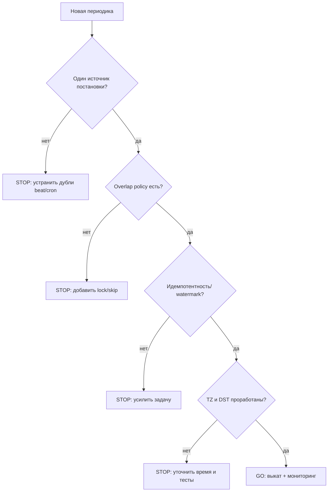

[← Назад к индексу части](index.md)
[↑ К глобальному плану](../mastery_plan.md)

## Pre-release чек-лист периодических задач

Перед тем как выпускать новую или существенно изменённую периодику в production, полезно пройти **go/no-go** таблицу:

| Проверка | Вопрос | Go-критерий |
| --- | --- | --- |
| Один планировщик | Сколько beat (и внешних cron) может публиковать эту задачу? | Ровно **один** контур или документированная координация |
| Overlap | Что если предыдущий прогон ещё идёт? | Есть lock/lease/skip policy и тест/ревью |
| Длительность vs период | p99 длительности < периода? Если нет — что делаем? | Явная политика отставания и алерты |
| Идемпотентность | Безопасен ли повторный запуск? | Ключи, watermark, уникальные ограничения |
| Время | В какой TZ выражены сутки/часы? | Документ + тест на DST при локальной TZ |
| Очередь и SLA | Попадает ли задача в правильную очередь? | Не вытесняет критичный трафик (см. часть 12) |
| Наблюдаемость | Видно ли отставание/ошибки/длительность? | Метрики, логи, алерты |
| Catch-up | Что после простоя 6 часов? | Лимитированный catch-up или skip + документ |

#### Проверь себя по чек-листу

1. Почему в таблице рядом с beat фигурирует «внешний cron»?

Ответ

Потому что второй **независимый** планировщик с той же семантикой создаёт те же **дубликаты**, что и второй beat: оба публикуют работу в очередь.

2. Достаточно ли для GO критерия «у нас Redis lock»?

Ответ

Не всегда: нужны **TTL**, проверка **владельца**, понимание границ при истечении lease, и **идемпотентность** на случай гонок. Lock — часть решения, не замена модели данных.

3. Строка чек-листа «Очередь и SLA»: что может пойти не так, если периодика попадает в **дефолтную** очередь вместе с пользовательским трафиком?

Ответ

Тяжёлая периодика **вытеснит** критичные задачи по latency, увеличит глубину очереди для пользователей и смешает алерты; нужен **роутинг** в выделенную очередь и квоты (см. часть 12).

---
