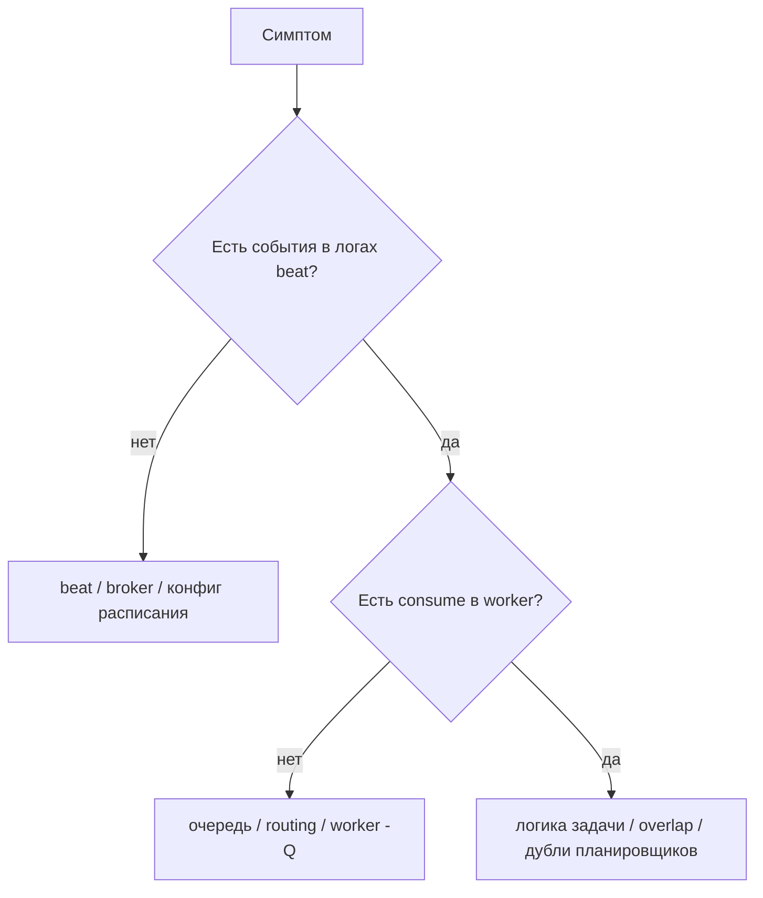

[← Назад к индексу части](index.md)
[↑ К глобальному плану](../celery_mastery_plan.md)

## Диагностика и runbook: периодика «не сработала» / «сработала дважды»

Используй как **чек-лист triage**, а не как догму — порядок шагов можно менять по симптомам.

### Симптом: задача не появляется в worker

| Шаг | Что проверить |
| --- | --- |
| 1 | **Запущен ли beat** и тот ли **broker URL**, что у worker. |
| 2 | **Расписание**: задача `enabled`? В django-celery-beat — флаг в БД; в коде — нет ли опечатки в имени `task`. |
| 3 | **Часовой пояс и crontab**: не «ждёте ли вы» срабатывание в локальном времени, а beat считает в другом. |
| 4 | **Цикл beat** (`beat_max_loop_interval`): для очень коротких интервалов нет ли систематической задержки. |
| 5 | **Очередь в `options`**: worker слушает эту очередь? (`-Q` и `task_routes`). |
| 6 | **Миграции** django-celery-beat на этом окружении. |

##### Проверь себя: «не появляется в worker»

1. Почему при «тишине» в worker первым делом сравнивают **broker URL** у beat и worker, а не только логи задачи?

Ответ

Beat может **успешно** публиковать в один брокер/vhost, а worker слушать **другой** — сообщения никогда не дойдут до потребителя; это быстрый инфраструктурный чек до отладки кода.

2. Как **`beat_max_loop_interval`** объясняет «я жду ровно минутный cron, а срабатывание запаздывает»?

Ответ

Beat опрашивает расписание с **конечным** интервалом цикла; при очень коротких периодах или нагрузке возможна **систематическая задержка** относительно «идеальных» границ времени.

### Симптом: задача выполняется дважды (или чаще)

| Шаг | Что проверить |
| --- | --- |
| 1 | **Сколько реплик beat** в k8s / docker-compose scale. |
| 2 | Нет ли **второго планировщика** (системный cron, GitHub Actions, другой кластер). |
| 3 | **Ретраи** брокера/задачи: не воспринимайте повторное исполнение как «второй beat». |
| 4 | Ручные **`apply_async`** / Canvas от того же пайплайна. |
| 5 | **DST / двойной час** для локального crontab. |

##### Проверь себя: «выполняется дважды»

1. Почему **retry** не следует сразу трактовать как «второй beat»?

Ответ

Retry — ожидаемая **повторная доставка** одного логического сообщения инфраструктурой; второй beat — **второй независимый** producer. Лечение разное: идемпотентность/политика ретраев vs устранение дубля планировщика.

2. Как **ручной `apply_async`** того же таска может имитировать «дубль периодики»?

Ответ

Сообщение из beat и ручной вызов **неразличимы** для worker: оба исполняются; без lock/идемпотентности получается параллельный или двойной эффект.

### Симптом: после простоя — лавина задач

Ожидаемо, если beat и broker накопили сообщения. Действия: **throttle** worker-ов, **лимитировать catch-up** в коде задачи, временно увеличить `prefetch` только осознанно (см. часть про worker), включить **expires** на периодических сообщениях, если устаревшие прогоны вредны.

##### Проверь себя: лавина после простоя

1. Почему слепое увеличение **`prefetch`** без анализа лимитов API и БД может усугубить восстановление?

Ответ

Worker заберёт **больше** сообщений и начнёт **параллельнее** бить по исчерпанным ресурсам — второй пик нагрузки. Prefetch повышают только при понимании **пропускной способности** downstream.

2. Когда **`expires`** уместен как часть тушения лавины, а когда опасен?

Ответ

**Уместен**, если прогоны старше порога **бесполезны** или вредны (устаревшие тики). **Опасен**, если каждый тик **юридически/операционно** обязателен — тогда нужны лимитированный catch-up и алерты, а не молчаливое отбрасывание.

#### Проверь себя по диагностике

1. Почему при «двойном выполнении» первым делом смотрят на число beat-реплик, а не сразу на код задачи?

Ответ

Потому что **инфраструктурный дубль планировщика** даёт два сообщения в очереди при корректном коде задачи; это быстрее подтвердить или снять, чем искать логическую гонку внутри тела задачи.

2. Чем «лавина после простоя» отличается от «двух beat»?

Ответ

Лавина — много сообщений от **одного** планировщика из-за накопившейся очереди или агрессивного catch-up; два beat — **независимые** публикаторы одной и той же периодики. Симптомы похожи, причины и лечение разные.

3. Как mermaid-triage «есть consume в worker?» отделяет проблему **routing** от проблемы **beat**?

Ответ

Если в логах beat публикация есть, а worker **не потребляет**, чаще **очередь/`-Q`/vhost**; если consume есть, но эффект «не тот», уходим в **логику задачи**, overlap и дубли producers.

---
