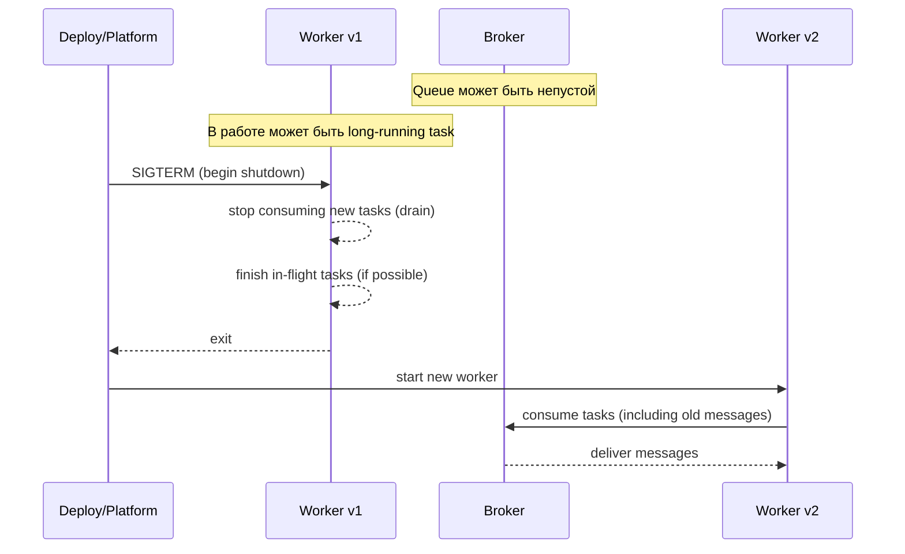
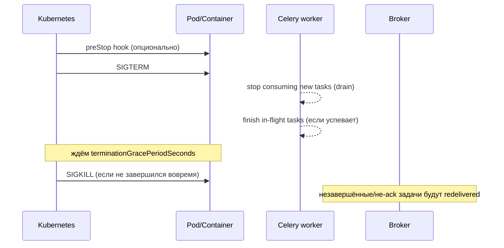

[← Назад к индексу части](index.md)
[↑ К глобальному плану](../../mastery_plan.md)

## 12.2. Rolling updates и graceful shutdown

### Цель раздела

Научиться безопасно обновлять и останавливать worker-ы и beat, не создавая массовых дублей, потерь времени и “зависших” задач, и понимать, какие реальные ограничения накладывают long-running задачи.

### В этом разделе главное

- Rolling update означает **несколько версий кода одновременно**: нужно думать о совместимости сообщений.
- Graceful shutdown — это не “просто SIGTERM”, а договор: **перестать брать новые задачи → закончить текущие → корректно выйти**.
- В контейнерах часто самый опасный сценарий — **SIGKILL**, когда graceful не происходит (OOM/eviction).
- Для long-running задач часто нужно менять дизайн: **разбивать**, делать checkpointing, или переносить тяжёлое состояние во внешнее хранилище.

### Термины

| Термин | Определение |
|---|---|
| **SIGTERM** | Сигнал “корректно завершайся”. Обычно первым приходит при остановке сервиса. |
| **SIGKILL** | “Убить сразу”. Процесс не может обработать, graceful невозможен. |
| **Termination grace period** | Время, которое платформа даёт процессу на корректное завершение. |
| **Drain** | Режим “не брать новые задачи”. |
| **In-flight** | Задачи “в процессе исполнения” на worker. |
| **In-queue** | Задачи, которые ещё лежат в broker и ждут. |
| **Revoke / terminate** | Механизм Celery для запроса “не выполнять или прервать выполнение” задачи. |

### Теория и правила

#### 1) Два разных риска при деплое

1) **Задачи в очереди (in-queue)**: лежат старые сообщения, новые worker их возьмут.
- Риск: несовместимость payload или имени задачи.

2) **Задачи в работе (in-flight)**: выполняются, когда вы хотите остановить worker.
- Риск: процесс убьют, задача будет redelivered (или потеряет прогресс), возможны дубликаты побочных эффектов.

#### Проверь себя: 12.2.1 in-queue vs in-flight

1. Какой риск “лечится” совместимостью payload, а какой — graceful shutdown?

<details><summary>Ответ</summary>

Совместимость payload лечит риск **in-queue**: старые сообщения в очереди должны быть понятны новой версии воркера. Graceful shutdown лечит риск **in-flight**: корректно завершить уже выполняющиеся задачи и не породить лишние redelivery/дубликаты из-за убийства процесса.

</details>

2. Почему in-flight риск особенно опасен для задач с побочными эффектами (платёж, письмо, изменение статуса)?

<details><summary>Ответ</summary>

Потому что задача может успеть частично сделать эффект и быть повторно доставленной/выполненной после убийства процесса до ack/записи состояния. Без идемпотентности это может привести к двойному списанию, двойной отправке и нарушению инвариантов.

</details>

3. Что будет “выглядеть одинаково” в интерфейсе, но иметь разную природу: большой depth или большой lag?

<details><summary>Ответ</summary>

Оба “кажутся” признаком нагрузки, но depth — количество сообщений, а lag — время ожидания. Большой lag при небольшом depth может означать проблемы потребления/конкуренции/зависаний. Большой depth при небольшом lag может быть нормальным при высоком throughput.

</details>

#### 2) Модель “что происходит при деплое” (картинка без магии)



Две практические мысли:
- деплой влияет на **производительность обработки** (в момент drain throughput падает),
- деплой влияет на **семантику** (задача может выполниться повторно, если старого воркера убили раньше ack).

#### Проверь себя: 12.2.2 модель деплоя

1. Почему очередь называется “буфер во времени” и как это связано с rolling update?

<details><summary>Ответ</summary>

Потому что сообщения живут дольше конкретной версии кода: они могут быть опубликованы до деплоя и обработаны после. Поэтому при rolling update новые воркеры неизбежно встречают “прошлые” сообщения, а значит нужна совместимость.

</details>

2. В каком месте цепочки чаще всего появляется throughput drop во время деплоя и почему?

<details><summary>Ответ</summary>

Во время drain/остановки части воркеров: они перестают брать новые задачи и/или завершают текущие. Общее количество активных исполнителей временно падает, поэтому скорость обработки уменьшается и backlog может начать расти.

</details>

3. Почему “быстрый деплой” не спасает от необходимости думать о семантике доставки?

<details><summary>Ответ</summary>

Потому что даже короткий интервал обновления не отменяет: непустую очередь, in-flight задачи, redelivery при прерывании, возможный SIGKILL. Семантика доставки и побочные эффекты не зависят от скорости деплоя.

</details>

#### 3) Rolling update без боли: минимальные “правила безопасности”

1. **Termination grace ≥ worst-case времени задачи**, либо задачи должны быть **разбиты**.
2. Обязательно иметь “политику” для in-flight задач:
   - ждать завершения,
   - или прерывать/перезапускать осознанно,
   - или переводить в чекпоинты.
3. Для in-queue задач иметь **backward compatibility** (см. 12.6).
4. Планировать, что во время деплоя throughput уменьшится → backlog может расти.

#### Проверь себя: 12.2.3 правила безопасного rolling update

1. Почему “Termination grace ≥ worst-case задачи” — это не рекомендация, а почти математическая необходимость?

<details><summary>Ответ</summary>

Если платформа даёт меньше времени, чем нужно задаче, она будет убита до завершения. Тогда возникает redelivery/потеря прогресса. Это закономерно, а не “редкий баг”, поэтому нужно либо увеличить grace, либо менять дизайн задач.

</details>

2. Назови два валидных подхода к long-running задачам, кроме “пусть работает час”.

<details><summary>Ответ</summary>

Разбивка на chunks/подзадачи с watermark и checkpointing, либо перенос тяжёлой работы в отдельный контур (например, batch‑pipeline) с управляемыми этапами и прогрессом во внешнем хранилище.

</details>

3. Почему “политика in-flight” — это часть контракта задачи, а не только ops‑решение?

<details><summary>Ответ</summary>

Потому что выбор “ждать/прерывать/чекпоинтить” зависит от бизнес‑семантики и побочных эффектов. Если задачу можно безопасно повторить — одна политика; если нельзя — требуется идемпотентность/дедупликация/компенсации.

</details>

#### 3.1) Kubernetes-реальность graceful shutdown: preStop + SIGTERM + grace period

Если Celery работает в Kubernetes, важно понимать “механическую” последовательность, потому что именно здесь часто рождается разрыв между ожиданиями (“мы же послали SIGTERM”) и реальностью (“задачи дублируются”).

Упрощённо жизненный цикл остановки pod выглядит так:



Практические выводы:
- **`terminationGracePeriodSeconds`** должен быть согласован с “худшими” задачами или с вашим решением “прерывать/чекпоинтить”.
- **`preStop` hook** полезен, если вы умеете переводить воркер в состояние drain (например, выставить флаг/снять readiness), чтобы он перестал брать новую работу до SIGTERM.
- Если pod получает **SIGKILL** (из-за слишком короткого grace или OOM), graceful shutdown не случится — и система должна быть готова к redelivery/дубликатам.

Мини-ориентир: “что должно быть истинно, чтобы graceful shutdown работал”:
- у задач есть ограниченная длительность (или чекпоинты),
- у внешних вызовов есть timeouts,
- у инфраструктуры достаточно времени на остановку,
- у бизнес-эффектов есть идемпотентность/дедупликация.

#### Проверь себя: 12.2.3.1 shutdown в Kubernetes

1. Зачем preStop, если Kubernetes всё равно пошлёт SIGTERM?

<details><summary>Ответ</summary>

preStop позволяет начать “подготовку к остановке” до SIGTERM: например, снять readiness, включить drain‑флаг, перестать принимать/брать новую работу. Это уменьшает шанс, что воркер возьмёт новую задачу прямо перед завершением.

</details>

2. Почему при слишком коротком `terminationGracePeriodSeconds` вы почти гарантированно получите дубликаты?

<details><summary>Ответ</summary>

Потому что контейнер будет убит SIGKILL, не завершив in-flight задачи. Broker не получит корректного подтверждения/состояния и выполнит redelivery. Если задача уже успела сделать побочный эффект — дубликат становится бизнес‑ошибкой.

</details>

3. Какой слой “должен компенсировать” невозможность graceful shutdown при OOMKill?

<details><summary>Ответ</summary>

Дизайн задач: идемпотентность, дедупликация, транзакционные границы, безопасные повторные попытки. OOMKill не всегда устраним полностью, поэтому система должна быть устойчивой к прерыванию и повтору.

</details>

#### 4) Revoke/terminate: когда (не) использовать

У Celery есть команды `revoke`/`terminate`, но важно понимать:

- `revoke` пытается **предотвратить старт** задачи (если она ещё в очереди) или пометить её как отменённую;
- `terminate` пытается **жёстко оборвать** уже выполняющуюся задачу (часто через SIGTERM/SIGKILL дочернего процесса).

Без идемпотентности и явного понимания побочных эффектов:
- `terminate` может оставить “наполовину выполненную” работу и создать повтор при redelivery;
- `revoke` может “потерять” важную задачу, если нет отдельной логики восстановления/повторного планирования.

На практике:
- `revoke` полезен как операционный инструмент (например, отменить заведомо неправильный массовый запуск),
- `terminate` — крайняя мера, требующая **ясной политики**, что делать с побочными эффектами и как потом восстанавливаться.

#### Проверь себя: 12.2.4 revoke/terminate

1. В чём ключевая опасность `terminate` для задач, которые пишут во внешние системы?

<details><summary>Ответ</summary>

Вы можете прервать задачу в момент, когда часть эффекта уже сделана, а часть — нет. После redelivery/повтора получится “полуэффект + повтор”, что ломает данные. Без идемпотентности и компенсаций terminate превращается в источник сложных инцидентов.

</details>

2. Когда `revoke` может быть оправдан, даже если вы боитесь “потерять задачу”?

<details><summary>Ответ</summary>

Когда запуск заведомо ошибочный или опасный (например, неправильная массовая рассылка/неверный batch), и у вас есть отдельная процедура восстановления/перезапуска корректной версии. То есть revoke — часть контролируемой операции, а не “случайная кнопка”.

</details>

3. Почему операции revoke/terminate должны сопровождаться наблюдаемостью и аудитом?

<details><summary>Ответ</summary>

Потому что это ручные вмешательства, меняющие семантику выполнения. Без аудита нельзя восстановить причинно‑следственную цепочку (“почему задача не выполнилась/почему был дубль”), а без метрик нельзя оценить последствия (backlog, retries, ошибки).

</details>

### Пошагово

#### Runbook: безопасный rolling update worker-ов (общая логика)

1. Посмотреть метрики: queue depth/lag, in-flight, rate ошибок.
2. Если lag уже высокий — сначала стабилизировать (иначе деплой ухудшит ситуацию).
3. Перевести часть воркеров в drain:
   - перестать брать новые задачи,
   - дождаться завершения текущих.
4. Обновить/перезапустить drain-воркеры.
5. Проверить метрики (не только “процесс поднялся”, а throughput и error rate).
6. Повторить по партиям (batch size) до полного обновления.

#### Runbook: что делать с long-running задачами при деплое

1. Определить: задача действительно должна быть long-running или это “монолитная обработка без чекпоинтов”.
2. Если long-running неизбежна:
   - увеличьте grace period,
   - обеспечьте idempotency/защиту от дублей,
   - подумайте о чекпоинтинге.
3. Если long-running — это дизайн-ошибка:
   - разбейте на chunks,
   - добавьте watermark/курсор,
   - делайте “пакеты” обработки.

### Простыми словами

Rolling update — это как ремонт моста, по которому продолжают ехать машины:
- нельзя “просто выключить всё”,
- нельзя менять правила движения так, чтобы старые машины внезапно не умели ехать,
- нужно временно снизить пропускную способность и учесть это.

### Картинка в голове

```
Есть две “очереди” работы:
  1) в брокере (ещё не начато)
  2) внутри воркеров (уже начато)

Rolling update обязательно касается обеих.
```

### Как запомнить

**Формула:** “Деплой = in-queue совместимость + in-flight завершение”.

### Примеры

#### Пример: “drain” как отдельный шаг деплоя

В production полезно думать о воркере как о существе с двумя режимами:
- **active**: берёт новые задачи;
- **draining**: не берёт новые, только заканчивает текущие.

Если у вас есть механизм “отключить consume” (через контроль/сигналы/оркестрацию), деплой становится намного безопаснее.

### Практика / реальные сценарии

- **Релиз с изменением поведения задачи**: сначала деплоим код, который понимает обе версии payload, потом меняем producer, потом вычищаем старую схему.
- **Инцидент с памятью**: вместо “перезапустить всё” делаем по очереди drain → restart, чтобы не уронить throughput в ноль.

### Типичные ошибки

- Считать, что “worker всегда успеет корректно завершиться” (игнорировать SIGKILL/OOM).
- Не учитывать, что во время деплоя throughput падает → backlog растёт.
- Менять сигнатуру задачи при непустой очереди.

### Что будет, если…

- **Если grace period меньше, чем длительность задач**: платформа убьёт воркер, задачи вернутся в очередь и могут выполниться повторно, создавая дубликаты.
- **Если делать деплой “всех сразу”**: вы получите временную остановку обработки, скачок backlog и риск SLO-коллапса.

### Проверь себя

1. Почему rolling update почти всегда требует backward compatibility сообщений?

<details><summary>Ответ</summary>

Потому что новые воркеры будут получать сообщения, опубликованные старым кодом, и наоборот (в переходный период). Очередь — это буфер во времени: она сохраняет “прошлое”, которое встречается с “будущим” кода.

</details>

2. Чем отличаются проблемы in-flight и in-queue задач при деплое?

<details><summary>Ответ</summary>

In-queue — это совместимость и корректная обработка сообщений из очереди (формат/имя/семантика). In-flight — это корректное завершение уже начатой работы при остановке процесса (drain/graceful, риск дублей при убийстве).

</details>

3. Почему long-running задачи — отдельная операционная категория риска?

<details><summary>Ответ</summary>

Потому что они конфликтуют с ожиданиями инфраструктуры (перезапуски, эвикшены), увеличивают время восстановления и делают деплой сложным: если задача длится час, либо вы ждёте час на drain, либо вы прерываете работу и рискуете дублями/потерей прогресса.

</details>

### Запомните

- Graceful shutdown — это договор, который может быть сорван platform-реальностью (OOM/SIGKILL).
- Rolling update — это неизбежно период, где “всё смешано”: старые и новые версии, старые сообщения и новый код.

---
