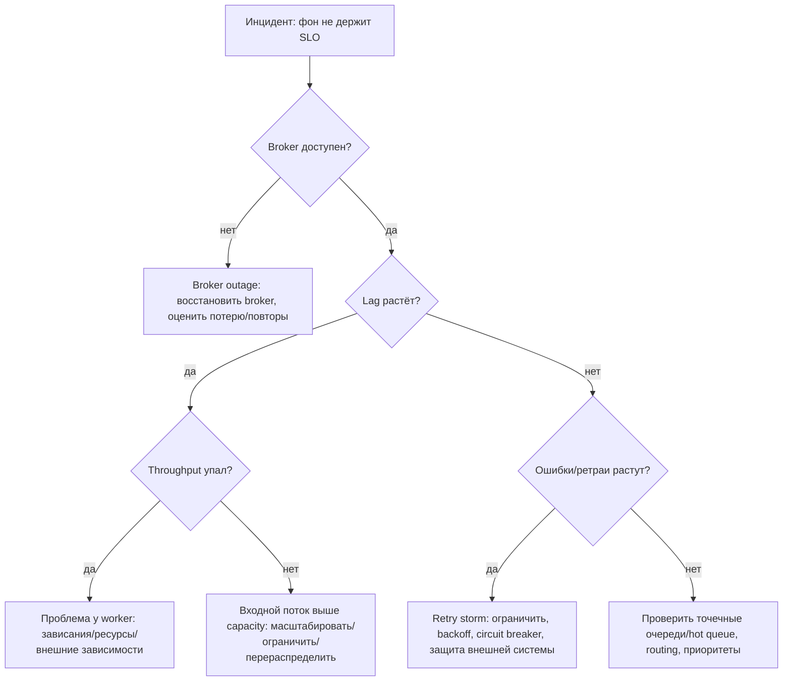

[← Назад к индексу части](index.md)
[↑ К глобальному плану](../../mastery_plan.md)

## 12.4. Инциденты: диагностика и runbooks

### Цель раздела

Научиться реагировать на типовые production-инциденты Celery не “по наитию”, а по воспроизводимым процедурам: что проверить, какие причины вероятны, какие действия безопасны, а какие могут ухудшить ситуацию.

### В этом разделе главное

- Важно разделять: **симптом** (backlog) и **причину** (падение внешней зависимости, неверная конфигурация, hot queue).
- Самая опасная реакция новичка — “перезапустить всё” без понимания: это может породить ещё больше дубликатов и ретраев.
- Runbook должен начинаться с метрик: lag/depth/error rate/broker health.
- Инциденты Celery часто “операционно диагностируемы”, если у вас есть метрики и дисциплина.

### Термины

| Термин | Определение |
|---|---|
| **Backlog explosion** | Очередь растёт быстро, система не успевает. |
| **Stuck worker** | Воркеры “живы”, но задачи не продвигаются (deadlock, external hang, starvation). |
| **Runaway retries / retry storm** | Массовые повторы, которые создают лавину нагрузки. |
| **Hot queue / partition** | Одна очередь перегрета, другие простаивают. |
| **Scheduler duplication** | Периодика запускается дважды из-за нескольких scheduler без координации. |

### Теория и правила

#### 1) “Инцидент” как типовой сценарий failure modes

Celery-контур ломается “предсказуемо”:
- broker недоступен → публикация/потребление ломается,
- backend недоступен → статусы/результаты “плывут”, chord может ломаться,
- внешняя зависимость падает → задачи начинают массово retry,
- worker зависает → throughput падает, backlog растёт,
- дубли beat → периодика запускается дважды.

Это не “сюрпризы”, а набор “болезней”, к которым нужны “протоколы лечения”.

#### 2) Карта быстрого triage (первый взгляд)



### Пошагово

Ниже — “скелеты runbooks”. Важно: они должны быть адаптированы под ваш стек и ваши метрики.

#### Runbook A: Backlog explosion (lag растёт, очередь переполнена)

1. Убедиться, что это не “фальшивый сигнал” (не сломан сбор метрик).
2. Проверить:
   - broker health,
   - worker count/availability,
   - error rate/retry rate,
   - наличие hot queue.
3. Определить причину:
   - входной поток вырос (traffic spike),
   - throughput упал (зависание, OOM, внешняя зависимость),
   - routing/конфиг ошибки.
4. Безопасные действия:
   - добавить воркеров/ресурсов (если причина — capacity),
   - изолировать критичные очереди (если batch “съел” всё),
   - временно ограничить producer (rate limit) или отложить неважное.
5. Опасные действия:
   - перезапустить всё без понимания (может усилить дубли),
   - массово “purge” очередь без бизнес-решения (может потерять данные).

#### Проверь себя: Runbook A

1. Почему “добавить воркеров” может не помочь при backlog explosion?

<details><summary>Ответ</summary>

Если первопричина — внешняя зависимость или poison message/ошибка кода, больше воркеров лишь увеличат число параллельных падений и ретраев. Также можно упереться в лимиты БД/API и получить каскадный отказ.

</details>

2. Как по метрикам отличить “backlog из‑за деплоя” от “backlog из‑за внешней зависимости”?

<details><summary>Ответ</summary>

При деплое обычно падает capacity/throughput временно, но error rate может оставаться нормальным. При внешней зависимости резко растут ошибки/ретраи по конкретным задачам, часто с ростом latency зависимостей.

</details>

3. Почему purge — это бизнес‑решение, а не техническое?

<details><summary>Ответ</summary>

Потому что purge означает потерю работы. Только бизнес может решить, можно ли потерять эти действия (уведомления/деньги/статусы) или нужно восстановление/повторное построение задач из источника правды.

</details>

#### Runbook B: Stuck workers (задачи “не двигаются”)

1. Проверить, берут ли воркеры новые задачи (active processes, prefetch).
2. Посмотреть “что выполняется сейчас” (через доступные инструменты):
   - тип задачи,
   - сколько длится,
   - есть ли зависание на внешнем вызове.
3. Проверить ресурсы:
   - CPU, memory, IO,
   - OOM kills,
   - saturation.
4. Действия:
   - аккуратно drain+restart проблемных воркеров,
   - уменьшить concurrency/prefetch (если starvation),
   - добавить timeouts и circuit breaker во внешние вызовы.

#### Проверь себя: Runbook B

1. Почему “воркер жив” не означает “воркер работает”?

<details><summary>Ответ</summary>

Процесс может быть жив, но завис на внешнем вызове/дедлоке/IO, или быть в состоянии starvation из‑за настроек concurrency/prefetch. Liveness/процессность не равны полезной работе.

</details>

2. Как уменьшение prefetch может помочь при stuck/неравномерной обработке?

<details><summary>Ответ</summary>

Большой prefetch приводит к тому, что воркер “забирает” много сообщений заранее, но фактически выполняет их медленно или зависает. Это ухудшает fairness и может увеличивать lag. Уменьшение prefetch снижает захват задач и улучшает распределение между воркерами.

</details>

3. Почему drain+restart нужно делать “аккуратно”, а не “всех сразу”?

<details><summary>Ответ</summary>

Потому что массовый рестарт резко снижает capacity и может вызвать всплеск redelivery/дубликатов, рост lag и SLO‑коллапс. Пошаговый подход сохраняет обработку и уменьшает риск каскадных эффектов.

</details>

#### Runbook C: Broker outage

1. Определить: outage полный или деградация (latency/частичные ошибки).
2. Остановить ухудшение:
   - если producer бесконечно ретраит publish, он может “ддосить” broker.
3. Восстановить broker.
4. После восстановления:
   - оценить backlog и lag,
   - оценить “скопившиеся” повторы,
   - при необходимости временно увеличить capacity воркеров.

#### Runbook D: Runaway retries / retry storm

1. Определить первопричину: какая внешняя зависимость падает?
2. Ввести backoff/jitter, если их нет.
3. Временно ограничить concurrency/throughput, чтобы не разрушить внешнюю систему.
4. Ввести “circuit breaker” или “degrade path” (если применимо).
5. Изолировать очереди: критичное не должно тонуть в ретраях неважного.

#### Runbook E: Scheduler duplication (периодика запускается дважды)

Это один из самых “подлых” инцидентов: он выглядит как “иногда всё делается дважды”, а не как явная ошибка.

1. Симптомы:
   - внезапное удвоение количества запусков периодических задач;
   - рост нагрузки “в ровные минуты” (по расписанию);
   - метрики/логи показывают одинаковые `task_name` с близкими timestamps.
2. Быстрый диагноз:
   - проверить, сколько scheduler’ов реально запущено (beat/DatabaseScheduler/cron, если есть);
   - проверить, не стартует ли beat “вместе с worker” по ошибке деплоя.
3. Действия (безопасная логика):
   - оставить ровно один scheduler (или включить координацию/lock-стратегию, если она предусмотрена);
   - временно включить дедупликацию/lock на стороне самой периодической задачи (если возможно) как “страховку”;
   - после стабилизации провести ретроспективу: почему платформа позволила двум scheduler’ам жить параллельно.
4. Опасные действия:
   - “просто перезапустить всё”: можно на короткое время снова получить два scheduler’а (race) и усилить проблему.

#### Runbook F: Hot queue / partition (одна очередь перегрета)

1. Симптомы:
   - общая система “вроде держится”, но одна категория задач отстаёт сильно;
   - по метрикам видно: lag по очереди `X` растёт, а по другим очередям — нет.
2. Диагноз:
   - убедиться, что routing действительно кладёт задачи в нужные очереди;
   - проверить, есть ли выделенные воркеры под эту очередь и хватает ли им ресурсов;
   - проверить, не “забита” ли очередь poison-message’ами (постоянные повторы).
3. Действия:
   - временно добавить capacity именно этой очереди (реплики/конкурентность) — но следить за внешними зависимостями;
   - если hot queue — это batch, а не critical: отделить и “урезать” batch, чтобы не рушить бизнес-SLO;
   - если причина — poison message: остановить лавину (DLQ/ограничение повторов) и исправить обработчик.

#### Runbook G: Result backend outage (backend результатов недоступен)

Это важный кейс: Celery может продолжать выполнять задачи, но “табло статусов” и некоторые механики orchestration становятся нестабильными.

1. Симптомы:
   - задачи выполняются, но клиент не видит статусы/результаты;
   - резко растут ошибки записи результата;
   - ломаются `chord`/части canvas (зависит от backend).
2. Быстрый диагноз:
   - это полный outage backend или деградация latency?
   - какие задачи/функции реально зависят от backend (вы читаете результат? есть chord-heavy workflow?).
3. Действия:
   - если backend нужен только “для красоты UI”: можно временно деградировать (не показывать статус), но продолжать обработку;
   - если backend — критичный элемент orchestration (например, chord unlock): лучше **остановить публикацию** тех workflow, которые зависят от backend, чтобы не копить “поломанные” состояния;
   - восстановить backend, затем аккуратно проверить “хвосты”: незавершённые chord’ы/ожидающие статусы.
4. Ошибка новичка:
   - “backend упал — значит задачи не выполняются”. Это не всегда так: нужно разделять **исполнение** и **видимость результата**.

#### Runbook H: Worker OOM / memory leak / crashloop (воркеры “падают и поднимаются”)

1. Симптомы:
   - OOMKill / SIGKILL в Kubernetes;
   - резкий рост restart count;
   - рост lag при “кажется, что реплик достаточно”.
2. Диагноз:
   - это реальный memory leak в коде задачи или просто слишком большие payload/буферы?
   - совпадает ли рост памяти с конкретным `task_name`?
   - не стало ли больше concurrency/prefetch после последнего релиза?
3. Действия:
   - временно снизить concurrency/prefetch для стабилизации;
   - изолировать “подозрительные” задачи в отдельную очередь/воркер;
   - увеличить memory limit только если понимаете, почему это безопасно (иначе просто сдвинете момент падения);
   - исправить причину: большие payload → передавать ссылки, утечки → профилировать, внешние буферы → освобождать.
4. Важный эффект:
   - падение воркера усиливает дубликаты/redelivery и может поднять retry storm — это каскадный инцидент.

### Простыми словами

Инцидент — это не “что-то странное”, а ситуация, где система перестала удовлетворять договору (SLO). Реакция должна быть похожа на медицину:
- сначала измерить (метрики),
- потом поставить диагноз (причина),
- потом лечить так, чтобы не стало хуже.

### Картинка в голове

```
Симптомы:
  backlog, lag, ошибки, ретраи, падения воркеров

Причины (частые):
  внешняя зависимость, ресурсы, конфигурация, hot queue, деплой

Опасность:
  “лечить симптом” (перезапуски/пурж), не исправив причину
```

### Как запомнить

**Формула triage:** “broker? lag? throughput? errors?” — в таком порядке.

### Примеры

#### Пример: “перезапустить всё” как анти-решение

Если причина — внешняя зависимость (например, API упало), то перезапуск воркеров:
- не починит API,
- увеличит количество redelivery,
- может усилить retry storm,
- и ускорит деградацию внешней системы.

Правильнее:
- снизить давление (rate limit/backoff),
- включить circuit breaker,
- изолировать очереди.

### Практика / реальные сценарии

- **Скачок трафика**: backlog растёт → временно скейлим воркеров, но следим за внешними лимитами.
- **Падение БД**: задачи, которые пишут в БД, начинают retry → нужна пауза/деградация, иначе очередь взорвётся.

### Типичные ошибки

- Не иметь runbooks, но ожидать “быстро починить”.
- Не иметь метрик lag и пытаться диагностировать по логам.
- Путать “много задач” и “много времени ожидания” (depth vs lag).

### Что будет, если…

- **Если purge очереди без решения бизнеса**: можно потерять критичные операции (например, уведомления/финансы).
- **Если не ограничить retry storm**: система может уйти в режим “всё время ретраим”, потребляя ресурсы и не делая полезной работы.

### Проверь себя

1. Почему “перезапуск воркеров” может ухудшить retry storm?

<details><summary>Ответ</summary>

Потому что при перезапуске часть задач будет redelivered и начнёт выполняться заново, увеличивая число попыток. Если первопричина не устранена, новые попытки снова упадут и снова попадут в ретраи, создавая ещё большую нагрузку.

</details>

2. Как отличить “capacity проблему” от “внешняя зависимость упала” по метрикам?

<details><summary>Ответ</summary>

При capacity проблеме обычно error rate не растёт резко, но lag/depth растут, CPU/активность воркеров близка к saturation. При падении внешней зависимости резко растут ошибки/ретраи по конкретному типу задач, а throughput может быть “высокий”, но бесполезный (всё падает и ретраится).

</details>

3. Почему runbook должен включать “опасные действия” отдельным списком?

<details><summary>Ответ</summary>

Потому что в стрессовой ситуации команда склонна делать “быстрое действие”, которое кажется очевидным, но разрушает систему (purge, массовый restart). Явное перечисление опасных действий снижает вероятность ухудшения инцидента.

</details>

### Запомните

- Инциденты — не исключение, а часть жизни фона.
- Без метрик и процедур фон превращается в “чёрный ящик”.

---
