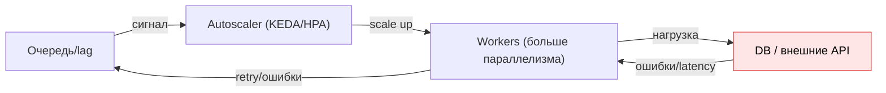

[← Назад к индексу части](index.md)
[↑ К глобальному плану](../../mastery_plan.md)

## 12.5. Autoscaling и capacity planning

### Цель раздела

Понять, как правильно масштабировать Celery-воркеры: какие сигналы использовать, как не устроить thrashing, почему “queue depth” может быть плохим триггером без контекста, и как увязать scaling с SLO и ресурсами платформы.

### В этом разделе главное

- Хороший autoscaling ориентируется на **lag/SLO**, а не только на depth.
- Нужны **cooldown** и “инерция”: иначе scaling будет дёргаться.
- Scaling может разрушить внешние зависимости (БД/API), если вы не ограничили давление (bulkhead/rate limit).
- Capacity planning — это не магия, а оценка: service time, concurrency, arrival rate.

### Термины

| Термин | Определение |
|---|---|
| **Arrival rate (\(\lambda\))** | Скорость поступления задач (tasks/sec). |
| **Service time (\(S\))** | Среднее время обработки одной задачи. |
| **Concurrency (\(c\))** | Сколько задач одновременно реально выполняется. |
| **Utilization (\(\rho\))** | Нагрузка: грубо, насколько система “занята”. |
| **Cooldown** | Пауза после масштабирования, чтобы система стабилизировалась. |

### Теория и правила

#### 1) Интуитивная модель capacity

Очень грубая (но полезная) формула для понимания:

- Если задача в среднем занимает \(S\) секунд,
- и у вас есть \(c\) параллельных исполнителей,
- то максимальная скорость обработки примерно \(c / S\) задач в секунду.

Это не точная теория очередей, но отличный “первый фильтр”:
- если входной поток выше, backlog будет расти;
- если вы скейлите, но входной поток ещё выше — вы просто сжигаете ресурсы.

#### 2) Какие сигналы использовать для autoscaling

**Сигнал A: lag (age of oldest message)** — лучший сигнал под SLO “время ожидания”.
- если lag растёт — не успеваем,
- если lag падает — догоняем.

**Сигнал B: queue depth** — полезно, но требует контекста:
- для коротких задач depth может быть нормальным,
- для длинных задач depth может быть маленьким, но lag огромным.

**Сигнал C: throughput** — полезно для диагностики, но опасно как триггер.

**Сигнал D: saturation ресурсов** (CPU/memory) — важно, чтобы не скейлить “в потолок”.

#### 3) Защита от thrashing

Thrashing появляется, когда:
- сигнал шумный,
- нет cooldown,
- пороги слишком агрессивны.

Правила:
- используйте сглаживание (moving average),
- вводите cooldown на scale down,
- ограничивайте скорость изменения масштаба,
- учитывайте время “прогрева” воркера (startup, warm caches).

#### 4) KEDA/HPA-like подходы (в идее)

Идея: scale по сигналам очереди.

Но важно помнить: “больше воркеров” = “больше давления” на:
- БД,
- внешние API,
- object storage.

Поэтому autoscaling должен быть частью системы ограничений:
- rate limit,
- bulkheads,
- circuit breakers,
- отдельные очереди.

#### 5) Визуальная модель “autoscaling ↔ внешние зависимости” (почему можно сделать хуже)

Это ключевой production-рисунок: scaling — не “прибавили воркеров”, а изменение давления на весь контур.



Смысл:
- если DB/API деградирует, scale up воркеров может **усилить деградацию**;
- тогда растут ошибки и ретраи → очередь растёт ещё быстрее → autoscaler снова скейлит → получается “петля самоусиления”.

Выход из петли обычно не “ещё больше воркеров”, а **ограничение давления** (bulkheads, rate limit, backoff, circuit breaker) + изоляция очередей.

### Пошагово

#### Пошаговый дизайн autoscaling под SLO

1. Зафиксировать SLO: например, p95 lag < 30s, p99 < 2m.
2. Определить сигнал: lag per queue.
3. Задать политику:
   - scale up, если lag > X в течение Y минут,
   - scale down, если lag < Z в течение W минут (W обычно больше Y).
4. Задать ограничения:
   - max replicas,
   - max concurrency per worker,
   - лимиты на внешние зависимости.
5. Протестировать на нагрузке: сценарии spike, outage внешней зависимости, восстановление.

### Простыми словами

Autoscaling — это как регулировка числа кассиров в магазине:
- если очередь растёт и люди ждут слишком долго — добавляем кассы,
- но если кассиры начинают толпой бежать на склад и мешать друг другу — станет хуже.

Нужно балансировать скорость обслуживания и “состояние магазина” (ресурсы/внешние зависимости).

### Картинка в голове

```
Скейлим воркеры -> растёт давление на внешние системы

Если внешняя система уже на грани:
  скейлинг усугубит инцидент

Правильный скейлинг:
  + изоляция очередей
  + ограничения давления
  + лаг-ориентированные SLO
```

### Как запомнить

**Формула:** “скейлим по lag, защищаемся от thrashing, бережём внешние зависимости”.

### Примеры

#### Пример: почему scale по depth может быть плох

Очередь `emails`:
- задачи очень короткие,
- depth = 5000 может быть нормально, если throughput 1000/sec,
- lag при этом может быть 5 секунд.

Очередь `reports`:
- задачи длинные,
- depth = 50 может быть проблемой, если каждая задача 3 минуты и воркеров мало,
- lag при этом может быть час.

Вывод: depth без lag и service time — слепой сигнал.

### Практика / реальные сценарии

- **Сезонный пик**: lag растёт → scale up, но ограничиваем API-провайдера уведомлений.
- **Ночной batch**: отдельная очередь/воркеры, чтобы не ломать дневной критичный фон.

### Типичные ошибки

- Скейлить по CPU без учёта lag (можно быть “не на 100% CPU”, но всё равно не успевать).
- Скейлить “всем воркерам одинаково” вместо per-queue isolation.
- Делать scale down слишком агрессивным (постоянные скачки).

### Что будет, если…

- **Если скейлить без ограничений внешних систем**: вы получите каскадный отказ (DB/API упадут, retry storm вырастет).
- **Если скейлить слишком поздно**: backlog станет настолько большим, что восстановление займёт часы даже при максимальном масштабе.

### Проверь себя

1. Почему lag лучше depth как сигнал для SLO?

<details><summary>Ответ</summary>

Lag напрямую измеряет “время ожидания”, то есть то, что ощущает бизнес (как быстро задача начинает выполняться). Depth измеряет лишь количество сообщений и зависит от скорости обработки и времени задач; одинаковый depth может означать очень разные времена ожидания.

</details>

2. Почему autoscaling может ухудшить ситуацию при падении внешней зависимости?

<details><summary>Ответ</summary>

Потому что больше воркеров создают больше параллельных попыток обращения к внешней системе. Если она уже деградирует, это увеличивает давление, повышает вероятность ошибок и усиливает retry storm.

</details>

3. Зачем нужен cooldown и почему scale down обычно должен быть “медленнее” scale up?

<details><summary>Ответ</summary>

Система имеет инерцию: метрики запаздывают, воркеры прогреваются, backlog рассасывается не мгновенно. Если scale down делать быстро, вы начнёте “пилить” масштаб вверх-вниз, ухудшая стабильность и увеличивая время обработки.

</details>

### Запомните

- Scaling — это часть SLO-архитектуры, а не просто “добавим реплик”.
- Нельзя масштабировать только воркеры, игнорируя broker и внешние зависимости.

---
