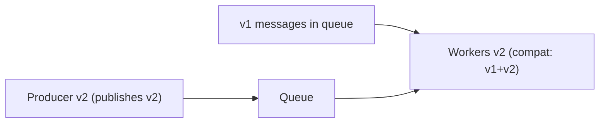
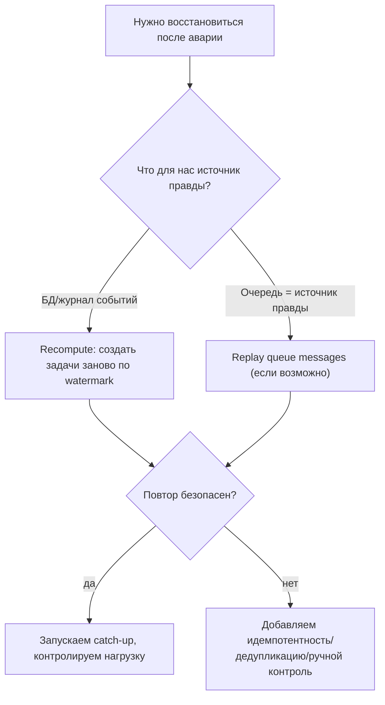

[← Назад к индексу части](index.md)
[↑ К глобальному плану](../../mastery_plan.md)

## 12.6. DR и совместимость: очередь не пуста

### Цель раздела

Научиться думать о Celery как о системе, где сообщения живут дольше, чем ваш деплой: как обновляться при непустой очереди, как версионировать payload, и как строить disaster recovery и replay-стратегии так, чтобы они не превращались в хаос.

### В этом разделе главное

- Очередь — это “память времени”: деплой всегда встречает сообщения из прошлого.
- **Совместимость** — это не только “формат JSON”, это ещё и семантика (что означает поле, какие допустимые значения).
- DR почти всегда опирается на **идемпотентность** и на наличие “источника правды” (БД/лог событий).
- Нельзя “восстановиться” без ответа: **что можно потерять, а что нельзя**.

### Термины

| Термин | Определение |
|---|---|
| **Schema evolution** | Эволюция структуры payload без ломки старых сообщений. |
| **Phased rollout** | Обновление по фазам: сначала совместимый consumer, потом producer, потом очистка. |
| **Dual-read / dual-write** | В переходный период читать/писать сразу две версии формата/канала. |
| **Replay** | Повторное воспроизведение событий/задач для восстановления. |

### Теория и правила

#### 1) Почему “меняем сигнатуру задачи” опасно

Если у вас есть сообщения в очереди, они уже сериализованы. Новая версия кода может:
- ожидать другое число аргументов,
- ожидать другое поле,
- иначе интерпретировать значение.

В результате после деплоя вы получите массовые падения задач.

#### 2) Базовая стратегия phased rollout для задач

**Фаза 1: подготовка consumer**
- выкатываем воркеры, которые умеют понимать **старый и новый формат**.

**Фаза 2: обновление producer**
- выкатываем код, который публикует **новый формат**.

**Фаза 3: очистка**
- когда уверены, что старых сообщений больше нет, убираем поддержку старого формата.

“Картинка в голове”:



Ключ: сначала обновляем того, кто **читает**, потом того, кто **пишет**. Это универсальный принцип совместимости.

#### 3) Что значит DR для Celery (простая рамка)

DR — это ответы на вопросы:
- Какие очереди/типы задач **критичны** и не должны теряться?
- Какие задачи можно **пересчитать** из источника правды?
- Что является источником правды: БД? журнал событий? внешняя система?
- Как избежать двойного выполнения при replay? (идемпотентность, дедупликация)

Принцип: “Если ты не можешь безопасно повторить — ты не можешь безопасно восстановиться”.

#### 3.1) Что именно “нужно сохранить” (и что можно потерять): матрица решений

Одна из самых практичных вещей для DR — договориться заранее, какие типы очередей и задач:

- **можно потерять** (и потом пересчитать/догнать),
- **нельзя терять** (и значит нужен другой уровень защиты).

Ниже — учебная матрица. Она не “про конкретный брокер”, а про смысл задачи.

| Категория задачи | Пример | Можно потерять? | Почему | Что сохранять / как восстанавливать |
|---|---|---:|---|---|
| **Производная/пересчитываемая** | пересчёт агрегатов, “обновить кэш”, поисковый индекс | обычно **да** | результат можно восстановить из источника правды | хранить watermark/курсор и уметь пересчитать диапазон |
| **Нотификации** | email/SMS/push | иногда **да**, но осторожно | потеря может быть приемлема, а повтор опасен (спам) | хранить idempotency key, журнал отправок, лимиты повторов |
| **Финансовые/критичные операции** | списание, выставление счёта, изменение статуса заказа | чаще **нет** | последствия юридические/денежные | транзакционный источник правды + идемпотентность + аудит |
| **Интеграции “ровно один раз по смыслу”** | отдать событие партнёру | **нет** (по смыслу) | повтор может вызвать двойной эффект у партнёра | outbox/дедупликация, retries с контролем, контракт с партнёром |
| **Периодика с “окнами”** | nightly batch за сутки | зависит | можно пропустить тик, но нельзя “сломать окно” | watermark, окно обработки, catch-up policy |

Ключ: DR — это не “мы сделали backup брокера”, а **мы понимаем, что такое потеря/повтор для бизнеса**.

#### 3.2) Replay strategy: как восстанавливаться после аварии “по-взрослому”

Replay (повтор) бывает двух типов, и их важно различать:

1) **Replay сообщений очереди** (если брокер/транспорт это позволяет): вы переотдаёте старые сообщения воркерам.  
2) **Recompute из источника правды**: вы заново строите задачи из БД/журнала событий по курсору (watermark).

Во многих системах вариант (2) надёжнее, потому что:
- очередь может быть не “источником правды”,
- сообщения могут быть частично потеряны,
- сообщения могут быть “плохими” (poison) или устаревшими.

Визуальная схема выбора стратегии:



Практическое правило: если ты не можешь уверенно ответить, “что будет при повторе”, значит DR-план ещё не готов.

#### 4) Версионирование задач: три уровня совместимости (очень практично)

В production “совместимость задач” — это сразу несколько разных вещей, которые легко перепутать:

| Уровень | Что именно меняется | Что может сломаться | Как защищаться |
|---|---|---|---|
| **A. Имя задачи и маршрутизация** | `task_name`, очередь, routing key | consumer не находит задачу; сообщения уходят “не туда” | phased rollout, алиасы имён, стабильные маршруты |
| **B. Схема payload (поля/аргументы)** | структура данных, типы, обязательность | ошибки парсинга/валидации, массовые падения после деплоя | schema evolution, compat reader, версия в payload |
| **C. Семантика (смысл)** | как интерпретируется поле/поведение | “всё валидно, но бизнес-эффект неправильный” | feature flags, canary, двойной контроль, аудит |

Ключевая мысль: JSON-совместимость решает только уровень B, но не A и не C.

Мини-паттерн “версия в payload”:

- добавь поле `schema_version`;
- consumer выбирает стратегию обработки по версии;
- в переходный период consumer понимает несколько версий.

Это не всегда нужно, но когда payload сложный и живёт долго в очереди — почти неизбежно.

### Пошагово

#### Пошаговый чеклист совместимости при деплое

1. Есть ли сообщения в очереди? Какой lag?
2. Меняется ли формат payload/аргументы/имя задачи?
3. Есть ли код обратной совместимости (парсинг обеих версий)?
4. Есть ли мониторинг ошибок “unknown field / missing field”?
5. Есть ли план отката и как он влияет на очередь?

#### Пошаговый чеклист DR

1. Классифицировать задачи: критичные/некритичные.
2. Для критичных: определить, что хранится и как восстанавливается.
3. Для некритичных: определить, как пересчитать (recompute) из источника правды.
4. Встроить идемпотентность/дедупликацию.
5. Тестировать recovery plan (на стенде/учениях).

### Простыми словами

Очередь — это как “почтовый ящик”, в который письма уже положили. Если вы поменяли формат письма так, что новый почтальон не умеет его читать — письма будут лежать и “падать”.

DR — это как пожарная безопасность: если нет плана заранее, в момент пожара вы не придумаете его качественно.

### Картинка в голове

```
Совместимость:
  сначала обнови читателя, потом писателя

DR:
  если повтор опасен -> восстановление опасно
  идемпотентность = страховка от повторов
```

### Как запомнить

**Формула:** “Очередь длиннее деплоя”.

### Примеры

#### Пример: evolve payload (идея)

Вместо “переименовали поле и всё”:
- добавили новое поле, но сохраняем старое,
- consumer умеет читать оба,
- после перехода удаляем старое.

Это скучно, но это и есть зрелость production.

### Практика / реальные сценарии

- **Деплой с миграцией БД**: новая версия задачи читает уже изменённую схему, а старая ещё может исполняться. Нужно учитывать порядок миграций и совместимость.
- **Восстановление после outage broker**: часть сообщений могла быть потеряна/доставлена повторно — система должна быть к этому готова.

### Типичные ошибки

- Менять сигнатуру задачи “в лоб” при непустой очереди.
- Считать, что JSON автоматически гарантирует совместимость (семантика может быть сломана).
- Не тестировать recovery plan.

### Что будет, если…

- **Если сделать несовместимый деплой**: массовые падения задач, backlog растёт, retry storm может добить систему.
- **Если не иметь DR-плана**: восстановление будет хаотичным, с риском потери данных и двойных эффектов.

### Проверь себя

1. Почему “сначала обновить consumer, потом producer” — универсальный принцип?

<details><summary>Ответ</summary>

Потому что reader должен уметь читать старый формат, пока writer ещё пишет старый. Если обновить writer первым, он начнёт писать новый формат, который старый reader не понимает, и система сломается. Поэтому сначала расширяем совместимость чтения, затем меняем запись.

</details>

2. Почему DR в фоновом контуре почти всегда упирается в идемпотентность?

<details><summary>Ответ</summary>

Потому что восстановление часто означает повтор: повтор доставки, replay, пересчёт. Если повторное выполнение может разрушить данные (двойное списание, двойной email), восстановление становится опасным. Идемпотентность делает повтор безопасным.

</details>

3. Почему “формат совместим”, но “семантика сломана” — реальный риск?

<details><summary>Ответ</summary>

Потому что поле может существовать, но изменилось его значение/интерпретация (например, валюта, единицы измерения, статус-коды). С точки зрения схемы всё валидно, но бизнес-смысл поменялся, и задача делает неправильный эффект.

</details>

### Запомните

- Очередь и деплой живут в разных временах: сообщения переживают релиз.
- DR и совместимость — это не “редкий кейс”, а неизбежность зрелой эксплуатации.

---
