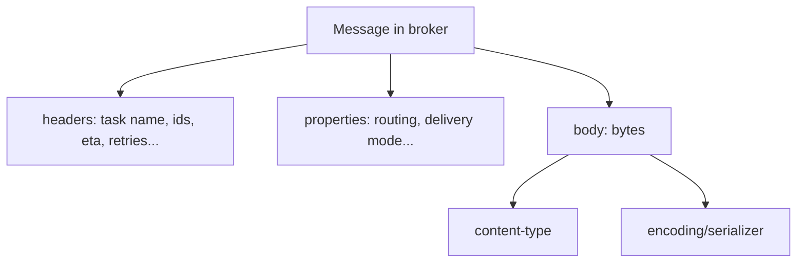

[← Назад к индексу части](index.md)
[↑ К глобальному плану](../mastery_plan.md)

## 13.2. Task message protocol: что лежит в очереди

### Цель раздела

Понять, что именно представляет собой “сообщение задачи” внутри broker: какие поля обязательны, где лежат метаданные, как версии протокола и сериализация влияют на совместимость и безопасность.

### В этом разделе главное

- В очереди лежит **сообщение**, а не “Python-функция”.
- Сообщение обычно разделено на: **headers**, **properties**, **body**.
- Сериализация тела — отдельный риск (pickle vs json) и отдельный источник несовместимости.
- В сообщении живут ключевые идентификаторы графа: `task_id`, `root_id`, `parent_id`, иногда `group_id`.
- Поля вроде `eta/expires/retries` — часть протокола, но реальное поведение может быть transport-dependent.

### Термины

| Термин | Определение |
|---|---|
| **Protocol version** | Версия формата сообщения задачи; влияет на структуру и поля. |
| **Headers** | Метаданные “в шапке” сообщения (например, имя задачи, ids, retries, eta). |
| **Properties** | Транспортные свойства сообщения (routing, delivery-mode и др.). |
| **Body** | Тело сообщения (обычно аргументы, kwargs, callbacks или их представления). |
| **Serializer** | Кодек, который превращает Python-структуру в байты (json/msgpack/pickle). |
| **Content-type** | Метка формата, чтобы receiver понимал, как декодировать body. |

### Теория и правила

#### 1) Главное: контракт сообщения должен быть стабильным

Задача — это контракт:

- **Имя задачи** (string) должно быть стабильно и одинаково трактоваться producer/worker.
- **Аргументы** должны быть сериализуемыми и **backward-compatible** при деплое.
- **Метаданные** (ids, retries, eta) должны сохраняться, иначе ломается orchestration/наблюдаемость.

Это критично по одной причине: **в очереди могут лежать старые сообщения**, которые переживут деплой.

##### Проверь себя (контракт сообщения)

1. Почему “мы деплоим producer и worker вместе” не отменяет требования backward compatibility?

<details><summary>Ответ</summary>

Потому что между ними есть broker и время: сообщения могли быть опубликованы старой версией до деплоя, но будут исполнены новой версией после деплоя. Очередь — буфер, поэтому “одновременный деплой” не гарантирует, что в обработку не попадут старые сообщения.

</details>

2. Представь, что ты меняешь имя задачи (string) или путь импорта. Что именно ломается и почему это относится к “контракту”?

<details><summary>Ответ</summary>

Worker выбирает обработчик по имени задачи из сообщения через registry. Если имя изменилось, worker может не найти обработчик для уже опубликованных сообщений, и они будут падать/зависать/уходить в DLQ/повторы в зависимости от политики. Это ломает совместимость на уровне протокола, а не на уровне “бизнес‑кода”.

</details>

3. Какие два элемента контракта ты обязан “держать стабильными” даже для задач без результата?

<details><summary>Ответ</summary>

Стабильное имя задачи и сериализуемая/совместимая схема аргументов (payload). Даже если результат не нужен, сообщение должно быть корректно декодировано и сматчено на обработчик.

</details>

#### 2) Почему pickle опасен не только “идеологически”

Pickle — это не просто “формат”, а механизм, который может выполнять код при десериализации. Поэтому:

- если хоть где-то есть риск, что в broker попадёт недоверенное сообщение — pickle становится RCE-риск;
- даже без атак pickle делает совместимость “хрупкой”: он завязан на классы/модули.

Правило: **по умолчанию выбирать безопасные сериализаторы** (обычно json) и включать другие только осознанно и с ограничением источников.

##### Проверь себя (pickle и безопасность)

1. Почему pickle — это не просто “неудобный формат”, а потенциальная уязвимость?

<details><summary>Ответ</summary>

Pickle при десериализации может выполнять произвольный код. Если злоумышленник или ошибочная система сможет положить сообщение в broker, worker может выполнить вредоносный код в момент декодирования body.

</details>

2. В каком случае “мы доверяем брокеру” всё равно не является полноценной защитой?

<details><summary>Ответ</summary>

Потому что риск может прийти не только “из интернета”, но и из внутренней инфраструктуры: скомпрометированный сервис, неправильные права доступа к broker, человеческая ошибка, утечки credentials. “Внутренний контур” не равен “безопасный”.

</details>

3. Что важнее: “удобно сериализовать любой Python‑объект” или “контракт задач предсказуем и безопасен”? Почему?

<details><summary>Ответ</summary>

Предсказуемость и безопасность. Celery — распределённая система: ты платишь сложностью диагностики и доверия. Удобство сериализации не должно увеличивать риск RCE и ломать совместимость при деплое.

</details>

#### 2.1) Body encoding, content-type и “почему оно вдруг не декодируется”

Тело сообщения (body) в Celery — это “байты + метка, как эти байты читать”.

- **Body encoding** — как Python-структура превращается в байты (через serializer).
- **Content-type** — строка-метка формата (условно: `application/json`, `application/x-python-serialize` и т.п.).

Почему это важно в реальности:

- Producer может отправить сообщение в одном формате, а worker может быть настроен принимать только часть форматов.
- При деплое/миграции сериализатора “тихие” несовместимости часто проявляются как массовые падения на десериализации.

Практический принцип: **разрешённые content-types — это политика безопасности и совместимости**. Если политика “размыта”, у тебя выше риск уязвимостей и неожиданной несовместимости.

##### Проверь себя (content-type и декодирование)

1. Почему “в очереди лежит bytes” ещё не означает, что worker сможет это выполнить?

<details><summary>Ответ</summary>

Потому что bytes должны быть декодированы по правильному content-type/serializer. Если worker не разрешает этот content-type или использует другой serializer, сообщение не распакуется, и задача не стартует.

</details>

2. Что опаснее в production: “разрешить все content-types” или “разрешить только безопасный набор”? Почему?

<details><summary>Ответ</summary>

Разрешить все — опаснее: повышается риск уязвимостей (например, pickle) и риск неожиданных несовместимостей при миграциях сериализации. Ограниченный набор делает поведение предсказуемым и безопаснее.

</details>

3. Какой симптом в логах/метриках обычно указывает на проблему декодирования (а не на проблему бизнес‑логики)?

<details><summary>Ответ</summary>

Массовые ошибки на этапе получения/распаковки сообщения (decode/deserialization error) до старта “task code”. Часто видно, что задача даже не вошла в `task_prerun`, а падает раньше.

</details>

#### 3) Идентификаторы графа: root/parent/task

Ментальная модель:

- `task_id` — конкретный “физический запуск” задачи.
- `root_id` — корень цепочки/графа (logical job).
- `parent_id` — кто породил текущую задачу.

Это основа для:

- трассировки;
- понимания причинно-следственных связей;
- диагностики “почему появилось столько задач”.

##### Проверь себя (идентификаторы)

1. Чем `task_id` отличается от `root_id` в практической отладке?

<details><summary>Ответ</summary>

`task_id` — конкретный запуск. `root_id` — общий “корень” цепочки/графа, то есть логическая операция, которая породила множество задач. Для расследования инцидентов `root_id` позволяет собрать всю “историю” одной операции.

</details>

2. Зачем нужен `parent_id`, если уже есть `root_id`?

<details><summary>Ответ</summary>

`parent_id` задаёт локальную причинность: кто породил текущую задачу. Это помогает восстановить дерево/граф порождений (особенно в canvas), а не только “всё относится к одному корню”.

</details>

3. Какой тип проблем проще ловить через `root_id/parent_id`, чем через логи “по имени задачи”?

<details><summary>Ответ</summary>

Проблемы “взрывного порождения” задач, циклических/повторных workflow, неожиданных fan-out, а также поиск первопричины в цепочке (какой шаг породил лавину ошибок).

</details>

#### 3.1) Correlation metadata: как связывать producer и worker “в одну историю”

Цель correlation metadata — сделать из распределённого исполнения *одну наблюдаемую транзакцию* (хотя бы на уровне логов/трейсов).

Что обычно относят к correlation metadata:

- `correlation_id` / `x_correlation_id` (связка с HTTP-request или бизнес-операцией),
- trace context (для distributed tracing),
- `root_id/parent_id` (для цепочек задач),
- tenant/user ids (с осторожностью и без персональных данных в логе, если есть комплаенс).

Ключевой нюанс: **correlation metadata эффективнее всего добавлять на producer-side до publish**, чтобы оно гарантированно “ехало” с сообщением через broker и было доступно worker-у.

Диагностическая выгода: когда у тебя “странности internals”, correlation позволяет увидеть путь: “HTTP → publish → worker reserve → execute → backend write”.

##### Проверь себя (correlation metadata)

1. Почему correlation метаданные лучше добавлять на producer-side до publish, а не на worker-side?

<details><summary>Ответ</summary>

Потому что они должны ехать вместе с сообщением через broker и быть доступны на всех этапах: в логах публикации, в worker, в мониторинге/трейсинге. Если добавить их только на worker-side, ты теряешь “половину истории” (producer → broker).

</details>

2. Почему “положить user_id в correlation” может быть плохой идеей в некоторых системах?

<details><summary>Ответ</summary>

Из-за комплаенса и утечек персональных данных: логи и payload могут долго храниться и быть доступны шире, чем исходная БД. Часто лучше хранить обезличенный correlation id и связывать его с пользователем в контролируемом месте.

</details>

3. Как correlation помогает отличить “задача дублируется” от “два разных запроса породили две задачи”?

<details><summary>Ответ</summary>

Если correlation id привязан к конкретному внешнему событию (например, HTTP request id), ты можешь увидеть: один correlation породил два `task_id` (дубликат/повтор), или два разных correlation породили по одной задаче (нормальный параллелизм).

</details>

#### 4) ETA / expires / retries и transport-dependent поведение

Формально эти поля выглядят “универсальными”, но в реальности их поведение зависит от транспорта и режима исполнения:

- **ETA/countdown**: где именно и как долго задача “ждёт”, зависит от того, кто держит таймер (broker vs worker-side scheduling behavior в конкретной связке).
- **expires**: может интерпретироваться по-разному в зависимости от момента проверки (до reserve, после reserve, перед submit).
- **retries**: логический счётчик в протоколе/контексте задачи, но redelivery и retry могут смешиваться по симптомам.

Практическая мысль: одинаковый payload не гарантирует идентичное runtime-поведение на разных transport-контурах. Поэтому в production важны не только “правильные поля”, но и тесты на конкретном transport.

##### Проверь себя (ETA/expires/retries)

1. Почему “ETA есть в сообщении” не гарантирует одинаковое поведение на разных брокерах?

<details><summary>Ответ</summary>

Потому что часть механики ожидания/планирования и проверки может быть реализована по‑разному (broker-side vs worker-side поведение в конкретной связке transport). Поэтому один и тот же набор полей может давать разные эффекты по задержкам и моменту исполнения.

</details>

2. Чем `retry` (логика приложения) отличается от `redelivery` (поведение доставки)?

<details><summary>Ответ</summary>

`retry` — сознательное решение “повторить задачу” по политике ошибок. `redelivery` — повторная доставка сообщения из-за того, что оно не было корректно подтверждено (ack) или consumer потерялся. Симптомы похожи (“задача снова”), но причины и лечение разные.

</details>

3. Где чаще всего “ломается ожидание” по `expires`?

<details><summary>Ответ</summary>

Когда разные части pipeline проверяют истечение в разные моменты (до reserve/после reserve/перед submit), либо когда есть задержки из-за prefetch/pool очередей. Тогда задача может казаться “должна была умереть”, но фактически уже зарезервирована/стартовала.

</details>

#### 5) Protocol versions: почему “одна и та же Celery” может говорить “на разных диалектах”

Идея protocol versions простая: формат сообщения менялся и может иметь вариации.

Практический смысл:

- при апгрейде Celery часть worker-ов может быть одной версии, часть — другой (rolling update),
- в очереди могут лежать сообщения, созданные старой версией producer,
- а worker должен уметь их разобрать.

Вывод: **апгрейды Celery и Kombu нужно проектировать как миграции протокола**, а не как “обновили библиотеку”.

##### Проверь себя (protocol versions)

1. Почему обновление Celery “только у воркеров” может сломать систему, даже если API задач не менялся?

<details><summary>Ответ</summary>

Потому что меняется интерпретация/поддержка формата сообщений (protocol versions, поля, сериализация). В очереди могут быть сообщения, созданные другой версией producer/старой версией, и новый worker может трактовать их иначе.

</details>

2. Что важнее тестировать при апгрейде: “код задач” или “контур сообщений в очереди”? Почему?

<details><summary>Ответ</summary>

Контур сообщений: совместимость формата, сериализация, обработка полей, поведение доставки. Код задач может быть неизменным, но система ломается на протоколе/транспорте.

</details>

3. Какой практический признак говорит о проблеме протокольной совместимости?

<details><summary>Ответ</summary>

Массовые ошибки декодирования/распаковки/неизвестной задачи сразу после деплоя/апгрейда, при том что код бизнес‑логики не менялся или менялся минимально.

</details>

### Пошагово

Как думать о message protocol в практических задачах:

1. Сформулируй, какие поля тебе нужны для observability (correlation, trace ids).
2. Выбери сериализатор и набор разрешённых content-types.
3. Определи схему payload (явно: версия, поля, типы).
4. Проектируй эволюцию схемы так, чтобы новые worker-ы понимали старые сообщения.

### Простыми словами

Очередь хранит не “вызов функции”, а “конверт”:

- на конверте написано “что это” (имя задачи, id, meta),
- внутри лежит “что нужно сделать” (аргументы),
- и важно, чтобы все участники умели читать этот конверт одинаково.

### Картинка в голове

```text
Message
├─ headers: { task, id, root_id, parent_id, retries, eta, expires, ... }
├─ properties: { routing_key, delivery_mode, priority?, ... }
└─ body: bytes (serializer=json/msgpack/...)
```



### Как запомнить

**Очередь = договор в байтах**. Если “договор” меняется без обратной совместимости — прод ломается без единой строки exception в producer.

Дополнение к формуле:

- **Протокол одинаковый, поведение может отличаться** (из-за транспорта и runtime).
- Поэтому “прочитал поле” и “получил ожидаемое поведение” — не одно и то же.

### Примеры

#### Пример: версия payload как страховка при деплое

Если у тебя задача принимает сложный словарь, полезно добавить версию:

```python
# producer side: передаём версию схемы
payload = {
    "v": 2,
    "user_id": 123,
    "email": "a@example.com",
    "reason": "welcome",
}
send_email.apply_async(kwargs={"payload": payload})
```

А на worker стороне:

```python
@app.task(bind=True)
def send_email(self, payload: dict):
    v = int(payload.get("v", 1))
    if v == 1:
        # старый формат
        user_id = payload["user_id"]
        email = payload["email"]
    elif v == 2:
        # новый формат (пример)
        user_id = payload["user_id"]
        email = payload["email"]
    else:
        raise ValueError(f"Unsupported payload version: {v}")
```

Это не “красота”, а способ пережить непустую очередь во время rolling update.

### Практика / реальные сценарии

- **Rolling update при непустой очереди**: старые сообщения должны быть прочитаны новыми worker-ами.
- **Миграция сериализатора**: делай поэтапно, иначе часть воркеров перестанет понимать сообщения.
- **Сквозная трассировка**: добавляй correlation ids в headers (или в payload) и прокидывай дальше.

### Типичные ошибки

- Передавать в задачу несерилизируемые объекты (ORM instance, file handle, DB connection).
- Передавать “огромные payload” (мегабайты) вместо ссылки на объектное хранилище.
- Менять сигнатуру/тип аргументов без стратегии backward compatibility.
- Разрешать pickle просто “потому что так удобно”.
- Не иметь явной политики “какие content-types допустимы” (безопасность + предсказуемость).

### Что будет если…

- Если поменять структуру kwargs, а в очереди остались старые сообщения, worker начнёт падать массово (часто с “не теми” исключениями).
- Если разрешить опасные сериализаторы, можно получить эксплуатационный риск уровня “компрометация worker-ов”.

### Проверь себя

1. Почему задача — это контракт, а не просто функция?

<details><summary>Ответ</summary>

Потому что между producer и worker есть transport/broker, время и независимые деплои. Функция — это локальный вызов. Контракт — это стабильное имя + сериализуемые аргументы + предсказуемая обработка версий/ошибок.

</details>

2. Почему “мы же деплоим одновременно” не спасает от несовместимости сообщений?

<details><summary>Ответ</summary>

Потому что очередь — буфер: сообщения могут быть созданными “до”, но исполненными “после”. Даже при одновременном деплое остаются сообщения в broker, которые попадут на новую версию worker-а.

</details>

3. Какой главный риск pickle в контуре задач?

<details><summary>Ответ</summary>

Риск выполнения произвольного кода при десериализации (RCE), если злоумышленник или ошибочная система сможет поместить сообщение в очередь. Плюс хрупкая совместимость по классам/модулям.

</details>

### Запомните

**В очереди лежит “байтовый контракт”.** Совместимость и безопасность начинаются с протокола сообщения.

---
