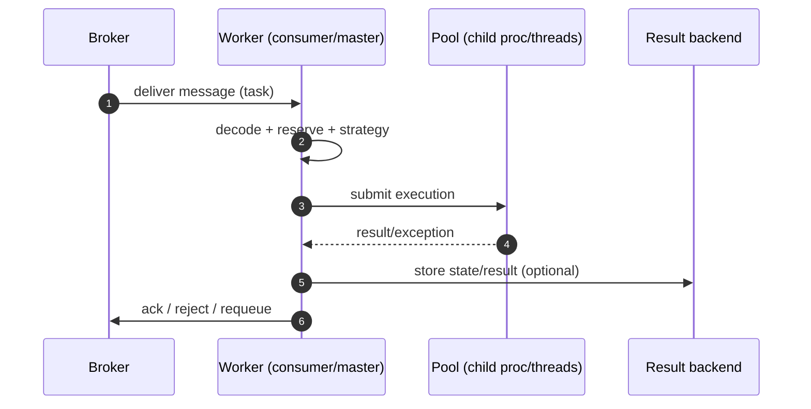

[← Назад к индексу части](index.md)
[↑ К глобальному плану](../celery_mastery_plan.md)

## 13.3. Consumer pipeline: от broker до pool

### Цель раздела

Разобрать внутренний pipeline потребления: как worker подключается к broker, забирает сообщения, буферизует их (prefetch), выбирает стратегию обработки и передаёт исполнение в pool, а затем принимает решение про ack/reject/requeue.

### В этом разделе главное

- Consumer pipeline — это “конвейер”, где каждое место может быть bottleneck.
- `prefetch` создаёт внутреннюю очередь “у worker-а”; это влияет на fairness и redelivery.
- Strategy layer решает, как именно обработать сообщение (включая ETA/expiration и др.).
- Ack/reject — это решение на стыке “доставка” и “исполнение”; оно критично для at-least-once семантики.
- Ошибки в child process должны быть корректно “спроецированы” обратно в state/result/events.

### Термины

| Термин | Определение |
|---|---|
| **drain events** | Получение событий/сообщений из transport event loop (упрощённо: “прочитать из broker”). |
| **reserve task** | “Зарезервировать” задачу: взять сообщение в обработку (часто до реального старта). |
| **Strategy** | Логика обработки конкретного типа сообщения/задачи: как распаковать, что проверить, куда отправить. |
| **QoS** | Управление “сколько сообщений можно взять” (prefetch/QoS). |
| **reject/requeue** | Отказ от сообщения; requeue означает “вернуть в очередь”. |

### Теория и правила

#### 1) Почему prefetch — это одновременно ускорение и риск

Prefetch (упрощённо): worker говорит broker “дай мне N сообщений заранее”.

Плюсы:

- меньше round-trip к broker;
- выше throughput при маленьких задачах (throughput = “сколько задач в секунду/минуту система реально переваривает”);
- better batching (batching = “обработка пачками”, меньше накладных расходов на каждое сообщение).

Минусы:

- **fairness** ухудшается: один worker может “унести” много сообщений и держать их у себя.
- при падении worker-а сообщения могут быть redelivered пачкой.
- ETA/сcheduling внутри worker-а может приводить к “сообщение унесли, но оно ждёт”.

Здесь полезно помнить ещё два термина:

- **overhead** (“накладные расходы”) — время/ресурсы на доставку, сериализацию, запись результата и координацию, которые не являются “полезной работой задачи”.
- **latency** (“задержка”) — сколько времени проходит от publish до start/finish; latency может расти даже при хорошем throughput (например, если очередь переполнена).

Это означает: prefetch — ключевой рычаг эксплуатационного поведения.

##### Проверь себя (prefetch)

1. Почему высокий prefetch может ухудшить “справедливость” распределения, даже если у тебя много worker-ов?

Ответ

Потому что один worker может заранее “унести” много сообщений из broker и держать их у себя (reserved), пока его pool занят. Другие worker-ы эти сообщения уже не увидят, и нагрузка распределится хуже, чем ожидалось.

2. Какой практический компромисс ты делаешь, повышая prefetch?

Ответ

Ты уменьшаешь overhead на получение сообщений и повышаешь throughput на коротких задачах, но рискуешь fairness, предсказуемостью redelivery после падений и ростом “внутренней очереди” на стороне worker-а.

3. Чем опасна ситуация “throughput хороший, а latency растёт” в контуре задач?

Ответ

Это значит, что система “переваривает” задачи в единицу времени, но отдельные задачи всё дольше ждут старта/завершения (очередь/резервирование/внешние зависимости). Для бизнеса часто важнее latency/SLO, чем “средний throughput”.

#### 2) Где заканчивается broker и начинается worker

Broker хранит сообщения и отдаёт их consumer-ам.
Worker:

- принимает сообщения (I/O),
- решает, что делать,
- исполняет или откладывает,
- подтверждает обработку.

Важно: если ты перепутаешь “где очередь”, ты перепутаешь “где лечить”.

##### Проверь себя (граница broker vs worker)

1. Почему “очередь пустая” на broker не означает “задач нет”?

Ответ

Потому что задачи могут быть уже забраны worker-ами (prefetch/reserved) и ждать исполнения внутри worker/pool. Снаружи кажется, что broker пуст, но backlog фактически “переехал” в worker.

2. Что проще масштабировать: broker или execution pool? И почему ответ “зависит”?

Ответ

Зависит от bottleneck. Если проблема в доставке/подключениях/лимитах брокера — масштабирование pool не поможет. Если проблема в исполнении (CPU/IO/внешние API) — масштабирование broker не поможет. Нужно локализовать слой.

3. В каком слое чаще всего появляется “неожиданная” сложность из-за сети?

Ответ

На границе transport/broker ↔ consumer: reconnect, partial failures, задержки доставки. Код задач может быть идеальным, но система будет “странной” из-за сети.

#### 2.1) Connect и “жизнь соединения”: почему иногда всё ломается без единой ошибки в задачах

Consumer pipeline начинается с банальной вещи: **worker должен быть подключён к broker**. Но в production “подключённость” — это не булевый флаг, а процесс:

- соединение может деградировать,
- каналы могут закрываться,
- может быть reconnect,
- могут быть transient ошибки.

Важно: при транспортных проблемах код задач может быть идеальным, а система всё равно будет “странной” (задержки, частичные ответы inspect, redelivery).

##### Проверь себя (connect/reconnect)

1. Почему reconnect loop часто проявляется как “задачи то идут, то не идут”, без явных исключений в task-коде?

Ответ

Потому что проблема в доставке: consumer периодически теряет связь и не читает сообщения. Код задачи может не исполняться вовсе, поэтому “ошибок в задаче” нет — есть деградация transport-слоя.

2. Какие два “ложных лечения” чаще всего делают люди, не распознав transport-проблему?

Ответ

Увеличивают concurrency/число воркеров “для скорости” и добавляют retry “чтобы надёжнее”. Это может усугубить ситуацию: больше воркеров → больше соединений/нагрузки на broker; больше retry → больше сообщений и шторм.

3. Какой тип доказательств нужен, чтобы уверенно сказать “это сеть/брокер”, а не “код задачи”?

Ответ

Логи Kombu/transport (reconnect, channel reset), метрики broker (connections, queue lag), и факт, что задачи не доходят до этапов `task_prerun`/исполнения. То есть доказательства по слоям.

#### 3) Strategy, rate limit и QoS: где принимаются решения

В consumer strategy происходит не только “распаковка сообщения”, но и решения:

- можно ли исполнять задачу сейчас с учётом ограничений;
- не превышен ли rate limit;
- как применяются QoS/prefetch в текущем состоянии worker-а;
- как трактовать сообщение с учётом expiration/eta.

Это важно, потому что задержка задачи может быть не в коде задачи, а в логике consumer strategy.

##### Проверь себя (strategy/QoS/rate limit)

1. Приведи пример, когда задача “ждёт”, хотя CPU свободен и ошибок нет.

Ответ

Например, сработал rate limit или QoS/prefetch логика ограничивает выдачу задач в pool; либо ETA/expiration трактуются так, что задача не должна стартовать сейчас. Тогда задержка в consumer strategy, а не в исполнении.

2. Почему важно отличать “задержку до старта” от “долгого исполнения”?

Ответ

Потому что лечатся они по-разному: задержка до старта — это routing/capacity/prefetch/QoS/transport; долгое исполнение — это код задачи или внешние зависимости (DB/API). Без различения ты будешь лечить не тот слой.

3. Какой риск несёт “централизованный rate limit” без наблюдаемости?

Ответ

Можно “тихо” задушить обработку: задачи будут копиться, latency вырастет, а ошибок не будет. Поэтому rate limit должен сопровождаться метриками backlog/lag и алертами.

#### 4) Mapping ошибок child process -> state/result/event

Ошибки в child процессе не “пропадают” сами по себе — они транслируются обратно в master-контур:

- в state/result backend (если включён),
- в события мониторинга,
- в worker-логи.

На практике один и тот же сбой может выглядеть по-разному в разных наблюдателях:

- в логах child ты видишь стек;
- в master логе — сообщение о failure/timeout/worker lost;
- в backend — обобщённый state/exception payload.

Поэтому правильная диагностика всегда сопоставляет минимум два источника: логи worker + состояние backend/events.

##### Проверь себя (child→master→backend)

1. Почему stack trace в child не всегда объясняет, почему клиент видит `PENDING`?

Ответ

Потому что `PENDING` может быть следствием проблем с backend (не записался state/result), проблем с доставкой событий, или того, что задача вообще не дошла до исполнения. Child trace объясняет только “почему упал код”, но не “как это отразилось в state”.

2. Какая типичная ошибка расследования связана с тем, что лог/стейт/события — разные источники?

Ответ

Считать один источник “истиной” и игнорировать остальные. Например, видеть “finished” в task-логе и думать, что всё ок, хотя backend запись упала и orchestration сломалась.

3. Какой минимум источников ты сопоставляешь при странном поведении: один, два, три?

Ответ

Минимум два: worker logs (master+child) и backend/events. В production часто нужно три: плюс broker/transport метрики, если есть симптомы доставки.

#### 5) Reserve task: почему “взяли” не значит “начали”

Reserve — это момент, когда worker “считает сообщение своим” (часто на уровне внутренних структур) и начинает путь к исполнению. Но:

- reserve может случиться существенно раньше реального старта, если pool занят;
- reserve может происходить “пачками” из-за prefetch;
- при падении worker-а зарезервированные сообщения могут вернуться в broker (и это выглядит как “дубли”).

Чтобы не ошибаться в выводах, полезно отличать:

- **received/reserved** (consumer увидел и держит),
- **started** (pool реально запустил код).

##### Проверь себя (reserve vs started)

1. Почему “received/reserved” — плохой сигнал для оценки SLO “задача стартует за X секунд”?

Ответ

Потому что reserve может случиться задолго до старта, особенно при большом prefetch и занятости pool. Для SLO важен enqueue→start, а received/reserved показывает только, что consumer увидел сообщение.

2. Как reserve связан с ощущением “задачи дублируются после рестарта”?

Ответ

Если сообщения были зарезервированы worker-ом, но не были подтверждены (ack), при падении/рестарте они возвращаются в broker и будут доставлены снова. Это выглядит как дубль, хотя это нормальная at-least-once семантика.

3. Что быстрее покажет проблему “pool забит”: broker метрика depth или `inspect active/reserved`?

Ответ

`inspect active/reserved`: он покажет, что worker держит много reserved и/или active задач, а новые не стартуют. Broker depth может быть маленьким, потому что backlog “переехал” в reserved.

### Пошагово

Путь сообщения внутри worker-а (упрощённо):

1. Worker подключается к broker и подписывается на очереди.
2. Consumer получает сообщение (drain).
3. Сообщение декодируется, читаются headers/properties/body.
4. Сообщение “резервируется” и попадает в pipeline.
5. Strategy решает: можно ли исполнять сейчас, не истекло ли, что с ETA.
6. Task отправляется в pool (submit).
7. Pool исполняет; результат/исключение возвращается в master.
8. Master фиксирует state/result/events.
9. Принимается решение: ack/reject/requeue.

А теперь тот же путь, но “с фокусом на места, где чаще всего ломается”:

1. **connect**: worker подключился к broker, подписался на очереди (если тут проблемы — ты видишь reconnects/ошибки transport).
2. **drain events**: worker читает сообщения/события из transport event loop (если тут проблемы — “тишина” при непустой очереди).
3. **decode**: распаковка body по content-type (если тут проблемы — массовые decode errors).
4. **reserve/prefetch**: сообщение стало “на стороне worker” (если тут проблемы — fairness, лавина redelivery после рестарта).
5. **strategy dispatch**: решение “что делать” (rate limit/QoS/ETA/expiration) (если тут проблемы — задержки без явной нагрузки CPU).
6. **execute pool submission**: отправка в pool (если тут проблемы — starvation, pool hung, OOM).
7. **result/state/events**: фиксация результата и событий (если тут проблемы — “выполнилось, но статус не меняется”).
8. **ack/reject**: подтверждение/отказ (если тут проблемы — потери/дубли и неожиданные redelivery).

### Простыми словами

Consumer — это “приёмщик на складе”: он может принести на конвейер сразу много коробок (prefetch), но если конвейер медленный, коробки будут лежать у него в руках, а не на складе (broker). Издалека это выглядит как “на складе пусто, но доставка не работает”.

### Картинка в голове

### Как запомнить

**Broker отдаёт сообщение, worker решает судьбу.** Prefetch — это “сколько судьбы взять заранее”.

### Примеры

#### Пример: почему `prefetch_multiplier` влияет на “справедливость”

Сценарий:

- 2 worker-а читают одну очередь.
- Задачи бывают короткие и длинные.

Если prefetch высокий, один worker может быстро забрать много длинных задач и “заблокировать” себя, а второй будет простаивать или наоборот. В итоге кажется, что “Celery распределяет плохо”.

Решение — проектировать:

- отдельные очереди по классу задач;
- разумный prefetch;
- отдельные pool-ы или отдельные worker-ы.

### Практика / реальные сценарии

- **Симптом**: “очередь пустая, но задача не стартует”.
  - Возможная причина: worker prefetch-нул сообщение и держит его у себя, но pool занят.
- **Симптом**: “после рестарта воркеров внезапно лавина повторов”.
  - Возможная причина: сообщения были зарезервированы prefetch-ом и вернулись в broker.

### Типичные ошибки

- Думать, что “queue depth = backlog”. На практике backlog может быть “внутри worker” (prefetch).
- Считать, что увеличение prefetch всегда хорошо.
- Не различать “received” vs “started”.

### Что будет если…

- Если prefetch слишком большой, fairness падает, а восстановление после падений становится менее предсказуемым.
- Если prefetch слишком маленький, throughput падает (overhead на broker).

### Проверь себя

1. Почему высокая `prefetch` может ухудшить распределение нагрузки между worker-ами?

Ответ

Потому что один worker может заранее забрать много сообщений и держать их у себя до освобождения pool. Другие worker-ы в этот момент не увидят эти сообщения и будут недогружены. Это “локальная монополизация” очереди.

2. Какие два места могут быть очередью “ожидания” кроме broker?

Ответ

Внутри worker-а (prefetch/reserved) и внутри execution pool (очередь задач на исполнение, если слоты заняты).

3. Что означает `requeue` и когда оно опасно?

Ответ

Requeue возвращает сообщение обратно в очередь, чтобы его мог взять другой worker или тот же позже. Опасно, если причина ошибки не исчезает (poison message) — получится бесконечная карусель, часто приводящая к retry storm.

### Запомните

**Consumer pipeline — это место, где “распределённость” становится реальностью.** Prefetch и ack — ключевые рычаги поведения.

---
