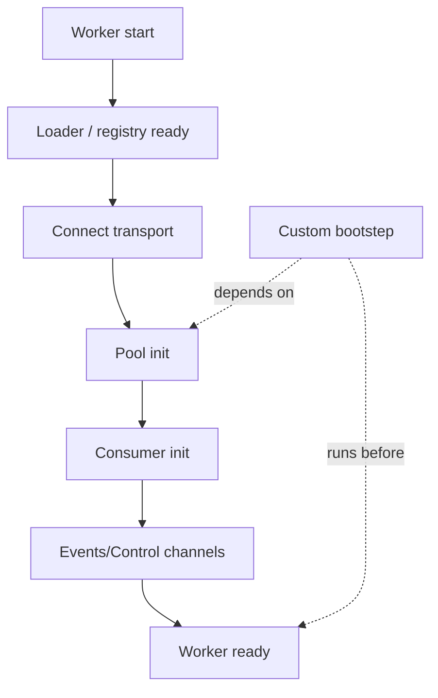

[← Назад к индексу части](index.md)
[↑ К глобальному плану](../celery_mastery_plan.md)

## 13.4. Bootsteps: жизненный цикл worker и расширения

### Цель раздела

Понять, что такое `bootsteps`, как через них устроен жизненный цикл worker-а, и как добавлять свои компоненты (инициализация клиентов, health probes, подписки на события) так, чтобы это было предсказуемо и поддерживаемо.

### В этом разделе главное

- Bootsteps — это **структурированная инициализация**: worker собирается как цепочка шагов.
- Каждый bootstep может иметь зависимости и порядок.
- Bootsteps — мощный механизм, но привязывает к internals версии Celery → использовать осознанно.
- Часто задача, для которой “хочется bootsteps”, решается проще: явным кодом в приложении или отдельным процессом.

### Термины

| Термин | Определение |
|---|---|
| **Bootstep** | Шаг инициализации/старта worker-а, который может добавлять компонент или логику. |
| **Dependency** | Требование “этот шаг должен быть после/до другого шага”. |
| **Blueprint** | Пакет шагов, из которых собирается worker (упрощённо: “план сборки”). |

### Теория и правила

#### 1) Зачем bootsteps вообще существуют

В worker-е много подсистем: соединение с broker, consumer, pool, event dispatcher, контрольные каналы, таймеры, heartbeat, сигнализация, логи.

Если бы всё инициализировалось “в одном `__init__`”, то:

- порядок и зависимости были бы неявными,
- расширение было бы через хаки,
- тестирование было бы сложнее.

Bootsteps — это “конструктор” worker-а, где шаги можно добавлять/менять.

#### 2) Главный принцип безопасного расширения

Если твой кастомный шаг:

- влияет на бизнес-результат (например, “не запускать задачу если…”),
- зависит от конкретных внутренних объектов Celery,

то ты должен считать это **инженерным долгом** и покрыть тестами/владением.

Если шаг:

- добавляет телеметрию,
- инициализирует клиент (например, Prometheus exporter, tracing),

то риск ниже, но порядок инициализации всё равно важен.

### Пошагово

Как подходить к bootsteps практично:

1. Сначала сформулируй цель: что нужно добавить и почему нельзя проще.
2. Определи, к какому моменту жизненного цикла это относится: до подключения к broker? после готовности pool? после запуска consumer?
3. Опиши зависимости: что уже должно быть готово.
4. Реализуй шаг так, чтобы он был **безопасен при рестарте** и не ломал graceful shutdown.
5. Добавь диагностику: логирование “bootstep X started/ready”.

### Простыми словами

Bootsteps — это как “сборка компьютера”:

- сначала блок питания,
- потом материнская плата,
- потом память,
- потом диски.

Если ты вставишь “диск” до “материнской платы”, ничего не заработает. Bootsteps дают порядок и возможность вставить “свою плату расширения” в правильное место.

### Картинка в голове



### Как запомнить

**Bootsteps = порядок + зависимости.** Если ты не можешь назвать зависимость — ты не готов к расширению.

### Примеры

#### Пример: “инициализировать клиент” без привязки к задаче
Сценарий: у тебя есть клиент для отправки метрик/трейсов/логов, который нужно “поднять” один раз при старте worker-а (а не в каждой задаче).

Интуитивное (но часто плохое) решение: “инициализировать в модуле `tasks.py` на import time”. Минусы:

- при prefork import time происходит в master, а процессы могут форкаться позже;
- ресурс (например, сокет/соединение) может “унаследоваться” после `fork` неправильно;
- порядок инициализации становится неявным.

Идея bootstep/worker lifecycle hook: инициализация происходит в правильный момент жизненного цикла worker-а.

Важно: конкретный API bootsteps зависит от версии Celery. В учебной части нам важнее **принцип**: инициализацию привязывать к worker lifecycle, а не к “случайному импорту”.

Мини-паттерн (высокоуровневый, без привязки к конкретному API):

```python
# pseudo-code (“псевдокод”): это идея/форма, не копируй 1:1 как готовый рецепт под конкретную версию

class TelemetryInitStep:
    requires = {"pool"}  # "нужен pool/процессы готовы"

    def start(self, worker):
        worker.telemetry = init_telemetry_client()
        worker.log.info("telemetry ready")

    def stop(self, worker):
        worker.telemetry.close()
```

Если ты не хочешь входить в bootsteps — зачастую достаточно `signals` (см. следующий раздел) или явной инициализации в точке старта процесса.

### Практика / реальные сценарии

- **Custom health probe**: сделать компонент, который периодически проверяет доступность критичных зависимостей (DB/Redis/API) и экспортирует метрику “ready”.
- **Инициализация клиентских SDK**: Sentry/OTel/Prometheus exporter, чтобы не делать это в каждой задаче.
- **Ограничение blast radius**: централизованно задать политики (например, запрет pickle content-type) на уровне worker bootstrap.

### Типичные ошибки

- Делать bootstep, который “вмешивается” в бизнес-результат (например, отменяет задачи) без тестов и чётких контрактов.
- Инициализировать соединения до `fork` и затем использовать их в child process (часто приводит к странным падениям/утечкам/зависаниям).
- Делать “слишком умный” bootstep: он становится мини-фреймворком внутри фреймворка.

### Что будет если…

- Если порядок инициализации неверный, worker может “запускаться”, но вести себя нестабильно: часть функций работает, часть — нет.
- Если расширение привязано к internals конкретной версии, апгрейд Celery может превратиться в рискованный проект.

### Проверь себя

1. Почему “инициализировать клиент на import time” часто плохо для prefork?

<details><summary>Ответ</summary>

Потому что import time происходит в master процессе, а затем процессы пула форкаются. Состояние соединений/сокетов/потоков после `fork` может стать некорректным. В итоге клиент либо не работает, либо ведёт себя нестабильно, либо создаёт утечки ресурсов.

</details>

2. Что важнее в bootsteps: сам API или принцип?

<details><summary>Ответ</summary>

Принцип: привязать инициализацию к жизненному циклу worker-а, учитывать порядок/зависимости и последствия `fork`. API может меняться по версиям, но принцип остаётся.

</details>

3. Когда не стоит идти в bootsteps вообще?

<details><summary>Ответ</summary>

Когда задачу можно решить проще: явным кодом старта процесса, отдельным сервисом, конфигурацией, либо signals для observability. Bootsteps — мощный инструмент, но он повышает связанность с internals.

</details>

### Запомните

**Bootsteps — это “структурный способ” добавить компонент в worker.** Используй, когда нужна интеграция с жизненным циклом worker-а и есть чёткая ответственность, тесты и владелец.

---
