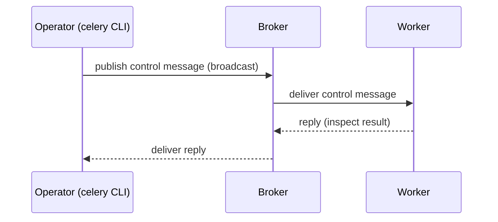

[← Назад к индексу части](index.md)
[↑ К глобальному плану](../mastery_plan.md)

## 13.6. Remote control internals: inspect/control/broadcast

### Цель раздела

Понять, что такое remote control в Celery: как работают команды `inspect` и `control`, почему “broadcast” зависит от транспорта, какие есть ограничения и почему это важная зона с точки зрения безопасности.

### В этом разделе главное

- `inspect` — “посмотреть состояние” (активные задачи, статистика, конфигурация).
- `control` — “выполнить команду” (например, shutdown, pool restart).
- Реализация команд — это обмен сообщениями, и его свойства зависят от транспорта.
- Remote control — мощный операционный инструмент и одновременно опасный рычаг (blast radius).
- Некоторые команды безопасны как диагностика, другие опасны как мутация runtime-состояния — их нужно разделять процедурно.

### Термины

| Термин | Определение |
|---|---|
| **inspect** | “опрос” worker-ов: получить данные. |
| **control** | “управление” worker-ами: послать команду. |
| **broadcast** | Отправка команды сразу многим worker-ам. |
| **reply queue** | Канал, по которому worker возвращает ответы на inspect-команды. |

### Теория и правила

#### 1) Почему remote control “не магия”

Remote control — это тоже сообщение в транспортной системе. Значит:

- возможны задержки,
- возможны потери ответов,
- возможны “частичные ответы” (часть worker-ов ответила, часть — нет),
- возможны security-риски, если кто-то может отправить команду.

#### 1.1) Broadcast transport implications: почему “рассылка” ведёт себя по‑разному

`broadcast` в remote control — это не абстрактная “функция”, а конкретный механизм доставки через выбранный transport/broker.

Отсюда практические последствия:

- **Не все worker-ы обязаны получить команду**: если worker в деградации/переподключении, он может “пропустить” рассылку.
- **Ответы могут приходить частично**: часть воркеров ответила, часть “молчит” — это часто сеть/каналы/нагрузка, а не “воркер умер”.
- **Задержка ответа не равна отсутствию ответа**: транспортная очередь ответов (reply queue) тоже может быть перегружена.

Ключевая мысль: `inspect`/`control` — это распределённое взаимодействие со всеми типичными болезнями: latency, partial failure, retries и race conditions.

#### 2) Security: почему это важно

Команды уровня `shutdown`, `purge`, `revoke`, `pool_restart` — это операционные “красные кнопки”.

Если злоумышленник или “неправильный сервис” может отправлять control-сообщения:

- можно остановить воркеры,
- можно вызвать массовый отказ в обслуживании,
- можно вмешаться в обработку.

Практическое правило: remote control должен быть защищён сетью, правами доступа к broker, и процессами (кто имеет право запускать эти команды).

### Пошагово

Как работать с inspect/control безопасно:

1. Всегда работай по targeted worker-ам, если возможно (не “по всем”).
2. Перед опасной командой делай “dry-run мышлением”: какая blast radius?
3. Различай “операционный останов” и “грейсфул drain”.
4. Логи и мониторинг должны фиксировать, кто и когда запускал команды.

### Простыми словами

Remote control — это “рация” для команды эксплуатации. Если рация доступна всем — кто угодно может сказать “всем выключиться”.

### Картинка в голове



### Как запомнить

**Inspect = спросить. Control = приказать.** Любой приказ имеет blast radius.

Уточнение:

- `inspect` обычно read-only, но тоже может вводить в заблуждение при деградации сети/брокера.
- `control` всегда считать потенциально “изменяющим систему”.

Перевод “на человеческий”:

- **read-only** = “только читает/смотрит, не меняет состояние”. Но даже “только смотрит” может дать неполную картину из‑за частичных отказов.

### Примеры

#### Пример: типовые команды (как “операционный словарь”)

```bash
# Посмотреть живые воркеры и статистику
celery -A proj inspect ping
celery -A proj inspect stats
celery -A proj inspect active
celery -A proj inspect reserved

# Управление (осторожно!)
celery -A proj control shutdown
celery -A proj control pool_restart
celery -A proj control revoke <task_id>
```

Смысл здесь не в точных флагах (они могут отличаться по проекту), а в понимании: inspect не меняет систему, control меняет.

### Практика / реальные сценарии

- **Инцидент “worker жив, задач нет”**: inspect помогает понять, не залип ли consumer, не заблокирован ли pool, есть ли reserved tasks.
- **Rolling restart pool**: `pool_restart` иногда используется как аккуратная мера при утечках, но требует осторожности.
- **Ограничение полномочий**: вынос “операционных команд” в отдельный инструмент/контур.

### Типичные ошибки

- Использовать broadcast-команды без понимания blast radius.
- Хранить доступ к broker с правами “всё можно” в приложениях без необходимости.
- Пытаться “лечить” проблемы control-командами вместо выяснения слоя первопричины.

### Что будет если…

- Если transport/сеть деградируют, inspect может показывать “неполную картину” (часть воркеров не ответит).
- Если remote control не защищён, риски могут быть критичными для бизнеса.

### Проверь себя

1. Почему inspect может вернуть неполный результат, даже если воркеры живы?

<details><summary>Ответ</summary>

Потому что это обмен сообщениями через transport: ответы могут задерживаться, теряться, часть воркеров может быть перегружена и не успеть ответить, или быть временно недоступной по сети/каналам broker.

</details>

2. Чем опасны control-команды в проде без процессов и ограничений?

<details><summary>Ответ</summary>

Они меняют систему и имеют большой blast radius: можно остановить воркеры, отменить задачи, вызвать деградацию. Без ограничений доступа и процедур это превращается в риск ошибочного/злоумышленного воздействия.

</details>

3. Какой правильный подход к “остановке обработки” во время деплоя?

<details><summary>Ответ</summary>

Не “жёстко shutdown”, а построить graceful shutdown/drain: перестать брать новые задачи, дождаться завершения текущих, аккуратно остановить процесс. Remote control может помочь, но стратегия должна быть осознанной.

</details>

### Запомните

**Remote control — это часть операционного контура.** Он полезен, но требует дисциплины: безопасность, ограничение blast radius, процедуры.

---
