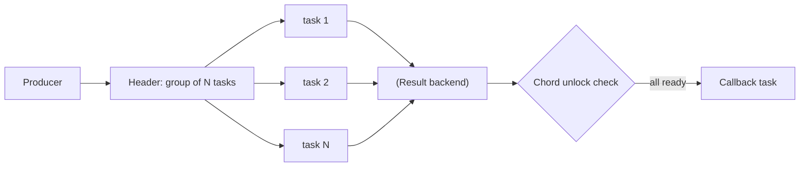

[← Назад к индексу части](index.md)
[↑ К глобальному плану](../../mastery_plan.md)

## 13.7. Chord internals: chord unlock и зависимость от backend

### Цель раздела

Понять, как Celery реализует `chord` внутри: как собираются результаты header-группы, что такое chord unlock, как backend участвует в синхронизации, и почему chord — одна из самых “backend-dependent” функций Celery.

### В этом разделе главное

- `chord` = `group` (header) + callback, который должен стартовать после завершения всех header задач.
- Факт “все завершены” нужно где-то хранить/вычислять → этим занимается backend (или специальные механики).
- Если backend слабый/неподходящий, chord может зависать, дублировать unlock или быть очень дорогим.
- Failure semantics chord сложны: что считать “завершением” при частичных ошибках?

### Термины

| Термин | Определение |
|---|---|
| **Header tasks** | Задачи внутри `group`, которые исполняются параллельно. |
| **Chord callback** | Финальная задача, которая запускается после завершения всех header tasks. |
| **Group result** | Сущность, которая представляет набор результатов задач в группе. |
| **Chord unlock** | Механизм “проверить, что все готовы” и запустить callback. |

### Теория и правила

#### 1) Почему chord не может быть “чисто в broker”

Broker — это очередь сообщений. Он не обязан хранить “состояние выполнения” задач как консистентную таблицу. Chord требует состояния:

- сколько задач было в header,
- какие завершились,
- какие упали,
- можно ли запускать callback.

Это состояние в Celery обычно связано с result backend.

#### 2) Почему backend — часть функциональности, а не только “удобство”

Если ты используешь chord, backend становится функционально критичен:

- без корректного backend chord может не завершаться;
- TTL/очистка результатов может “сломать” chord, если результаты исчезли раньше unlock.

Практическое правило: **если используешь chord — выбирай backend, который поддерживает chord хорошо**, и проектируй TTL/очистку с учётом времени workflow.

#### 2.1) Как собираются результаты chord header (интуиция → формулировка → “что хранится где”)

Интуиция:

- У нас есть N параллельных задач.
- Нужно дождаться, когда “все N готовы”.
- Значит, где-то должна быть “таблица прогресса” по этой группе.

Формулировка:

- **Header group** порождает набор `task_id` (и часто `group_id`).
- Каждый header task по завершении публикует **сигнал завершения** в виде записи состояния/результата.
- Chord unlock периодически (или событийно, в зависимости от реализации) проверяет: “все ли записи готовы”.

Что практически хранится:

- **Результаты/состояния задач**: по ключам `task_id`.
- **Состояние группы**: “сколько задач в группе и сколько уже ready”.

Почему это важно: если “состояние группы” не может быть получено надёжно (TTL, неполная запись, деградация backend), chord unlock не может принять решение о запуске callback.

#### 2.2) Роль backend в unlock logic: какие операции нужны от backend

Для нормальной работы chord backend должен уметь (концептуально):

- надёжно сохранить “готовность” отдельной задачи;
- надёжно “увидеть” готовность всех задач группы (агрегация/счётчик/список);
- сделать это достаточно быстро при больших N.

Если backend даёт слабую консистентность или дорогие операции “посчитать N готовых”, unlock становится либо медленным, либо нестабильным.

#### 3) Failure semantics chord: что означает “все завершились”, если часть упала

Chord заставляет тебя ответить на инженерный вопрос: “какая политика у частичных ошибок?”

Возможные варианты (на уровне проектирования workflow, даже если Celery предоставляет дефолт):

- **Fail-fast** (“упали — сразу стоп”): если любая header-задача падает — chord считается проваленным, callback не запускается (или запускается “ошибочный callback”).
- **Best-effort** (“делаем что можем”): callback запускается, даже если часть задач упала, но получает “частичный результат” и список ошибок.
- **Compensate** (“компенсируем”): при падении части задач запускается компенсирующая логика (в отдельном обработчике).

Почему это важно: “по умолчанию” часто не совпадает с бизнес-ожиданием. И если callback пишет в БД/отправляет события, нужно заранее знать, что он делает при partial failure.

Практическая рекомендация: **явно кодировать политику** (даже если это просто “fail-fast и логируем”), а не надеяться на “как-нибудь”.

#### 4) Масштабирование chord-heavy workload: почему “узкое горлышко” почти всегда backend

Chord-heavy нагрузка обычно упирается не в CPU worker-ов, а в координацию:

- каждая header-задача пишет результат/состояние;
- unlock должен читать/агрегировать готовность группы;
- callback запускается как “барьер”.

Что это значит на практике:

- нагрузка на backend растёт примерно пропорционально числу header задач (и иногда суперлинейно из-за повторных проверок unlock);
- если backend деградирует, chord может “подвисать” и создавать лавину повторных операций.

Практики:

- **уменьшать fan-out** (fan-out = “разветвление на много параллельных задач”; использовать `chunks`, агрегировать работу),
- **разделять очереди** (header tasks и callback в разные очереди/пулы),
- **делать callback идемпотентным** (защита от повторов unlock),
- **проектировать TTL** с запасом и мониторить “age” group results.

### Пошагово

Ментальная модель chord:

1. Producer отправляет header group (N задач).
2. Каждая задача исполняется и пишет result/state.
3. Где-то появляется “точка синхронизации”: проверить, что N задач готовы.
4. Когда готовы — запускается callback.

В Celery эта “точка синхронизации” часто называется chord unlock и сильно завязана на backend.

Чуть более “внутренний” пошаговый образ (без привязки к конкретной реализации):

1. Создаётся “описание группы”: список `task_id` (и/или `group_id`).
2. Header задачи исполняются и по завершении отмечают свою готовность в backend.
3. Unlock‑процедура проверяет: все ли `task_id` готовы?
4. Если да — формирует вход для callback (например, список результатов или структуру “результат/ошибка”) и запускает callback.
5. Если нет — откладывает проверку или ждёт дальнейших событий (зависит от механики).

### Простыми словами

Chord — это как “созвонимся, когда все участники пришли”. Для этого нужна “таблица присутствия”. Backend — это и есть такая таблица.

### Картинка в голове

### Как запомнить

**Chord = параллель + барьер синхронизации.** Барьер почти всегда живёт в backend.

### Примеры

#### Пример: почему TTL результатов может “сломать chord”

Сценарий:

- header tasks могут исполняться до 30 минут,
- TTL для результатов выставлен 10 минут,
- часть задач медленная.

Результаты первых задач исчезнут из backend до момента unlock. Unlock не сможет “увидеть”, что они были готовы, и chord может зависнуть или вести себя странно.

Вывод: TTL/очистку проектируют исходя из **максимального времени workflow**, а не “как обычно”.

### Практика / реальные сценарии

- **Большой fan-out**: тысячи задач в header → backend получает огромную нагрузку на записи/чтения.
- **Частичные сбои**: часть задач падает, часть успешна — что должен делать callback? Нужны явные правила.
- **Стабильность unlock**: при сбоях unlock может “переигрываться”; callback должен быть идемпотентным.

#### Сценарий: “chord unlock штормит” (симптомы и лечение)

Симптомы:

- backend CPU/latency резко растут;
- callback запускается с задержкой;
- видно много повторных попыток “проверить готовность”.

Типичная причина:

- слишком большой fan-out,
- backend не выдерживает координацию,
- повторные проверки unlock усиливают нагрузку.

Лечение (по порядку):

1. Уменьшить fan-out (chunks/агрегация).
2. Разнести очереди/пулы, чтобы callback не конкурировал с header.
3. Увеличить наблюдаемость backend и “время до callback”.
4. Пересмотреть выбор backend, если chord — критический паттерн системы.

### Типичные ошибки

- Выбрать backend “на минималках” и затем активно использовать chord.
- Не учитывать TTL/очистку.
- Делать callback, который не идемпотентен.
- Декомпозировать workflow в chord там, где дешевле `chunks` или другой orchestration.

### Что будет если…

- Если backend деградирует — chord-heavy система деградирует нелинейно (barrier синхронизации создаёт “узкое горлышко”).
- Если callback не идемпотентен — повтор unlock приведёт к дублированию бизнес-эффекта.

### Проверь себя

1. Почему chord зависит от backend сильнее, чем обычные одиночные задачи?

Ответ

Потому что chord требует глобального состояния группы: нужно знать, что “все N задач завершились”, а это состояние хранится/вычисляется через backend. Одиночная задача может обходиться без результата, chord — нет.

2. Как TTL результатов может повлиять на chord?

Ответ

Если результаты header задач исчезнут до момента unlock, система не сможет подтвердить “все готовы”, и chord может зависнуть или завершиться некорректно. TTL должен быть больше максимального времени выполнения workflow с запасом.

3. Почему callback chord должен быть идемпотентным?

Ответ

Потому что unlock может сработать повторно при сбоях/гонках, и callback может быть запущен более одного раза. Идемпотентность защищает от удвоения бизнес-эффекта.

4. Какие две вещи ты обязан спроектировать явно, прежде чем делать chord в production?

Ответ

Политику частичных ошибок (что делать при падении части header задач) и масштабирование координации (fan-out размер, нагрузка на backend, TTL/очистка результатов). Без этого chord превращается в источник “редких, но тяжёлых” инцидентов.

### Запомните

**Если ты используешь chord, ты “подписываешься” на качество result backend.** Это не опция, а фундаментальная зависимость.

---
