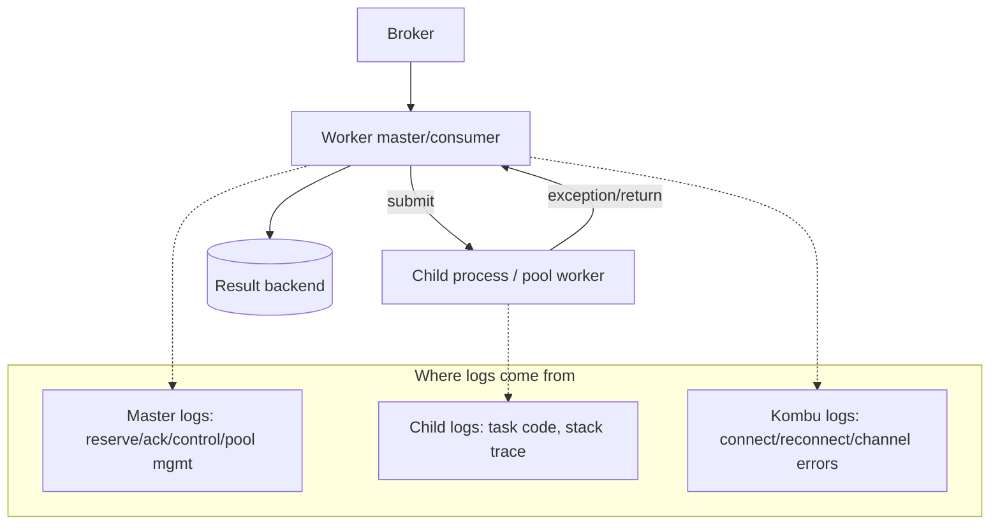
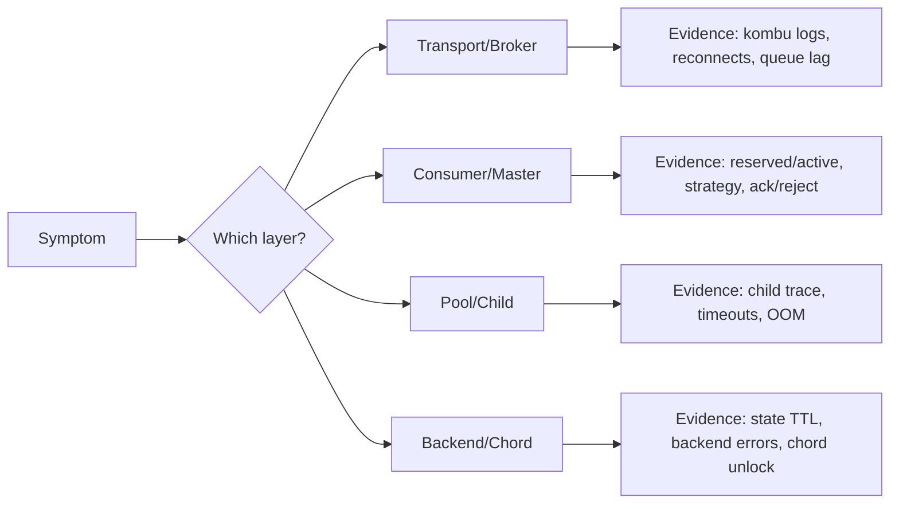

[← Назад к индексу части](index.md)
[↑ К глобальному плану](../celery_mastery_plan.md)

## 13.8. Internal debugging: как чинить странности

### Цель раздела

Дать практический, “без мистики” подход к отладке: какие симптомы бывают, какие слои возможны, какие инструменты применить, и как собрать доказательства, а не “догадки”.

### В этом разделе главное

- Диагностика начинается не с “перезапустить”, а с “локализовать слой”.
- Всегда различай:
  - очередь в broker,
  - reserved/prefetch внутри worker,
  - очередь исполнения в pool,
  - запись результатов в backend.
- “Странные симптомы” часто объясняются: prefetch, acks_late, падения child process, деградации backend, ошибки сериализации, несовместимость сообщений.
- Логи и метрики должны быть связаны `task_id/root_id/correlation_id`.

### Термины

| Термин | Определение |
|---|---|
| **Layered debugging** | Метод: выявить слой проблемы и использовать инструменты слоя. |
| **Worker master vs child trace** | Понимание, что stack trace может быть в child, а симптом — в master. |
| **Transport-level issue** | Проблема на уровне соединения с broker/доставки, а не кода задачи. |
| **Kombu logs** | Логи transport-слоя Celery (подключение, каналы, delivery и ошибки коммуникации). |

### Теория и правила

#### Правило “4 очереди”

Когда говорят “задача в очереди”, на практике это может быть 4 разных места:

1. **Broker queue**: сообщение лежит в брокере.
2. **Worker reserved**: worker уже забрал сообщение (prefetch), но ещё не исполняет.
3. **Pool queue**: сообщение уже отправлено в исполнение, но ждёт свободный слот.
4. **External bottleneck**: задача стартовала, но висит на внешней зависимости (DB/API/FS).

Если ты не различаешь эти места, ты не различаешь стратегии лечения.

#### Читать логи Celery и Kombu: практический паттерн

Смотреть логи только “задачи” недостаточно. Нужны три слоя:

1. **Worker execution logs** (уровень задачи): старт, завершение, исключения.
2. **Worker master/consumer logs**: reserve, dispatch, ack/reject, pool lifecycle.
3. **Kombu/transport logs**: переподключения, канальные ошибки, проблемы доставки.

Если есть только слой 1, ты видишь “код упал/не упал”, но не видишь transport/consumer-сбои.

##### Мини-словарь “транспортных” симптомов (как распознавать)

Это не точные строки логов (они меняются по версиям), а смысловые паттерны:

- **reconnect loop**: частые переподключения к broker → причина часто в сети, лимитах соединений, перегрузке брокера, TLS/IAM проблемах.
- **channel closed / connection reset**: соединение оборвалось → смотри network, broker limits, idle timeouts, LB.
- **drain stalls**: “тишина” в consumer при непустой очереди → смотри event loop, QoS/prefetch, transport деградации.

Смысл: если видишь эти паттерны, не надо “оптимизировать задачу” — сначала лечится transport/broker слой.

#### Worker master vs child trace: как не запутаться

- **Child trace** чаще отвечает на “почему код задачи упал”.
- **Master trace/log** чаще отвечает на “почему доставка/подтверждение/управление пошли не так”.

Диагностическая ошибка новичка: видеть stack trace в child и считать, что всё объяснено. На деле проблема может быть выше: child успешно завершился, а backend запись упала; или наоборот.



Эта схема помогает не перепутать: “где упало” и “где видно”.

#### Когда идти в исходники Celery

Идти в исходники имеет смысл, когда:

- ты локализовал слой (например, consumer strategy/chord unlock),
- у тебя есть воспроизводимый кейс (или почти воспроизводимый),
- стандартные метрики/логи не объясняют расхождение.

Не идти в исходники, когда:

- проблема явно инфраструктурная (перегруженный broker, сетевой разрыв, OOM),
- нет воспроизводимости и нет базовых логов.

Принцип: исходники — это не “первый шаг”, а “инструмент подтверждения гипотезы”.

### Пошагово

#### Чек-лист 1: “worker жив, задач нет (или не исполняются)”

1. Есть ли сообщения в broker? (queue depth/lag, брокерные метрики)
2. Видит ли worker очереди и подписки? (конфиг routing, правильные очереди)
3. Что показывает `inspect reserved/active`?
4. Есть ли свободные слоты исполнения? (concurrency/pool)
5. Нет ли “тихих” падений child processes? (логи, OOM, max_tasks_per_child)
6. Не упирается ли задача во внешние зависимости? (таймауты, метрики, trace)

#### Чек-лист 2: “задачи исполняются, но статусы/результаты не видны”

1. Используется ли result backend и правильно ли настроен?
2. Не истёк ли TTL/очистка?
3. Не отключены ли результаты для задач (ignore_result)?
4. Нет ли ошибок записи в backend (лог/метрика ошибок backend)?

#### Чек-лист 3: “chord зависает”

1. Поддерживает ли backend chord корректно?
2. Не исчезли ли результаты header задач (TTL)?
3. Нет ли частичных падений header задач?
4. Идемпотентен ли callback?

### Простыми словами

Отладка internals — это как искать поломку в конвейере:

- не надо сразу “ускорять мотор” (concurrency),
- сначала нужно понять, где конвейер стоит: на входе, на распределении, на исполнении или на фиксации результата.

### Картинка в голове

```text
Symptom -> Layer -> Evidence -> Fix

"queue grows" -> consumer/pool -> reserved/active, runtime, broker lag -> tune prefetch/scale/route
"received but not started" -> pool -> active slots, stuck tasks -> reduce prefetch / isolate queues / timeouts
"done but state pending" -> backend -> backend errors, TTL -> fix backend config/ttl/ignore_result
"chord stuck" -> chord unlock/backend -> group results, ttl -> change backend / extend ttl / redesign
```



### Как запомнить

**Не лечи без диагноза.** Сначала доказательства по слоям, затем изменения.

### Примеры

#### Пример: минимальный “словарь команд” для быстрой диагностики

```bash
celery -A proj inspect ping
celery -A proj inspect active
celery -A proj inspect reserved
celery -A proj inspect stats
celery -A proj inspect conf
```

Их смысл — быстро понять: worker отвечает? он что-то исполняет? он что-то держит “в запасе”? какие настройки реально активны?

#### Пример: “мастер отвечает, child падает” (паттерн)

Симптом:

- `inspect ping` отвечает;
- `inspect active` почти пусто или задачи быстро уходят в failure;
- очередь растёт/колеблется.

Рабочая гипотеза:

- master и consumer живы,
- но child процессы нестабильны (OOM, segfault в C-extension, тяжёлые зависимости после fork).

План:

1. Проверить системные логи/OOM kill.
2. Ограничить размер задач и память на процесс (`max_tasks_per_child`, архитектурная декомпозиция).
3. Проверить “тяжёлые” импорты/клиенты после fork.

### Практика / реальные сценарии

- **Edge case**: после деплоя часть задач падает с `KeyError` на kwargs.
  - Гипотеза: несовместимость сообщений в очереди.
  - Действие: проверить, не было ли изменения схемы payload, применить versioning.
- **Edge case**: “иногда задача выполняется дважды”.
  - Гипотеза: at-least-once + `acks_late` + падение worker после side effect.
  - Действие: идемпотентность, transactional outbox, корректные ack настройки.

### Типичные ошибки

- “Перезапускать до победы” и тем самым скрывать источник проблемы.
- Увеличивать concurrency без понимания bottleneck и получать ещё больше деградации (DB/API).
- Игнорировать transport/сеть: иногда “Celery странный” — это сеть странная.

### Что будет если…

- Если нет метрик/логов на слой — diagnosis time растёт, а ошибки повторяются.
- Если нет correlation id — расследование превращается в угадайку.

### Проверь себя

1. Назови четыре “очереди ожидания” (или места задержки), которые часто путают.

<details><summary>Ответ</summary>

Broker queue, worker reserved/prefetch, pool queue/слоты исполнения, внешние зависимости (задача стартовала, но блокируется на DB/API/FS).

</details>

2. Почему “прибавить concurrency” может ухудшить ситуацию?

<details><summary>Ответ</summary>

Потому что bottleneck может быть не в worker, а во внешней зависимости (DB/API). Увеличение параллелизма усилит нагрузку, ухудшит latency и приведёт к лавине timeouts/retries.

</details>

3. Как отличить проблему backend от проблемы execution?

<details><summary>Ответ</summary>

Если лог/события показывают завершение исполнения, но state/result не меняются или недоступны — это backend (или настройки ignore_result/TTL). Если “received” есть, но “started/finished” нет — это pool/execution/consumer.

</details>

### Запомните

**Internal debugging — это дисциплина: слой → доказательства → действие.** Это превращает “магическую систему” в предсказуемую инженерную.

---

<a id="final-spravochnik-scenarii-samoproverka-oshibki-rezyume"></a>
