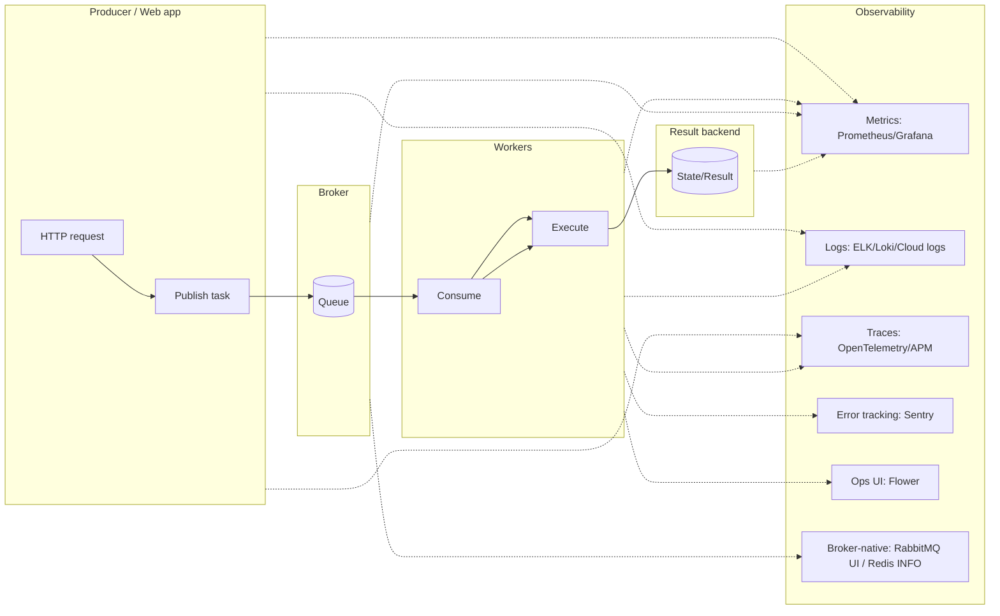

[← Назад к индексу части](index.md)
[↑ К глобальному плану](../mastery_plan.md)

## 14.2. Инструменты наблюдаемости

### Цель раздела

Понять, какие инструменты существуют вокруг Celery и **какую проблему каждый решает**, чтобы не ожидать от Flower то, что должен делать Prometheus/OTel, и наоборот.

### В этом разделе главное

- **Flower** удобен для “операционной видимости” по worker-ам и задачам, но не заменяет метрики/трейсы.
- **Prometheus + Grafana** — главный путь к масштабируемым метрикам и алёртингу.
- **OpenTelemetry (OTel)** — про сквозные трейсы, корреляцию и экспорты в APM.
- **Sentry / error trackers** — отличный слой для исключений и контекста, но это не метрики очередей.
- **Broker‑native monitoring** (RabbitMQ Management, Redis INFO/latency) — часто единственный честный источник “здоровья брокера”.
- В реальности обычно нужен **комплект**, а не “один инструмент”.

### Термины

| Термин | Определение |
|---|---|
| **Exporter** | Компонент, который превращает внутренние данные в метрики (например, для Prometheus). |
| **APM** | Платформы наблюдаемости (Datadog/New Relic и т.п.), часто потребляют OTel. |
| **Broker-native** | Наблюдаемость, встроенная в брокер (RabbitMQ UI, Redis команды). |

### Теория и правила

#### Инструменты как “слои”

Представь, что у тебя есть разные “датчики”:

**Главный вывод:** инструменты перекрываются, но не совпадают. Flower может показать “активные задачи”, но не даст тебе устойчивый алёртинг по p95 end-to-end и не даст правильную работу с high-cardinality.

#### Что выбирать “по умолчанию”

Практическая рекомендация для типичного production‑стека:

- **Метрики**: Prometheus + Grafana (+ Alertmanager).
- **Логи**: JSON‑логи в централизованный сборщик (Loki/ELK/Cloud).
- **Трейсы**: OpenTelemetry SDK + collector + бэкенд (Jaeger/Tempo/вендор).
- **Ошибки**: Sentry (или аналог).
- **Ops‑видимость**: Flower (опционально) или APM UI.
- **Broker‑native**: обязательно, особенно для RabbitMQ.

### Пошагово

Алгоритм “как внедрять без хаоса”:

1. Начни с метрик очередей/воркеров (минимум: depth/lag/rates + worker heartbeats).
2. Добавь structured logs с обязательными полями (см. 14.3).
3. Добавь error tracking для исключений задач.
4. Добавь tracing для 1–2 критичных бизнес‑цепочек (см. 14.4).
5. Собери 1 “операционный” дашборд и 1 “бизнес‑SLO” дашборд (см. 14.6).
6. Включи алёрты по lag/SLO и по health брокера/воркеров.

### Простыми словами

Инструменты — как разные виды камер:

- Flower — “камера в коридоре у воркеров”.
- Prometheus — “датчики температуры/давления по всему зданию”.
- Tracing — “видеозапись пути конкретного человека через здание”.
- Broker-native — “датчики внутри лифта” (без них не узнаешь, что лифт умирает).

### Картинка в голове

Наблюдаемость — это “триаду”:

1) **Metrics** отвечают “насколько и как меняется”,  
2) **Logs** отвечают “что произошло”,  
3) **Traces** отвечают “где было потрачено время и как связаны шаги”.

### Как запомнить

Если хочешь:

- **алёрты и дашборды** → метрики,
- **расследование конкретного случая** → логи,
- **сквозную причину задержки** → трейсы.

### Примеры

#### Flower: что это даёт (и чего не ждать)

Типично Flower помогает:

- видеть активные/зарезервированные задачи,
- видеть worker-ы и их состояние,
- иногда — статистику по задачам.

Но Flower **не гарантирует**:

- правильную корреляцию с бизнес‑операцией,
- устойчивый алёртинг,
- разбор задержек “между publish и start”.

#### Broker-native: RabbitMQ Management

RabbitMQ UI часто показывает то, что снаружи не видно:

- состояние соединений/каналов,
- memory/disk alarms,
- backlog по каждой очереди,
- скорость входа/выхода сообщений,
- потребителей и их prefetch.

### Практика / реальные сценарии

- **Сценарий**: “worker жив, но не потребляет”.
  - Flower может показать, что worker на месте; RabbitMQ UI покажет, что consumer disconnected или prefetch забит; метрики покажут consume rate = 0.

### Типичные ошибки

- Считать, что “если есть Flower, значит observability есть”.
- Не наблюдать брокер “изнутри”, а только через клиентские ошибки.
- Подключить OTel “везде”, не настроив sampling и не понимая fan‑out.

### Что будет если…

- **…не иметь broker-native мониторинга?** Ты будешь видеть только симптомы (“висит”), но не причину (“disk alarm, блокировка публикации”).
- **…строить алёрты только на error tracker?** Ты узнаешь об инциденте поздно: деградации обычно начинаются с лагов и ретраев.

### Проверь себя

1. Какая связка инструментов чаще всего покрывает “минимум production‑готовности”?

Ответ

Метрики (Prometheus/Grafana) + централизованные логи + broker-native мониторинг; затем добавляются error tracker и tracing для критичных цепочек.

2. Почему tracing “в лоб” может оказаться слишком дорогим в Celery?

Ответ

Потому что fan-out может создавать тысячи спанов на одну бизнес‑операцию, а каждый спан — данные, хранение, стоимость. Нужны sampling и/или агрегирование, иначе ты утонешь в объёмах и цене.

3. Какой инструмент чаще всего даёт лучшую диагностику “здоровья брокера”?

Ответ

Broker-native (RabbitMQ Management / Redis INFO/latency / облачные метрики), потому что он видит внутренние лимиты, alarms и состояние диска/памяти.

### Запомните

- Наблюдаемость — это “комплект”, а не “одна кнопка”.
- Broker-native мониторинг — обязательный слой, особенно для RabbitMQ.

---
