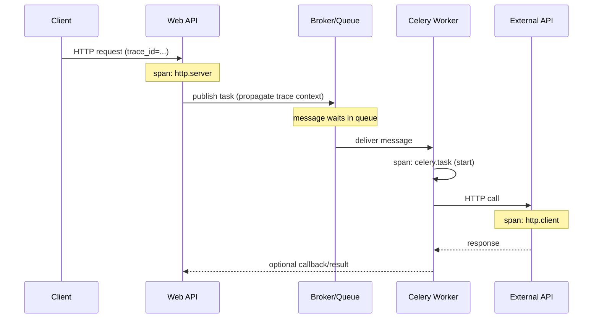

[← Назад к индексу части](index.md)
[↑ К глобальному плану](../mastery_plan.md)

## 14.4. Трейсинг через границы задач

### Цель раздела

Понять, как строить **distributed tracing** в мире Celery, где есть очереди, ретраи и fan‑out, и как не получить “дорого, шумно и бесполезно”.

### В этом разделе главное

- Tracing в Celery ценен тем, что показывает **сквозную задержку**: publish → wait → execute → downstream.
- Самая сложная часть — **propagation**: как донести trace context из HTTP в задачу.
- Fan‑out/fan‑in создают “взрыв спанов”; нужны sampling/ограничения.
- Ретраи — это отдельные попытки: их нужно моделировать как отдельные spans или события.
- Tracing не заменяет метрики, но помогает находить **первопричину** задержек.

### Термины

| Термин | Определение |
|---|---|
| **Trace / span** | Trace — цепочка событий; span — один шаг с длительностью и атрибутами. |
| **Context propagation** | Передача идентификаторов trace между компонентами. |
| **Sampling** | Решение, какие trace сохранять/отбрасывать. |
| **Fan-out/fan-in** | Разветвление/сбор, усложняющее tracing. |

### Теория и правила

#### Где “границы” в tracing для Celery

Есть минимум 3 естественные границы:

1) HTTP request → publish task  
2) Queue wait → task start  
3) Task execution → downstream calls (DB/API)  

Если ты видишь только (3), ты не видишь лаг очереди. Если ты видишь только (1), ты не видишь реальное выполнение. Ценность — в полном контуре.

#### Как выглядит trace для “HTTP → Celery → внешний API”

#### Sampling и “взрыв” данных

В Celery легко сделать тысячу задач на один запрос. Если ты сохраняешь все trace полностью:

- объём спанов огромный,
- стоимость хранения огромная,
- расследовать сложно (слишком много данных).

Поэтому:

- используй **tail‑based sampling** (если доступно) или правила sampling,
- для fan‑out сохраняй “полный trace” только для ошибок/медленных кейсов,
- для успешных — может хватить агрегированных метрик.

### Пошагово

Практический план внедрения tracing:

1. В веб‑приложении включи OTel для входящих запросов (server spans).
2. При publish задачи передай trace context в message headers.
3. В worker-е при старте задачи создавай span `celery.task` и извлекай context.
4. Проставляй атрибуты: `task.name`, `task.id`, `task.retries`, `queue`, `tenant_id`.
5. Для downstream вызовов (DB/HTTP) убедись, что клиентские библиотеки инструментированы.
6. Настрой sampling:
   - 100% для ошибок,
   - повышенный % для медленных,
   - низкий % для остальных.

### Простыми словами

Tracing — это “GPS‑трек” посылки: где она была, сколько лежала на складе, где задержалась. Метрики говорят “в среднем доставка стала медленнее”, tracing говорит “задержка на складе X и потом пробка на дороге Y”.

### Картинка в голове

Trace — это “ниточка”, протянутая через все компоненты. Но если ниточек слишком много, ты запутаешься — поэтому sampling это “оставляем ниточки только для важных случаев”.

### Как запомнить

В tracing Celery запомни тройку:

- **propagate** context (иначе нет сквозного trace),
- **annotate** attributes (иначе trace без смысла),
- **sample** разумно (иначе будет дорого и шумно).

### Примеры

#### Пример. Какие атрибуты полезны на span задачи

- `celery.task_name`
- `celery.task_id`
- `celery.root_id`, `celery.parent_id`
- `celery.queue`
- `celery.retries`
- `tenant_id`
- `outcome` (success/failure/retry)

#### Пример. Как отражать ретраи

Есть два подхода:

1) Один span на logical task, а ретраи — события внутри (удобно для логического взгляда).  
2) Span на каждую attempt (удобно для времени и ошибок, но больше данных).

Выбор зависит от того, что важнее и сколько данных ты готов хранить.

### Практика / реальные сценарии

- **Сценарий**: “почему эндпоинт медленный, если он только публикует задачу?”
  - Trace покажет: публикация тормозит из‑за broker latency/блокировок, либо из‑за синхронной сериализации/компрессии.
- **Сценарий**: “почему результат приходит через 10 минут?”
  - Trace покажет: 9 минут ожидание в очереди (lag) + 1 минута выполнения.

### Типичные ошибки

- Включить tracing, но не передавать context — получаются “разорванные” trace.
- Передавать слишком много атрибутов (PII, payload) — риск и стоимость.
- Сохранять 100% trace при fan‑out — взрыв данных.

### Что будет если…

- **…не настроить sampling?** Ты быстро упираешься в лимиты хранения и начинаешь отключать tracing целиком.
- **…не инструментировать downstream calls?** Ты увидишь, что “задача медленная”, но не увидишь почему (БД? внешнее API?).

### Проверь себя

1. Почему tracing особенно полезен при разборе end-to-end latency?

Ответ

Потому что он показывает распределение времени по шагам: публикация, ожидание в очереди, выполнение, внешние вызовы. Метрика “end-to-end” сама по себе не говорит, где именно потеря времени.

2. Что сломается, если ты не будешь прокидывать trace context из producer в worker?

Ответ

Сквозной trace развалится на два отдельных: HTTP будет одним trace, а задача — другим, и ты не сможешь связать “какой запрос породил какую задачу” в tracing‑системе.

3. Почему в Celery tracing без sampling часто непрактичен?

Ответ

Из‑за fan‑out/fan‑in: одна операция может породить много задач, а значит много спанов. Это резко увеличивает объём данных и стоимость, усложняет анализ и может перегрузить collector/backend.

### Запомните

- Tracing ценен тем, что объясняет “где время”.
- Propagation + атрибуты + sampling — три обязательных элемента.

---
