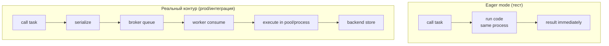

[← Назад к индексу части](index.md)
[↑ К глобальному плану](../celery_mastery_plan.md)

## 15.3 Eager mode и его ограничения

### Цель раздела

Разобраться с `task_always_eager`: как использовать eager режим как ускоритель тестов и где он начинает “врать”, создавая ложную уверенность.

### В этом разделе главное

- Eager — это **локальное выполнение**, а не “мини‑прод”.
- Eager полезен для wrapper‑тестов и быстрых проверок.
- Eager **не моделирует** многие свойства Celery: доставка через broker, конкуренция worker‑ов, процессы/пулы, часть таймаутов, redelivery, проблемы backend.

### Термины

| Термин | Определение |
|---|---|
| **`task_always_eager`** | Настройка Celery: выполнять задачи немедленно, в том же процессе. |
| **Eager result** | Объект результата, получаемый сразу; может отличаться по поведению от реального async результата. |
| **Isolation illusion** | Иллюзия изоляции: “у нас всё работает”, потому что нет реальных гонок/сетевых эффектов. |

### Теория и правила

#### Чем eager полезен

- проверка, что `delay/apply_async` правильно вызывается (аргументы, именование, базовая логика);
- тестирование “обёртки”: например, что при конкретном исключении происходит retry (на уровне вызова), или что логируются нужные поля;
- быстрые “smoke tests” для локальной разработки.

#### Чем eager обманывает

1) **Нет реальной сериализации/десериализации** (зависит от настроек/пути, но чаще eager не ловит проблем payload так же, как реальный broker).  
2) **Нет реального worker‑рантайма**:

- нет prefork‑процессов и их особенностей,
- нет конкуренции и очередей,
- нет prefetch/ack динамики.

3) **Нет реального взаимодействия с backend/broker** — поэтому не ловятся ошибки подключения, конфигурации, задержки.

4) **Таймауты и сигналы ОС** в реальности связаны с процессами/пулами, а eager — это “просто вызвали функцию”.

### Пошагово: безопасный шаблон использования eager в тестах

1. Используй eager для **быстрого слоя** тестов (wrapper + smoke).
2. Обязательно держи отдельный слой integration/e2e, который запускается в CI.
3. В eager‑тестах:
   - явно включай/выключай eager настройку через конфиг/фикстуру,
   - не делай выводов про производительность/конкуренцию,
   - отдельно тестируй контракт payload (schema) без зависимости от eager.

### Простыми словами

Eager — это как “привезли товар сами на руках”. Это хорошо, чтобы проверить, что товар правильный. Но это не проверяет логистику (машины, склады, дороги, пробки).

### Картинка в голове



### Как запомнить

**Eager ускоряет, но не доказывает.**

### Примеры

#### Пример: включение eager для тестов (идея)

В проекте обычно делают отдельный конфиг для тестов:

```python
CELERY_TASK_ALWAYS_EAGER = True
CELERY_TASK_EAGER_PROPAGATES = True  # чтобы исключения “не прятались”
```

Почему `EAGER_PROPAGATES` важен: иначе ошибки могут “упаковываться” и тест будет вести себя не так, как ты ожидаешь.

### Практика / реальные сценарии

- Для fast‑feedback слоя (локально) eager — нормально.
- Для защиты от регрессий в проде обязательно нужен integration/e2e слой (хотя бы один “пробный прогон” воркера).

### Типичные ошибки

- Полагаться только на eager mode.
- Считать eager тестом “производительности” или “конкуренции”.
- Не включать propagation исключений → тесты не ловят реальные падения.

### Что будет если…

- Если заменить интеграционные тесты eager‑тестами, ты начнёшь ловить ошибки **после деплоя**, когда уже поздно.

### Проверь себя

1. Назови три свойства Celery‑системы, которые eager режим почти не проверяет.

<details><summary>Ответ</summary>

Доставка/сериализация через broker, поведение worker‑рантайма (пулы/процессы/конкуренция), взаимодействие с result backend (задержки/сбои/консистентность).

</details>

2. Зачем часто включают `task_eager_propagates` в тестах?

<details><summary>Ответ</summary>

Чтобы исключения “вылетали наружу” и тест мог корректно утверждать, что задача падает/ретраится. Иначе ошибка может быть спрятана внутри результата.

</details>

### Запомните

- Eager — это инструмент ускорения, а не доказательство production‑готовности.

---
