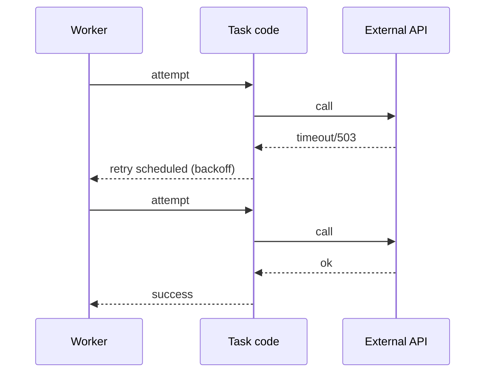

[← Назад к индексу части](index.md)
[↑ К глобальному плану](../../mastery_plan.md)

## 15.4 Тестирование retry и timeouts

### Цель раздела

Научиться тестировать поведение “не по счастливому пути”: transient failures, backoff/jitter, лимиты повторов, soft/hard timeouts — так, чтобы тесты были полезными и не превращались в flaky.

### В этом разделе главное

- Retry — это не “включили и забыли”, это контракт поведения: **что ретраим, как часто, когда сдаёмся**.
- Таймауты бывают разные: таймауты Celery (soft/hard), таймауты клиентов (HTTP/DB), таймауты инфраструктуры.
- Тесты retry должны проверять **семантику**, а не “точное время сна” (иначе будет flaky).
- В Celery retry — это обычно **исключение‑сигнал** (задача “поднимает руку” и говорит worker‑у: “переотправь меня позже”), поэтому тесты часто проверяют **сам факт retry** и **параметры**, а не “реальную паузу”.

### Термины

| Термин | Определение |
|---|---|
| **Transient failure** | Временная ошибка, которая может пройти (таймаут сети, 503). |
| **Backoff** | Увеличение задержки между повторами. |
| **Jitter** | Случайный разброс задержек, чтобы не было “лавины” повторов. |
| **Soft time limit** | “Мягкий” таймаут: задаче дают шанс корректно обработать сигнал/исключение. |
| **Hard time limit** | “Жёсткий” таймаут: выполнение принудительно прерывается. |
| **Retry as exception** | Типичная механика Celery: `self.retry(...)` завершает попытку через исключение, чтобы worker запланировал новую. |
| **Retry storm** | Ситуация, когда слишком много задач одновременно ретраятся и создают лавину нагрузки (на broker, backend и внешние зависимости). |

### Теория и правила

#### 1) Что именно проверять в retry‑тестах

- **Класс ошибок**, которые приводят к retry (например, `TimeoutError`, `ConnectionError`).
- **Ошибки, которые НЕ ретраятся** (например, валидация входных данных).
- **Максимальное число попыток**.
- **Эскалация после исчерпания** (например, запись в DLQ/parking queue, алёрт, пометка статуса).
- Для backoff: что задержка **растёт** (или хотя бы не константная), а не точные секунды.

#### 1.1) Важное уточнение: где “живёт” retry — в Celery или в вашей логике?

Частая архитектурная развилка:

- **Retry делает Celery** (через `self.retry(...)` или `autoretry_for=...`):
  - плюс: единообразно и близко к “истине” рантайма,
  - минус: сложнее unit‑тестировать без Celery‑контекста.
- **Retry делает ваша бизнес‑логика** (как в примере `business_logic_with_retry`):
  - плюс: легко unit‑тестировать семантику,
  - минус: если делать неправильно, можно вступить в конфликт с celery‑ретраями и таймаутами.

На практике обычно:

- “тонкий” retry логики (например, 1–2 быстрых повторов вызова внутри попытки) — внутри функции,
- “тяжёлые” повторы с backoff/jitter и переносом нагрузки во времени — на уровне Celery (`self.retry`).

#### 2) Почему “проверять время сна” — плохая идея

Потому что:

- CI работает по‑разному,
- jitter добавляет случайность,
- реальный брокер/воркер делает это асинхронно,
- тесты становятся flaky.

Лучше проверять:

- количество попыток,
- последовательность состояний,
- факт “мы попытались снова”,
- параметры вызова retry (если тестируешь wrapper).

#### 2.1) Как тестировать backoff “без секундомера”

Хороший компромисс:

- проверять, что backoff **монотонно не убывает** (или растёт),
- проверять, что backoff **ограничен сверху** (чтобы не было “зависли на сутки”),
- проверять, что jitter **есть** (если нужен), но не проверять точные значения.

То есть: тест “политики”, а не “таймера”.

#### 3) Таймауты: soft vs hard — почему их по‑разному тестируют

Смысл простыми словами:

- **soft time limit** — “вежливый будильник”: Celery сигнализирует задаче, что пора заканчивать (обычно через исключение вроде `SoftTimeLimitExceeded`). У задачи есть шанс:
  - завершить работу аккуратно,
  - сохранить прогресс,
  - поставить компенсацию/cleanup.
- **hard time limit** — “рубильник”: выполнение принудительно прерывается. В реальности это может означать:
  - “код дальше не исполнится”,
  - “finally может не отработать” (особенно если процесс убили),
  - побочные эффекты могут остаться в середине.

Практическое следствие для тестирования:

- soft time limit можно относительно стабильно проверить в integration/e2e (задача получает исключение, вы его ловите/обрабатываете),
- hard time limit часто проверяют **не как “unit‑тест”**, а как “операционный инвариант”: отдельный медленный тест или ручная лабораторка (и обязательная идемпотентность/компенсации).

### Пошагово: шаблон тестирования retry (без лишней хрупкости)

1. Определи, что является transient failure (например, таймаут внешнего API).
2. Вынеси внешний вызов в “порт”, чтобы можно было подменить.
3. Сделай тест, где первые N попыток падают transient ошибкой, а потом успех.
4. Утверждай:
   - что вызов был сделан N+1 раз,
   - что side effects не дублируются (если должны быть идемпотентны),
   - что при N=max_retries — происходит правильное поведение (ошибка/эскалация).

### Пошагово: шаблон тестирования Celery‑retry (когда retry делает `self.retry`)

Эта схема нужна, чтобы тестировать именно Celery‑уровень.

1. Включи eager‑режим **только для wrapper‑тестов**, и включи propagation исключений.
2. Вызови задачу и ожидай, что она “сигнализирует retry” через исключение.
3. Утверждай:
   - что `self.request.retries` увеличился (если доступно),
   - что retry случился только на нужных исключениях,
   - что при достижении лимита задача ведёт себя по контракту (эскалирует/падает без повторов).

Важно: eager‑тест здесь проверяет **контракт задачи**, а не планирование/задержку. Планирование/доставка проверяются на integration/e2e уровне.

### Простыми словами

Retry — это как “перезвонить позже”. Тест должен проверить, что:

- перезваниваем **только когда это имеет смысл**,
- не перезваниваем бесконечно,
- после лимита — **делаем понятный вывод** (ошибка/эскалация), а не “молча крутимся”.

### Картинка в голове



### Как запомнить

**Retry тестируем по смыслу (семантика), а не по секундомеру.**

### Примеры

#### Пример: тестируем, что transient ошибка приводит к повтору (идея)

Псевдо‑пример на `pytest` (показать идею, не привязываясь к конкретному проекту):

```python
import itertools
import pytest

class TransientError(RuntimeError):
    pass

def call_external_api_stub(errors_then_ok: int):
    counter = itertools.count()

    def _call():
        i = next(counter)
        if i < errors_then_ok:
            raise TransientError("temporary")
        return "ok"
    return _call

def business_logic_with_retry(call_api, max_attempts: int = 3):
    # это “чистая” логика повтора (в реальном проекте часть retry может делать Celery)
    last = None
    for _ in range(max_attempts):
        try:
            return call_api()
        except TransientError as e:
            last = e
    raise last

def test_retry_semantics():
    call = call_external_api_stub(errors_then_ok=2)
    assert business_logic_with_retry(call, max_attempts=3) == "ok"

def test_retry_exhausted():
    call = call_external_api_stub(errors_then_ok=10)
    with pytest.raises(TransientError):
        business_logic_with_retry(call, max_attempts=3)
```

Это пример подхода: **сначала** тестируем семантику повтора “в чистом виде”. Отдельно (на другом уровне) тестируем, что Celery‑задача правильно классифицирует ошибки и вызывает `self.retry`.

#### Пример: как выглядит Celery‑retry в коде (и что именно тестировать)

Ниже — учебный пример “правильной” задачи с явной классификацией ошибок. Обрати внимание: **валидация входа не ретраится**, а временная ошибка — ретраится.

```python
from celery import shared_task

class ValidationError(Exception):
    pass

class TransientExternalError(Exception):
    pass

def call_downstream(user_id: int) -> str:
    # внешний вызов (HTTP/DB/SDK)
    raise NotImplementedError

@shared_task(bind=True, max_retries=5, default_retry_delay=10)
def sync_user_profile(self, user_id: int) -> str:
    if user_id <= 0:
        raise ValidationError("user_id must be positive")  # non-retryable

    try:
        return call_downstream(user_id)
    except TransientExternalError as e:
        # retryable: переносим во времени
        raise self.retry(exc=e, countdown=2 ** self.request.retries)
```

Что здесь тестируется:

- “на `ValidationError` — не retry”,
- “на `TransientExternalError` — retry”,
- “countdown не убывает по мере retries” (без точных секунд),
- “после max_retries — поведение определено” (например, задача падает и алертится).

#### Пример: testing soft timeouts (идея)

Таймауты часто лучше тестировать через:

- очень маленькие лимиты,
- контролируемый “сон”/блокировку,
- и утверждение, что задача завершилась ошибкой/прервана.

Важно: такие тесты обычно попадают в “медленные” (integration/e2e) и запускаются отдельным маркером.

Чтобы у читателя была “картинка”, приведём учебный пример задачи с soft time limit и корректным cleanup:

```python
from celery import shared_task
from celery.exceptions import SoftTimeLimitExceeded

@shared_task(bind=True, soft_time_limit=1, time_limit=2)  # значения для примера
def long_job(self) -> str:
    try:
        # имитируем работу
        while True:
            pass
    except SoftTimeLimitExceeded:
        # важный момент: здесь можно сделать корректное завершение/сохранение прогресса
        return "interrupted-soft"
```

Что тестировать:

- что задача действительно ловит `SoftTimeLimitExceeded` и возвращает ожидаемый “контрактный” результат (или делает понятный cleanup),
- что **side effects** не остаются “наполовину применёнными” (для этого нужно проектировать задачу и тестировать идемпотентность/компенсации).

### Практика / реальные сценарии

- Для критичных задач делай тест “исчерпали max_retries → отправили в DLQ/пометили статус”.
- Если используешь backoff/jitter — проверяй, что интервалы **не равны нулю** и растут (без точного времени).
- Если задача ходит во внешнее API:
  - тестируй, что таймаут выставлен на клиенте (HTTP timeout),
  - тестируй, что “таймаут клиента” классифицируется как retryable,
  - тестируй, что после лимита retries есть **эскалация** (метка в БД / событие / алерт), а не вечная молотилка.

### Типичные ошибки

- Ретраить бизнес‑ошибки (данные некорректны) → бесконечный шум.
- Тестировать retry только на happy path → в проде surprise.
- Пытаться “подождать реальные секунды” в тестах → flaky и медленно.
- Смешивать таймауты: “поставили только `time_limit` в Celery, но не поставили timeout в HTTP‑клиенте” → воркер может висеть на I/O дольше, чем ожидаешь.

### Что будет если…

- Если не тестировать исчерпание retry — в инциденте ты узнаешь, что задача “крутится” бесконечно, пока очередь не умрёт.
- Если тестировать только “что ретраится”, но не тестировать “что НЕ ретраится”, ты легко создашь retry storm на невалидных данных.

### Проверь себя

1. Почему тест “проверим, что backoff ровно 2, 4, 8 секунд” часто плохой?

<details><summary>Ответ</summary>

Потому что реальные реализации могут добавлять jitter, зависеть от окружения и планировщика, и тест начнёт флейкать. Лучше проверять семантику: “задержка растёт/не нулевая/количество попыток ограничено”.

</details>

2. Что важнее проверить для retry: “время сна” или “максимальное число попыток и класс ошибок”? Почему?

<details><summary>Ответ</summary>

Максимальное число попыток и класс ошибок. Именно это определяет безопасность системы (не ретраим то, что нельзя, и не ретраим бесконечно). Время сна вторично и чаще всего слишком хрупкое для тестов.

</details>

3. В каких тестах обычно разумно проверять soft/hard time limits?

<details><summary>Ответ</summary>

В интеграционных/e2e тестах, потому что soft/hard timeouts связаны с рантаймом worker, пулами и сигналами ОС. В unit‑тестах можно лишь проверять, что параметры выставлены, но не реальное прерывание.

</details>

### Запомните

- Retry и таймауты — это контракт надёжности. Его надо тестировать отдельно от happy path.

---
