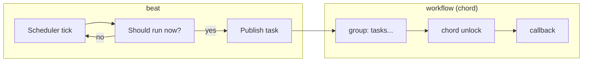

[← Назад к индексу части](index.md)
[↑ К глобальному плану](../../mastery_plan.md)

## 15.6 Тестирование периодических задач и workflow

### Цель раздела

Научиться тестировать два класса “сложных” Celery сценариев: периодические задачи (beat) и orchestration (canvas), включая overlap prevention и частичные отказы chord/group.

### В этом разделе главное

- Периодические задачи ломаются не “в теле”, а в **расписании и overlap**.
- Workflow ломаются на **частичных сбоях** и **гонках статусов**.
- Для workflow почти всегда нужен хотя бы один integration/e2e тест.
- Для chord/group важно помнить: многие механики orchestration **зависят от result backend**. Поэтому “у нас есть брокер” ≠ “workflow работает”.

### Термины

| Термин | Определение |
|---|---|
| **Beat schedule** | Логика расписания: когда именно надо запускать задачу. |
| **Overlap** | Наложение: новый запуск начинается, когда предыдущий ещё не завершён. |
| **Chord failure** | Сценарий, когда часть задач в group падает и callback не выполняется или выполняется с ошибкой. |

### Теория и правила

#### 1) Что тестировать в periodic задачах

- корректность вычисления “когда запускать” (особенно если есть окна времени, DST, локальные зоны);
- наличие/отсутствие overlap:
  - если overlap запрещён — должен быть механизм защиты (lock/lease/unique run id);
  - и тест на него.
- идемпотентность: периодика почти гарантированно будет запускаться повторно (иногда из‑за дрейфа/рестартов).

#### 1.1) Уточнение: периодика обычно требует “контракта запуска”

Для periodic‑задач полезно прямо в коде (и тестах) зафиксировать:

- **что является “окном”** (например, “за текущий час”),
- **что является “ключом запуска”** (например, `run_id = 2026-03-30T10`),
- **как ведём себя при overlap** (пропускаем? ждём? делаем coalesce?).

Если ключ запуска есть, overlap‑тест становится детерминированным: мы проверяем, что “для одного run_id эффект один”.

#### 2) Что тестировать в workflow (canvas)

- happy path (всё успешно),
- partial failure:
  - одна из задач в group падает,
  - что происходит с callback,
  - как выглядит ошибка в backend,
  - не зависает ли workflow.
- race conditions на статусах:
  - “часть задач уже finished, но chord ещё не unlock”,
  - “backend временно недоступен”.

#### 2.1) Почему workflow‑тесты часто “вдруг” требуют backend

Простыми словами:

- broker отвечает за “довезти сообщения”,
- backend часто отвечает за “помнить результаты/статусы, чтобы собрать их обратно”.

Canvas‑примитивы вроде chord/group часто используют backend как “место встречи результатов”, поэтому:

- без backend chord может не работать или работать ограниченно,
- при проблемах backend появляются “странные зависания” workflow.

Это не повод “бояться”: это повод в тестах поднимать **минимально реалистичный контур** (broker + backend), иначе мы тестируем не то.

### Пошагово: тест‑набор для одного workflow (chord/group)

1. E2E: поднять broker + backend, запустить worker.
2. Сценарий A: все подзадачи успешны → callback выполнен → итог корректный.
3. Сценарий B: одна подзадача падает “намеренно” → проверить ожидаемую реакцию:
   - callback не выполнен (или выполнен с ошибкой — в зависимости от дизайна),
   - ошибка видна,
   - система не зависла.
4. Сценарий C: эмуляция временной деградации backend (если применимо) → убедиться, что workflow корректно восстанавливается или корректно фейлится.

### Пошагово: как тестировать beat без “реальных часов”

1. Вынеси вычисление “надо ли запускать сейчас” в функцию/класс (или используй schedule‑объекты, которые можно спросить `is_due`).
2. В unit‑тестах подменяй “текущее время” (clock) или напрямую передавай `now` в вычисление.
3. Отдельно (редко) держи integration/e2e тест, который проверяет, что “beat действительно публикует задачу”, но не на минутных интервалах, а на коротком тест‑окне.

#### Проверь себя по beat без реальных часов

1. Почему прямое ожидание “прошла минута -> задача стартовала” часто делает тест плохим?

<details><summary>Ответ</summary>

Потому что тест становится медленным и нестабильным: зависит от времени окружения, загрузки CI и планировщика. Гораздо надёжнее тестировать вычисление расписания детерминированно через подмену времени и отдельно держать короткий integration smoke.

</details>

2. Что даёт `run_id` в периодических задачах с точки зрения тестируемости?

<details><summary>Ответ</summary>

`run_id` превращает расплывчатый “запуск периодики” в конкретный ключ выполнения. Это позволяет детерминированно проверять overlap/dedup и формулировать чёткие asserts: “для одного run_id эффект ровно один”.

</details>

### Простыми словами

Periodic — это “будильник”: ошибка часто не в том, что ты делаешь после пробуждения, а в том, что будильник срабатывает два раза или не срабатывает вовсе.  
Workflow — это “сборка из деталей”: ошибка часто в том, что одна деталь не приехала, а сборка продолжает ждать бесконечно.

### Картинка в голове



### Как запомнить

**Периодика = расписание + overlap. Workflow = fan‑out + сбор + частичные отказы.**

### Примеры

#### Пример: тест overlap prevention (идея)

Если у тебя есть защита “не запускать задачу повторно, пока она не закончилась”, то тест должен это доказать:

- первый запуск стартует и “держит lock”,
- второй запуск видит lock и выходит/откладывается,
- после завершения первый освобождает lock, следующий запуск возможен.

Важно: это обычно integration тест (есть реальное хранилище lock‑ов: Redis/DB).

#### Пример: “контракт запуска” для periodic‑задачи через run_id (учебный)

Идея: периодическая задача строит run_id из времени, и все побочные эффекты делают dedup по этому ключу.

```python
from datetime import datetime, timezone

def hourly_run_id(now: datetime) -> str:
    now = now.astimezone(timezone.utc)
    return now.strftime("%Y-%m-%dT%H")  # один запуск на час
```

Что тестировать unit‑тестом:

- один и тот же `now` → один и тот же run_id,
- разные часы → разные run_id,
- границы (смена суток/месяца) корректны.

Дальше integration‑тестом:

- два запуска с одинаковым run_id → эффект один (через DB unique или таблицу дедупликации).

#### Пример: workflow‑тест “partial failure” в chord (что утверждать)

Даже если ты не пишешь буквально такой код, важно понимать *что именно* проверяет тест.

```text
given: chord(group(A, B, C), callback=K)
when:  B падает
then:  K не должен “тихо” отработать как будто всё ок
and:   у нас есть наблюдаемое состояние ошибки (backend/лог/метрика)
and:   workflow не зависает навечно (есть таймаут/эскалация/cleanup)
```

Тест должен проверять **контракт реакции на частичный отказ**, иначе в проде ты получишь “тихий недосчёт” или зависания.

#### Проверь себя по partial failure в workflow

1. Почему “callback не выполнился” недостаточно как единственный assert в chord failure test?

<details><summary>Ответ</summary>

Потому что важно не только отсутствие callback, но и наблюдаемое, управляемое поведение системы: ошибка должна быть видна (статус/лог/метрика), workflow не должен зависать бесконечно, а эскалация/таймаут должны быть предсказуемыми.

</details>

2. Какой риск возникает, если partial failures не тестируются вообще?

<details><summary>Ответ</summary>

Появляются “тихие” прод‑ошибки: недосчитанные результаты, зависшие пайплайны, накопление backlog и трудная диагностика из‑за отсутствия явного сигнала о сбое.

</details>

### Практика / реальные сценарии

- Для расчётов/агрегаций периодикой: тест “два запуска подряд не портят данные”.
- Для chord‑ов: тест “одна подзадача падает → мы видим ошибку и делаем понятный recovery”.

### Типичные ошибки

- Тестировать beat “как есть” с реальными минутами/часами → тесты медленные и flaky.
- Не тестировать chord failure cases → зависания в проде.
- Не тестировать гонки статус‑backend → трудно диагностировать.
- Поднимать только broker в тестах и думать, что workflow проверен → а потом chord ломается/зависает из‑за backend‑зависимости.

### Что будет если…

- Если не тестировать overlap, можно получить удвоенную нагрузку и двойные эффекты на границе времени (например, “каждый час” запускается дважды при рестарте).

### Проверь себя

1. Почему periodic задачи почти всегда должны быть идемпотентными?

<details><summary>Ответ</summary>

Потому что расписание может запускать задачу повторно из‑за рестартов, дрейфа, ручных запусков и overlap. Если задача не идемпотентна, периодика создаёт постоянный риск дублей.

</details>

2. Что нужно обязательно протестировать в chord/group кроме happy path?

<details><summary>Ответ</summary>

Частичный отказ (подзадача падает) и поведение callback/unlock, а также отсутствие “вечного ожидания”/зависания workflow.

</details>

3. Почему тестировать “реальные часы” для beat обычно плохая идея?

<details><summary>Ответ</summary>

Потому что тест становится медленным и нестабильным. Лучше тестировать логику расписания через “подмену времени” или тестировать schedule вычисления отдельно, а e2e делать ограниченно.

</details>

### Запомните

- Для periodic и workflow тестируй “края”: overlap и partial failures.

---
