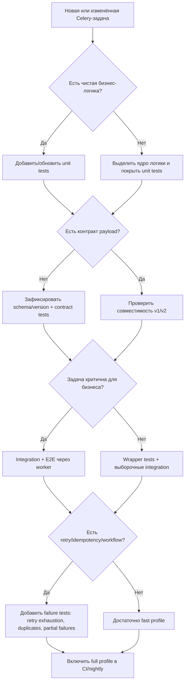
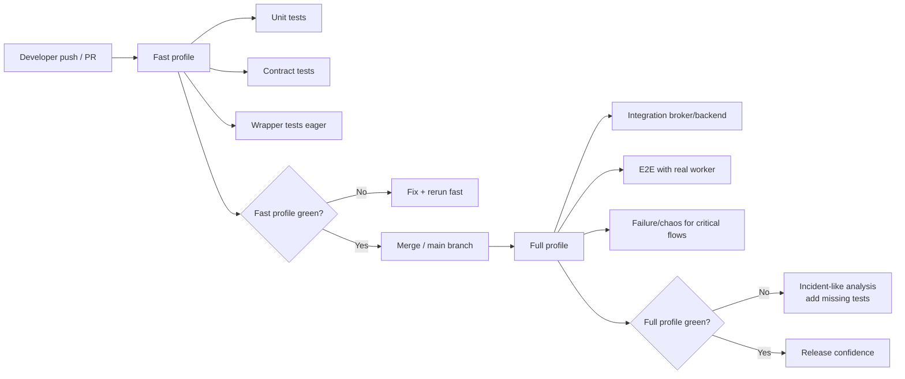

[← Назад к индексу части](index.md)
[↑ К глобальному плану](../../mastery_plan.md)

## FINAL. Справочник, сценарии, самопроверка, ошибки, резюме

### Мини‑практика

Набор упражнений, чтобы закрепить всё “руками”. Важно: это не “идеальные задания”, а реалистичные шаги, которые можно применить в любом проекте.

### 1) Unit test для чистой бизнес‑логики без Celery

- Возьми любую задачу из проекта.
- Вынеси ядро в чистую функцию (без Celery/HTTP).
- Напиши 3 теста:
  - happy path,
  - ошибка валидации,
  - edge case (граница диапазона/пустой ввод).

### 2) Integration test с локальным Redis/RabbitMQ

- Подними брокер (локально/в CI).
- Прогони задачу через реальный publish/consume (не eager).
- Убедись, что:
  - задача действительно исполняется воркером,
  - результат фиксируется там, где ты ожидаешь (backend/DB).

### 3) Смоделируй временную ошибку внешнего API и проверь retry/backoff

- Подмени HTTP‑клиент так, чтобы первые 2 запроса возвращали 500/таймаут, а третий — 200.
- Проверь:
  - число попыток,
  - отсутствие “двойных” side effects,
  - корректное завершение после успеха.

### 4) Смоделируй повторное выполнение и проверь идемпотентность результата

- Запусти одну и ту же logical работу дважды.
- Убедись, что эффект “как один”.
- Если есть конкурентный риск — добавь тест параллельного запуска.

### 5) Добавь “контрактный” e2e‑чек для workflow

- Возьми один реальный chain/group/chord из проекта.
- Прогони happy path через реальный broker + backend + worker.
- Затем запусти сценарий partial failure:
  - убедись, что ошибка наблюдаема (статус/лог/метрика),
  - убедись, что нет “вечного ожидания” без эскалации.

---

### Визуальная карта принятия решений по тестам

Этот блок нужен, чтобы быстро ответить на вопрос “какой следующий тест добавить”, когда времени мало, а риски растут.

Простыми словами: сначала гарантия логики и контракта, потом реализм инфраструктуры, потом устойчивость к сбоям.

---

### Runbook: симптом -> какой тест добавить

Когда в проде что-то “болит”, этот блок помогает быстро превратить симптом в тест, чтобы проблема не вернулась.

| Симптом в проде | Вероятная причина | Какой тест добавить первым |
|---|---|---|
| После деплоя массовые `Decode/Validation` ошибки | Несовместимый payload | Contract test на старые payload + тест “unknown version rejected fast” |
| Повторные письма/вебхуки/списания | Нет идемпотентности эффекта | Тест двойного запуска + конкурентный тест с одним logical key |
| Очередь растёт, задач много в retry | Неправильная классификация ошибок | Тест “что НЕ ретраится” + тест на retry exhaustion |
| Workflow периодически “зависает” | Chord/group edge case, backend деградация | E2E test partial failure + таймаут/эскалация оркестрации |
| Локально всё зелёное, в CI/проде падает | Переупор на eager, мало integration | Integration test через реальный broker/worker |
| Флейки в integration тестах | Плохая изоляция очередей/namespace | Тестовый namespace по `TEST_RUN_ID`, устранение shared queue |

Как пользоваться runbook:

1. Выбираешь строку по симптому.
2. Добавляешь **первый** тест‑фиксатор.
3. После фикса добавляешь ещё один тест на соседний failure mode, чтобы закрыть класс проблем, а не одиночный баг.

---

### Жизненный цикл тестов в CI (fast -> full)

Этот блок помогает увидеть, как теория части 15 превращается в рабочий процесс команды.

Практический смысл:

- **fast profile** защищает скорость разработки;
- **full profile** защищает от “сюрпризов прод‑контура”;
- если full падает, это сигнал не только “чинить код”, но и **усиливать тестовый контур**.

#### Проверь себя по жизненному циклу тестов в CI

1. Почему падение full profile должно приводить не только к фиксу бага, но и к усилению тестового контура?

Ответ

Потому что сам факт “баг ушёл в поздний слой” означает пробел в ранних гарантиях. Если не усилить контур, проблема класса повторится в будущем в другой форме.

2. Что обычно говорит о неудачном дизайне профилей: частые падения fast или частые неожиданные падения full?

Ответ

Обе ситуации плохи, но по‑разному: частые падения fast ломают скорость разработки, а неожиданные падения full сигнализируют о скрытых инфраструктурных/контрактных рисках. Хороший дизайн профилей минимизирует оба типа.

---

### Definition of Done для тестирования Celery-задачи

Короткий чек‑лист, который можно использовать как gate перед merge:

- [ ] Чистая бизнес‑логика покрыта unit‑тестами (happy path + edge cases).
- [ ] Контракт payload зафиксирован (schema/version) и покрыт contract‑тестами.
- [ ] Retry‑поведение проверено: что ретраится, что не ретраится, что происходит на лимите.
- [ ] Идемпотентность проверена по side effects (минимум повторный запуск, при необходимости конкуренция).
- [ ] Для workflow/periodic (если есть): проверены overlap/partial failures/race‑риски.
- [ ] Для критичных задач есть integration/e2e тест с реальным broker/worker/backend.
- [ ] Тесты изолированы (namespace/очереди/ресурсы), нет зависимости от порядка запуска.

Если хотя бы один пункт “нет”, задача ещё не готова к production‑уровню надёжности.

#### Проверь себя по Definition of Done

1. Почему отсутствие только одного пункта (например, idempotency test) уже делает задачу “неготовой”, даже если остальное покрыто?

Ответ

Потому что Celery‑контур уязвим на границах. Один непротестированный критичный риск (дубликаты, контракт, retry) может перечеркнуть пользу остальных тестов и привести к дорогому прод‑инциденту.

2. В каком случае можно сознательно не добавлять e2e тест для конкретной задачи?

Ответ

Когда задача низкой критичности, без сложной orchestration/внешних side effects, и риск инфраструктурных сбоев для неё мал. Но даже тогда остаются обязательными unit/contract и базовый контроль повторов по контексту риска.

---

### Сравнение в тестах: Redis vs RabbitMQ (практический минимум)

Этот блок добавлен, чтобы у читателя не было иллюзии, что “любой broker одинаков” в тестировании.

| Аспект | Redis (как broker) | RabbitMQ (AMQP) | Что это меняет в тестах |
|---|---|---|---|
| Модель очереди | Упрощённая для Celery | Нативная брокерная модель AMQP | На RabbitMQ легче воспроизводить “брокерные” сценарии маршрутизации/ack |
| Ack/доставка | Работает, но с особенностями реализации транспорта | Более “каноничная” AMQP‑семантика | Для критичных delivery‑сценариев полезно иметь хотя бы один тест на RabbitMQ |
| Локальный запуск в CI | Очень простой и быстрый | Чуть тяжелее по настройке | Fast‑профиль часто делают на Redis, full‑профиль — выборочно на RabbitMQ |
| Наблюдаемость брокера | Проще, но меньше AMQP‑инструментов | Богаче инструменты/метрики очередей | Failure‑диагностику удобнее проверять ближе к прод‑брокеру |
| Типичные edge cases | Границы payload/нагрузки, lock/key discipline | Routing/binding/prefetch/consumer‑поведение | Набор integration‑тестов может отличаться по акцентам |

Практическая рекомендация:

- если в проде Redis — достаточно глубоко тестировать Redis‑контур;
- если в проде RabbitMQ — добавь обязательный full‑слой именно на RabbitMQ;
- если в команде оба варианта, держи fast на Redis и smoke/full‑набор на RabbitMQ для критичных потоков.

Главная мысль: **тестовый брокер должен быть максимально близок к прод‑контексту на критичных сценариях**.

#### Проверь себя по сравнению Redis и RabbitMQ

1. Почему fast‑профиль часто делают на Redis, а критичный full‑слой — ближе к прод‑брокеру?

Ответ

Redis проще и быстрее для повседневного цикла разработки, но критичные delivery/маршрутизационные сценарии лучше проверять на брокере, чья семантика ближе к production. Это баланс между скоростью и достоверностью.

2. Когда особенно опасно тестировать только на “удобном” локальном брокере?

Ответ

Когда в проде другой брокер и критичны нюансы его поведения (routing/ack/consumer dynamics). Тогда часть рисков остаётся непроверенной до релиза.

---

### Матрица покрытия по критичности задачи

Этот блок нужен как быстрый “калькулятор достаточности”: чтобы не недотестировать критичные задачи и не перетестировать второстепенные.

| Критичность задачи | Примеры | Минимальный набор тестов | Что добавить при первом инциденте |
|---|---|---|---|
| **Низкая** | неважные уведомления, вторичные пересчёты | unit + contract + базовый wrapper | integration smoke через broker |
| **Средняя** | пользовательские письма, отчёты, экспорт | unit + contract + retry tests + integration | e2e с worker + idempotency duplicate test |
| **Высокая** | биллинг, платежи, юридически значимые события | unit + contract + integration + e2e + idempotency (repeat+concurrency) + failure tests | chaos/failure расширение + отдельный release gate |
| **Критическая** | деньги/безопасность/SLA‑критичный контур | всё из “Высокая” + workflow partial failure + broker/backend degradation tests + строгий CI full profile | регулярные game day/DR‑сценарии и пересмотр runbook |

Простыми словами:

- чем выше риск для бизнеса, тем меньше можно полагаться на “быстрые” тесты;
- критичные потоки должны иметь доказательства устойчивости к дублям, таймаутам и partial failures.

#### Проверь себя по матрице критичности

1. Если задача “средней” критичности пережила первый инцидент с дублями, какие два теста логично добавить в первую очередь?

Ответ

E2E тест с реальным worker и тест идемпотентности на повтор/дубликат (включая хотя бы один конкурентный сценарий при наличии риска). Это закрывает наиболее вероятные причины повторения инцидента.

2. Почему для “критической” задачи недостаточно только unit+contract, даже если они идеальны?

Ответ

Потому что критический риск часто лежит в рантайме и инфраструктуре: redelivery, partial failures, деградация broker/backend, конкуренция worker‑ов. Эти классы отказов unit/contract не моделируют полноценно.

---

### Анти-паттерны тестирования Celery (и как заменить)

| Анти‑паттерн | Почему опасно | Чем заменить |
|---|---|---|
| “У нас всё в eager, значит покрыто” | Не проверяется реальный транспорт/worker/backend | Держать отдельный integration/e2e слой |
| “Тестируем только happy path” | Инциденты обычно на краях (retry/duplicates/workflow failure) | Добавить failure‑набор по runbook |
| “Один общий broker без изоляции” | Flaky, гонки, ложные падения | Namespace/уникальные очереди на test run |
| “Ретраим любые ошибки” | Retry storm и бессмысленная нагрузка | Явная классификация retryable/non‑retryable + тесты на обе ветки |
| “Нет версии payload” | Непредсказуемые падения после деплоя | Versioned schema + compatibility tests |

Запомните формулу:

**Не “больше тестов”, а “правильные тесты на правильных рисках”.**

#### Проверь себя по анти-паттернам

1. Почему “ретраить любые ошибки” — это не устойчивость, а источник новых инцидентов?

Ответ

Потому что non‑retryable ошибки (валидация, несовместимый payload, логические нарушения) повтором не лечатся. Массовые ретраи только увеличивают нагрузку, backlog и время восстановления, создавая retry storm.

2. Какой антипаттерн чаще всего приводит к “ложно зелёным” тестам, и чем его заменить?

Ответ

Часто это “только eager‑тесты”. Заменять нужно многослойным контуром: eager/wrapper для скорости плюс integration/e2e/failure для реалистичных рисков.

---

### Справочник по части

| Тема | Коротко “как правильно” |
|---|---|
| Что тестировать | Разделяй слои: логика, контракт payload, retry/timeouts, идемпотентность, интеграция, orchestration. |
| Уровни тестов | Большинство — unit/contract. Integration/e2e — точечно на критичные риски. |
| Eager mode | Используй для ускорения wrapper‑тестов, но не заменяй им интеграцию. |
| Retry/timeouts | Тестируй семантику: классы ошибок и лимиты попыток; таймауты — чаще в integration/e2e. |
| Идемпотентность | Проверяй по эффекту, включая повторы и конкуренцию. |
| Workflow/periodic | Тестируй overlap и partial failures chord/group. |
| Изоляция | Уникальные очереди/namespace на тест‑ран; осторожно с purge. |
| Payload contract | Schema + versioning + тесты совместимости; не ретраить ошибки валидации. |

---

### Карта соответствия глобальному плану (часть 15)

Чтобы при повторении не гадать “всё ли покрыто”, ниже короткая карта соответствия пунктам плана:

| Пункт плана | Где раскрыто в этой части | Что именно закрыто |
|---|---|---|
| **15.1 Что тестировать** | `15.1` | Логика, контракт, retry, idempotency, orchestration, интеграция, partial failures |
| **15.2 Уровни тестов** | `15.2` | Unit/wrapper/integration/e2e/chaos + критерии выбора |
| **15.3 Eager mode** | `15.3` | `task_always_eager`, польза, ограничения, почему не замена integration |
| **15.4 Retry/timeouts** | `15.4` | transient errors, backoff, max retries, soft/hard timeout сценарии |
| **15.5 Идемпотентность** | `15.5` | повторный запуск, redelivery‑эмуляция, конкурентный запуск, logical job duplicate |
| **15.6 Periodic/workflow** | `15.6` | beat logic, overlap prevention, chord/group failure, race conditions |
| **15.7 Фикстуры/изоляция** | `15.7` | app/broker fixtures, CI profiles, параллельность, очередь/namespace изоляция |
| **15.8 Контракты payload** | `15.8` | JSON Schema/Pydantic подход, несовместимые версии, controlled reject |
| **Мини‑практика** | `Мини‑практика` | 5 упражнений от unit до workflow e2e/failure |
| **Типичные ошибки** | `Типичные ошибки` + в разделах | Общие и тематические антипаттерны |

---

### Ключевые тезисы части

- Тесты Celery проектируются по слоям: **логика -> контракт -> интеграция -> устойчивость к сбоям**.
- **Eager mode** нужен для скорости, но не заменяет тесты с реальным broker/worker/backend.
- Ошибки на “краях” (retry, дубликаты, payload compatibility, workflow partial failures) должны иметь отдельные тесты.
- Идемпотентность проверяется по **эффекту**, а не по “успешному возврату” функции.
- Изоляция тестов — часть архитектуры CI; иначе появятся flaky и ложные результаты.

### Частые сценарии

### Сценарий 1. “У нас много задач, но хочется быстрые тесты”

- Делай **unit + contract** как основной слой.
- Для каждой критичной задачи — 1 integration/e2e тест.
- Для workflow — минимум 1 e2e тест на partial failure.

### Сценарий 2. “После деплоя внезапно полетели ошибки сериализации”

- Добавь contract tests payload.
- Введи `version` в payload и backward compatibility.
- Валидацию делай early и не ретраь ошибки данных.

### Сценарий 3. “Иногда двойные эффекты (двойные письма/вебхуки)”

- Добавь тесты идемпотентности:
  - повторный запуск,
  - конкурентный запуск.
- Введи idempotency key и хранение дедупликации в устойчивом хранилище.

---

### Вопросы для самопроверки

1. Какие уровни тестов ты выберешь для задачи “списать деньги” и почему?

Ответ

Unit (логика и инварианты), contract (payload и версии), integration/e2e (реальный broker/worker/backend), failure‑тесты (ретраи на временных ошибках, redelivery/повторная публикация) и тест идемпотентности (эффект один). Потому что риск высокий и больше всего опасны края: дубли, частичные отказы, несовместимость.

2. Какая самая опасная иллюзия eager mode?

Ответ

Что “раз тест прошёл, значит прод‑контур работает”. На самом деле eager не проверяет доставку/конкуренцию/worker‑рантайм и часть проблем инфраструктуры.

3. Что в Celery‑контуре чаще всего ломается на “краях”, и почему это надо тестировать отдельно?

Ответ

Retry/таймауты, дубликаты (redelivery/повторная публикация), несовместимые payload, partial failures workflow. Это ломается реже, но последствия обычно тяжёлые, и unit‑тесты этого не ловят.

---

### Типичные ошибки

- Полагаться только на eager mode.
- Не тестировать retry отдельно от happy path.
- Не проверять side effects на дубликатах (идемпотентность “на словах”).
- Делать интеграционные тесты без изоляции очередей и namespace.
- “Чистить очередь” в shared окружении и ломать соседние тест‑раны.
- Менять payload без схемы/версии и без тестов совместимости.

---

### Резюме части

- Тестирование Celery — это **многослойная стратегия**: логика, контракт, надёжность, интеграция и orchestration.
- Eager mode — полезный ускоритель, но не доказательство production‑готовности.
- Самые важные тесты для production‑устойчивости: **контракт payload**, **retry/таймауты**, **идемпотентность**, **partial failures workflow**.

Следующая логичная тема по плану — **производительность/throughput/масштабирование (часть 16)** и **безопасность (часть 17)**: они опираются на то, что тест‑контур уже умеет ловить регрессии и failure modes, а не только happy path.
