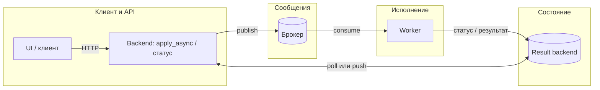

[← Назад к индексу части](index.md)
[↑ К глобальному плану](../celery_mastery_plan.md)

## Что желательно знать заранее

Желательно уже понимать:

- архитектуру Celery: producer → broker → worker → (result backend);
- модели пула worker-а (prefork, threads, gevent и т.д.) — см. часть 8;
- **at-least-once**, retry, идемпотентность — см. часть 9;
- основы выбранного брокера (RabbitMQ vs Redis и компромиссы) — см. часть 6;
- базовый мониторинг очередей и метрик — см. часть 12 и 14.

**Сквозной контур (для метрик perf):** узкое место может быть **до** брокера (API при `apply_async`), **в** брокере, **в** worker-е, **в** result backend при статусе, **в** UI при опросе. Оптимизация «только worker» не закрывает SLA, если тормозит другой участок.

#### Проверь себя: предпосылки и сквозной контур

1. Назови **два** участка диаграммы выше, где узкое место **не** исправляется увеличением `-c` у worker-а.

Ответ

Например: **edge** (API блокируется на `apply_async` из‑за broker pool или сериализации) и **state** (result backend или **poll** статуса перегружены). В обоих случаях расширение параллелизма **исполнения** не устраняет bottleneck на пути к брокеру или к хранилищу статусов.

2. Зачем при изучении этой части заранее помнить про **at-least-once** и идемпотентность (часть 9)?

Ответ

Потому что **ретраи и redelivery** раздувают **сырой** throughput и нагрузку на брокер/downstream, маскируя **goodput**; оптимизация perf бессмысленна без понимания, сколько раз **безопасно** выполнить эффект. Идемпотентность позволяет масштабировать concurrency без «двойных» бизнес-последствий.

3. Почему «знать брокер» (часть 6) важно именно для **perf**, а не только для надёжности?

Ответ

У разных брокеров разные **узкие места** (flow control, память, visibility, диск) и разная стоимость операций; одни и те же настройки Celery ведут себя **иначе**. Без этой базы легко тюнить worker, оставаясь с **брокером** как скрытым потолком throughput.

---
