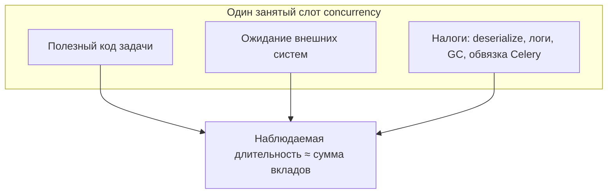
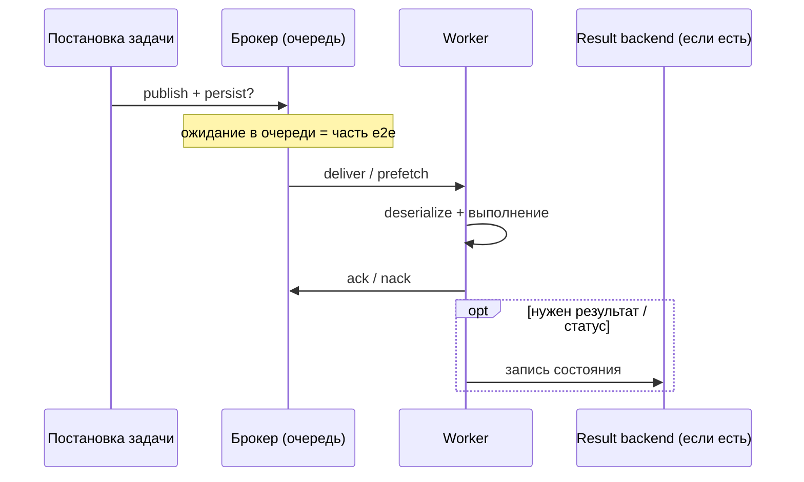
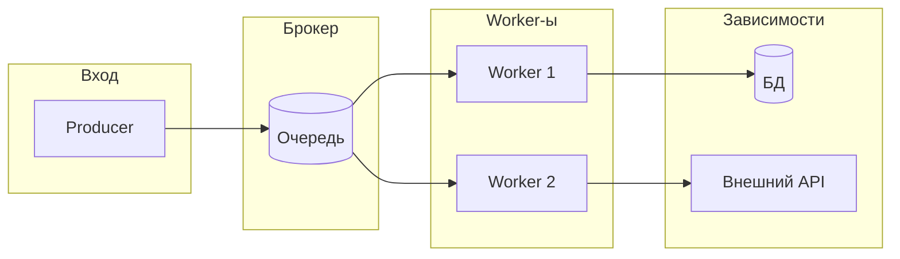

[← Назад к индексу части](index.md)
[↑ К глобальному плану](../celery_mastery_plan.md)

## 16.1 Что считать производительностью

### Цель раздела

Научиться **формулировать цели производительности** Celery-контура так, чтобы их можно было измерить, улучшать и защищать на ревью — без путаницы между «быстро выполняется функция» и «быстро обслуживается бизнес-процесс».

### В этом разделе главное

- **Throughput** — про объём завершённой работы, не про ожидание в очереди.
- **End-to-end latency** — про путь сообщения и бизнес-время, не только CPU в worker-е.
- **Распределение времени** важнее среднего: хвосты убивают доверие и SLA.
- **Queue lag** показывает, успевает ли система за входящим потоком.
- **Cost per task** связывает инженерные метрики с деньгами и лимитами API.
- **Worker efficiency** помогает отличить «мало воркеров» от «воркеры заняты не тем».

### Термины

| Термин | Кратко |
|--------|--------|
| **SLO** | Целевой уровень сервиса: например, «95% задач типа X за 5 минут». |
| **Перцентиль (p95/p99)** | Граница, ниже которой укладывается 95%/99% наблюдений. |
| **Saturation** | Насколько компонент **заполнен** работой (очередь, CPU, connections). |
| **Goodput** | Полезная completed work, без потерь на ретраи/отбраковку (иногда вводят вручную). |

### Теория и правила

**Throughput задач** обычно измеряют как число **успешно завершённых** задач в секунду (или в минуту) для заданного класса задач. Практически: `число_завершений_успех / окно_времени` по метрикам worker-а, брокера или бизнес-событий — но **одинаково** определяйте «успех» и **не смешивайте** классы в одном числителе. Важно фиксировать: *что считается успехом*, *какие очереди*, *какой период* (steady state vs burst).

**End-to-end latency** — интервал от момента, когда задача **принята к исполнению системой** (например, `apply_async` вернул id / сообщение ушло в брокер), до момента, который выбран как «готово»:

- результат записан в backend и доступен;
- или побочный эффект гарантированно выполнен (сложнее измерять — нужны бизнес-метрики).

**Execution time distribution**: одна и та же задача может занимать 50 ms в типичном случае и 120 с при деградации внешнего API. Для планирования важны **гистограммы**, не среднее.

**Queue lag** можно определить как:

- глубину очереди (число сообщений);
- или **время ожидания** первого сообщения в очереди (лучше коррелирует с UX);
- или отставание «время поступления → время старта обработки».

**Cost per task** включает:

- CPU-seconds и память на worker-е;
- сообщения брокера (publish/consume, ack);
- операции result backend;
- вызовы внешних API (деньги, квоты);
- запись логов и метрик.

**Worker efficiency**: доля времени, когда worker исполняет полезный код задачи, а не ждёт I/O, lock, GIL (в threads), сборку мусора, сетевые таймауты на пустом месте. Формально полезно смотреть на **удельную стоимость**: CPU-seconds на одну успешно завершённую задачу, долю времени в **idle/wait** по стекам потоков и долю **системного** времени (сеть, диск). Если CPU низкий, а очередь растёт, «эффективность исполнителя» в узком смысле высокая, но **системная эффективность** низкая — работа **стоит в очереди** или в ожидании внешнего ответа.

**Как измерять worker efficiency на практике (без философии):**

- **User CPU vs iowait vs idle** на хосте/процессе: высокий **iowait** при «занятых» слотах часто значит «слоты ждут диск/сеть», а не считают Python — растёт wall time задач без роста user CPU.
- **CPU-seconds на N успешных задач** одного класса (или на 1k задач): при том же входе вдруг выросло — ищите регрессию в коде, сериализации, логах или зависимости.
- **Разложение wall time внутри задачи** (`time.monotonic()` вокруг HTTP, БД, «чистого» Python): видно, не «тикает» ли слот в ожидании без прогресса.
- **Не путать** узкую эффективность worker-а с здоровьем системы: все слоты могут быть «заняты» ожиданием API, **throughput goodput** падает, **lag** растёт — bottleneck **вне** worker-а.



Слот может быть «занят», но вклад трёх классов разный: профилирование и метрики показывают, **куда уходит** wall time. На практике вклады **не независимы** (например, логирование — и CPU, и I/O), но **три коробки** помогают не спутать «мало user CPU» с «задача ничего не делает».

**Execution time distribution (глубже, чем среднее):** для одного `task.name` стройте **гистограмму** или хотя бы p50/p95/p99. Среднее арифметическое чувствительно к **редким хвостам** и почти никогда не описывает SLO. На практике полезны три слоя:

- **Стабильный режим** (steady state): типичные запросы к API, обычный размер входа.
- **Деградация зависимости**: таймауты, retry, «медленная БД» — хвост удлиняется.
- **Аномалии**: один тип входа (огромный файл, плохой документ) раздувает p99.

Планируйте ёмкость по **p95/p99 для класса задач**, а не по «среднему по больнице». Если смешать в одной выборке «отправить письмо» и «собрать отчёт за год», среднее будет **бессмысленным** для обоих классов.

**Интуиция гистограммы (план: execution time distribution):** «среднее» — одно число; **гистограмма** показывает, есть ли **два горба** (быстрый и медленный режим) или **длинный хвост**. SLO почти всегда привязан к **хвосту**, а не к середине.

```
  число задач (условно)
        │         ╭── редкие долгие (бьют по p99)
        │    █    │
        │    █ █  │ ██
        │  █ █ █ █│█ █
        └─────────┴──────────► время execution
            типичное тело     хвост
```

**Связка очереди и latency (Little’s Law, интуиция):** в стационарном режиме для стабильной системы справедливо приближение \(L \approx \lambda W\), где \(L\) — среднее число задач «в полёте» (в очереди + в работе), \(\lambda\) — скорость поступления, \(W\) — среднее время от постановки до завершения (end-to-end). **Простыми словами:** если задачи приходят быстрее, чем вы их перевариваете, **хвост очереди растёт**, и end-to-end latency растёт даже если **execution time** задачи не изменился. Поэтому лечить только «ускорением функции» без учёта \(\lambda\) и ёмкости часто недостаточно.



**Как читать диаграмму:** «длинная полоска» end-to-end складывается из **нескольких участков**; оптимизация только одного (например, тела задачи) не гарантирует выполнение SLO, если доминирует **ожидание в B** или **запись в R**.

**Goodput vs «сырой» throughput:** *сырой* счётчик может расти из‑за **ретраев**, **redelivery** и повторного исполнения после падений. **Goodput** — число **уникальных бизнес-операций**, доведённых до успеха (или осмысленно завершённых) без двойного учёта. На дашборде «задач/сек» высоко, а пользователи недовольны — проверьте, не является ли рост **попыток**, а не **полезных исходов**.


Смысл: при расследовании идите **сверху вниз** (от обещания пользователю к железу), при проектировании SLO — **фиксируйте верхний слой**, иначе оптимизация M4 не спасёт M1.

#### Проверь себя: теория §16.1 (метрики и слои)

1. Почему **среднее** execution time по смеси «письмо 50 ms» и «отчёт 20 мин» почти бесполезно для SLO **каждого** класса?

<details><summary>Ответ</summary>

Среднее **размывает хвосты** и скрывает **два (или больше) режима** работы: для писем важен другой масштаб времени и другой перцентиль, чем для отчётов. Планировать ёмкость и алёрты нужно **по классу** и по **p95/p99** этого класса, иначе «нормальное среднее» сосуществует с провалами SLA у одного из типов задач.

</details>

2. Сравни два определения **queue lag**: «число сообщений в очереди» и «возраст самого старого сообщения». Когда второе информативнее первого?

<details><summary>Ответ</summary>

Глубина в **штуках** не видит **вес** задач: мало тяжёлых сообщений может быть хуже, чем много лёгких. **Возраст** (или перцентиль времени ожидания) лучше коррелирует с тем, **сколько ждёт пользователь** и насколько система «разогналась» по времени, а не только по счётчику.

</details>

3. **Cost per task**: назови два **разных** компонента стоимости — один «инфраструктурный», один «внешний по деньгам».

<details><summary>Ответ</summary>

Например: инфраструктурный — **CPU·сек и RAM** на кластере, трафик брокера, записи в result backend; внешний по деньгам — **квоты и тарифы SaaS**, платные API, выставляемые по вызовам. Оба входят в полную цену задачи и ограничивают масштабирование.

</details>

### Пошагово: как выбрать «правильные» метрики под продукт

1. Опиши **пользовательский или бизнес-исход**: что значит «задача сделана» для клиента?
2. Выбери **1–2 главных SLO** (например, p95 latency для класса A, max lag для класса B).
3. Разбей задачи на **классы** (короткие уведомления, тяжёлый batch, периодика).
4. Для каждого класса измерь **throughput**, **execution time p50/p95/p99**, **queue depth/lag**.
5. Добавь **сатурацию** downstream (ошибки API, pool БД, Redis slowlog) — иначе Celery «зелёный», а система страдает.

#### Проверь себя: алгоритм выбора метрик

1. На шаге 1 ты формулируешь бизнес-исход. Почему без этого бессмысленно выбирать «главный» перцентиль latency?

<details><summary>Ответ</summary>

Перцентиль измеряет **время до события**, которое вы должны **определить**: «готово в UI», «письмо ушло», «отчёт в S3». Разные исходы — разные точки отсчёта end-to-end и разные допустимые хвосты. Без контракта «что хорошо» метрика превращается в число без решений.

</details>

2. Зачем в шаге 5 явно добавлять **сатурацию downstream**, если уже есть метрики очереди Celery?

<details><summary>Ответ</summary>

Потому что Celery может **стабильно жевать очередь**, а пользователь всё равно страдает из‑за **5xx БД**, исчерпания **connection pool** или деградации внешнего API: узкое место **за пределами** брокера. Без downstream-метрик вы лечите **симптом очереди**, не первопричину.

</details>

### Простыми словами

Производительность Celery — это не «у меня функция за 20 ms». Это **успеваем ли мы переваривать поток работы целиком** и **как долго элемент работы живёт от постановки до результата**, включая очереди и повторы.

### Картинка в голове

Представь **конвейер**: на входе коробки (сообщения), на выходе — готовые заказы. Throughput — сколько коробок **выпустили** в час. Latency — сколько **конкретная коробка** путешествовала по цеху, включая ожидание на полке. Если полка завалена — throughput может быть высоким у «лёгких» коробок, а тяжёлые никогда не дождутся смены.



**Идея диаграммы:** задержка может возникнуть **в любой звезде**; измерять только worker — значит игнорировать «полку» в брокере и очереди в БД.

### Как запомнить

**«Среднее врёт, хвосты правят, очередь — ранний сигнал».**

### Примеры

**Пример формулировки SLO:**

- Класс задач `notifications.send`: p95 end-to-end **< 30 с**, error rate **< 0.1%**.
- Класс `reports.build`: p95 execution **< 10 мин**, но lag очереди **< 2 ч** в пике.

**Пример ошибочной метрики:** «Среднее время `task.run` = 100 ms» при том, что сообщения висят в очереди 20 минут — пользователь всё равно недоволен.

### Практика / реальные сценарии

- **E-commerce**: отдельные SLO на «письмо о заказе» и на «пересчёт рекомендаций».
- **Data pipeline**: throughput батчей и **максимальный допустимый lag** слоя обработки.
- **Интеграции**: cost per task = **квоты SaaS**; оптимизация — не ускорить Python, а **снизить число вызовов**.

### Типичные ошибки

- Смотреть только на **CPU worker-а**, игнорируя глубину очереди.
- Смешивать в одной метрике **разные типы задач**.
- Оптимизировать **p50**, пока **p99** рвёт договорённости.

### Что будет, если…

- **Если не измерять lag:** ты узнаешь о перегрузке от **злых твитов** или **алёрта клиента**, а не от дашборда.
- **Если мерить только успешный throughput без ретраев:** retry storm выглядит как «много работы», хотя goodput падает.

### Проверь себя

1. Чем **queue depth** может отличаться от **полезного** сигнала для SLA?

<details><summary>Ответ</summary>

Глубина в сообщениях не учитывает **вес** задач: 10 тяжёлых сообщений vs 10 лёгких — разное время до восстановления lag. Лучше комбинировать depth с **возрастом самого старого сообщения**, перцентилями времени ожидания и метриками по **классам** задач.

</details>

2. Почему **end-to-end latency** почти всегда **больше**, чем время выполнения функции в worker-е?

<details><summary>Ответ</summary>

Потому что в end-to-end входят **ожидание в очереди**, задержки брокера, возможные **redelivery**, ожидание слота concurrency, запись результата в backend и иногда ожидание внешних ресурсов до старта/после завершения, если они часть контракта «готово».

</details>

3. Зачем вводить **cost per task**, если инженеру платят зарплату, а не «за задачу»?

<details><summary>Ответ</summary>

Потому что задачи потребляют **денежные внешние ресурсы** (API, облако, хранилище) и **внутреннюю ёмкость** (кластер, брокер). Без cost per task легко «оптимизировать код» и одновременно **увеличить счёт** или упереться в квоту.

</details>

4. В чём разница между «**worker efficiency** в узком смысле» и **системной** производительностью (lag / goodput)?

<details><summary>Ответ</summary>

В узком смысле worker может **мало простаивать**: слоты заняты ожиданием I/O или «правильным» кодом. Но если downstream **не тянет** или очередь **забита**, **lag** и **e2e latency** для клиента всё равно плохие, а **goodput** не растёт. Системная производительность требует метрик **контура целиком**, а не только «CPU крутится».

</details>

5. Почему нельзя смешивать в **одном** числителе throughput **разные** `task.name` без явной оговорки?

<details><summary>Ответ</summary>

Потому что «задача в секунду» при смеси лёгких и тяжёлых имён **не сравнима** с собой же при изменении доли классов: вы можете «улучшить» throughput числом, увеличив долю дешёвых задач, и одновременно **убить** SLO тяжёлых. Нужны **отдельные ряды** или явный знаменатель (например, только класс `notifications.*`).

</details>

6. Как **два горба** на гистограмме execution time соотносятся с выбором **p95** как целевого перцентиля?

<details><summary>Ответ</summary>

Два горба означают **два режима** (например, кэш попал / не попал; быстрый и медленный API). Один перцентиль **p95** может попадать в «толстый» быстрый горб и **маскировать** долю запросов во втором горбе — для SLO иногда нужны **два** порога, **разрез по входу** или отдельные классы задач.

</details>

7. **Saturation** из таблицы терминов §16.1: приведи пример сатурации **не** очереди Celery, но влияющей на e2e.

<details><summary>Ответ</summary>

Например: **пул соединений к БД** исчерпан — задачи в worker-е ждут коннект; **rate limit** внешнего API — задачи ждут слот retry; **CPU брокера** под flow control — publish тормозится. Во всех случаях «очередь задач» может выглядеть иначе, чем полная картина задержки для клиента.

</details>

### Запомните

Производительность Celery измеряется **на уровне системы и бизнес-исхода**, а не только микропрофиля функции.

---
