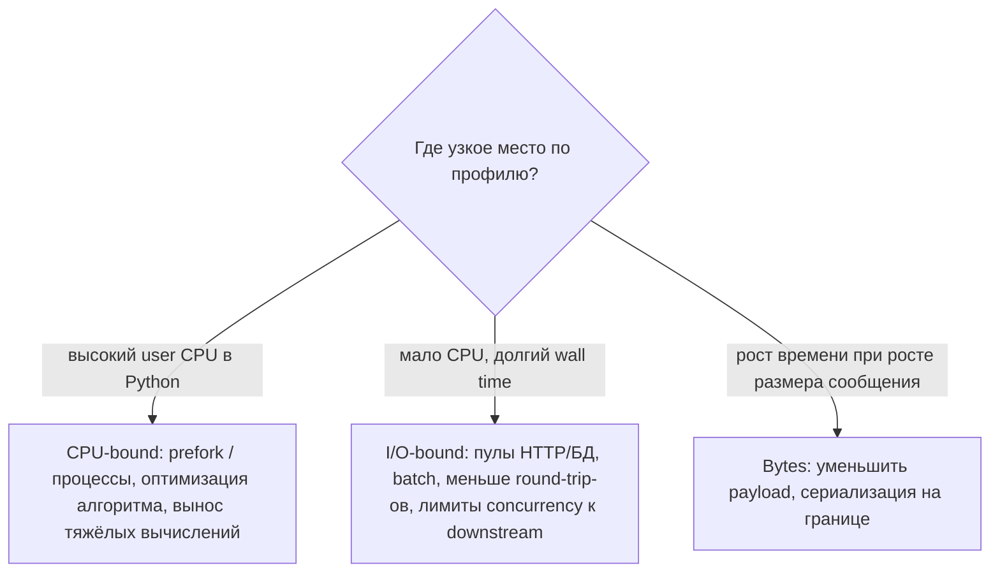
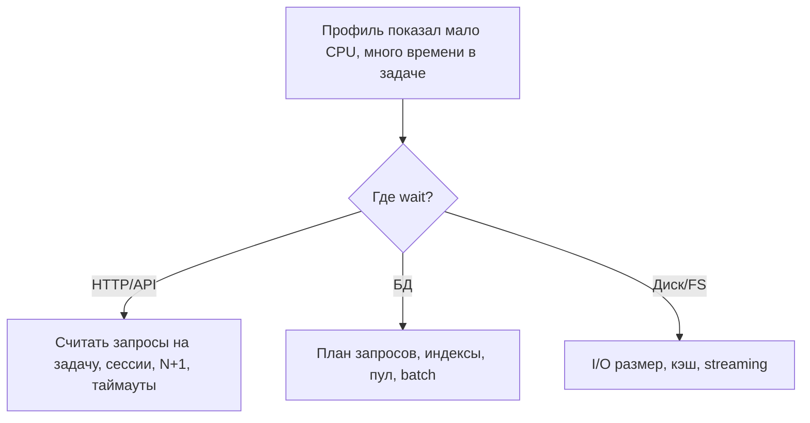
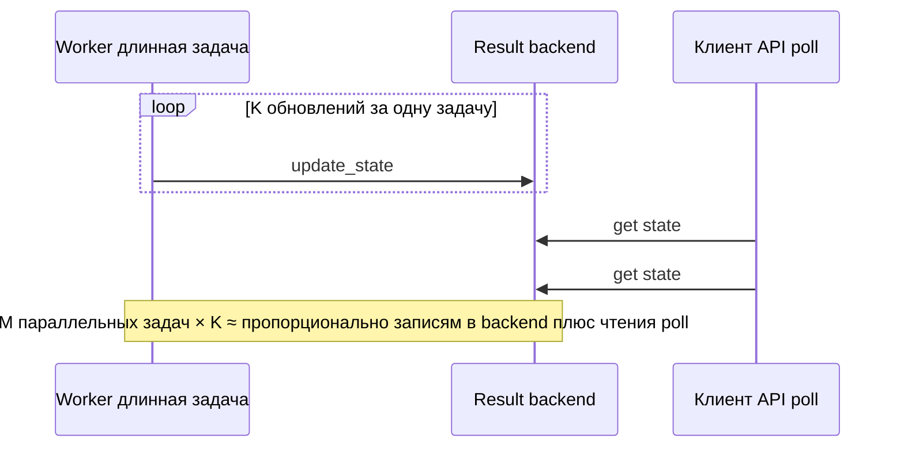

[← Назад к индексу части](index.md)
[↑ К глобальному плану](../../mastery_plan.md)

## 16.2 Profiling задач

### Цель раздела

Научиться **разбирать профиль задачи**: где тратится время и ресурсы, что ускорять в первую очередь, а что является следствием архитектуры или транспорта.

### В этом разделе главное

- Разделение **CPU-bound** и **I/O-bound** задаёт разные инструменты (процессы vs потоки/greenlet).
- **Внешние вызовы** часто доминируют: оптимизация Python бессмысленна без кэша, пула, batching.
- **Большой payload** бьёт по сети, CPU сериализации и памяти.
- **Сериализация/десериализация** на границе producer и worker — частый скрытый налог.
- **Частые обновления прогресса** (`update_state`) могут превратиться в шторм записей в backend.

### Термины

| Термин | Кратко |
|--------|--------|
| **CPU-bound** | Узкое место — вычисления в CPU. |
| **I/O-bound** | Узкое место — ожидание сети/диска/БД. |
| **Payload** | Тело аргументов задачи в сообщении. |
| **Hot path** | Участок кода, выполняемый **очень часто** — там микрооптимизации и налоги критичны. |

### Теория и правила

**CPU-bound задачи** в классическом CPython с GIL плохо масштабируются **потоками**; чаще нужен **prefork** (отдельные процессы) или вынос в нативный код/другой сервис. Профилировать имеет смысл `cProfile`, sampling profiler, линейные участки на больших данных.

**I/O-bound задачи** проводят время в ожидании ответа. Узкое место — **лимиты соединений**, **DNS**, **TLS handshake**, **latency API**, **lock в БД**. Здесь важнее **конкуренция без перегруза**, пулы, таймауты, circuit breaker, **уменьшение числа запросов** (batch).



Диаграмма — **не диагноз по одному числу**: смотрите **стеки**, **APM**, **счётчики запросов** и **размер сообщений** вместе.

#### Внешние вызовы и БД (план 16.2 — углубление)

Именно здесь чаще всего «теряются» минуты при **миллисекундном** Python:

- **N+1 запросов:** цикл по сущностям с отдельным HTTP или SQL на каждую итерацию — latency растёт **линейно** от числа элементов. Лечение: **batch API**, `JOIN`/`IN (...)`, догрузка списком, кэш.
- **Новое соединение на каждый вызов:** лишние **TCP + TLS** рукопожатия. Используйте **переиспользуемые** сессии (`httpx.Client`, `requests.Session`, пул соединений БД), где это безопасно с учётом потоков/greenlet.
- **Синхронный клиент в gevent без monkey patch:** блокируете весь пул. Либо совместимые драйверы/клиенты, либо другой тип пула (см. часть 8).



**Размер payload:** большие списки id, вложенные dict, «тащим весь объект ORM» — всё это сериализуется на producer-е, едет по брокеру, десериализуется на worker-е. Иногда выгоднее передавать **id** и догружать в worker-е из БД (с оговорками про консистентность и версии схемы).

**Сериализация:** `json` обычно безопаснее и предсказуемее по совместимости; `pickle` может быть быстрее на некоторых структурах, но несёт риски и часто **не стоит** экономии. Смешанные типы и `datetime` требуют дисциплины.

**Прогресс задач:** каждый `update_state` — как правило, запись в backend. При тысячах обновлений на одну длинную задачу вы можете **убить backend** и сеть быстрее, чем ускорить саму работу.

**План 16.2 — частота прогресса:** это отдельный «горячий контур» рядом с брокером — **записи в result backend** умножаются на число итераций внутри **одной** задачи и на **число параллельных** таких задач; сверху часто ложится **опрос статуса** из API (см. §16.5).



#### Проверь себя: ветвление профиля §16.2

1. Профиль показывает **высокий user CPU** в Python и мало ожиданий. Какой **тип** нагрузки это намекает и какой **тип пула** чаще уместен для масштабирования CPU-bound в CPython?

<details><summary>Ответ</summary>

Это **CPU-bound** в смысле «узкое место — вычисления в интерпретаторе». В классическом CPython **потоки** плохо масштабируют чистый CPU из‑за GIL; чаще смотрят на **prefork** (процессы) или вынос тяжёлых вычислений. Решение должно подкрепляться **профилем** и метриками, а не догмой.

</details>

2. **I/O-bound** задача: concurrency увеличили, latency внешнего API выросла нелинейно. Что это говорит о **реальном** bottleneck?

<details><summary>Ответ</summary>

Что **внешняя система** или **сеть** стала узким местом: вы умножили одновременные запросы и уперлись в **лимиты, lock, очередь на стороне зависимости**. Дальше растить concurrency бесполезно или вредно; нужны **rate limit**, кэш, batch, circuit breaker, масштабирование **зависимости** или снижение числа вызовов на задачу.

</details>

3. Сравни два подхода к «узкому месту bytes»: уменьшить **payload в сообщении** vs передавать **id** и догружать в worker-е. Когда второй **хуже**?

<details><summary>Ответ</summary>

Когда **лишний round-trip** к БД дороже передачи небольшого payload, когда нужен **снимок данных на момент постановки** (id читает «как сейчас»), или когда догрузка создаёт **N+1** и новую нагрузку на хранилище. Выбор — по замерам и контракту консистентности.

</details>

### Пошагово: мини-алгоритм профилирования одной задачи

1. Зафиксируй **входной размер** (число id, размер JSON, наличие вложений).
2. Замерь **end-to-end** и **execution** отдельно (лог времени постановки → старт worker → конец).
3. Внутри execution: **cProfile** или APM (если есть) на репрезентативном входе.
4. Отметь долю времени: **внешний HTTP**, **БД**, **чистый Python**, **сериализация** (если видно).
5. Проверь **число обращений** к внешним системам на одну задачу — часто их нужно резать.
6. Оцени **частоту update_state / логов** — не создаёшь ли ты вторую нагрузку.

### Простыми словами

Сначала выясни: задача **думает**, **ждёт** или **гоняет байты туда-сюда**. От этого зависит, что менять — код, пул, брокер или формат сообщения.

### Картинка в голове

Задача — бригада на ремонте. Если они **ждут поставку плитки** (I/O), покупка второго перфоратора (ещё один CPU-процесс) не ускорит ремонт. Если они **режут плитку без остановки** (CPU), нужны **ещё руки** (процессы) или другой инструмент.

### Как запомнить

**«Профиль сначала говорит CPU vs wait vs bytes».**

### Примеры

**Псевдокод: слишком тяжёлый payload**

```python
# Плохо: тащим большие структуры в сообщение
send_report.delay(huge_nested_dict_with_rows)

# Лучше: id отчёта + версия схемы
send_report.delay(report_id="r-123", schema_version=2)
```

**Псевдокод: прогресс каждую строку**

```python
for i, row in enumerate(million_rows):
    process(row)
    if i % 1 == 0:
        self.update_state(state="PROGRESS", meta={"current": i})  # миллион записей в backend
```

Разумнее: обновлять каждые N тысяч строк или по времени.

#### Инструменты и приёмы (чтобы не гадать)

| Инструмент / приём | Зачем |
|--------------------|--------|
| **`cProfile` / `profile`** | Узнать, **какие функции Python** съели CPU на репрезентативном входе. |
| **Sampling profiler (`py-spy` и аналоги)** | Смотреть стеки **в проде-подобном** режиме с меньшим замедлением; полезно для «почему CPU 100%». |
| **APM (OpenTelemetry, Datadog, и т.д.)** | Разложить время на **HTTP, DB, Redis** внутри задачи, если инструментированы клиенты. |
| **Логирование фаз с монотонными часами** | В начале задачи: `t0 = time.monotonic()`, после десериализации, после ключевого вызова — увидеть, **где разошлись** e2e и execution. |
| **Метрики брокера** | Длина очереди, publish rate, ack rate, consumer utilisation — отделить «медленный код» от «не успеваем забирать». |
| **Замер размера сообщения** | Логировать **размер сериализованного payload** (или хэш + длина) на staging — поймать «раздутые» аргументы до прода. |

**Практический совет:** профилируйте **тот же объём данных**, что и в бою (порядок величин). Профиль на 10 элементах и вывод на 10⁶ элементов — разные программы: могут измениться **алгоритмическая сложность**, кэш, планы запросов в БД.

**Команды и приёмы (минимум для старта):**

```bash
# Статистика вызовов Python при локальном запуске тела задачи (без полного контура брокера)
python -m cProfile -s cumtime -m pytest tests/test_my_task_logic.py -k heavy_case

# Сохранить профиль и разобрать интерактивно
python -m cProfile -o /tmp/task.prof run_one_task_locally.py
python -c "import pstats; p=pstats.Stats('/tmp/task.prof'); p.sort_stats('cumtime').print_stats(40)"
```

```bash
# Sampling по живому процессу worker (осторожно в проде: нагрузка, права)
# py-spy record -p <PID> -o /tmp/profile.svg --duration 30
```

Для **частоты `update_state`**: залогируйте счётчик вызовов на одну длинную задачу на staging; если он измеряется **тысячами**, backend почти наверняка участвует в bottleneck.

#### Проверь себя: инструменты и замеры §16.2

1. Зачем **sampling profiler** иногда предпочтительнее чистого `cProfile` при разборе **прода-подобной** нагрузки?

<details><summary>Ответ</summary>

`cProfile` даёт детальный учёт вызовов, но сильнее **искажает** тайминги и накладные расходы; sampling (`py-spy` и аналоги) смотрит **стеки в момент времени** с меньшим вмешательством — полезнее для «что реально на CPU» под нагрузкой. Часто используют **оба**: cProfile на стенде, sampling при подозрении на прод-симптомы.

</details>

2. **Метрики брокера** в таблице инструментов: как по ним отличить «медленный код задачи» от «consumer не успевает забирать»?

<details><summary>Ответ</summary>

Смотреть **связку**: растёт **глубина очереди**, **низкий** ack/consume rate при **низкой** загрузке CPU worker-ов — задачи **не исполняются** или не доставляются (брокер, routing, prefetch, не те worker-ы). Если очередь есть, worker **занят**, ack идут, но медленно — чаще **исполнение** или downstream внутри задачи.

</details>

3. Почему профиль на **10 элементах** опасен как основа для выводов о задаче на **10⁶** элементов?

<details><summary>Ответ</summary>

Может измениться **асимптотика** (O(n) vs O(n²)), поведение кэша, планы запросов в БД, пороги батчинга. Микро-профиль не увидит **давление на брокер** и **хвосты** latency при реальном объёме. Нужен профиль и метрики на **репрезентативном** порядке величины.

</details>

### Практика / реальные сценарии

- Задача «отправить письма»: узкое место — **SMTP/API**, не цикл в Python → батчи, rate limit, несколько очередей по приоритету.
- Задача «посчитать фичи ML»: CPU-bound → prefork, возможно **уменьшение concurrency**, если каждый процесс жрёт RAM.

### Типичные ошибки

- Включать **микрооптимизации** до измерений.
- Профилировать на **микроскопическом** входе, а в проде вход в 1000 раз больше.
- Игнорировать **сетевой round-trip** к брокеру на маленьких задачах.

### Что будет, если…

- **Если гонять огромный payload:** рост latency **всех** задач из-за нагрузки на брокер и память worker-ов.
- **Если частый update_state:** backend становится bottleneck; растёт latency **получения статуса** и нагрузка на Redis/БД.

### Проверь себя

1. Почему для **I/O-bound** задачи «просто увеличить concurrency» может быть опасно?

<details><summary>Ответ</summary>

Потому что вы **умножаете одновременные** запросы к БД/API/пулу соединений. После порога растёт **latency зависимости**, появляются таймауты, ретраи и каскадные отказы — throughput падает, хотя «параллельности» больше.

</details>

2. Когда **догрузка по id в worker-е** может быть хуже, чем передать данные в сообщении?

<details><summary>Ответ</summary>

Когда данные **очень малы**, БД **далеко/дорога**, или когда нужна **строгая изоляция** снимка данных на момент постановки (передача id подразумевает чтение «как сейчас», что может отличаться от намерения). Нужен осознанный контракт версий и консистентности.

</details>

3. Что такое **hot path** в контексте Celery и почему это важно для логов?

<details><summary>Ответ</summary>

Hot path — код/участок, который выполняется для **каждой** или почти каждой задачи (сериализация, лог в начале задачи, метрика). Маленький налог × миллионы задач = большая стоимость. DEBUG-лог на hot path может стать **основной** нагрузкой.

</details>

4. Почему **N+1** HTTP- или SQL-запросов внутри **одной** Celery-задачи — типичная причина «медленной» задачи при **низкой** загрузке CPU?

<details><summary>Ответ</summary>

Потому что CPU в основном **простаивает в ожидании** сети или ответа БД; профиль показывает мало user CPU, но **wall time** огромен. Суммарная latency растёт как **число round-trip-ов**; решение — уменьшить число запросов (batch, JOIN, один вызов API), а не добавлять процессы.

</details>

5. Почему **`update_state` в цикле** на миллион итераций бьёт по производительности **сильнее**, чем «миллион быстрых операций в Python» в том же цикле?

<details><summary>Ответ</summary>

Потому что каждый вызов обычно — **сетевой round-trip** и **запись** в result backend (сериализация, Redis/БД, конкуренция за соединения). Это на порядки дороже локального шага цикла и **масштабируется** с числом параллельных worker-ов и частотой poll клиентов. Решение — реже обновлять (по времени/чанкам), уменьшать `meta`, отключать результат где не нужен.

</details>

### Запомните

Профилируй **весь путь задачи** и **зависимости**, не только тело функции.

---
