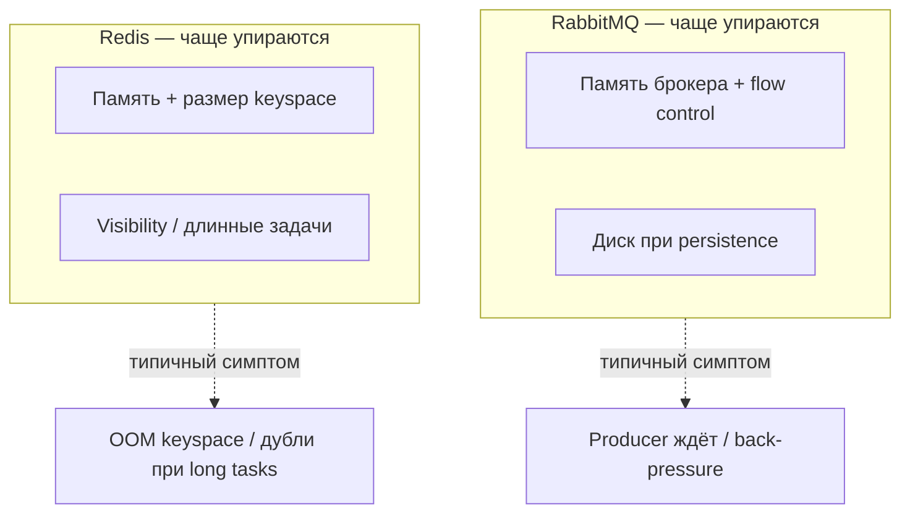
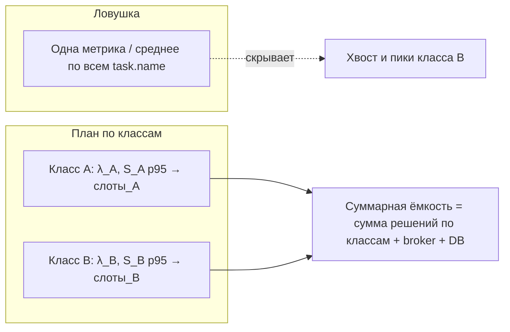
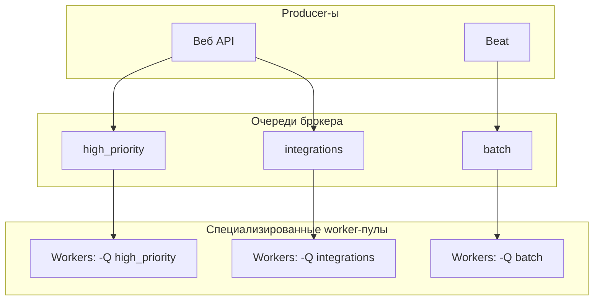
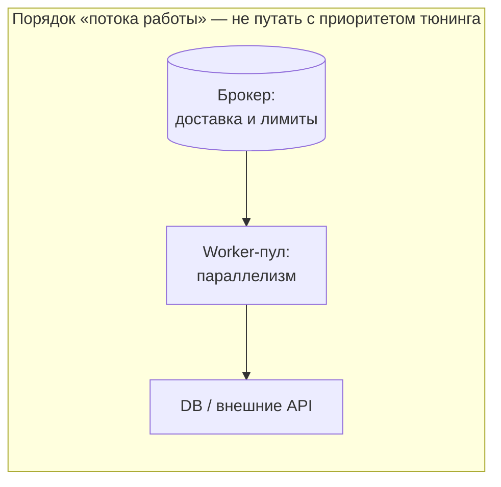
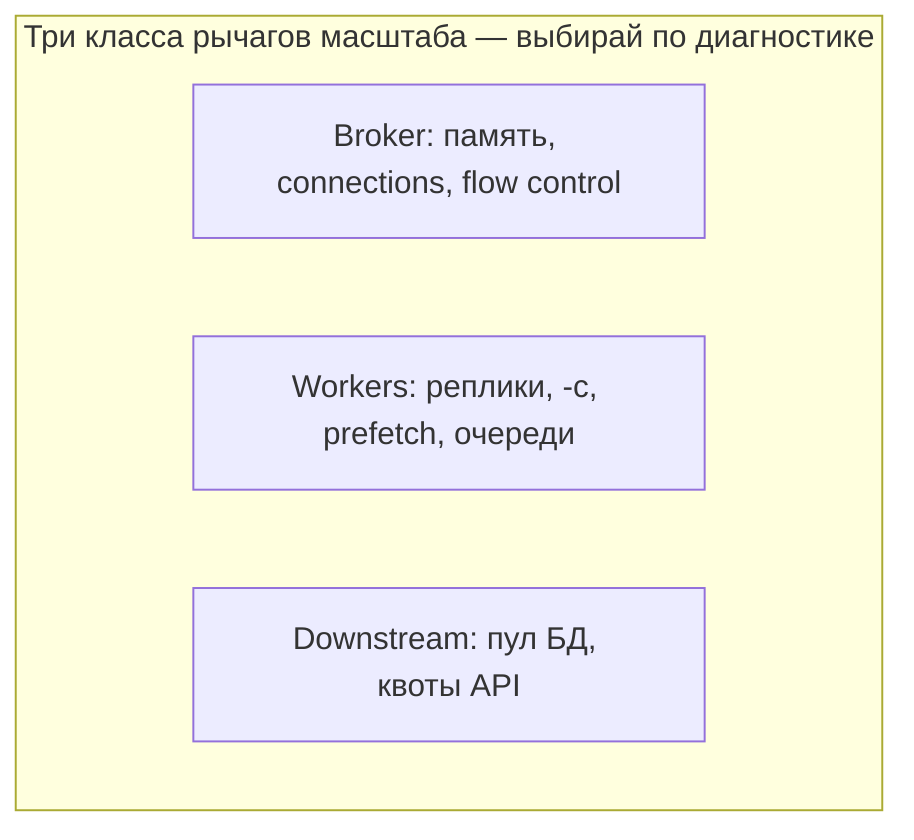

[← Назад к индексу части](index.md)
[↑ К глобальному плану](../celery_mastery_plan.md)

## 16.3 Стратегии масштабирования

### Цель раздела

Понять **какие рычаги масштабирования** существуют в Celery-системе, как **не перепутать** узкое место, и как проектировать **топологию очередей** под рост.

### В этом разделе главное

- **Vertical scaling**: больше CPU/RAM на процесс worker-а — просто, но есть потолок.
- **Horizontal scaling**: больше процессов/подов worker-ов — нужен запас брокера и downstream.
- **Queue partitioning / несколько очередей**: изоляция SLA и предотвращение «одна очередь на всё».
- **Workload specialization**: отдельные worker-ы на тяжёлый batch и на латентность-критичные задачи.
- **Autoscaling** должен опираться на **правильный сигнал** (lag, age, custom), иначе — thrashing.
- **Bottleneck** может быть в брокере (connections, memory, flow control), а не в Python.

### Термины

| Термин | Кратко |
|--------|--------|
| **Scale up** | Увеличить ресурсы **одного** узла. |
| **Scale out** | Добавить **больше** узлов worker-ов. |
| **Partition** | Разнести поток работы по **нескольким** очередям/ключам. |
| **Thrashing** | Частые колебания масштаба без стабилизации. |

### Теория и правила

**Вертикальное масштабирование worker-а** — увеличить CPU/RAM на машине или лимиты контейнера. Подходит, когда узкое место — **один** тяжёлый процесс или мало памяти на дочерний процесс prefork. Ограничение: один хост, NUMA, пределы машины.

**Горизонтальное масштабирование** — больше реплик worker-деплоя. Требует:

- достаточной **пропускной способности брокера** (соединения, память, I/O);
- **идемпотентности** и устойчивости к дубликатам;
- понимания **лимитов downstream** (часто реальный потолок).

**Queue partitioning:** выделить очереди `high_priority`, `batch`, `integrations` и направлять задачи **явно**. Это улучшает fairness: лёгкая задача не ждёт позади гигантского batch.

**Workload specialization:** отдельные deployment-ы слушают разные `-Q` и имеют разный **concurrency**, лимиты памяти, autoscaling policy.

**Autoscaling triggers:** глубина очереди без контекста опасна; лучше **возраст сообщений**, **lag в секундах**, **загрузка CPU** в связке с **ошибками downstream**. Нужны cooldown и гистерезис (см. часть 12).

**Capacity planning по классам:** оценивайте ёмкость отдельно для «лёгких» и «тяжёлых» задач. Среднее по всем задачам смешивает **несовместимые** режимы и вводит в заблуждение при расчёте числа worker-ов.

Ниже — явное соответствие **пунктам плана** (16.3), чтобы ничего не потерять при чтении.

#### Вертикальное масштабирование worker-а (scale up)

Увеличить **CPU/RAM** одного пода/VM или лимиты контейнера. Имеет смысл, когда:

- каждый **процесс prefork** жрёт много RAM (модель, кэш) и вы упираетесь в OOM при scale out;
- узкое место — **один** поток вычислений внутри процесса и вы не готовы дробить задачу.

Потолок: один узел, NUMA, стоимость «большой машины», при prefork память часто ≈ **RSS × число дочерних процессов**.

#### Горизонтальное масштабирование пулов worker-ов (scale out)

Больше реплик `Deployment` / больше процессов на флоте. Имеет смысл, когда execution **масштабируется** (CPU-bound без GIL-проблемы в процессах, или I/O с запасом по квотам). **Обязательно** проверьте брокер и downstream: иначе вы **перенесёте** bottleneck.

#### Queue partitioning (разделение очередей)

Несколько очередей + явный routing (`task_routes`, `queue=` в `apply_async`). Цели: **изоляция SLA**, разные prefetch/concurrency, разные алёрты. Антипаттерн — всё в `celery` по умолчанию.

#### Workload specialization (специализация обработчиков)

Разные команды запуска: `celery worker -Q emails -c 16` и `celery worker -Q video -c 2`. Одна кодовая база, **разные операционные профили** — стандарт для зрелых систем.

#### Autoscaling triggers (триггеры автомасштабирования)

Плохой сигнал: **мгновенная** глубина очереди без возраста сообщений — ложные всплески, **thrashing**. Лучше комбинировать:

- **возраст** самого старого сообщения или lag в секундах;
- **скорость drain** (задач/мин из очереди) vs скорость publish;
- **ошибки downstream** и **retry rate** (не разгоняйте worker-ы в retry storm);
- **CPU/RAM** самих worker-ов и **сатурацию брокера**.

В Kubernetes часто используют **KEDA** (и аналоги) по длине очереди Redis, RabbitMQ queue length, лагу из внешней метрики. Задайте **cooldown**, **min/max replicas**, **гистерезис** (разные пороги scale up и scale down) — подробнее в части 12.

#### Scale-up брокера vs scale-out worker-ов: где bottleneck

| Симптомы | Вероятный фокус |
|----------|-----------------|
| Растёт lag, worker-ы **простаивают**, мало consume | Брокер, сеть до брокера, **не те consumer-ы** слушают очередь |
| Очередь **пустая**, но задачи «не едут» | Producer не публикует, routing, отдельный vhost/очередь |
| Worker CPU высокий, lag падает | Часто **исполнение** — можно scale out worker-ов (если downstream позволяет) |
| После scale out worker-ов выросли **5xx БД/API**, lag не улучшился | Bottleneck **downstream** или **лимиты пула** |
| RabbitMQ **memory alarm**, **flow control**, Redis **OOM** | **Брокер** — усилить ресурс, persistence, sharding, снизить publish |
| Высокий **publish rate**, малый размер задач | Налог транспорта — см. 16.5, батчи, отдельный слой приёма |

#### RabbitMQ vs Redis: разные «точки прокола» для производительности

Полная картина компромиссов — в **части 6**; здесь — **инженерный срез для perf**: при одинаковом коде задач узкое место часто **разное**, потому что у транспортов разная механика хранения и доставки сообщений.

| Фокус | RabbitMQ (AMQP, типично) | Redis (broker, типично) |
|-------|--------------------------|-------------------------|
| Память и давление | **Memory alarm**, очереди + **flow control** к producer-ам | **Один инстанс = общий лимит RAM**, рост ключей, **OOM** |
| Справедливость / prefetch | Модель **prefetch_count** на consumer хорошо документирована | Семантика **другая**; см. стенд и доки kombu/Celery для вашей связки |
| Долгие задачи | Меньше путаницы с «видимостью», но свои лимиты канала | **Visibility timeout** и redelivery — отдельный класс симптомов (§16.6) |
| Диск I/O | **Persistent** очереди → нагрузка на диск при всплесках | Чаще **RAM-first**; AOF/RDB — отдельный учёт |



Смысл: это **разные классы** перегрузок и **разные** алёрты; при смене брокера **не переносить** prefetch и пороги «как было» без повторной **калибровки** на стенде.

#### Capacity planning по классам задач (мини-шаблон)

Для **каждого класса** (например, `email`, `report`, `webhook`):

1. \(\lambda\) — средняя и **пиковая** скорость поступления (задач/сек).
2. \(S\) — service time: p50/p95 **execution** (сек).
3. Нужные **параллельные слоты** (грубо): при ориентире на p95, «одновременно в работе» ≈ \(\lambda \times S_{p95}\) (упрощение; точнее — моделирование и симуляция).
4. Умножить на **запас** (headroom) для деплоя, пиков, ретраев.
5. Отдельно оценить **лимиты** внешних API и пул БД — часто они задают **жёсткий потолок** раньше, чем Celery.

**Почему нельзя «усреднить всё» (картинка):** один график или одно среднее по смеси классов маскирует, что **тяжёлый** класс требует отдельного пула, а **лёгкий** — отдельного SLO.



#### Topology design (тезис плана: без топологии — хаос)

**Топология** здесь — это *кто в какую очередь публикует*, *какие worker-пулы какие очереди слушают*, *где result backend*, *какие лимиты у внешних сервисов*. Без явной схемы масштабирование превращается в «ещё реплик worker-а», что ломает fairness и маскирует bottleneck.



**Встроенный autoscale Celery** (`celery worker --autoscale=max,min`) удобен на **одном** хосте или простом деплое: он реагирует на **нагрузку пула процессов**, но **не заменяет** оркестратор уровня Kubernetes. **KEDA / HPA по метрикам очереди** масштабируют **поды** по сигналам брокера или кастомным метрикам — это другой слой; его нужно согласовать с **лимитами downstream** и **гистерезисом** (часть 12).

| Подход | Плюсы | Ограничения |
|--------|--------|-------------|
| **Celery `--autoscale`** | Просто, без K8s | Обычно в рамках одной машины/процесса; слабее связь с «lag в секундах» |
| **KEDA / метрики очереди** | Масштаб кластера, богатые сигналы | Нужна корректная метрика, защита от thrashing, учёт broker |
| **Ручной размер пула** | Предсказуемо | Медленная реакция на пики |

#### Пример маршрутизации (partition на уровне приложения)

```python
# celery.py — иллюстрация идеи (имена очередей и задач подставь свои)
app.conf.task_routes = {
    "proj.tasks.send_notification*": {"queue": "high_priority"},
    "proj.tasks.build_report*": {"queue": "batch"},
    "proj.tasks.sync_partner*": {"queue": "integrations"},
}
```

Явный `queue=` в `apply_async` для критичных путей тоже допустим; главное — **единая политика**, чтобы задачи не «утекали» в default незаметно.

#### Проверь себя: масштабирование и ёмкость §16.3

1. Когда **вертикальное** масштабирование worker-а предпочтительнее **горизонтального** добавления реплик?

<details><summary>Ответ</summary>

Когда узкое место — **один процесс** с большим RSS (модель в памяти) и выгоднее дать **больше RAM/CPU одному узлу**, чем умножать копии; или когда **стоимость и лимиты** сети/лицензий делают лишние реплики дороже. Потолок — один хост и NUMA; дальше снова горизонталь.

</details>

2. В шаблоне capacity \(\lambda \times S_{p95}\) что ломается, если подставить **среднее** \(S\) вместо p95 для **тяжёлого хвоста**?

<details><summary>Ответ</summary>

Вы **недооцените** нужное число параллельных слотов: редкие долгие задачи займут очередь дольше, чем предсказано «средним», и вырастут **lag** и **p99 e2e**. Для планирования ёмкости хвосты важнее среднего.

</details>

3. **KEDA/autoscale** по мгновенной глубине очереди без **гистерезиса** и cooldown: какой симптом это даёт в эксплуатации?

<details><summary>Ответ</summary>

**Thrashing**: частые поднятия/опускания реплик, нестабильный размер пула, лишняя нагрузка на оркестратор и **дрожание** downstream. Нужны сглаживание, разные пороги scale up/down, иногда **возраст** сообщения вместо мгновенной глубины.

</details>

### Пошагово: локализация bottleneck

1. **Lag растёт?** Если да — система не успевает (или есть poison messages).
2. **CPU worker-ов низкий, lag высокий** — возможно, задачи **ждут** I/O или **заблокированы** внешним ресурсом; больше процессов не поможет без исправления зависимости.
3. **CPU высокий, lag низкий** — возможно, вы **успеваете**, или вход упал; проверьте saturation downstream.
4. **Ошибки/ретраи выросли** после scale out — вы уперлись в **лимит зависимости**, не в Celery.
5. **Брокер CPU/RAM/connections на пределе** — масштабировать worker-ы бесполезно или вредно; **усиливать broker** или уменьшать publish rate.

### Простыми словами

Масштабирование — не «больше коробок с кодом», а **согласованное** увеличение ёмкости **всей цепочки**: очередь, исполнители, база, API.

### Картинка в голове

Представь **мост**: можно добавить полосы (worker-ы), но если **въезд** (broker) или **выезд** (БД) узкие, пробка просто **переедет**.

**Цепочка пропускной способности:** увеличивать имеет смысл **самое узкое** звено; расширение worker-ов не даст эффекта, если bottleneck — брокер или downstream (и наоборот).





### Как запомнить

**«Сначала найди узкое звено цепи, потом заказывай железо».**

### Примеры

**Запуск worker только на нужные очереди:**

```bash
celery -A proj worker -Q high_priority,emails -c 8
celery -A proj worker -Q batch,reports -c 2
```

Тяжёлые отчёты не блокируют отправку писем.

### Практика / реальные сценарии

- **Чёрная пятница:** заранее подняты отдельные worker-пулы для **оплаты** и для **аналитики**, разные autoscaling.
- **RabbitMQ:** следить за **memory alarm** и **flow control** — симптом, что producer-ы должны замедлиться или broker нуждается в ресурсе.

### Типичные ошибки

- Масштабировать worker-ы при **забитом брокере**.
- Держать **всё в `celery` default queue**.
- Autoscale по **мгновенной** глубине без сглаживания.

### Что будет, если…

- **Если масштабировать без partition:** одна тяжёлая задача **голодает** критичные мелкие.
- **Если игнорировать downstream:** scale out превращается в **DDoS своей БД**.

### Проверь себя

1. Почему увеличение **concurrency** не всегда увеличивает **throughput**?

<details><summary>Ответ</summary>

Потому что при росте параллелизма часто растёт **конкуренция за общие ресурсы** (GIL для CPU в потоках, lock в БД, rate limit API), увеличивается **переключение контекста** и накладные расходы, а иногда задачи становятся **в основном ожиданием** — добавление исполнителей не уменьшает wait time сверх лимита зависимости.

</details>

2. Когда **batching** лучше, чем распил на тысячи микрозадач?

<details><summary>Ответ</summary>

Когда накладные расходы **публикации, ack, сериализации и round-trip** сравнимы с полезной работой, или когда внешняя система выгоднее принимает **пакеты** (bulk API, batch insert). Batching снижает число сообщений и амортизирует фиксированные затраты.

</details>

3. Как понять, bottleneck в **worker**, **broker** или **внешнем API**?

<details><summary>Ответ</summary>

Смотреть **корреляцию метрик**: низкая утилизация worker при растущем lag — часто **брокер** или задачи не доходят до исполнения; высокая утилизация и рост времени внутри задачи на HTTP/DB — **downstream** или код; ошибки соединения к брокеру, flow control, рост памяти брокера — **broker**; если увеличение worker не снижает lag, а ошибки API растут — **внешний API/БД**.

</details>

4. Чем **topology design** (отдельные очереди и пулы) помогает **fairness**, чего не даёт один только рост **concurrency** в общем пуле?

<details><summary>Ответ</summary>

Раздельные очереди изолируют **SLA**: тяжёлый batch не блокирует слоты и prefetch **критичного** контура. Рост concurrency в одной куче делит **те же** downstream-лимиты и может **усугубить** голод коротких задач в смешанной очереди. Топология задаёт **границы потоков**, а не только «больше процессов».

</details>

5. Почему при **смене брокера** RabbitMQ → Redis нельзя переносить **один в один** пороги алёртов по «длине очереди»?

<details><summary>Ответ</summary>

У транспортов разная **семантика** хранения, prefetch, visibility, памяти и симптомов перегрузки (flow control vs OOM, дубли при долгих задачах). Одно и то же число в UI **не означает** ту же опасность; нужна **калибровка** на стенде и свои пороги.

</details>

### Запомните

Масштабирование без **диагностики bottleneck** и **разделения workload** быстро превращается в хаос.

---
