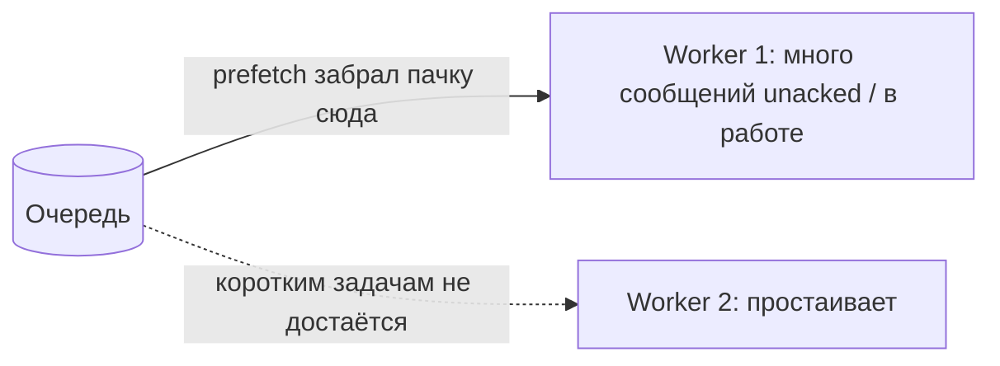
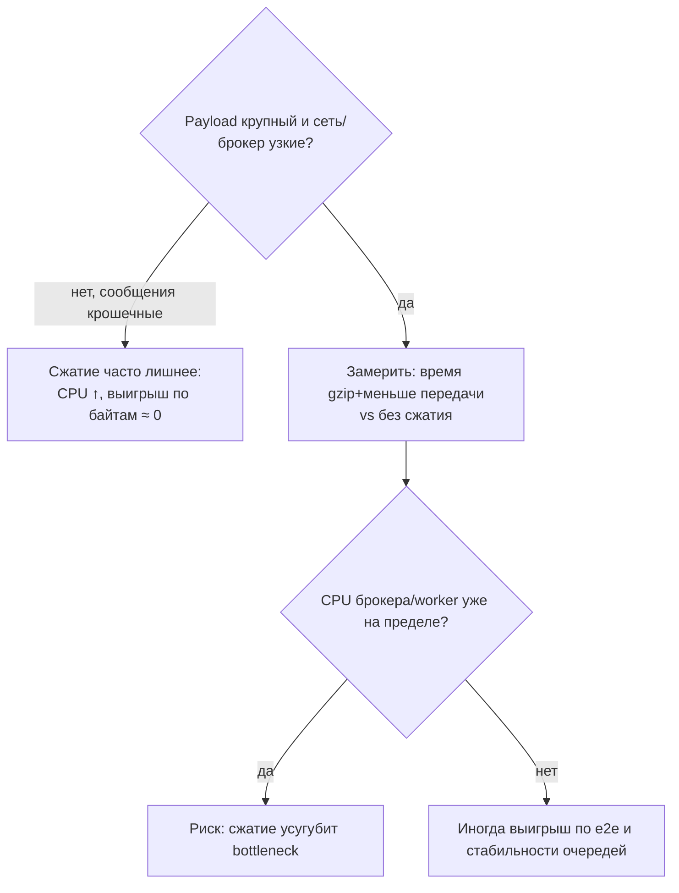
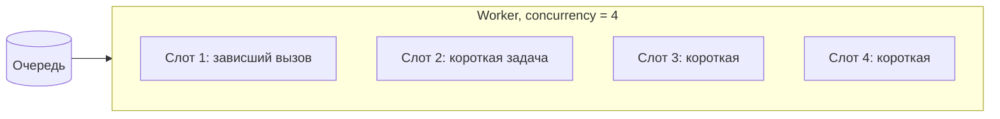
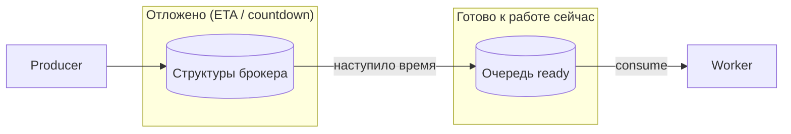

[← Назад к индексу части](index.md)
[↑ К глобальному плану](../celery_mastery_plan.md)

## 16.4 Настройки, влияющие на производительность

### Цель раздела

Связать **конкретные параметры Celery/worker** с эффектом на throughput, latency и стабильность, чтобы настраивать осознанно, а не «как в туториале».

### В этом разделе главное

- **Concurrency** задаёт параллелизм **внутри** одного worker-процесса (модель зависит от пула).
- **Prefetch** влияет на справедливость распределения и риск «забора» долгих задач одним worker-ом.
- **Serializer и compression** — компромисс CPU vs размер сообщения.
- **max_tasks_per_child** / **max_memory_per_child** — профилактика утечек и раздувания процессов.
- **Result backend writes** дороги: хранить результат только когда нужно.
- **Logging verbosity** в проде на горячем пути убивает I/O.
- **Тайм-ауты задач** (`soft`/`hard` time limit) влияют на **эффективный** throughput: «зависшая» работа **удерживает слот** concurrency.
- **Пул соединений к брокеру** на стороне producer и нагрузка **событий** (monit Flower) — частые скрытые налоги.
- **Отложенный запуск** (`countdown`, `eta`) и **`expires`** меняют, сколько «будущей» работы лежит в брокере и как быстро дойдут **готовые** задачи.

### Термины

| Термин | Кратко |
|--------|--------|
| **worker_prefetch_multiplier** | Сколько сообщений «заранее» выдать consumer-у относительно его параллелизма; вместе с `prefetch_count` брокера задаёт **fairness** и риск «забора» очереди одним воркером. |
| **acks_late** | Ack **после** успешного выполнения (`task_acks_late=True`) — иначе при падении процесса сообщение **теряется** для повторной обработки; в связке с prefetch влияет на redelivery. |
| **Compression** | Сжатие тела сообщения: меньше сеть, больше CPU. |

### Теория и правила

**Concurrency (`-c` / `worker_concurrency`):**

- **prefork**: несколько процессов — обход GIL для CPU-bound, выше память на worker.
- **threads**: I/O-bound при освобождении GIL; риск перегруза БД при большом `-c`.
- **gevent/eventlet**: много «лёгких» задач на I/O; требует **monkey patch** совместимых библиотек и дисциплины с блокирующим кодом.
- **solo**: один процесс, **последовательное** исполнение — не про throughput в проде, а про **детерминированную** отладку и воспроизведение; параллелизма между задачами нет.

**Rate limits на задачах (`rate_limit` в декораторе, глобальные лимиты):** Celery может **искусственно** притормаживать исполнение, чтобы не перегрузить зависимость. Это полезно для защиты API, но на **очень высоком** RPS сам механизм учёта лимитов — **не бесплатный** (синхронизация в worker). Полное отключение лимитов (`worker_disable_rate_limits`) ускоряет «сырой» drain, но умножает риск **DDoS своей БД** — меняйте только с метриками downstream.

**Prefetch (`worker_prefetch_multiplier`) — практически:**

Celery выставляет **QoS / prefetch** для consumer-а так, чтобы worker мог заранее получить несколько сообщений (конкретная формула зависит от версии и пула; ориентир — «умножитель × эффективный параллелизм»). Важно не имя параметра, а **поведение**:

- **RabbitMQ (AMQP):** классическая модель `prefetch_count` — сколько **unacked** сообщений может висеть на consumer-е. Большой prefetch при **разной длительности** задач даёт эффект «один толстый worker съел половину очереди».
- **Redis / другие транспорты:** семантика prefetch и fair dispatch может отличаться; при смене брокера **перепроверяйте** поведение на стенде (одна очередь, два worker-а, смесь длинных и коротких задач).

**Fair scheduling (честность очереди):** тезис из плана: **высокий throughput без fair scheduling может убить latency критичных задач**. Если один consumer забирает пачку долгих задач, короткие задачи в той же очереди ждут **освобождения слотов** именно на этом consumer-е, хотя другие машины **простаивают**. Лечение: **отдельные очереди**, **prefetch = 1** (или низкий multiplier) для смешанных профилей, **отдельные пулы** под разные SLA.



Смысл схемы: при высоком prefetch **один** consumer может удерживать **непропорционально много** «хвоста» очереди; остальные машины **не помогают**, пока не освободятся слоты у первого.

**Связка `task_acks_late=True` и prefetch:**

- При **acks рано** (по умолчанию в ряде конфигураций) сообщение считается «доставленным» до конца выполнения — при kill -9 worker-а задача **может потеряться**. Это влияет на **надёжность**, не на «скорость» напрямую.
- При **acks_late** сообщение остаётся **unacked**, пока задача не завершена. Если prefetch большой, при падении процесса **много** сообщений может вернуться в очередь (**redelivery**) — это увеличивает **наблюдаемый** throughput сообщений и нагрузку, хотя **goodput** не растёт.

**`max_tasks_per_child` / `worker_max_tasks_per_child`:** перезапуск дочернего процесса prefork после N задач.

**`max_memory_per_child` / `worker_max_memory_per_child`:** в **Celery 5+** доступен лимит памяти (в KiB в конфиге), по достижении которого дочерний процесс завершается. Проверяйте **документацию вашей версии** и поведение на вашей ОС; не полагайтесь на параметр, не прочитав release notes.

**Serializer / compression:**

- `json` — совместимость и безопасность; может быть медленнее и тяжелее по размеру на некоторых данных.
- `compression='gzip'` и аналоги уменьшают трафик, добавляют CPU — выгодно на **широких** сообщениях и **медленных** сетях.



**Backend writes (`result backend`):** каждая запись статуса/результата — это **сеть + сериализация + хранилище**. Дорого на горячем пути:

- хранение **traceback** и больших `meta` в `update_state`;
- **`ignore_result=False`** (частый дефолт для задачи): Celery **всё равно** может писать состояние/результат в backend, даже если приложение **никогда** не вызывает `.get()` — это отдельный налог на каждую задачу;
- долгий **`result_expires`** при огромном потоке задач — раздувание Redis/БД.

Используйте `ignore_result=True` там, где результат не нужен, короткий TTL, не писать тяжёлые структуры в `meta` без необходимости.

**`task_track_started`:** если включено отслеживание состояния **STARTED**, worker при старте задачи делает **ещё одну** запись в result backend. Для UI «прогресс-бар» это удобно; на **очень высоком** RPS это отдельный множитель нагрузки на Redis/БД. Включайте точечно для задач, где статус «начали» реально нужен клиенту.

**Logging verbosity:** `DEBUG` на каждую задачу в высоком throughput — это **миллионы строк** и дисковый I/O. В проде держите **INFO** с дисциплиной полей; для расследований — **выборочный** DEBUG (отдельные воркеры, feature flag, короткое окно).

**Тайм-ауты (`task_time_limit` / `task_soft_time_limit`, или в `@app.task`):** с позиции **ёмкости пула** зависшая задача эквивалентна очень долгой: она **удерживает** процесс/поток/greenlet, пока не сработает лимит или вмешательство. Пока слот занят, остальные задачи на этом worker-е **ждут**. Разумные лимиты — не только защита от бесконечного цикла, но и **сохранение throughput** соседей. Подробная семантика soft/hard — в части 9.



**Пул соединений к брокеру (`broker_pool_limit` и стек kombu):** при **лавине** `apply_async` producer может исчерпать пул и **блокироваться** на получении соединения — снаружи это похоже на «API стал медленным», хотя worker-ы недогружены. Меры: **батчи**, **ограничение входа**, осторожное увеличение пула, вынос **массовой** постановки в отдельный контур.

**События задач (`worker_send_task_events`, мониторинг через Flower и т.п.):** поток событий по каждой задаче полезен для отладки, но на большом RPS добавляет **трафик и CPU**. Включайте осознанно; часто в проде достаточно **метрик/логов** по политике выборки (часть 14).

**Отложенный запуск (`apply_async(..., countdown=..., eta=...)`) и срок жизни сообщения (`expires`):**

- Сообщение с **будущим временем исполнения** всё равно **существует** в инфраструктуре брокера (как именно — зависит от транспорта): растёт **объём** отложенной работы в памяти/структурах данных и усложняется **планирование** доставки «уже готовых» задач.
- Лавина **миллионов** отложенных задач на одну и ту же секунду (например, «разбудить всех пользователей в 09:00») даёт **синхронный пик** publish/consume — похоже на burst (§16.7): нужны **размазанные** ETA, **отдельная** очередь, **лимит** на постановку с API.
- **`expires`**: если сообщение **не успели** забрать до истечения срока, оно может быть **отброшено** — это снижает хвост **устаревшей** работы (хорошо для perf и стоимости), но меняет **семантику** «каждая постановка когда‑нибудь выполнится». Осознанный выбор между **надёжностью** и **отсутствием мусора** в очереди.



#### Проверь себя: нюансы настроек §16.4

1. Почему **`task_track_started`** глобально на огромном RPS может быть дороже, чем редкие **`update_state`** внутри длинных задач?

<details><summary>Ответ</summary>

`task_track_started` добавляет **запись при старте каждой** задачи — это умножается на **весь** поток. `update_state` бьёт по backend **пропорционально частоте вызова**; если он только у длинных задач и реже, суммарная нагрузка может быть меньше. Решение — включать **точечно** то, что реально нужно UI/операциям.

</details>

2. Сравни эффект **`expires`** и **`time limit`** на «хвост» работы в системе: что отсекает **устаревшие задания в брокере**, а что **зависший слот** worker-а?

<details><summary>Ответ</summary>

**`expires`** (и срок жизни сообщения) влияет на то, **доставится ли** задача consumer-у: устаревшее может быть **отброшено** брокером — меньше мусора в очереди, но другая семантика надёжности. **Time limit** прерывает **уже исполняющуюся** задачу и **освобождает слот** concurrency — иначе зависание держит пул. Это разные уровни: транспорт vs исполнение.

</details>

3. **Gevent/eventlet** в таблице concurrency: почему «просто увеличить `-c`» опасно без проверки **блокирующих** вызовов в коде?

<details><summary>Ответ</summary>

Один **блокирующий** вызов без cooperative I/O может **остановить весь** greenlet-пул: остальные задачи не получают управление. Нужны совместимые библиотеки, monkey patch там, где уместно, или **отказ** от gevent для этого кода. Иначе рост `-c` не даёт ожидаемого параллелизма.

</details>

### Пошагово: практичный порядок тюнинга

1. Раздели workload по очередям (см. 16.3) **раньше**, чем крути prefetch.
2. Выставь concurrency **от профиля**: CPU-bound → процессы и умеренный `-c`; I/O-bound → threads/gevent с лимитами downstream.
3. Настрой prefetch **после** наблюдения fairness (если одни worker забиты, другие пусты — снижай multiplier).
4. Включи compression **только если** payload большой и сеть/брокер узкие (проверь CPU).
5. Введи **max_tasks_per_child** для prefork при подозрении на утечки или после долгой работы с C-расширениями.
6. Убери лишние **result** и **update_state**.
7. Задай **time limits** там, где возможны зависания на I/O; проверь **broker pool** и burst **публикации** с producer-а; оцени стоимость **task events** при экстремальном RPS.
8. Если пользуешься **массовым ETA/countdown**: проверь **пик** в момент «срабатывания», память брокера и необходимость **`expires`** для устаревших заданий.

### Простыми словами

Настройки worker-а — это **как организовать смену**: сколько людей одновременно (concurrency), сколько заказов брать в работу заранее (prefetch), не таскать ли лишний груз (payload/compression), и **когда менять смену** целиком (restart child).

### Картинка в голове

Prefetch — это **корзина заказов** у курьера. Если корзина огромная, один курьер тащит 50 заказов, а остальные стоят без дела — **хвост latency** растёт.

### Как запомнить

**«Concurrency — параллелизм, prefetch — справедливость, backend — скрытая БД; зависание — украденный слот».**

### Примеры

```python
# celery.py / конфиг
app.conf.update(
    task_ignore_result=True,  # по умолчанию для большинства fire-and-forget
    result_expires=3600,      # не копить мусор в backend
    worker_prefetch_multiplier=1,  # чаще для длинных задач
    task_compression="gzip",     # только если замерили выигрыш
)
```

```python
@app.task(ignore_result=True)
def notify_user(user_id: str) -> None:
    ...
```

**Надёжность и prefetch (связка настроек):**

```python
app.conf.update(
    task_acks_late=True,
    task_reject_on_worker_lost=True,  # политика при потере воркера — см. доки и риски
    worker_prefetch_multiplier=1,    # часто разумно вместе с acks_late на длинных задачах
)
```

Подбирайте `reject_on_worker_lost` осознанно: это влияет на то, **куда** деваются задачи при аварии, и на **повторную** нагрузку.

### Практика / реальные сценарии

- **Длинные видео-транскоды:** concurrency небольшой, prefetch 1, отдельная очередь.
- **Массовые webhooks:** threads/gevent + жёсткий лимит HTTP-сессий + идемпотентность.

### Типичные ошибки

- Копировать `worker_prefetch_multiplier=4` «как у всех» для **очень длинных** задач.
- Хранить **большие результаты** в Redis без TTL.
- Оставлять **pickle** ради «скорости» без модели доверия.
- Ставить **миллионы** задач с **одинаковым** `eta` без размазывания пика и без отдельной очереди — получить **thundering herd** на consume и downstream.

### Что будет, если…

- **Если слишком высокий prefetch + долгие задачи:** часть worker-ов **голодает**, очередь визуально есть, но обработка **неравномерная**.
- **Если включить gzip на крошечных сообщениях:** CPU вырастет, сеть почти не выиграет.
- **Если нет time limits на зависающих I/O-задачах:** слоты concurrency **заморожены**, effective throughput падает, растёт хвост latency без роста CPU.
- **Если producer исчерпал broker pool:** публикация **блокируется**, клиенты ждут, хотя очередь ещё не «полная».
- **Если хвост отложенных задач огромен:** брокер тратит ресурсы на **будущее**, а метрика «глубина ready-очереди» может **не отражать** полный объём работы в системе.

### Проверь себя

1. Почему **ignore_result** может ускорить систему даже если ты «никогда не вызываешь `.get()`»?

<details><summary>Ответ</summary>

Потому что Celery всё равно может **писать состояние/результат** в backend при настройках по умолчанию для многих путей, и инфраструктура несёт стоимость **записи, сериализации и хранения**. Явное отключение результата убирает этот налог для fire-and-forget задач.

</details>

2. Когда **увеличение concurrency в prefork** ухудшит ситуацию по памяти?

<details><summary>Ответ</summary>

Когда каждый дочерний процесс держит **большой рабочий набор** (модели, кэши, большие буферы). Память растёт **почти линейно** с числом процессов, возможны OOM и thrashing, а throughput не растёт.

</details>

3. Зачем вообще существует **prefetch**, если «честнее» всегда брать по одному сообщению?

<details><summary>Ответ</summary>

Чтобы уменьшить **накладные расходы** на опрос брокера и улучшить **плотность** доставки при очень мелких быстрых задачах. Это компромисс: выше эффективность транспорта vs риск неравномерности и хуже latency для смешанных очередей.

</details>

4. Как **отсутствие time limit** на задаче, которая может зависнуть на внешнем API, бьёт по **throughput** всего worker-а?

<details><summary>Ответ</summary>

Задача удерживает **слот** параллелизма (процесс/поток/greenlet), пока не завершится или не будет прервана. Пока слот занят, остальные сообщения, назначенные этому worker-у, **ждут**, даже если другие слоты простаивают редко или нагрузка «лёгкая». Эффективная пропускная способность падает без видимого роста CPU.

</details>

5. Чем **огромный пласт отложенных задач** (`eta`/`countdown`) может ухудшить производительность **даже до** того, как они начнут выполняться?

<details><summary>Ответ</summary>

Они уже занимают **память и внутренние структуры** брокера, увеличивают сложность диспетчеризации и могут дать **синхронный пик** в момент наступления времени — нагрузка на брокер, worker-ы и downstream скачет **разом**. Метрики «текущей» очереди не всегда показывают этот **скрытый** объём будущей работы.

</details>

### Запомните

Каждая «маленькая» настройка — это компромисс между **скоростью, справедливостью, памятью и надёжностью**.

---
