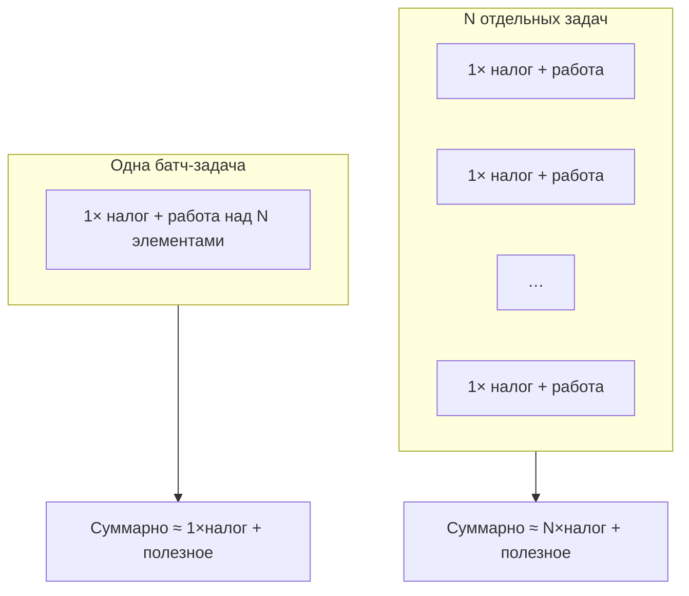
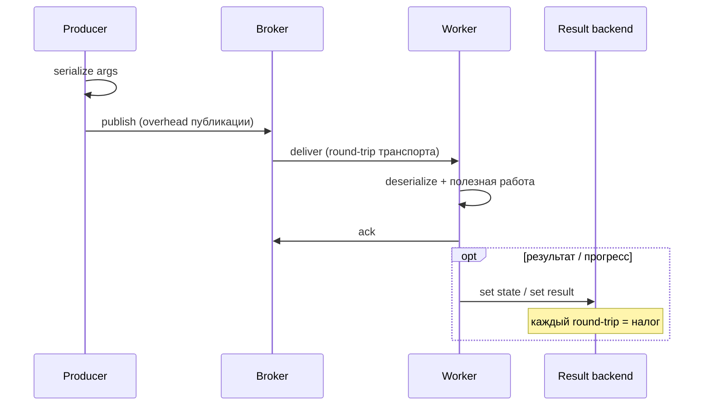
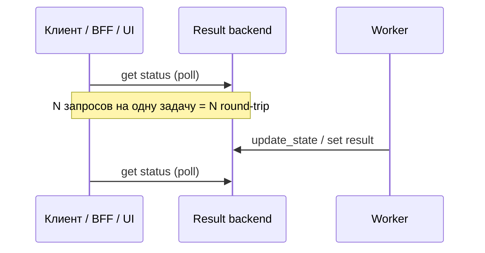

[← Назад к индексу части](index.md)
[↑ К глобальному плану](../celery_mastery_plan.md)

## 16.5 Стоимость слишком мелких задач

### Цель раздела

Понять **налог на микрозадачи**: публикация, доставка, ack, сериализация — и научиться выбирать **гранулярность** работы.

### В этом разделе главное

- У сообщения есть **фиксированная** стоимость «наладки».
- Тысячи задач на **одну** бизнес-операцию часто проигрывают одной **батч-задаче**.
- Round-trip к broker и backend не бесплатен.
- Batching меняет семантику отказов — нужна идемпотентность и границы транзакций.

### Термины

| Термин | Кратко |
|--------|--------|
| **Overhead** | Накладные расходы сверх полезной работы. |
| **Task granularity** | Насколько «крупной» единицей вы делите работу. |
| **Amortization** | Распределение фиксированной стоимости на много элементов. |

### Теория и правила

Каждая Celery-задача оплачивает примерно:

- сериализацию аргументов на producer-е;
- publish в брокер;
- доставку, возможно persistent storage в брокере;
- десериализацию на worker-е;
- ack;
- (опционально) запись состояния/результата.

**План отдельно выделяет:** (1) **overhead публикации** — подготовка тела сообщения, вызов клиента брокера, возможные блокировки при **flow control**; (2) **round-trip к broker/backend** — не только «доставить задачу», но и при необходимости **запросить статус/результат**, частые `AsyncResult` polling с API, лавина `update_state`. Эти вещи **не видны** в профиле «чистой» функции, но съедают **CPU, соединения и I/O** всей системы.

Если полезная работа — **одна микросекунда**, а налог — **миллисекунды**, система тратит жизнь на «перекладывание сообщений».

**Амортизация фиксированного налога (план: batching как альтернатива мелкой гранулярности):** одно и то же количество «полезных операций» можно оплатить **N раз** полным циклом сообщения или **один раз** циклом + пакетом работы внутри. Пока налог сопоставим с работой **на элемент**, дробление ухудшает отношение «полезное / накладное».





**Опрос статуса с API/UI (план: round-trip к backend):** отдельно от исполнения задачи стоит **синхронный** или частый опрос `AsyncResult.state` / HTTP «как там задача?». Каждый запрос — **чтение** из result backend и сеть; при тысячах клиентов это превращается в **второй hotspot** рядом с брокером.



Практика: **webhook/callback**, **SSE/WebSocket**, **редкий** poll с backoff, **короткий TTL** кэша статуса на BFF — вместо tight loop «каждые 100 ms».

**Batching** объединяет элементы: одна задача обрабатывает список id чанками. Выигрыш — меньше сообщений, меньше TCP/AMQP кадров, проще rate limit.

Цена batching:

- **Частичный провал**: один элемент ломает обработку (нужна изоляция ошибок внутри батча).
- **Долгая** задача вместо многих коротких — влияет на **fairness** в общей очереди (решение — отдельная очередь batch).
- **Лимит размера сообщения:** один «супер-батч» может **не влезть** в лимит брокера или разумный TTL обработки; тогда используют **несколько батч-задач** (`group` чанков) или цепочку «задача → следующий чанк через callback/signature» — баланс между налогом сообщений и размером payload.

#### Проверь себя: гранулярность и транспорт §16.5

1. Почему **опрос статуса** из BFF может создать нагрузку на **тот же** Redis, что и `update_state`, но **независимо** от числа worker-ов?

<details><summary>Ответ</summary>

Потому что и poll, и запись статуса — **обращения к result backend**: клиенты могут генерировать **чтения** с большей частотой, чем worker — записи, особенно при tight loop. Узкое место смещается в **backend**, хотя брокер и исполнение выглядят здоровыми.

</details>

2. **Batching** улучшил throughput, но **p95 latency одного** элемента вырос. Какие **два** практических рычага без отказа от батчей?

<details><summary>Ответ</summary>

Уменьшить **размер батча** или **время ожидания набора** (если батч собирается из входящего потока); выделить **отдельную быструю очередь** для критичных элементов с мелкой гранулярностью. Компромисс явно продаётся продукту: средний drain vs хвост единичных запросов.

</details>

3. Как **flow control** брокера проявляется на стороне **producer** при лавине микрозадач?

<details><summary>Ответ</summary>

Producer может **блокироваться** или получать back-pressure при публикации: `apply_async` тормозит, растёт latency HTTP, растёт очередь запросов **до** брокера. Это часть **overhead публикации** и связано с ёмкостью брокера, а не только с worker-ами.

</details>

### Пошагово: решить, дробить или батчить

1. Оцени **среднюю полезную длительность** задачи.
2. Оцени **налог** (профилирование + метрики брокера: messages/s vs tasks/s).
3. Если налог **сопоставим** с работой — батчить или укрупнять единицу работы.
4. Спроектируй **идемпотентность** на уровне элемента батча.
5. Задай **лимиты** размера батча (память, таймаут, размер сообщения).

### Простыми словами

Вместо «поставить 10 000 записей в очередь по одной» иногда разумно «поставить **20** задач по 500 записей» — меньше очередной волокиты, больше толку.

### Картинка в голове

Каждая микрозадача — как **отдельный поход в магазин за одним яйцом**. Один заход за **корзиной** дешевле, но если яйцо разобьётся в дороге, нужно правило, **что делать с остальной корзиной**.

### Как запомнить

**«Много сообщений ≠ много полезной работы».**

### Примеры

```python
# Вместо: for id in ids: process_one.delay(id)

@app.task
def process_batch(ids: list[str], chunk_size: int = 500) -> None:
    for i in range(0, len(ids), chunk_size):
        chunk = ids[i : i + chunk_size]
        for x in chunk:
            try:
                process_one(x)
            except Exception:
                # политика: лог, DLQ элемент, счётчик — но не валим весь батч без причины
                ...
```

Если один батч **раздувает** тело сообщения выше лимита брокера или времени обработки, публикуй **несколько** батч-задач меньшего размера (например, `group(process_batch.s(chunk) for chunk in chunks(ids))`) — компромисс между налогом «много сообщений» и риском «одно гигантское».

### Практика / реальные сценарии

- **Индексация поиска:** батчи документов вместо «один документ — одна задача» при миллионах документов.
- **Отправка push:** батч по пользователям с общим шаблоном.

### Типичные ошибки

- Создавать задачу **внутри цикла** на миллион элементов без ограничений producer-а.
- Запускать такой цикл **одновременно** с десятков реплик API без **лимита постановки** — упираться в **broker pool** и CPU publish **до** «загрузки» worker-ов.
- Делать огромной **саму задачу** (сообщение не влезает в лимиты брокера).
- Крутить **tight poll** статуса задачи из UI/API (каждые сотни мс) — грузить result backend сильнее, чем сама работа.

### Что будет, если…

- **Если микрозадачи лавиной:** брокер и dispatch станут bottleneck, **latency всего** вырастет.
- **Если один батч раздул сообщение выше лимита брокера:** **отказ публикации**, потеря или отложенная обработка на стороне producer-а, «тихие» ошибки в логах — нужен **контроль размера** и разбиение на несколько сообщений.
- **Если много реплик API одновременно** публикуют микрозадачи в цикле: узким местом станет **раньше брокера** — CPU/пул соединений producer-а, **таймауты** `apply_async`, хотя worker-ы ещё «не загружены».

### Проверь себя

1. Почему снижение числа сообщений может **увеличить** время восстановления после ошибки в одном элементе?

<details><summary>Ответ</summary>

Потому что ошибка может **повторно запустить весь батч** или потребовать более сложной **частичной** компенсации. Нужны явные стратегии: чекпоинты внутри батча, идемпотентность по элементу, мёртвая буква/DLQ на уровне элемента.

</details>

2. Как понять, что вы в зоне «слишком мелких задач» по метрикам?

<details><summary>Ответ</summary>

Высокий **messages published per second** при низком **полезном эффекте** (например, мало бизнес-событий завершено), высокая доля CPU на сериализацию/логирование, низкий **полезный** throughput при «занятых» worker-ах, рост нагрузки на брокер **сильнее**, чем на исполнение.

</details>

3. Назови **компромисс** batching для latency одиночного элемента.

<details><summary>Ответ</summary>

Элемент ждёт **формирования батча** или обработки чанка целиком — первая единица может получить **хуже** latency при том же среднем throughput; для критичных единиц нужны отдельные быстрые пути или меньшие батчи.

</details>

4. Почему **частый polling** статуса задачи из HTTP-API может ухудшить производительность **даже при пустой очереди** в брокере?

<details><summary>Ответ</summary>

Потому что нагрузка переносится на **result backend** и сеть: каждый опрос — отдельное чтение/round-trip. Брокер может быть здоров, а Redis или БД под статусами — **узким местом**; плюс растёт latency самого API, обслуживающего клиентов.

</details>

### Запомните

Оптимальная гранулярность — это баланс **налога транспорта** и **семантики отказов**.

---
