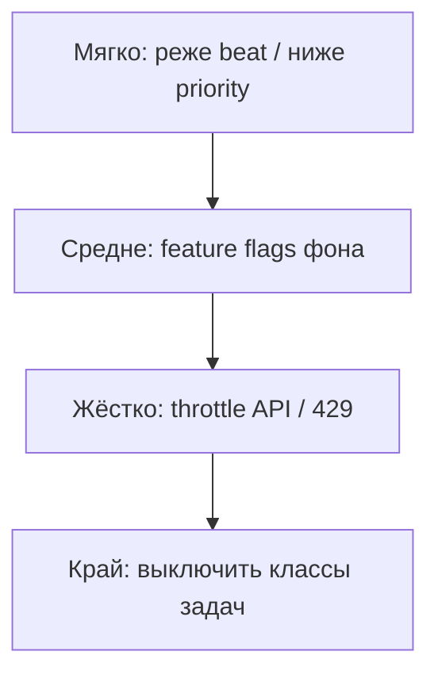
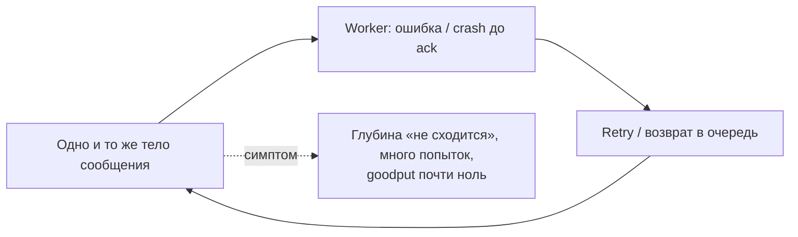
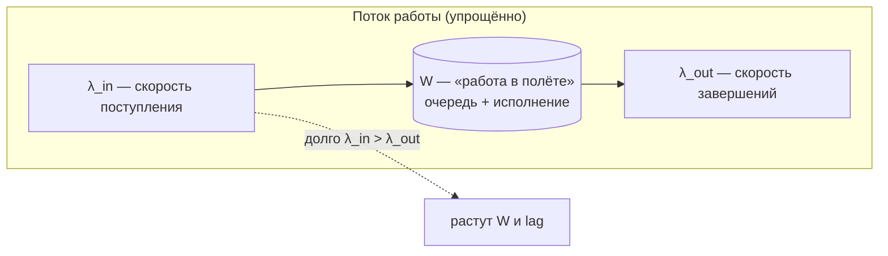
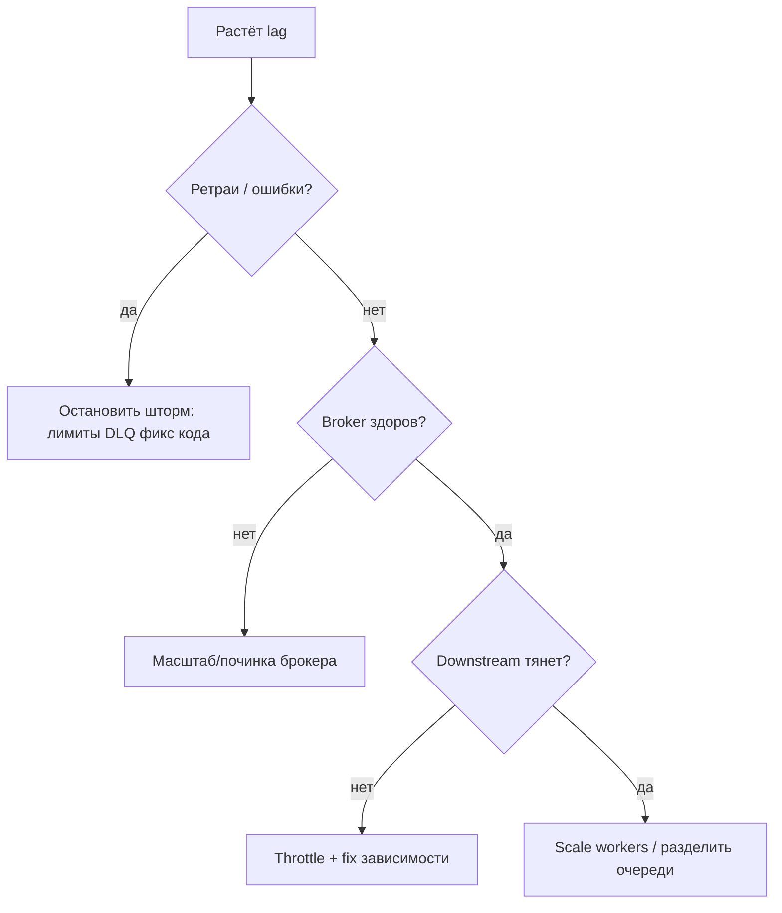

[← Назад к индексу части](index.md)
[↑ К глобальному плану](../celery_mastery_plan.md)

## 16.6 Борьба с backlog

### Цель раздела

Дать **операционный каркас**: что делать, когда очередь **отстаёт**, lag растёт, и «просто добавить воркеров» не всегда ответ.

### В этом разделе главное

- Backlog — симптом: нужна **диагностика** входа, ёмкости и качества сообщений.
- Добавление worker-ов работает, если bottleneck — **исполнение**, а не зависимость.
- Упрощение и ускорение задач иногда эффективнее железа.
- Переразделение очередей защищает **критичное** от **фона**.
- Временное снижение входа (throttle, 429 клиентам) — валидная **деградация**.
- Второстепенные задачи можно **отложить** или **отключить**.

### Термины

| Термин | Кратко |
|--------|--------|
| **Throttle** | Искусственное ограничение скорости поступления/обработки. |
| **Load shedding** | Сброс/отказ от части работы ради спасения системы. |
| **Poison message** | Сообщение, которое вечно падает и занимает ресурсы. |

### Теория и правила

**Явное соответствие пунктам плана 16.6** (чтобы при чтении не «терять строку чеклиста»):

| Пункт плана | Рычаг в операциях |
|-------------|-------------------|
| Добавление worker-ов | Scale пулов при bottleneck в **исполнении**, не при retry storm и не при упёртой БД/API |
| Упрощение / ускорение задач | Убрать шаг, кэш, precompute, меньше данных на задачу |
| Переразделение очередей | Вынести batch из real-time, отдельные `-Q` и деплои |
| Временное снижение входа | Throttle API, очередь на приёме, пауза cron/beat, 429/«принято позже» |
| Деградация второстепенного | Лестница ниже: реже фон → флаги → жёсткий throttle → отключение классов |

**Добавление worker-ов** — первый инстинкт. Он правильный, если:

- CPU worker-ов был запас, lag из-за **нехватки исполнителей**;
- downstream выдержит рост параллелизма.

**Упрощение задач:** отключить тяжёлый необязательный шаг, перенести **precompute**, уменьшить размер обрабатываемых данных, включить кэш.

**Переразделение очередей:** вынести **batch** из пути **real-time**, поднять отдельный пул.

**Снижение входа:** feature flag, очередь на стороне клиента, ответ «принято позже» в API, пауза cron.

**Деградация второстепенного:** отключить рекомендации, оставить оплату; уменьшить частоту beat.

**Лестница деградации (практический порядок мыслей):** на инциденте полезно идти от **мягких** рычагов к **жёстким**, фиксируя решение в runbook. Порядок не универсален, но типично:

1. **Реже** второстепённый beat / снизить `priority` таких сообщений (ещё что‑то «едет», но не давит критичное).
2. **Feature flag:** отключить тяжёлый фон (превью, отчёты, рассылки «можно завтра»), оставить оплату/безопасность/SLA.
3. **Throttle входа** в API или очередь ожидания на приёме заявок (клиент видит «попробуйте позже», система не захлёбывается).
4. **Полное** отключение целых классов задач по согласованию — только когда мягкие меры не держат downstream.

**Poison messages** создают ложный backlog: одно и то же сообщение крутится. Нужны DLQ, лимиты ретраев, алёрты на **рост unacked** без прогресса.

**Ложный «шторм» и Redis (visibility timeout):** у транспорта на Redis сообщение может снова стать видимым, если задача **дольше**, чем настроенный **visibility timeout** (или аналог в `broker_transport_options`), до того как worker корректно подтвердил обработку. Симптомы похожи на рост нагрузки: **дубликаты** работы, странные ретраи, «очередь не сходится». Это не замена диагностике poison, но отдельная ветка чек-листа при долгих задачах (см. также части про брокер и надёжность).

**Приоритеты и «мягкая» деградация:** если брокер и клиент поддерживают **приоритеты сообщений** (`priority` в `apply_async`, x-max-priority в RabbitMQ и т.д.), можно **не отключать** второстепенное полностью, а опустить его в хвост. Это компромисс: при постоянной перегрузке низкий приоритет всё равно **голодает** — приоритеты не заменяют **отдельные очереди** и **отдельные пулы**, но дают рычаг на коротких пиках.

**Ограничение producer-а:** иногда backlog лечится **токен-бакетом** или очередью на стороне API («мы принимаем заявки до N/сек»), чтобы не переполнить Celery **раньше**, чем сработает autoscaling.

#### Проверь себя: операции при backlog §16.6

1. Почему **throttle входа** иногда эффективнее **немедленного** scale out worker-ов?

Ответ

Потому что при упёртом **downstream** или **poison** новые worker-ы только **ускоряют** разрушение зависимости или бессмысленные ретраи. Throttle даёт **временно** снизить \(\lambda_{in}\), стабилизировать систему и **диагностировать** первопричину, пока autoscaling не разогнал шторм.

2. Сравни **приоритет сообщений** и **отдельную очередь** для критичного SLA: когда приоритетов недостаточно?

Ответ

При **хронической** перегрузке низкий приоритет **голодает** бесконечно; отдельная очередь и пул дают **гарантированный** drain и разные prefetch/concurrency. Приоритеты — рычаг на **коротких пиках**, не замена изоляции workload.

3. **Visibility timeout** (Redis): почему симптом похож на **poison**, но механизм другой?

Ответ

Poison — сообщение **логически** больное и падает при обработке. Visibility — сообщение **нормальное**, но задача **дольше** таймаута видимости: оно снова становится доступным другому consumer-у → **дубли** и лишняя работа без смены кода payload. Лечение — таймауты, отдельные очереди для долгих задач, настройка транспорта.

### Пошагово: чек-лист при росте lag

1. Убедись, что **beat/producer** не создал **дубликатный шторм** (ошибка конфигурации).
2. Проверь **ошибки** задач и ретраи — не «работа», а **бесконечные повторы**?
3. Оцени **возраст** самого старого сообщения и **скорость drain** (задач/мин выход).
4. Проверь **брокер** (memory alarm, disk, connections).
5. Проверь **downstream** (latency БД, 5xx API).
6. Решение: **scale** исполнения / **снизить вход** / **изолировать классы** / **чинить poison**.

### Простыми словами

Backlog — это когда **кухня не справляется с заказами**. Можно нанять поваров, но если **поставщик рыбы** не возит, новые повара просто **стоят у пустой плиты**. Иногда нужно **временно перестать принимать** часть заказов.

### Картинка в голове

Два крана наполняют ванну: **вход** (publish) и **выход** (consume). Если вход > выход долго — ванна **перельётся**. Либо увеличиваем выход, либо уменьшаем вход, либо чиним **засор** (poison).

В стационаре при **постоянном** избытке входа растёт не только глубина очереди, но и **время ожидания** в хвосте — это связано с интуицией Little’s Law из §16.1.

### Как запомнить

**«Backlog лечат входом, выходом или качеством сообщений».**

### Примеры

- Включить **временный** флаг «отложить генерацию превью», оставив «загрузку файла».
- Поднять **отдельный** autoscaled deployment только на `heavy` очередь.

### Практика / реальные сценарии

- **Инцидент API партнёра:** частично отключить задачи интеграции, оставить критичный импорт заказов с backoff.

### Типичные ошибки

- Масштабировать worker-ы при **retry storm**.
- Не замечать **одну** задачу, которая занимает все слоты concurrency.
- Сразу «**рубить всё**» второстепенное без **лестницы** (сначала реже beat / priority / флаги) — лишняя боль для продукта и команды, когда достаточно было мягкого шага.

### Что будет, если…

- **Если только scale out при забитой БД:** БД падает, backlog становится **хуже**.

### Проверь себя

1. Как отличить «настоящий» backlog от **poison message**?

Ответ

Poison обычно виден по **повторяющимся ошибкам** одного типа, росту **unacked**/redelivery без снижения depth, конкретному паттерну в логах. Настоящий backlog при **здоровых** задачах — растущая очередь при низкой доле ошибок и нехватке throughput.

2. Назови **три** рычага кроме «добавить worker-ов».

Ответ

Снизить **входящий поток** (throttle), **оптимизировать** задачи или инфраструктуру, **переразделить** workload по очередям и пулам, усилить **брокер**/backend, временно **отключить** второстепенные задачи.

3. Почему «временная деградация продукта» может быть **правильным** инженерным решением?

Ответ

Потому что она **защищает** критичный контур (оплата, безопасность, SLA) от тотального отказа и даёт время на исправление, вместо бесконтрольного роста backlog и каскадного падения зависимостей.

4. Как **слишком короткий visibility timeout** (Redis) может выглядеть как «система не справляется», хотя worker-ы заняты?

Ответ

Сообщение снова становится доступным для другого consumer-а, пока первая копия ещё выполняется — растёт **дублирующая** работа, нагрузка на downstream и шум в метриках. Визуально это смешивается с backlog и ретраями, хотя первопричина — **контракт времени видимости** vs длительность задачи.

5. Зачем на инциденте идти по **лестнице** деградации (мягкие шаги → жёсткие), а не сразу выключать всё второстепенное?

Ответ

Чтобы **минимизировать** ущерб продукту и пользователям, упростить **откат** и дать метрикам показать, **какой** рычаг реально снял давление. Часто хватает **реже beat** или флага фона; мгновенное «вырубить пол-продукта» усложняет коммуникацию и маскирует, что именно спасло систему.

### Запомните

Управление backlog — это **управление потоком и приоритетами**, не только покупка CPU.

---
