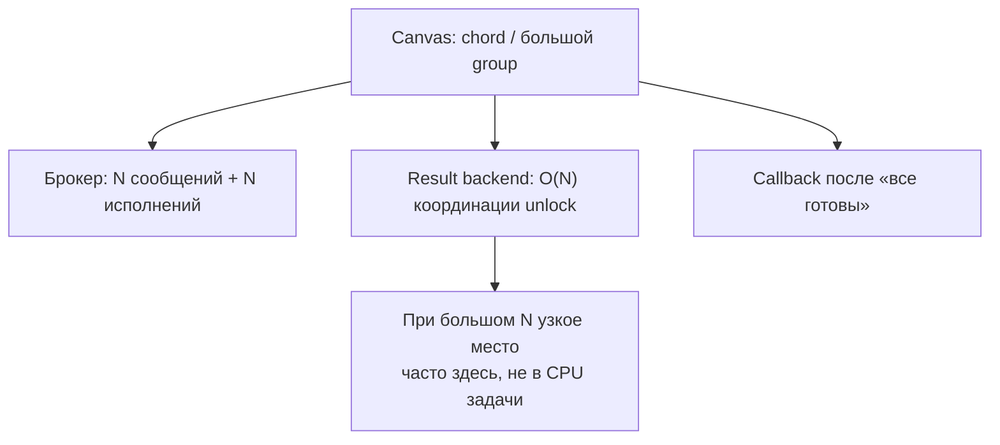
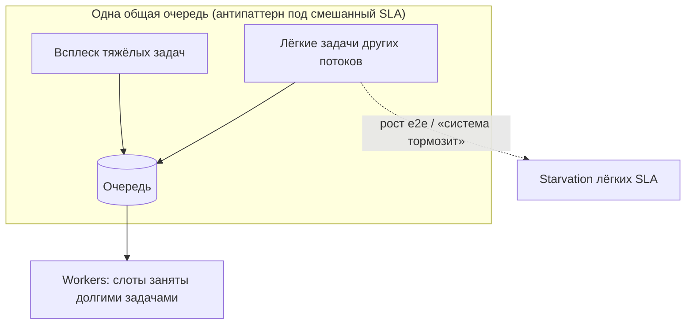
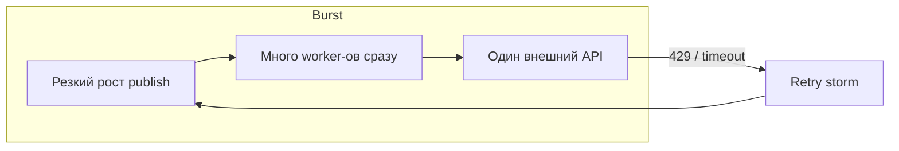
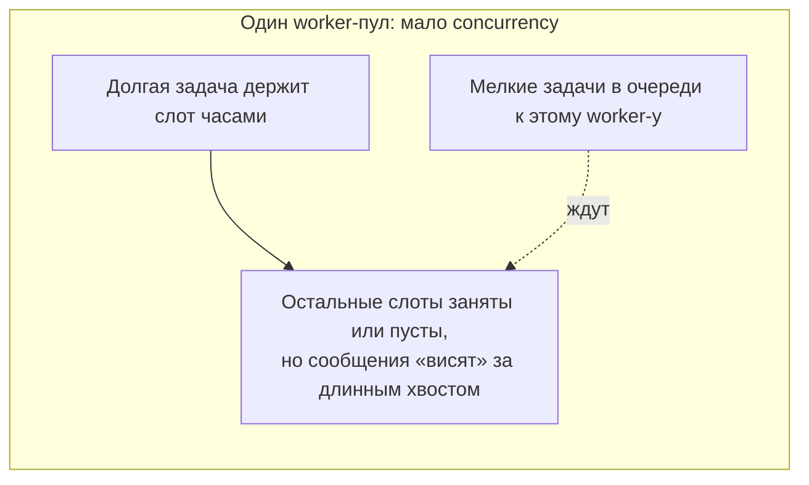
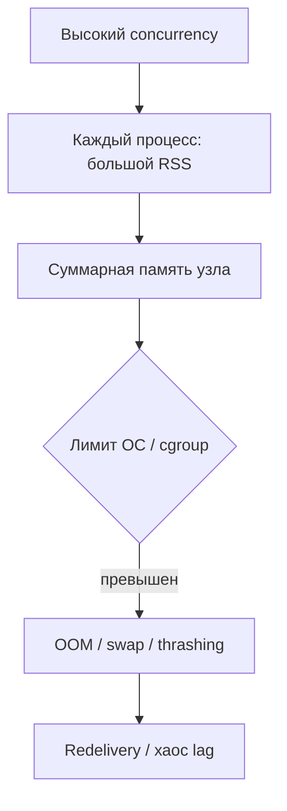

[← Назад к индексу части](index.md)
[↑ К глобальному плану](../../mastery_plan.md)

## 16.7 Performance edge cases

### Цель раздела

Разобрать **типичные «острые углы»**, где система ведёт себя неинтуитивно под нагрузкой или на пиках.

### В этом разделе главное

- **Большие chords** создают fan-out на backend и координацию unlock.
- **Hot queue** смешивает несовместимые SLA.
- **Burst** провоцирует **thundering herd** к зависимостям.
- **Долгоживущие задачи** ухудшают планирование и утилизацию.
- **Heavy memory + high concurrency** = риск OOM и swap.

### Термины

| Термин | Кратко |
|--------|--------|
| **Thundering herd** | Много клиентов одновременно «просыпаются» и бьют в один ресурс. |
| **Fan-out** | Одно событие порождает много параллельных подзадач. |

### Теория и правила

**Большие chords (`group` + callback):** много подзадач → нагрузка на брокер; координация завершения → нагрузка на **result backend** (см. часть 10, 13). На экстремальных размерах разумнее другие паттерны (стриминговая агрегация, внешний orchestrator).

**Оценка масштаба (числа):** chord из **N** подзадач порождает **N** сообщений в брокере, **N** исполнений и **O(N)** обращений к result backend для механизма unlock (детали зависят от версии Celery и backend). При N порядка **10⁵–10⁶** вы можете **исчерпать** пропускную способность Redis и сеть **раньше**, чем «полезная работа» станет узким местом. Практичные приёмы: **чанки** (несколько меньших групп с промежуточной агрегацией), **счётчик/агрегат** во внешнем хранилище без canvas, вынесение тяжёлой оркестрации в **workflow-движок**, если паттерн постоянный.

**Hot queue:** если все типы задач в одной очереди, пик одного клиента или одного job type **голодает** остальных. Лечится partition + отдельные worker-пулы.

**Burst-пики и thundering herd:** резкий рост publish. Worker-ы и пулы соединений **прогреваются** не мгновенно; одновременно растёт параллельное давление на **один** внешний API или **один** шард БД — **latency cliff**, таймауты, ретраи, **retry storm** в петле. Нужны **очередь как амортизатор**, **token bucket** на входе, **jitter** в backoff, **rate limit** исходящих вызовов из задач, **кэш**, **предпрогрев**. Тот же класс проблем — **синхронное «просыпание»** огромного числа задач с **одинаковым** `eta` (см. **§16.4**, отложенный запуск).

**Долгие задачи:** занимают слот concurrency долго; мелкие задачи в том же пуле страдают. Решение — **отдельные очереди** и пулы.

**Memory + concurrency:** каждый prefork процесс с копией тяжёлых данных; рост concurrency линейно увеличивает RAM. После **fork** страницы с родителем разделяются **copy-on-write**: при записи в память копируются страницы — RSS может расти неожиданно при «разнообразных» задачах в одном пуле.

**Комбинация «много процессов × тяжёлый рабочий набор» (план 16.7):** это не просто «много RAM». Типичный сценарий: вы подняли `-c` или число реплик, каждый процесс держит **модель**, **кэш**, **буферы** — суммарный RSS пересекает лимит узла → **OOMKill** / **swap** → резкое падение полезной работы, **redelivery**, рост lag **нелинейно**. Лечение: **снизить** concurrency, **разнести** тяжёлые задачи в отдельный пул с меньшим `-c`, **уменьшить** объект в памяти, **streaming** вместо загрузки всего в RAM, `max_memory_per_child` / recycle.

**Долгоживущие задачи и слоты (связь с 16.4):** одна задача на **часы** в общем пуле с малым concurrency **блокирует** обработку остальных сообщений на этом worker-е — визуально «очередь есть, а не едет». Вынос в **отдельную очередь** и пул с отдельным масштабом обязателен, если такие задачи не редкость.

#### Проверь себя: edge cases §16.7

1. **Thundering herd** после burst: почему **jitter** в backoff и **token bucket** на входе снижают вероятность **retry storm**?

Ответ

Без jitter многие задачи **одновременно** повторяют запрос к одному API после таймаута — внешняя система снова **ломается**, цикл повторяется. Jitter **размазывает** повторы во времени; token bucket **ограничивает скорость** постановки/вызовов, не давая входу мгновенно восстановить пиковое давление.

2. **Hot queue:** чем симптом отличается от просто «мало worker-ов» в системе в целом?

Ответ

Hot queue — **локальный** перекос: один тип потока или клиент **забивает** общую очередь, и **другие** классы задач голодают при том, что **глобально** CPU мог бы хватать, если бы workload был разделён. Лечение — **partition** и отдельные пулы, а не слепой scale всех worker-ов.

3. **COW после fork:** почему «одинаковый» код задач может привести к **разному** росту RSS у дочерних процессов со временем?

Ответ

Пока память только читается, страницы разделяются экономно; при **записи** (мутации объектов, кэши per-task, разные библиотеки) страницы **копируются** — RSS детей расходится. Разнообразие входов усиливает эффект; отсюда неожиданный рост при «одном и том же» коде.

### Пошагово

1. Для canvas: оцени **N** подзадач и **запись в backend** — масштабируется ли?
2. Для пиков: есть ли **лимит** на publish rate снаружи?
3. Для долгих задач: они в **отдельной** очереди?
4. Для памяти: сделай **расчёт** RSS × процессы.

### Простыми словами

На пиках всплывает всё: **слишком много параллельных «хвостов»**, **одна очередь на всех**, **слишком тяжёлая координация**.

### Картинка в голове

Chord из 50 000 задач — как **считать голоса** с 50 000 курьерами, каждый должен позвонить диспетчеру «я доставил». Диспетчер (backend) может **легче** сказать: «отметьте партиями по 500».

### Как запомнить

**«Большой fan-out бьёт по координации и backend».**

### Примеры

- Заменить «chord на 100k» на **чанки групп** с последовательной агрегацией или map-reduce вне Celery canvas.
- Ввести **отдельную** очередь `exports` с малым concurrency.

### Практика / реальные сценарии

- **Black Friday:** заранее **ограничить** генерацию тяжёлых отчётов, оставить слоты для транзакций.

### Типичные ошибки

- Строить **огромные** group/chord без оценки backend.
- Держать **долгие** и **короткие** задачи в одном пуле без приоритетов.

### Что будет, если…

- **Если OOM на worker:** задачи **теряются** или перезапускаются агрессивно, backlog **растёт** нелинейно из-за redelivery.

### Проверь себя

Вопросы **1–3** — из глобального плана (часть 16.7); ответы совпадают по смыслу с разделами 16.3–16.5, здесь — в контексте edge cases. Вопрос **4** — про **chord** и result backend.

1. Почему увеличение concurrency не всегда увеличивает throughput?

Ответ

Потому что при росте параллелизма часто упираются в **общий ресурс** (брокер, БД, API, диск) или растут **накладные расходы**; иногда растёт доля **ожидания** и ошибок, и фактически завершённых задач в секунду становится меньше.

2. Когда batching лучше, чем тысячи микрозадач?

Ответ

Когда **фиксированный налог** на сообщение сопоставим с работой или bulk-операции дешевле; когда нужно снизить нагрузку на брокер и улучшить **эффективность** конвейера.

3. Как понять, bottleneck в worker, broker или внешнем API?

Ответ

Коррелировать **метрики**: рост lag при низкой загрузке worker — чаще **брокер**/доставка; рост времени внутри задачи на HTTP/DB при высокой загрузке — **внешний API/БД**; высокая загрузка CPU user space в worker без внешних ожиданий — **код worker**; симптомы flow control/memory broker — **брокер**.

4. Почему **большой chord** может сделать **result backend** узким местом **раньше**, чем worker-ы «упрутся» в CPU?

Ответ

Потому что координация **O(N)** обращений к backend (состояния подзадач, логика unlock) умножается на **частоту** завершений и сеть; для Redis это ещё и **конкуренция за один поток** команд. Worker-ы могут быть не на 100% CPU, а backend уже даёт **latency** и ошибки — хвост canvas растёт не из‑за «медленного Python» в задаче.

5. Как **синхронное просыпание** миллионов задач с одним `eta` связано с **burst** и **§16.4**?

Ответ

В момент наступления времени **одновременно** становятся ready огромные объёмы сообщений — резкий рост **publish/consume** и нагрузки на брокер, worker-ы и downstream, аналогично внешнему burst. Нужны **jitter** по ETA, отдельная очередь, лимит постановки — см. отложенный запуск в §16.4 и пики в этом разделе.

6. Почему при **OOM** worker-а backlog может расти **нелинейно**, а не «пропорционально потерянным» задачам?

Ответ

OOM и агрессивные рестарты ведут к **redelivery**, повторному исполнению, шуму в метриках и возможному **retry storm** у downstream. Система тратит ресурсы на **повторы**, goodput падает, очередь «не сходится» визуально быстрее, чем линейно от числа убитых процессов.

### Запомните

Edge cases лечатся **архитектурой потоков и границами очередей**, не только параметрами `-c`.

---
