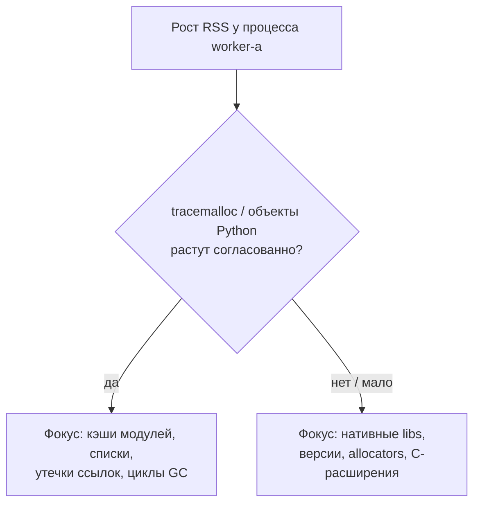
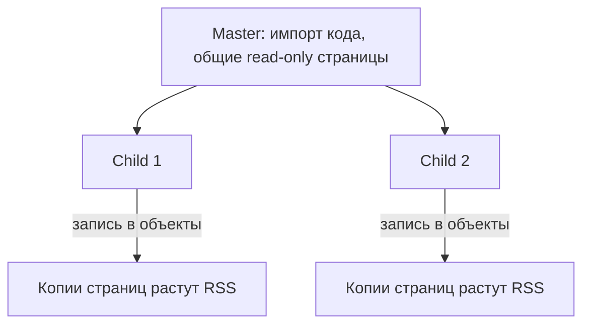
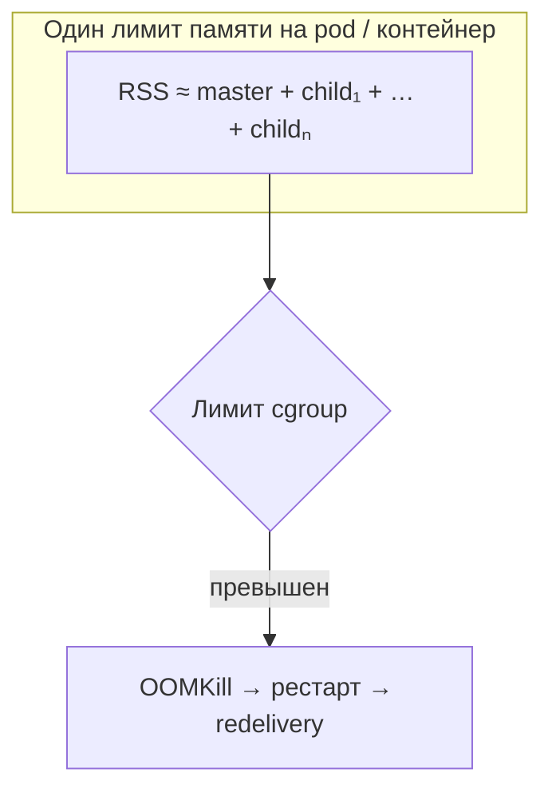

[← Назад к индексу части](index.md)
[↑ К глобальному плану](../../mastery_plan.md)

## 16.8 Память, GC и утечки в долгоживущих worker-ах

### Цель раздела

Понять, почему worker **«раздувается»** со временем, как это связано с **кэшами**, **C-расширениями**, **fork**, и какие **механизмы перезапуска** процессов применять.

### В этом разделе главное

- Долгоживущий процесс **накапливает** состояние: кэши, фрагментация, утечки.
- **max_tasks_per_child** — простой способ «освежать» процессы.
- **max_memory_per_child** — защита от неконтролируемого роста RSS.
- Утечки могут быть **вне Python heap** (нативные библиотеки).
- Глобальные кэши на уровне модуля **размножаются** на все задачи.

### Термины

| Термин | Кратко |
|--------|--------|
| **RSS** | Resident Set Size — память процесса, удерживаемая ОС. |
| **GC** | Сборщик мусора Python. |

### Теория и правила

В **prefork** дочерние процессы живут долго. Любой **глобальный** dict-кэш, загрузка тяжёлой модели в память, накопление **истории** в списках — раздувает процесс.

Некоторые библиотеки (CV, ORM кэши второго уровня, нативные парсеры) могут **утечь** или не отдавать память ОС обратно даже после освобождения Python-объектов.

**Две ветки диагностики роста RSS (план: нативные утечки vs куча Python):**



**GC (сборщик мусора) и «раздувание» процесса:** CPython использует **поколенческий** GC. Долгоживущие worker-ы накапливают объекты в старших поколениях; полные циклы GC и фрагментация кучи могут давать **паузы** и рост RSS, который **не сразу** возвращается ОС. Это не всегда «утечка» в классическом смысле, но выглядит как рост памяти на графике. **max_tasks_per_child** обрывает это, **принудительно** начиная с чистого процесса.

**Prefork и память родителя:** код и часть данных загружаются в **мастер-процессе**, затем `fork`. Пока память **только читается**, страницы разделяются экономно (**copy-on-write**). Как только задачи **мутируют** большие структуры или создают много своих объектов, копии страниц растут — эффект «я не кэширую, но RSS ползёт вверх» возможен при тяжёлых библиотеках.



**max_tasks_per_child:** после N задач процесс **заменяется**. Цена — время на **прогрев** (импорты, соединения — их нужно создавать заново лениво).

**max_memory_per_child:** если RSS превысил порог — процесс завершается и заменяется (см. актуальные docs Celery для вашей версии).

**Лимит памяти cgroup / контейнера (Kubernetes, Docker и т.п.):** в модели **prefork** в памяти живут **master** и **N** дочерних процессов одновременно. **Суммарный RSS контейнера** — то, что видит cgroup; если `resources.limits.memory` (или аналог) **меньше** пикового «мастер + все дети + пик задачи», контейнер получит **OOMKilled**. Симптомы: **рестарты** пода, волна **redelivery**, «падает только под нагрузкой», хотя «один процесс вроде укладывался» в оценку. Планируйте лимит по **worst-case**: примерно **число дочерних процессов × пиковый RSS ребёнка** + мастер + запас; иначе снижайте **`-c`**, увеличивайте limit, выносите тяжёлые задачи в отдельный деплой с другим профилем памяти.



#### Проверь себя: память и процессы §16.8

1. Почему **`max_tasks_per_child`** может **улучшить** стабильность latency, даже если «утечки не доказаны»?

<details><summary>Ответ</summary>

Потому что он периодически **сбрасывает** фрагментацию кучи, накопление в старших поколениях GC и «мягкое» раздувание процесса после долгой работы с тяжёлыми библиотеками. Цена — **прогрев** нового процесса; порог N выбирают по метрикам, а не наугад.

</details>

2. **tracemalloc** показывает рост объектов Python, а **RSS** растёт сильнее. Куда смотреть дальше?

<details><summary>Ответ</summary>

В **нативные** аллокаторы, C-расширения, версии библиотек: память вне Python heap не отражается в tracemalloc. Нужны профили нативной памяти, обновления/фиксы расширений, изоляция задач в отдельные процессы с recycle.

</details>

3. Чем **`max_memory_per_child`** принципиально отличается от **лимита cgroup** на весь pod?

<details><summary>Ответ</summary>

`max_memory_per_child` — **логика Celery** перезапустить **одного** ребёнка prefork при превышении порога (если поддерживается версией). **cgroup** ограничивает **весь контейнер** (master + все дети): при ошибке в оценке лимита убивается **весь** pod. Оба механизма дополняют друг друга, но не заменяют.

</details>

### Пошагово

1. Наблюдай **RSS** по времени на staging под нагрузкой.
2. Если рост монотонный — ищи **глобальные кэши** и **утечки**.
3. Введи **max_tasks_per_child** как базовую гигиену для prefork с тяжёлыми зависимостями.
4. При «необъяснимом» росте — профилируй **нативные** части и версии библиотек.
5. Если подозреваешь рост именно **Python-кучи** (а не только RSS от C-alloc): на стенде включай **`tracemalloc`** / снимай срезы по топ allocators — это помогает отличить «утечку объектов Python» от **нативного** роста, который `tracemalloc` почти не видит.
6. В **Kubernetes**: сверь **memory limit** пода worker-а с **фактическим** суммарным RSS при целевом **`-c`** и типичном входе; отдельно проверь пик при **холодном старте** после деплоя.

### Простыми словами

Worker как **офис**: если никогда не убирать, бумаги **захламят** стол. Иногда проще **сменить кабинет** (новый процесс), чем искать каждую бумажку.

### Картинка в голове

Процесс — **губка**: впитывает кэши и фрагментацию. **Отжать** губку полностью иногда нельзя — проще взять **новую**.

### Как запомнить

**«Долгая жизнь процесса = долгая память».**

### Примеры

```python
# celery.py
app.conf.update(
    worker_max_tasks_per_child=1000,
    # worker_max_memory_per_child=200_000  # KiB — если поддерживается вашей версией/платформой
)
```

Избегать:

```python
_GLOBAL_CACHE: dict = {}

@app.task
def f(x):
    _GLOBAL_CACHE[x] = huge_object()  # рост без границ
```

### Практика / реальные сценарии

- **ML inference** в worker: модель в памяти — контролируй **число процессов** и **размер модели**.
- **Парсинг PDF/изображений:** периодический recycle процессов после обработки «мусорных» файлов.

### Типичные ошибки

- Думать, что «Python сам всё почистит» при **нативных** утечках.
- Ставить **слишком маленький** max_tasks_per_child без замера — лишний **churn** и прогрев.
- Читать в задачу **целиком** большие файлы/BLOB в RAM «на простоту» вместо **streaming**/чанков — один вход раздувает RSS и копии после **COW** в prefork.
- Задавать **memory limit** в K8s от «одного Python», игнорируя **prefork × N** и пиковый RSS детей.

### Что будет, если…

- **Если игнорировать рост RSS:** OOMKill, **redelivery**, волна инцидентов.

### Проверь себя

1. Почему **кэш на уровне модуля** особенно опасен в Celery worker-е?

<details><summary>Ответ</summary>

Потому что модуль импортируется **один раз** на долгоживущий процесс, и кэш живёт **между задачами**, накапливаясь для всех входов. Это легко превращается в **неконтролируемый** рост памяти и скрытые «глобальные» состояния, ломающие идемпотентность и предсказуемость.

</details>

2. Какой **недостаток** у частого перезапуска дочерних процессов?

<details><summary>Ответ</summary>

Накладные расходы на **прогрев**: импорт кода, установление соединений, заполнение мелких кэшей, возможный **холодный старт** зависимостей — временно снижается throughput и может расти latency первых задач после рестарта.

</details>

3. Почему утечка может быть **вне Python heap**, и что с этим делать?

<details><summary>Ответ</summary>

Нативные расширения и библиотеки выделяют память через **malloc** иначе, чем объекты Python; RSS растёт, хотя `tracemalloc` мало показывает. Действия: обновления/фиксы библиотек, изоляция в отдельных процессах с recycle, профилировщики нативной памяти, упрощение зависимостей.

</details>

4. Как **частые `update_state`** связаны с **производительностью**, если «задача всё равно одна»?

<details><summary>Ответ</summary>

Каждый вызов обычно порождает **запись** в result backend и сетевой round-trip. На длинной задаче тысячи обновлений превращают backend в **отдельный hotspot**: растёт latency получения статуса, нагрузка на Redis/БД и конкуренция за соединения — **параллельно** с основной работой задачи.

</details>

5. Почему **OOMKilled** в Kubernetes при **prefork** возможен при «нормальном» RSS **одного** дочернего процесса?

<details><summary>Ответ</summary>

Потому что **cgroup** считает память **всего контейнера**: master **и** все активные дочерние процессы **одновременно**, плюс пик задачи. Лимит pod-а, оценённый «как для одного Python», обычно **занижен**; при полной загрузке **`-c`** суммарный RSS превышает `limits.memory` — убивается контейнер целиком, следом **redelivery**.

</details>

### Запомните

Память worker-а — **состояние продукта**; управляй ею так же, как CPU и очередями.

---
