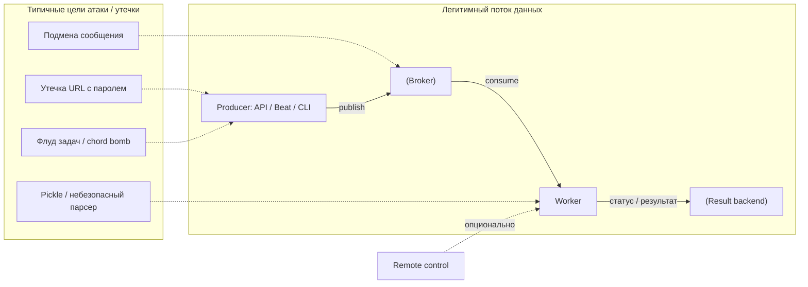

[← Назад к индексу части](index.md)
[↑ К глобальному плану](../../mastery_plan.md)

## Что желательно знать заранее

Желательно уже понимать:

- архитектуру **producer → broker → worker → (result backend)** — части 3–4;
- как устроены **вызов задач и payload** — часть 5;
- компромиссы **брокера и backend** — часть 6;
- основы **конфигурации** Celery — часть 7;
- **remote control / события** на концептуальном уровне — часть 13–14.

**Сквозная мысль:** атакующий может целиться **не в код задачи**, а в **транспорт**, **хранилище результатов**, **панель мониторинга**, **логи** или **процесс публикации** из веб-приложения.

**Компоненты контура и типичные векторы** (стрелки — **нормальный** поток; пунктир от «угрозы» — **куда** бьёт злоумышленник или ошибка дизайна):

**Зачем так:** на одной схеме видно и **рабочий** путь, и **где искать** слабое место при разборе инцидента (не смешивая «угрозы» с узлами как будто они часть топологии).

#### Проверь себя: предпосылки

1. Почему на схеме **remote control** показан пунктиром к worker?

Ответ

Remote control — **отдельный канал влияния** на worker (команды inspect/control, broadcast в зависимости от настроек и транспорта). Его нужно учитывать в **поверхности атаки** даже если «основной» поток — только consume из очереди: компрометация управляющего контура даёт **операционные** возможности (revoke, pool restart и т.д.).

2. Зачем для безопасности знать про **result backend**, если «главное» — брокер?

Ответ

Backend часто хранит **результаты, traceback, метаданные групп/chord** — это **второе хранилище** с **своими** ACL, сетевым доступом и риском **утечки через poll API**. Игнорировать backend — оставлять **половину состояния** без модели угроз.

3. Почему на вводной схеме **угрозы** (A1–A4) **не** сливаются в один узел с брокером и worker?

Ответ

Чтобы **не** смешивать **легитимный поток** и **классы атак**: иначе читатель воспринимает угрозу как «ещё один компонент топологии». Отдельный subgraph фиксирует: это **векторы**, направленные **в** существующие узлы, а не равноправные сервисы.

---
