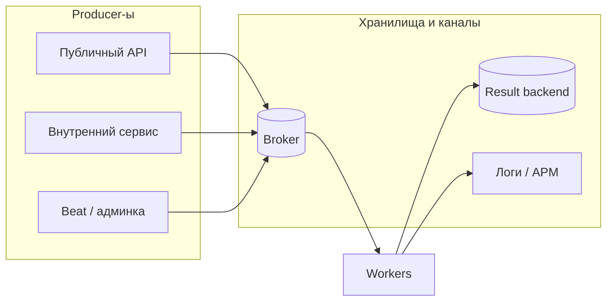
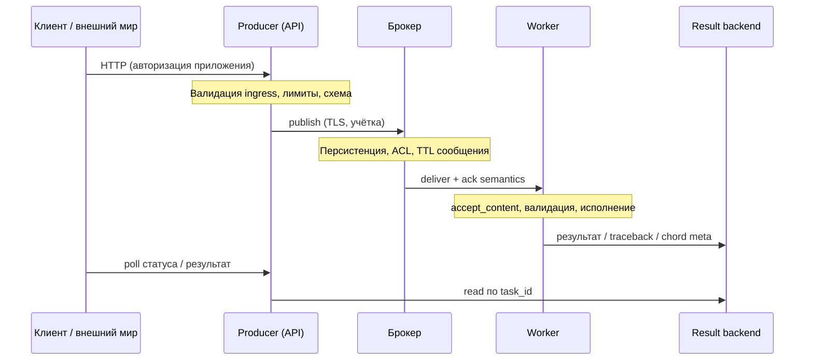
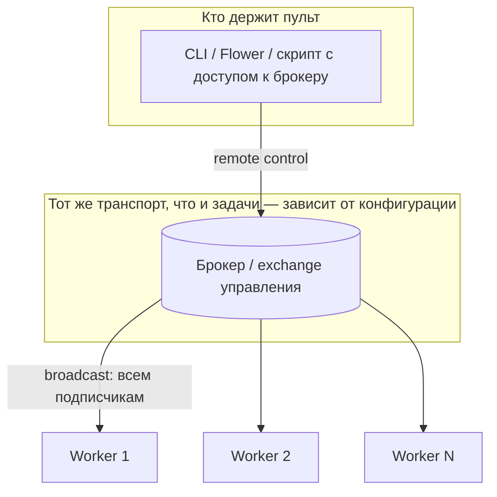

[← Назад к индексу части](index.md)
[↑ К глобальному плану](../mastery_plan.md)

## 17.1 Поверхность атаки Celery-контура

### Цель раздела

Научиться **системно перечислять**, где в системе с Celery возможен **вредоносный или ошибочный ввод**, и связать это с **конкретными мерами** в следующих разделах.

#### Проверь себя: формулировка цели §17.1

1. Почему в цели раздела стоит **«ошибочный ввод»** рядом с **«вредоносным»**?

Ответ

Многие инциденты — не злой умысел, а **неверный** конфиг, тестовый брокер в prod, логирование kwargs «на час». Модель угроз должна ловить **и** атакующего, **и** класс ошибок, которые дают **тот же** эффект (утечка, флуд, RCE).

2. Что значит **«связать с конкретными мерами в следующих разделах»** на практике ревью?

Ответ

После каждого пункта threat model должна появляться **отсылка к политике**: serializer → §17.2, TLS/ACL → §17.3, PII → §17.4 и т.д. Иначе список рисков остаётся **документом**, а не **чек-листом** изменений в коде и инфраструктуре.

3. Можно ли считать цель §17.1 выполненной, если команда **перечислила** только RabbitMQ и worker?

Ответ

Нет: цель — **системность**. Без backend, логов, Beat, RC и supply chain картина **неполная** и защита будет **точечной** там, где «удобно вспомнить».

### В этом разделе главное

1. **Брокер** — не «внутренняя магия», а **сетевой сервис** с учётками; доступ к нему часто равен возможности **ставить работу** на worker-ы.
2. **Result backend** — отдельное хранилище: результаты, ошибки, данные chord/group; **своя** модель ACL и утечек.
3. **Remote control / broadcast** (где включено) — канал **управления** worker-ами; компрометация даёт **операторские** возможности.
4. **Сериализация** — перевод байтов в объекты; при **pickle** это близко к **выполнению кода**.
5. **Аргументы задач и kwargs** — часто содержат **ID**, **URL**, **флаги**, иногда **PII**; попадают в логи и дампы.
6. **Traceback и исключения** — утекают **пути**, **фрагменты данных**, **SQL**; попадают в backend и логи.
7. **Supply chain** — зависимости `celery`, `kombu`, транспорты; **уязвимость в библиотеке** = уязвимость контура.
8. **Celery Beat, скрипты, shell** — любой **не-HTTP** publisher с доступом к брокеру — та же поверхность, что и API, но **мимо** ingress-лимитов веба; детали **§17.1г** и **§17.3д** (клиент в терминах Celery).

#### Проверь себя: восьмёрка «главное» §17.1

1. Сгруппируй пункты **1–2** и **5–6**: какой **общий** риск они подчёркивают про «данные в полёте»?

Ответ

Один и тот же чувствительный фрагмент может **одновременно** жить в **брокере**, **backend** и **логах/стеках**; защита только одного узла **не** удаляет копии в других. Это основа для §17.4 и ретеншн по **всем** стокам.

2. Почему пункты **3** и **8** вместе важны для **операционного** чек-листа доступа?

Ответ

Remote control — **пульт** над worker-ами; Beat/shell — **альтернативный** producer **без** веб-rate-limit. Оба требуют **сетевой** изоляции, **ролей** и аудита «кто реально может командовать кластером», иначе защита API **обходится**.

3. Как пункт **7** (supply chain) **снимает** иллюзию «мы закрыли сериализацию JSON — контура достаточно»?

Ответ

Уязвимость в **kombu/amqp/redis-клиенте** может сработать **до** вашей бизнес-валидации (парсинг протокола, сжатие). JSON в kwargs **не** защищает от **дыры** в стеке транспорта — нужны lockfile, сканирование CVE, минимальный образ.

### Термины

| Термин | Кратко |
|--------|--------|
| **Attack surface** | Все точки **взаимодействия** злоумышленника с системой. |
| **Trust boundary** | Линия, за которой данные/узлы **не считаются** автоматически добросовестными. |
| **Producer** | Код, вызывающий `delay` / `apply_async`: **веб**, **Beat**, **CLI/скрипты**, **другой worker** — всё это «клиенты» брокера. |
| **Consumer / worker** | Процесс, **исполняющий** задачи по сообщениям из брокера. |

#### Проверь себя: термины §17.1

1. Чем **цель раздела** (системный перечень входов) отличается от **«написать список задач Celery»**?

Ответ

Список `@app.task` — только **исполнение**; цель §17.1 — учесть **все каналы ввода и хранения**: брокер, backend, логи, RC, Beat, supply chain. Иначе защита строится вокруг кода задачи и **пропускает** реальные пути атаки.

2. Почему **Producer** в таблице терминов включает **«другой worker»**?

Ответ

Потому что worker, вызывающий `delay`/`apply_async`, — это **клиент брокера** с теми же рисками публикации, что и HTTP API: компрометация или баг в **цепочке** задач может ставить сообщения **без** вашего веб-ingress.

3. Что в терминах означает **trust boundary** для сообщения в очереди?

Ответ

Граница, после которой содержимое сообщения **нельзя** считать добросовестным без проверки: всё, что пришло из брокера в worker, должно проходить **serializer whitelist** и **бизнес-валидацию**, даже если путь по сети «внутренний».

### Теория и правила

**Правило 1: три независимых «хранилища риска».**  
(а) **Очередь в брокере** — кто пишет, тот **инициирует выполнение** (с теми аргументами, которые прошли сериализацию).  
(б) **Result backend** — кто читает, тот видит **результаты и ошибки**.  
(в) **Логи/метрики/трейсы** — часто **копируют** фрагменты payload и стеков.

**Правило 2: сеть не спасает от pickle.**  
Даже в «закрытой» сети остаются: **скомпрометированный** контейнер, **ошибочно** выданные права, **инсайдер**, **supply chain**. Политика «только JSON + схема» **дешевле** в смысле рассуждений, чем «мы в VPC».

**Правило 3: remote control — отдельная тема в эксплуатации.**  
Если включены механизмы управления через брокер или иной канал, их нужно **либо жёстко ограничить**, либо **отключить** там, где не нужны. Детали зависят от версии и транспорта; инженерный принцип: **минимум удалённого управления** без аутентификации и сетевой изоляции.

**Правило 4: broker URL и credentials — отдельный актив.**  
Строка `CELERY_BROKER_URL` / `CELERY_RESULT_BACKEND` часто содержит **логин, пароль, хост**. Это **секрет** уровня доступа к очереди и результатам. Утечка равна **компрометации контура** (publish/consume в пределах прав учётки).

| Вектор утечки URL | Что происходит | Профилактика |
|-------------------|----------------|--------------|
| Коммит в git, gist, тикет | Мгновенное сканирование ботами | Secret scanning, pre-commit, отзыв кредов |
| Логи старта контейнера (`docker logs`, CI) | Пароль в plaintext | Не печатать полный URL; masked env в логах |
| `/proc/*/environ`, дампы core | Чтение секрета с хоста | Hardening, non-root, ограничение exec в pod |
| Общий чат / screen share | Социальная инженерия | Vault с TTL, не шарить строку целиком |
| Бэкап `.env` на незащищённом носителе | Долгоживущая утечка | Шифрование бэкапов, раздельные секреты по средам |

#### Проверь себя: правила 1–4 и утечки URL

1. Как **правило 1** (три хранилища) связано с инцидентом «очистили Redis, но PII остались в ELK»?

Ответ

Логи — **третье** независимое хранилище риска: данные из kwargs/traceback **копируются** в агрегатор с **своим** retention. Очистка брокера/backend **не** удаляет то, что уже ушло в **логи** (см. §17.4).

2. Почему **правило 2** отвергает аргумент «pickle ок, мы в закрытой сети» **даже** без внешнего злоумышленника?

Ответ

В «закрытой» сети остаются **легитимные** процессы и люди; ошибка прав, **инсайдер** или **скомпрометированный** сервис могут положить pickle в очередь. Сеть **не** фильтрует семантику байтов.

3. Назови **два** разных вектора из таблицы утечки URL и **разные** классы защиты для каждого.

Ответ

Например: **git leak** — secret scanning + отзыв кредов + pre-commit; **docker logs** — не печатать полный env, masked стартовые логи; **`/proc/environ`** — non-root, ограничение exec, hardening. Достаточно двух пар «вектор → мера» из таблицы с **разным** характером (процесс vs репозиторий vs человек).

**Простыми словами:** URL брокера с паролем — это **не адрес сайта**, а **ключ от ворот склада**. Его нельзя кидать в чат «на минутку».

#### Проверь себя: метафора «ключ от склада» §17.1

1. Чем **опаснее** утечка `CELERY_BROKER_URL`, чем утечка **публичного** hostname брокера без пароля?

Ответ

С паролем в строке атакующий получает **готовый** доступ в роли учётки приложения (publish/consume в пределах прав) **без** дополнительного взлома; hostname сам по себе лишь точка подключения.

2. Почему метафора **«ключ»**, а не «пароль от Wi‑Fi офиса»?

Ответ

Wi‑Fi часто даёт **лишь** сетевой доступ; URL брокера обычно сразу **авторизует** к **критичному** сервису с **постановкой работы** и иногда **чтением** очередей — ближе к **физическому** ключу от зоны с грузом.

3. Как эта метафора **согласуется** с **правилом 4** (таблица утечек URL)?

Ответ

Таблица перечисляет **каналы** утечки ключа (git, логи, `/proc`, чат); метафора задаёт **культуру**: ключ **не** «на минутку» в Slack — иначе любой из векторов таблицы становится реалистичным.

### Пошагово: составить threat model для своего контура

1. **Нарисуйте** producer-ы (веб, cron, beat, админка, другие сервисы).
2. Для каждого: **кто** может вызвать публикацию задачи **извне** (анонимный пользователь, партнёр API, только внутренние сервисы)?
3. Перечислите **все** URL подключения: `CELERY_BROKER_URL`, `result_backend`, Redis для rate limit и т.д. — где лежат **в конфиге/ENV**?
4. Отметьте **кто** имеет сетевой доступ к брокеру и backend **кроме** worker-ов и API (мониторинг, CI, ноутбук разработчика).
5. Зафиксируйте **формат** сообщений (serializer) и **кто** может писать в те же очереди.
6. Проверьте **логирование**: печатаются ли `args`/`kwargs`, заголовки, полные исключения?
7. Зафиксируйте **зависимости** и процесс **обновлений** (Dependabot, lockfile, сканирование).

#### Проверь себя: threat model по шагам

1. Зачем в шаге 2 спрашивать **«кто извне»** отдельно от перечисления producer-ов в шаге 1?

Ответ

Список процессов **не** равен **границе доверия**: внутренний сервис может быть доступен **извне** через ошибочный gateway, а публичный API — иметь **админский** эндпоинт без авторизации. Шаг 2 переводит инвентаризацию в **модель угроз** по акторам.

2. Почему в шаге 4 важно явно назвать **CI и ноутбук разработчика**?

Ответ

Они часто имеют **широкий** доступ к секретам и сети «на время задачи», но **не** попадают в стандартную картинку «только API и worker». Забытый pipeline или VPN сотрудника — типичный **скрытый** путь к брокеру и **утечка** URL.

3. Как шаг 5 связан с **§17.2г**, если в шаге уже есть «формат сообщений»?

Ответ

«Формат» должен включать **и** тело задачи, **и** путь **результатов** в backend: два URL и два контракта. Без этого threat model **половинчатый** — ровно промах, который закрывает §17.2г.

### Простыми словами

Celery — это **несколько дверей**: дверь «поставить задачу», дверь «прочитать результат», дверь «посмотреть, что случилось в логах». Защищать нужно **каждую**, а не только код внутри `@app.task`.

### Картинка в голове

Представь **конвейер на фабрике**: брокер — **лоток с заявками**; worker — **станок**. Если кто-то подбрасывает в лоток **фальшивую заявку**, станок всё равно начнёт работать. **Форма заявки** (сериализация) решает, можно ли вложить в неё **«самораспаковывающийся»** приказ (pickle).

**Путь сообщения и точки доверия** (сквозной взгляд для аудита):

На диаграмме видно: **компрометация** может целиться в **API** (неверная постановка), в **брокер** (подмена), в **worker** (код/сериализация), в **backend** (чтение чужих результатов при слабых ACL).

### Как запомнить

**«Брокер + backend + логи»** — три столба поверхности; **сериализация** — **что** именно worker «ест» из брокера.

### Примеры

**Пример А. Утечка broker URL в репозиторий.**  
В `docker-compose.yml` или `.env.example` случайно оставили реальный пароль. Роботы сканируют GitHub **за минуты**. Риск: **публикация произвольных задач** (при слабой политике) или **чтение очередей**.

**Пример Б. Общий Redis и DB index.**  
Один и тот же Redis: и кэш сессий, и broker, и result backend без разделения ключей/ACL. Компрометация **одного** клиента приложения может упростить **доступ к метаданным задач**.

**Пример В. Логирование `request.json` при постановке задачи.**  
В лог попадает тело HTTP с **email, телефоном** — это уже **инцидент персональных данных**, даже если брокер идеально защищён.

#### Проверь себя: примеры А–В §17.1

1. Чем **пример Б** (общий Redis) опасен **сильнее**, чем «просто смешали кэш и задачи в одном имени очереди»?

Ответ

Речь о **одном инстансе и клиентском доступе**: другой компонент приложения с правами на тот же DB/ключи может **читать/писать** метаданные Celery или вызвать **FLUSH**-класс команд, задев **всё** сразу. Это **blast radius** зоны доверия, а не только путаница имён.

2. Почему **пример А** (URL в git) даёт риск **раньше**, чем «кто-то нашёл баг в коде задачи»?

Ответ

Сканеры и боты ходят по публичным репозиториям **автоматически** и **быстро**; утечка кредов к брокеру даёт **параллельный** канал постановки задач **до** анализа уязвимостей в бизнес-логике.

3. **Пример В:** какое **минимальное** разделение снижает риск, если **нельзя** завести второй Redis?

Ответ

**Отдельный logical DB / префиксы ключей + ACL** так, чтобы клиент кэша **не** имел прав на ключи Celery (и наоборот), плюс запрет опасных команд для роли приложения. Полная изоляция лучше — **отдельный** кластер.

### Практика / реальные сценарии

- **Стартап → enterprise:** появляется **аудит** и требование **разделения** prod/stage на уровне **учёток брокера**, не только префиксов имён очередей.
- **Подрядчики с VPN:** считается, что «все свои»; через год доступ забыли отозвать — **персистентная** поверхность.

### Типичные ошибки

- Считать брокер **«внутренним»** и не ставить **TLS/ACL**.
- Хранить **один** пароль на все окружения и все типы клиентов.
- Включать **подробные** логи задач в production «на время отладки» и не выключать.

### Что будет, если…

- …**утёк broker URL** с правами publish? Злоумышленник может **забить очереди**, ставить **дорогие** задачи, **сканировать** имена задач (информация об архитектуре), при плохой сериализации — **RCE** на worker-ах.
- …**открыт result backend**? Утечка **бизнес-данных** из `return`, **traceback** с SQL/путями, **метаданные** групп.

#### Проверь себя: практика и типичные ошибки §17.1

1. Чем сценарий **«подрядчики с VPN»** отличается от утечки URL в git с точки зрения **политики доступа**?

Ответ

Git-утечка — **мгновенная** глобальная экспозиция секрета ботам. VPN-подрядчик — **долгоживущая** **человеческая** поверхность: доступ остаётся после завершения проекта, если **не** отозвать роли и **не** ротировать креды. Разные runbook-и: secret scanning vs offboarding.

2. Почему пункт «**один пароль на все окружения**» в типичных ошибках — это не только **операционная** лень?

Ответ

Компрометация stage или утёк из CI с **тем же** паролем открывает **prod** брокер **сразу** — коррелированный риск. Разделение учёток **сужает blast radius** при инциденте на «менее защищённом» контуре.

3. Свяжи **«подробные логи на время отладки»** с **правилом 1** (три хранилища риска).

Ответ

Временные debug-логи копируют kwargs/traceback в **третье** хранилище (агрегатор) с **длинным** retention; «выключили в коде» **не** удаляет уже проиндексированные события. Нужны **сэмплирование**, фильтры и политика **удаления** в SIEM.

#### Проверь себя: интеграция раздела §17.1

1. Назови **три** различных типа активов, которые злоумышленник может преследовать в контуре Celery (не только «выполнить код»).

Ответ

Например: **целостность и доступность** (DoS через флуд задач); **конфиденциальность** (результаты в backend, PII в логах); **операционный контроль** (remote control, отзыв задач); **репутационные/регуляторные** последствия утечки данных. Достаточно трёх осмысленных категорий из этого ряда.

2. Почему **supply chain** отнесён к поверхности атаки именно **рядом** с сериализацией и брокером, а не «отдельной лекцией»?

Ответ

Потому что компрометация зависимости может дать **тот же эффект**, что и плохая политика сообщений: **недоверенный код** в worker-е исполняется с **теми же** правами, что и бизнес-задачи. Это **не абстрактный** риск, а **расширение** поверхности там, где вы уже доверяете стеку.

3. **Remote control** опасен, даже если злоумышленник **не** может публиковать задачи. Почему?

Ответ

Потому что это **отдельный вектор**: при компрометации учётки/сети к управляющему каналу можно **влиять на процессы** worker-а (инспекция, остановки, рестарт пулов — в зависимости от конфигурации), **собирать информацию** о кластере и **усиливать** атаку. Защита задач не заменяет защиту **управления**.

### Запомните

Поверхность Celery — это **брокер, backend, управление, сериализация, логи и зависимости**. Пока вы не перечислили их явно, «у нас безопасный VPC» — не модель угроз.

#### Проверь себя: запомните и метафора §17.1

1. Что добавляет формула запомните по сравнению с **только** «брокер + worker»?

Ответ

**Backend, remote control, сериализация, логи, supply chain** — всё это **отдельные** точки компрометации и утечки; VPC не объединяет их в один «безопасный шар».

2. Как **метафора конвейера** (фальшивая заявка в лотке) соотносится с **pickle**?

Ответ

Форма заявки = **формат сериализации**: pickle позволяет вложить **исполняемый** сценарий в «данные»; станок (worker) **выполнит** десериализацию с правами процесса. JSON без валидации всё ещё опасен **семантически**, но не через **произвольный код при парсинге**.

3. На **sequenceDiagram** «путь сообщения»: где в первую очередь ставить **авторизацию «свой task_id»** при poll результата?

Ответ

На **стороне API** перед чтением backend: `API->>RB` должен сопровождаться проверкой, что задача **привязана** к субъекту/сессии; иначе знание id = чтение чужого результата (см. §17.1в).

---

### Углубление 17.1а: remote control, события и «невидимый» канал

**Зачем отдельный подпункт.** В учебниках часто фокусируются на `apply_async`, а **управление** worker-ами остаётся «как в доке devops». В production это **вторая дверь**: команды **inspect**, **control**, **broadcast** (в зависимости от версии Celery, транспорта и конфигурации) позволяют **собирать информацию** о кластере и **воздействовать** на процессы.

**Broadcast в модели угроз (план: remote control / broadcast).** **Точечная** команда к одному worker-у вредна; **broadcast** — это рассылка **тем же каналом** сразу **многим** worker-ам (вся смена «нажала кнопку»). С точки зрения безопасности: **одна** скомпрометированная сессия оператора или **одна** уязвимость в доступе к управлению превращается в **массовое** воздействие на кластер — рестарты, сбор состояния со **всех** узлов, усиление DoS. Поэтому broadcast относят к **той же** поверхности, что и remote control, а не к «удобству админки».

**Простыми словами:** если основная очередь — **конвейер деталей**, remote control — **пульт от станка**. Потерять пульт или отдать его кому попало — плохая идея.

**Что сделать инженерно (чек-лист):**

1. **Инвентаризация:** какие команды Celery вы реально используете в эксплуатации (Flower, CLI, custom scripts)?
2. **Сеть:** те же правила, что и для брокера — **не** выставлять управление наружу без **VPN/mTLS**.
3. **Аутентификация брокера:** слабый пароль на RabbitMQ бьёт **и** по постановке задач, **и** по каналам, которые reuse соединение.
4. **Принцип минимума:** если управление извне не нужно — **отключайте** приём remote control на worker-е (в актуальной документации Celery для вашей мажорной версии ищите настройки вроде **отключения remote control** / **worker remote control**). В проде часто оставляют управление **только** с bastion/VPN и **отдельной** ролью в IAM/K8s RBAC для pod exec.
5. **Аудит:** кто из людей может выполнить `celery -A proj inspect active` **к проду** — это **тот же** доступ, что и к пониманию нагрузки и иногда к **pool restart**.

**Что будет, если пренебречь:** атакующий с доступом к **тому же** брокеру/транспорту, что и управление, может **усилить** DoS (массовые рестарты, нагрузка на расследование) или **собрать** карту сервисов для следующего шага.

#### Проверь себя: remote control, broadcast, Flower §17.1а

1. Почему **Flower** относится к поверхности атаки **даже** если он «только читает»?

Ответ

Потому что **чтение** раскрывает **имена задач**, **аргументы** в активных вызовах (если отображаются), **топологию** worker-ов и **состояние** очередей — это **разведка**. Часто Flower **защищён слабо** или висит во **внутренней** сети с широким доступом. Плюс некоторые установки включают **опасные** возможности без strong auth.

2. Чем **broadcast** управления для злоумышленника **опаснее**, чем «просто отправить одну вредоносную задачу в очередь»?

Ответ

Задача в очереди исполняется **теми** worker-ами, которые её заберут, и в рамках **семантики** задачи. Broadcast по каналу управления может **одномоментно затронуть много** процессов (информация, рестарт пулов и т.д.) **вне** вашей бизнес-логики `task` — это **операционный** рычаг на весь периметр исполнения. Плюс это **не** то же самое, что rate limit на API: источник — **внутренний** доступ к управлению.

3. Зачем в чек-листе пункт **«аудит: кто может `inspect active` к проду»** стоит **рядом** с отключением remote control?

Ответ

Потому что даже при «технически отключённом» RC в коде **остаётся** человеческий и организационный путь: bastion, kube exec, общий VPN. Без инвентаризации **людей** и ролей защита **на бумаге** расходится с тем, кто реально держит **пульт**. Аудит связывает политику с **практикой** доступа.

---

### Углубление 17.1б: supply chain — зависимости как часть атаки

**Теория.** Celery — не монолит: **kombu**, **billiard**, транспортные библиотеки (`amqp`, `redis`), иногда **дополнения** для сжатия и сериализации. Уязвимость в **любом** из звеньев может дать **RCE в worker-е** или **утечку** при парсинге протокола — это **не** лечится настройкой `accept_content`, если баг **до** вашей валидации.

**Правила практики:**

| Практика | Зачем |
|----------|--------|
| **Lockfile** (poetry.lock, pip-tools) | Воспроизводимые сборки, контроль обновлений |
| **Сканирование** (Dependabot, Snyk, OSV) | Раннее обнаружение CVE |
| **Пинning минорных** обновлений в проде | Снижение сюрпризов; отдельный канал для security patches |
| **Минимальный образ** контейнера | Меньше пакетов — меньше мёртвого кода с CVE |
| **Запрет `pip install` в рантайме** | Исключить подмену при компрометации |

**Простыми словами:** вы защищаете **сообщения**, но worker всё равно **жуёт код библиотек**. Если библиотека **дырявая**, сообщение может быть **легитимным**, а **парсер** — нет.

#### Проверь себя: supply chain и зависимости §17.1б

1. Почему **lockfile** — это про **безопасность**, а не только про «чтобы собиралось»?

Ответ

Потому что без фиксации версий **две** сборки в разное время получают **разный** набор транзитивных пакетов; атакующий или **компрометация** зеркала может подсунуть **новую** версию с бэкдором. Lockfile + проверка хешей даёт **контролируемую** поверхность.

2. Почему **CVE в kombu/amqp** может обойти вашу политику **`accept_content=['json']`**?

Ответ

Потому что уязвимость может быть **ниже** уровня вашей бизнес-валидации: в **парсинге** протокола, **обработке** фреймов, **сжатии** или зависимости транспорта. Сообщение ещё **не** дошло до `json.loads` в задаче, а код библиотеки уже **исполнил** опасный путь. Отсюда — сканирование, пиннинг и минимальный образ, а не только serializer.

3. Чем **запрет `pip install` в рантайме** в таблице связан именно с **Celery worker** как долгоживущим процессом?

Ответ

Worker **долго** живёт с **теми же** правами и сетевым доступом; динамическая установка пакетов при компрометации или ошибочном скрипте превращает рантайм в **канал supply-chain** без прохождения CI/ревью образа. Статический образ + пересборка — контролируемая граница.

---

### Углубление 17.1в: result backend — кто может читать и зачем это отдельная тема

План отдельно выделяет **доступ к result backend**: это не то же самое, что доступ к брокеру.

**Что хранится:** по `task_id` часто доступны **состояние**, **результат** `return`, **traceback** при ошибке, данные для **group/chord**. Любой HTTP/API-слой, который по запросу пользователя делает `AsyncResult(id).get()` или отдаёт статус из Redis, превращает backend в **публичное хранилище**, если `task_id` угадывается или перебирается.

**Политика (чек-лист):**

| Вопрос | Зачем |
|--------|--------|
| Тот же Redis, что и сессии? | Развести **ACL/DB/префиксы** или кластеры — см. §17.3 |
| Кто в сети может открыть порт backend? | Только **API** и **worker**, не «вся VPC» |
| Отдаём ли клиенту **сырой** traceback? | **Нет** — только код/инцидент; детали в защищённом логе |
| Достаточно ли длины/энтропии `task_id` для вашей модели? | UUID хорошо; короткий автоинкремент — **перебор** |
| Есть ли **авторизация** «этот пользователь может видеть только свои задачи»? | Иначе знание id = чтение чужого результата |

**Простыми словами:** backend — это **шкафчик с результатами** у выхода; если номер шкафчика угадать легко, чужие документы читаются без брокера.

#### Проверь себя: result backend и poll §17.1в

1. Почему **UUID** в `task_id` **не** отменяет необходимости **авторизации** на API статуса?

Ответ

Потому что UUID может **утечь** через логи, рефереры, поддержку, XSS, утечку ссылки или ошибку в другом эндпоинте. Идентификатор — не **доказательство** права доступа; нужна **связка** task ↔ субъект/организация в **доверенном** хранилище.

2. В чём **риск** смешения **того же Redis**, что и для сессий/кэша, с **result backend** — помимо «пересечения ключей»?

Ответ

**Зона доверия и ACL:** клиент приложения с правами на кэш теоретически ближе к **чтению/записи** того же инстанса; при ошибке конфигурации или **FLUSH** страдают **и** сессии, **и** результаты задач. Разделение instance/DB/префиксов + ACL снижает **blast radius** и упрощает аудит «кто к чему подключён».

3. Почему в чек-листе отдельной строкой стоит **«сырой traceback клиенту»**, если проблема уже обсуждалась в §17.4?

Ответ

Потому что **poll статуса** через API — типичный **второй** путь: разработчик чинит HTTP-ответ основного эндпоинта, но **забывает** нормализовать **ошибку** в JSON статуса задачи. Явный пункт в §17.1в привязывает backend к **продуктовому** API и предотвращает «утечку через AsyncResult».

---

### Углубление 17.1г: Celery Beat — отдельный producer и отдельные риски

**Почему в плане важен полный список producer-ов.** **Beat** не обслуживает HTTP, но **постоянно** подключается к брокеру и **кладёт** периодические задачи по расписанию. Это **такой же** критический узел, как API: компрометация beat-контейнера или **подмена** расписания = **массовая** постановка работ **в обход** публичного ingress rate limit.

| Риск | Проявление | Меры |
|------|------------|------|
| Утечка **broker URL** у beat | Флуд периодических задач, смена расписания | Те же секреты/Vault, что у worker; **не** слабее API |
| **Запись в репозиторий** `beat_schedule` / dynamic beat от **недоверенных** данных | Произвольные `apply_async` по cron из БД без валидации | Валидировать источник расписания; **не** давать пользователю cron-строку без санитизации |
| **Один** beat на несколько сред | Задачи уходят в **prod** из stage | Разные `CELERY_BROKER_URL` / vhost per env, CI-проверки конфига |
| Нет мониторинга **числа** триггеров beat | «Тихий» рост нагрузки | Метрики publish от beat, алёрты на аномалии (см. часть 14) |

**Простыми словами:** beat — это **будильник**, который сам ходит на кухню и ставит заказы. Если будильник **взломали**, он разбудит всю смену **тысячей** заказов, даже если дверь с улицы (API) заперта.

#### Проверь себя: Celery Beat как producer §17.1г

1. Почему **ingress rate limit** на публичном API **не** защищает от флуда, если **скомпрометирован** только Beat?

Ответ

Потому что Beat **не** проходит через ваш HTTP API: он публикует **напрямую** в брокер по своим учётным данным. Защита — **сегментация**, **узкие** права учётки beat, **мониторинг**, **изоляция** окружений и **безопасность** того места, где хранится/генерируется расписание.

2. Как **динамическое расписание** из БД (cron из записей пользователя) превращается в **риск**, если валидация слабая?

Ответ

Любая возможность **изменить** расписание или имя задачи без строгой схемы даёт путь к **массовой** постановке произвольных `apply_async` **в обход** продуктовых лимитов API. Это ближе к **бэкдору** в producer-е, чем к «удобной админке».

3. Почему **один Beat на несколько сред** опаснее простой опечатки в `CELERY_BROKER_URL` у API?

Ответ

Ошибка у API бьёт по **одному** классу запросов; Beat **периодически** и **автономно** наполняет prod очереди из stage/тестового конфига, что даёт **долгий** и **трудноуловимый** фоновый флуд. Нужны **жёсткие** guardrails в CI и разные vhost/URL per env.

---
