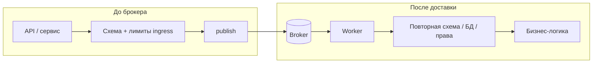
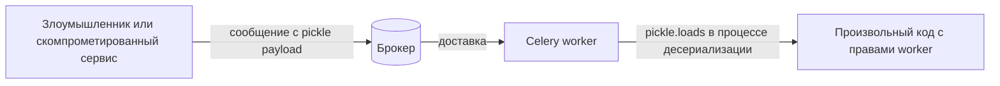
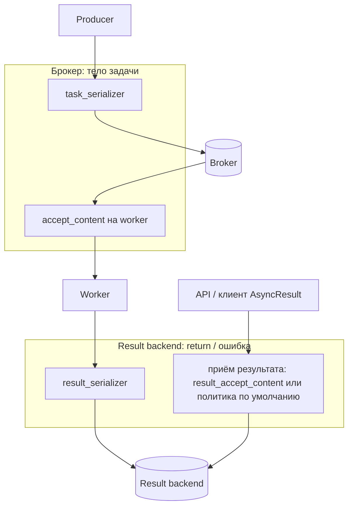

[← Назад к индексу части](index.md)
[↑ К глобальному плану](../../mastery_plan.md)

## 17.2 Сериализация и доверие к сообщениям

### Цель раздела

Научиться **выбирать и настраивать** формат сообщений так, чтобы **недоверенный** или **случайно испорченный** payload **не превращался** в произвольное исполнение кода и чтобы эволюция схемы была **управляемой**.

#### Проверь себя: формулировка цели §17.2

1. Зачем в цели явно упомянут **«случайно испорченный»** payload, если безопасность обычно про **злоумышленников**?

<details><summary>Ответ</summary>

Повреждённые или несовместимые сообщения при rolling deploy, **баге** сериализатора или **частичной** записи в брокер могут привести к **непредсказуемому** поведению worker-а и **обходу** проверок. Политика версий и `accept_content` защищают **и** от злого умысла, **и** от «битых» байтов.

</details>

2. Как **две части** цели (RCE vs **управляемая эволюция**) соотносятся с **двумя слоями**: serializer и схема?

<details><summary>Ответ</summary>

RCE — прежде всего **выбор безопасного** serializer и whitelist. Управляемая эволюция — **версии**, совместимость, отдельные очереди и явные отказы — чтобы изменения контракта **не** превращались в тихую порчу данных или **открытие** старых веток кода.

</details>

3. Почему цель §17.2 **не** формулируется как «настроить JSON»?

<details><summary>Ответ</summary>

JSON — **средство**, а не цель: важны **согласованность** producer/worker, **result backend**, подпись при угрозах, лимиты размера (**§17.6**) и валидация. «Только JSON» без остального оставляет **дыры**.

</details>

### В этом разделе главное

1. **Pickle** (и родственные «исполняемые» форматы) в сообщениях из **недоверенного** источника — это **категорически** небезопасно: десериализация = **выполнение кода**.
2. **JSON** (и аналоги) **не** дают RCE при парсинге самим по себе, но **не** отменяют **логических** атак: лишние поля, неверные ID, обход бизнес-правил.
3. **`accept_content`** на worker-е — **whitelist**: worker **откажется** принимать неожиданные `content-type` сообщений.
4. **Единая схема** аргументов (pydantic/dataclasses/ручная проверка) — **контракт** между версиями сервисов.
5. Поле **`schema_version`** / **`payload_version`** в kwargs или в структуре первого аргумента помогает **безопасно** катить новые поля и отсекать старых клиентов.
6. **Подпись сообщений** (HMAC и т.п.) имеет смысл, если у вас **есть** угроза подмены на транспорте или несколько producer-ов с разным доверием; это **инфраструктурный** выбор, не «галочка».

#### Проверь себя: шестёрка «главное» §17.2

1. Как **пункты 2** и **4** вместе задают **две линии защиты** после выбора JSON?

<details><summary>Ответ</summary>

JSON снимает **RCE при парсинге** (п.1 контрастирует с pickle); п.2 напоминает про **логические** атаки; п.4 — **схема** ограничивает допустимые поля и типы. Итого: безопасный парсер + **контракт** на содержимое.

</details>

2. Зачем **п.3** (`accept_content`) упомянут **отдельно** от «мы шлём JSON из API»?

<details><summary>Ответ</summary>

Worker должен **отказать** в десериализации, если в очередь попал **другой** content-type (старый producer, админка, ошибка конфига). Настройка на стороне **отправителя** не гарантирует, что в брокере **нет** pickle-сообщений.

</details>

3. Свяжи **п.5** (версия схемы) и **п.6** (подпись): в чём они решают **разные** проблемы?

<details><summary>Ответ</summary>

Версия — про **эволюцию** и совместимость при rolling deploy и старых сообщениях. Подпись — про **целостность и происхождение** байтов при **нескольких** доверенных producer-ах или промежуточных компонентах. Ни одна **не** заменяет другую; обе **не** заменяют TLS для конфиденциальности.

</details>

### Термины

| Термин | Кратко |
|--------|--------|
| **Serializer** | Как объект Python превращается в байты и обратно (`json`, `pickle`, `msgpack`…). |
| **`content_encoding`** / **`content_type`** | Метаданные сообщения в протоколе Kombu/Celery. |
| **Whitelist** | Разрешено **только** из списка; всё остальное — отбой. |

#### Проверь себя: термины §17.2

1. Чем **`content_type`** в сообщении Celery/Kombu **практически** связан с **`accept_content`**?

<details><summary>Ответ</summary>

`content_type` (и родственные метаданные) говорит worker-у, **каким** сериализатором интерпретировать тело; `accept_content` — **whitelist** допустимых типов. Несовпадение → отказ в обработке **до** бизнес-кода.

</details>

2. Почему **serializer** и **схема payload** — разные уровни абстракции?

<details><summary>Ответ</summary>

Serializer отвечает за **представление байтов ↔ объекты**; схема — за **допустимые поля и смысл** после парсинга. Один и тот же JSON может быть **валидным** для парсера и **опасным** для бизнес-логики без схемы.

</details>

3. Зачем в терминах упомянуты **`content_encoding`** (например `utf-8`, `base64`)?

<details><summary>Ответ</summary>

Это часть **контракта сообщения**: неверная или неожиданная кодировка ломает **канонизацию** для подписи и может маскировать **полезную нагрузку** от фильтров; при отладке подписи и межсервисного обмена encoding должен быть **явным** и согласованным.

</details>

### Теория и правила

**Почему pickle опасен (точная формулировка + простыми словами).**  
Формально: unpickling может вызывать **произвольные callable** при восстановлении объектов. Простыми словами: вы **не загружаете данные**, вы **запускаете механизм**, который по этим данным **строит** объекты и может **вызвать** код злоумышленника.

**Правило для production в недоверенной или большой организации:**  
**serializer JSON** (или иной безопасный к десериализации) **и** явная валидация. Pickle оставляют только там, где **все** producer-ы и брокер **строго доверенные**, а часто и там его **избегают** как ненужный риск.

**Настройки (концептуально):**  
- На приложении: `task_serializer`, `result_serializer`, `accept_content` (список строк вида `json`).  
- Согласовать **одинаково** на producer и worker; иначе сообщения **отвергнутся** или будут **ошибочно** обработаны при миграции.

**Две «трубы», а не одна:** тело **задачи** в брокере и **значение результата** в result backend проходят по **разным** путям сериализации. Закрыть только `task_serializer='json'` и забыть `result_serializer` — распространённый промах (подробно **§17.2г**).

**Схема payload:**  
- Договоритесь: **только** простые типы в JSON (строки, числа, bool, списки/словари ограниченной глубины).  
- **Не** передавайте **ORM-объекты** и **файловые дескрипторы** — они плохо сериализуются, **тащат лишнее** и ломают границы сервиса.

#### Проверь себя: теория pickle, две трубы, ORM §17.2

1. В чём разница между «pickle **опасен**» и «JSON **безопасен**» **в формулировке** из теории (не в лозунге)?

<details><summary>Ответ</summary>

Текст фиксирует: unpickling может вызывать **произвольные callable** при восстановлении — это **механизм исполнения**. JSON при стандартном `loads` строит структуры данных **без** такого механизма; остаётся **логическая** опасность задачи после парсинга.

</details>

2. Почему пункт «**согласовать одинаково на producer и worker**» критичен **именно** при миграции?

<details><summary>Ответ</summary>

В полёте могут сосуществовать **старые** сообщения и **новые** воркеры (или наоборот): рассинхрон serializer-а даёт **молчаливую** порчу, отказы или **обход** ожидаемой схемы. Нужны явные версии, dual-write или отдельная очередь.

</details>

3. Как передача **ORM-объекта** в kwargs бьёт **и** по §17.2, **и** по §17.4?

<details><summary>Ответ</summary>

По §17.2: ломает **контракт** простых типов, тянет **pickle-подобные** соблазны или нестабильную сериализацию. По §17.4: в `repr`/логах и результатах оказываются **лишние поля** (PII, внутренние id) — раздувается поверхность утечки.

</details>

### Пошагово: безопасная линия сериализации

1. Выберите **JSON** как базовый формат для межсервисных задач.
2. Установите `task_serializer='json'`, `result_serializer='json'`, `accept_content=['json']` (плюс то, что **реально** нужно; минимизируйте).
3. В каждой задаче **первой строкой** валидируйте вход (например, `order_id: str` формата UUID, лимиты длины).
4. Введите **версию** схемы; старые worker-ы **отклоняют** неизвестные версии с **понятной** ошибкой в лог (без утечки внутренностей наружу).
5. Документируйте **максимальный** размер списков и вложенности (см. §17.6).
6. При миграции: **двойная** поддержка версий в переходный период или **отдельная** очередь для новой схемы.

**Валидация аргументов (план §17.2, отдельный акцент).** В глобальном плане она стоит рядом со **schema discipline**: это **не** синоним сериализации. Минимум: **типы и границы** (длина строк, глубина вложенности — связь с §17.6), **формат идентификаторов** (UUID, префиксы), **allow-list полей** или `extra=forbid` в Pydantic, **сверка сущностей с БД** (заказ существует и принадлежит тенанту) **до** побочных эффектов. Валидацию удобно **разделять** на слой HTTP/API и слой **первой строки задачи** (двойная проверка при подозрении на обход промежуточного сервиса).

#### Проверь себя: валидация аргументов

1. Почему **Pydantic с `extra='forbid'`** относится к **безопасности**, а не только к «чистоте API»?

<details><summary>Ответ</summary>

Это защита от **mass assignment**: клиент не подсовывает **лишние** поля, которые дальше по коду могут **неожиданно** прочитаться (флаги привилегий, внутренние id). Сериализация JSON сама по себе такие поля **не отбросит**.

</details>

2. В каком случае **валидация только в HTTP-слое** перед `delay()` **недостаточна**?

<details><summary>Ответ</summary>

Когда задачу может поставить **другой** producer (другой сервис, Beat, скрипт, старое сообщение в брокере) **минуя** тот же код view. Тогда единственная гарантия — **входная** проверка **в начале** `@app.task` (или общий декоратор/обёртка).

</details>

3. Как **сверка `order_id` с БД** в worker-е сочетается с тезисом «в сообщении только id» из §17.4?

<details><summary>Ответ</summary>

В полёте — **минимум** данных (id), а **актуальные** права и существование объекта подтверждаются в **доверенном** worker-е при обращении к БД. Так меньше PII в очереди и логах, но **не** меньше проверок **смысла** операции.

</details>

**Два слоя проверки (схема):** одна и та же идея «валидация» применяется **до** publish и **после** consume — иначе обходят Beat, другой сервис или старое сообщение.



### Простыми словами

JSON — это **письмо с цифрами и буквами**. Pickle — **магический свиток**, который при чтении **может сотворить что угодно**. Worker читает свиток с правами **вашего приложения**.

### Картинка в голове

**Таможня на границе:** `accept_content` — список **разрешённых языков** документов. **Валидатор задачи** — **проверка по списку разрешённых товаров**. Без второго пункта контрабанда проходит **на законном языке**.

### Как запомнить

**Pickle + недоверенный брокер = RCE. JSON + нет валидации = логический взлом.**

**Визуал: как pickle превращается в RCE на worker-е** (упрощённо, для ментальной модели):



JSON-ветка на той же схеме **обрывается** на этапе парсинга: `json.loads` **не** вызывает произвольные функции по данным сообщения — опасность смещается в **семантику** задачи (нужна валидация и авторизация бизнес-операции).

#### Проверь себя: метафора таможни и визуал RCE §17.2

1. В чём **ограничение** метафоры «таможня = `accept_content`, товары = валидация»?

<details><summary>Ответ</summary>

Она **не** показывает **второй путь** — `result_serializer` и backend; таможня на границе worker↔брокер **не** проверяет, что лежит в Redis как **результат**. Нужна **§17.2г** в голове параллельно.

</details>

2. Почему на схеме RCE стрелка ведёт в узел **RCE**, а не в «ошибку задачи»?

<details><summary>Ответ</summary>

Потому что при pickle десериализация **может исполнить код** до входа в вашу бизнес-функцию `task` — это **не** обычное исключение в теле задачи, а компрометация **процесса** worker-а.

</details>

3. Как **«картинка в голове»** про таможню помогает запомнить, зачем **два** фильтра?

<details><summary>Ответ</summary>

Язык документа (`accept_content`) и список разрешённых товаров (схема/валидация) — **разные** проверки; обе нужны, иначе контрабанда проходит **на правильном языке** или **легальный** документ везёт **запрещённый** смысл.

</details>

### Примеры

**Пример 1. Минимальная конфигурация «только JSON».**

```python
# celeryconfig.py или Celery(..., include=[...])
app.conf.update(
    task_serializer="json",
    result_serializer="json",
    accept_content=["json"],
    # Явно зафиксировать приём результатов, если в вашей версии Celery
    # это отдельная настройка (имя/дефолт — по доке ветки):
    # result_accept_content=["json"],
)
```

Оба поля **`task_serializer`** и **`result_serializer`** должны быть осознанными: «только JSON в очереди» при **pickle** в Redis с результатами оставляет **вторую** дыру (**§17.2г**).

**Пример 2. Задача с версией и валидацией.**

```python
from celery import Celery
from uuid import UUID

app = Celery("secure_tasks")

@app.task(bind=True)
def process_order(self, payload: dict):
    version = payload.get("v")
    if version != 1:
        raise ValueError("unsupported payload version")
    oid = payload.get("order_id")
    try:
        UUID(str(oid))
    except (ValueError, TypeError):
        raise ValueError("invalid order_id")
    # ... бизнес-логика
```

**Пример 3. Почему «просто pydantic» — хорошо.**  
Модель отсекает **лишние поля**, приводит типы, даёт **один** источник правды для документации API постановки задач.

**Пример 4. Дисциплина схемы (schema discipline) с Pydantic v2.**  
Один модуль `schemas.py` импортируется **и** в API (при приёме HTTP), **и** в worker (при входе в задачу). Так **одна** правда о допустимых полях не «расходится» между сервисами.

```python
# schemas.py
from pydantic import BaseModel, Field, field_validator

class OrderTaskPayload(BaseModel):
    model_config = {"extra": "forbid"}  # лишние поля — ошибка (против mass assignment)

    v: int = Field(..., ge=1, le=2, description="версия схемы")
    order_id: str = Field(..., min_length=36, max_length=36)

    @field_validator("order_id")
    @classmethod
    def uuid_fmt(cls, v: str) -> str:
        # упростим: только длина/алфавит; в проде — UUID.parse
        if not all(c in "0123456789abcdef-" for c in v.lower()):
            raise ValueError("order_id format")
        return v

# В задаче:
# payload = OrderTaskPayload.model_validate(raw_dict)
```

**Пример 5. Заголовки `apply_async` для метаданных целостности (эскиз).**  
Celery позволяет передать `headers=`; туда можно положить **идемпотентный ключ**, **версию**, **HMAC** (см. §17.2в). Worker читает `self.request.headers` (имена зависят от версии; в проекте проверьте фактический ключ в документации Celery для вашей ветки).

```python
import hmac
import hashlib
import json

def sign_payload(secret: bytes, body: dict) -> str:
    canonical = json.dumps(body, sort_keys=True, separators=(",", ":")).encode()
    return hmac.new(secret, canonical, hashlib.sha256).hexdigest()

# my_task.apply_async(
#     args=[body],
#     headers={"X-Task-Signature": sign_payload(SECRET, body)},
# )
```

**Проверка на worker-е (эскиз):** в начале задачи извлеките заголовки из `self.request` (имя атрибута и вложенность **зависят от версии Celery и транспорта** — сверьтесь с докой; ниже — иллюстративно):

```python
import hmac

# SECRET и sign_payload — как в примере с HMAC выше; вынесите в общий модуль.

@app.task(bind=True)
def verify_and_run(self, body: dict):
    headers = getattr(self.request, "headers", None) or {}
    want = headers.get("X-Task-Signature")
    if not want or not hmac.compare_digest(
        want, sign_payload(SECRET, body)
    ):
        raise ValueError("invalid task signature")
    # ... основная логика
```

На worker-е — **тот же** алгоритм канонизации и сравнение подписи **до** тяжёлой логики. Если канонизация у producer и consumer **разъедется**, подпись всегда будет «неверной» — это частый **операционный** баг; покрывайте **тестом** (часть 15). Для сравнения подписей используйте **`hmac.compare_digest`**, а не `==`, чтобы снизить риск **timing attacks** (для локальной сети риск ниже, чем для публичного API, но привычка полезна).

#### Проверь себя: примеры кода §17.2 (1–5)

1. Что в **примере 1** может остаться **неполным**, если раскомментировать только `result_accept_content`, но **не** сверить дефолты вашей версии Celery?

<details><summary>Ответ</summary>

Поведение **наследования** настроек между `accept_content` и приёмом результатов зависит от **ветки**; можно думать, что закрыли backend, фактически worker/API всё ещё **принимают** неожиданный тип. Нужен **фактический** тест чтения `AsyncResult` и дока для мажорной версии.

</details>

2. Почему **пример 4** (общий `schemas.py`) снижает **риск безопасности**, а не только дублирование кода?

<details><summary>Ответ</summary>

Расхождение схемы между API и worker порождает **окно**, когда в брокер попадают поля, которые worker **не** проверяет (или наоборот). Один модуль = один **контракт** и меньше шанс **обойти** валидацию на одном из концов.

</details>

3. В **примере 5** что сломается **первым** при изменении порядка ключей в `json.dumps` **на одной** стороне?

<details><summary>Ответ</summary>

**HMAC перестанет совпадать**, потому что канонизация зависит от `sort_keys` и `separators`; producer и consumer должны использовать **идентичную** функцию `sign_payload` (и общие тесты).

</details>

### Практика / реальные сценарии

- **Микросервисы:** сервис A ставит задачи сервису B. Доверие **не** безусловное → **JSON + схема + контрактные тесты** (см. часть 15).
- **Django/FastAPI:** из view передают **id**, не **instance** модели — меньше утечек и дешевле сериализация.

### Типичные ошибки

- Оставить **по умолчанию** (в старых примерах встречался pickle) «потому что так в туториале».
- Разрешить `accept_content=['json', 'pickle']` «для отладки» в prod.
- Передавать **весь dict** от пользователя в kwargs без **allow-list** полей.
- Настроить **только** `task_serializer`/`accept_content` и **не** проверить **`result_serializer`** и политику приёма результатов (**§17.2г**).

### Что будет, если…

- …разрешить pickle и брокер **прочитает** злоумышленник? Он кладёт сообщение → worker **исполняет** произвольный код → **компрометация** секретов, майнер, вымогательство.
- …только JSON, но **нет** валидации? **Mass assignment**: лишние поля, **обход** проверок, вызов веток кода, которые разработчик **не ожидал** от API.
- …задачи в брокере **JSON**, а **результаты** в Redis **pickle**? Поверхность RCE/несовместимости **переезжает** в backend; при утечке `task_id` или дампа Redis опасность **та же порядка**, что и для pickle в очереди, плюс **два** контракта сложнее сопровождать.

#### Проверь себя: практика и последствия §17.2

1. Почему сценарий **Django/FastAPI: id вместо instance** из практики — это **сразу** два выигрыша?

<details><summary>Ответ</summary>

Меньше **чувствительных** и тяжёлых данных в сообщении (**§17.4**) и **предсказуемый** JSON-контракт без «магии» ORM (**§17.2**): проще схема, валидация и эволюция.

</details>

2. Как ошибка **`accept_content=['json','pickle']` «для отладки»** сочетается с пунктом «что будет, если разрешить pickle»?

<details><summary>Ответ</summary>

Пока pickle в whitelist, **любой** источник сможет положить pickle-сообщение — прод **остаётся уязвимым** к RCE-вектору независимо от того, что «обычно» шлют JSON. «Отладка» не снимает класс угрозы.

</details>

3. Почему **микросервисы** в практике требуют **контрактных тестов** (часть 15), а не только ручной договорённости?

<details><summary>Ответ</summary>

Два репозитория легко **разъезжаются** по полям и версиям; контрактные тесты ловят **до** продакшена сценарии, когда сообщение **формально** JSON, но **семантически** опасно или **несовместимо** со старым worker-ом.

</details>

#### Проверь себя: интеграция раздела §17.2

1. Почему **JSON** не делает задачу «автоматически безопасной»?

<details><summary>Ответ</summary>

Потому что безопасность JSON — в **отсутствии произвольного кода при парсинге**. **Семантика** задачи всё ещё может быть **опасной**: списание чужих средств, удаление данных, обход авторизации, если **не проверять** права и допустимые значения.

</details>

2. Зачем **версия схемы**, если все сервисы деплоятся **одновременно**?

<details><summary>Ответ</summary>

На практике **rolling deploy**, откаты, **забытые** worker-ы старой версии, **ручные** задания и **долгоживущие** сообщения в брокере дают **окно**, когда в полёте **две** схемы. Версия даёт **явное** поведение вместо тихой порчи данных.

</details>

3. Когда **подпись сообщений** (HMAC) **не** заменяет TLS?

<details><summary>Ответ</summary>

TLS защищает **канал** (конфиденциальность и целостность **на проводе**). Подпись может подтвердить **автора содержимого** и защитить от **подмены на уровне приложения**, но **не** заменяет шифрование трафика, если вы хотите скрыть **содержимое** от пассивного перехвата. На практике обычно нужны **и** TLS, **и** (при угрозе) подпись/авторизация producer-а — они решают **разные** части модели угроз.

</details>

### Запомните

**Serializer — это граница доверия.** Whitelist `accept_content` + **валидация** + **версии** схемы — базовый инженерный минимум для **тела задачи** в брокере. То же внимание — к **`result_serializer`** и приёму записей из backend (**§17.2г**): одна «безопасная» очередь при опасном формате **результатов** оставляет контур **наполовину** закрытым.

#### Проверь себя: запомните §17.2

1. Сформулируй **одной фразой**, почему «половина закрытого контура» хуже «слабо закрытого целиком».

<details><summary>Ответ</summary>

Атакующий целится в **слабое звено**: при открытом backend или pickle в результатах компрометация **не** требует обхода защищённой очереди — достаточно **второго** пути.

</details>

2. Какие **три** элемента из «Запомните» должны появиться в **чек-листе** перед релизом?

<details><summary>Ответ</summary>

`accept_content` (минимальный whitelist), **валидация/схема** с версией, явная политика **`result_serializer`** и приёма результатов (**§17.2г**). Достаточно связать все три в ответе.

</details>

3. Почему **версии схемы** упомянуты в том же предложении, что и **whitelist**?

<details><summary>Ответ</summary>

Whitelist защищает **класс** десериализации; версия защищает **эволюцию** контракта при rolling deploy и старых сообщениях в брокере — иначе «безопасный» JSON **ломает** данные или **открывает** старые ветки кода.

</details>

---

### Углубление 17.2а: сравнение форматов (интуиция выбора)

| Формат | Безопасность десериализации | Удобство типов | Скорость / размер | Когда уместно |
|--------|-----------------------------|----------------|-------------------|---------------|
| **JSON** | Высокая при стандартном парсере | Только базовые типы | Средне; текст | **По умолчанию** для межсервисных задач |
| **pickle** | **Низкая** (RCE) | Любые Python-объекты | Компактнее текста | Только **замкнутый** доверенный контур |
| **msgpack** | Выше pickle при **стандартных** типах; осторожность с **custom ext** / хуками десериализации в конкретной библиотеке | Бинарные структуры | Быстрее JSON | Когда нужен **бинарный** контракт **и** вы **контролируете** типы и кодек |
| **yaml** (если встречается) | **Опасен** при небезопасных loader-ах | Гибко | Зависит | Избегать без жёсткого `SafeLoader`-паттерна |

**Важно:** «безопасный парсер» **не** отменяет **логических** атак: огромная строка в JSON всё ещё **DoS** на память (см. §17.6).

**Сжатие сообщений (gzip и др.).** Если брокер или клиент распаковывает тело **без лимита**, теоретически возможна **decompression bomb** (малый сжатый объём → гигабайты после распаковки). В модели угроз это ближе к **§17.6**; меры: лимит размера **до** распаковки, отключение сжатия для внешних producer-ов, контроль на **proxy**.

#### Проверь себя: форматы, msgpack, YAML, сжатие §17.2а

1. В каком случае **msgpack** может быть **хуже выбора**, чем кажется по таблице «безопаснее pickle»?

<details><summary>Ответ</summary>

Когда включены **пользовательские ext-типы**, нестандартные хуки десериализации или библиотека позволяет восстанавливать объекты **вне** набора простых типов. Тогда повторяется логика «непредсказуемое поведение при загрузке». Нужно **явно** зафиксировать, какие типы разрешены, и тестировать контракт.

</details>

2. Сравни **угрозу DoS** от **огромной строки в JSON** и от **pickle RCE** — в чём разница классов риска?

<details><summary>Ответ</summary>

Огромная строка/глубокий JSON бьёт по **доступности** (CPU/RAM парсера, размер сообщения) — класс **DoS**. Pickle при недоверенном источнике бьёт по **целостности и исполнению** — **RCE** с правами worker-а. Обе проблемы реальны; одна **не** заменяет другую.

</details>

3. Почему **YAML** в таблице отмечен как **опасный** «по умолчанию», даже если данные «только текст»?

<details><summary>Ответ</summary>

Потому что типичные loader-ы YAML могут **конструировать произвольные объекты** или выполнять неочевидные конструкции при небезопасных настройках. Нужен **явный** безопасный режим (`SafeLoader` и аналоги) и запрет произвольных тегов; иначе это ближе к pickle, чем к JSON.

</details>

---

### Углубление 17.2б: поле версии в payload и эволюция схемы

**Проблема.** Вы добавили поле `priority` в kwargs. Старые worker-ы **игнорируют** или **падают** непредсказуемо. Хуже: новый producer шлёт **обязательное** поле, старый consumer **ломает** очередь при каждом сообщении.

**Паттерн «версия + совместимость»:**

1. В **каждом** сообщении (или в первом аргументе-dict) — `schema_version: int`.
2. Consumer: `if version > SUPPORTED: reject` с **явной** метрикой «отброшено по версии».
3. Переходный период: **две** версии поддерживаются в коде **явно** (`if v==1: ... elif v==2: ...`), потом **v1** отключается после drain очереди.
4. **Отдельная очередь** для новой схемы — самый чистый способ избежать смешения в полёте.

**Простыми словами:** версия — это **номер рецепта** на кухне. Повар (worker) **не гадает**, какой суп варить: смотрит на номер и открывает **нужную** страницу книги.

#### Проверь себя: версия схемы и совместимость §17.2б

1. Зачем **отдельная очередь** иногда **лучше**, чем «умный» consumer с пятью ветками `if version`?

<details><summary>Ответ</summary>

Потому что **упрощает** рассуждение об эксплуатации: разные **метрики**, **разные** лимиты, **независимый** drain и откат; меньше риск, что **одна** ошибка в ветке сломает **все** версии. Цена — больше **сущностей** в брокере и роутинге.

</details>

2. Зачем в переходный период **явно** поддерживать **две** ветки `if v==1 / v==2`, а не «магически» терпеть отсутствие полей?

<details><summary>Ответ</summary>

Иначе старые сообщения **молча** интерпретируются как новые с **дефолтами** — риск **логической** порчи данных и **обхода** проверок. Явные ветки + метрики «отброшено по версии» делают миграцию **наблюдаемой** и безопасной для отката.

</details>

3. Как **Pydantic `extra=forbid`** в примере §17.2 связан с **безопасностью**, а не только с чистотой API?

<details><summary>Ответ</summary>

Это защита от **mass assignment**: клиент не может **добавить** неожиданные поля, которые задача или ORM **случайно** прочитают в ветках кода. Уменьшается поверхность «лишние kwargs → непредвиденное поведение».

</details>

---

### Углубление 17.2в: подпись и аутентификация сообщений (когда это имеет смысл)

**Когда TLS недостаточно логически.** Несколько **доверенных** сервисов публикуют в **одну** очередь, но вы хотите **не допустить**, чтобы скомпрометированный сервис B выдавал себя за A **внутри** TLS-канала. Или сообщение **проходит** через промежуточный компонент, и нужна **целостность** на уровне приложения.

**Идея HMAC (упрощённо):** producer считает **хэш** от канонического представления payload + **секрет**, кладёт подпись в **headers** (Celery поддерживает передачу заголовков в `apply_async`). Consumer **пересчитывает** хэш тем же секретом; несовпадение → **отбросить** задачу и залогировать инцидент.

**Пошагово (концептуально):**

1. Выберите **канонический** формат строки для подписи (стабильный порядок ключей JSON, без «лишних» пробелов).
2. Храните ключ в **secret manager**; **разные** ключи per окружение.
3. На worker-е: проверка **до** тяжёлой работы; **константное** сравнение строк (защита от timing attacks — на уровне библиотеки).
4. Ротация ключа: период с **двумя** валидными подписями.

**Минусы:** операционная сложность, риск **дрейфа** канонизации, нужно **тестировать** контракт (часть 15).

**Простыми словами:** TLS — **закрытый конверт**. Подпись — **печать** отправителя на листе внутри: даже если конверт не вскрывали, вы знаете, **кто** подписал содержимое.

**Встроенный механизм Celery (ориентир).** В официальном руководстве описаны **подпись сообщений** через serializer **`auth`**, `accept_content=['auth']`, `app.setup_security()` и пути к ключам/сертификатам (`security_key`, `security_certificate`, …). При необходимости подписывать ещё и **события** мониторинга тот же документ предлагает выставить **`event_serializer='auth'`** (наряду с `task_serializer`). Это **альтернатива** самописному HMAC в `headers`: плюс — единый поддерживаемый путь в экосистеме Celery; минус — операционная сложность PKI и ротации cert. Заметьте: **auth serializer не шифрует** содержимое сообщения — при нужной **конфиденциальности** на канале всё равно нужен TLS (или отдельное шифрование полезной нагрузки по политике). Кастомный HMAC остаётся уместным, когда нужна **тонкая** интеграция с уже существующим секретом в API.

#### Проверь себя: HMAC, auth serializer, replay §17.2в

1. Подпись сообщения **не** защищает от чего **важного**, даже при идеальной реализации?

<details><summary>Ответ</summary>

От **повторной отправки** (replay): перехваченное **валидное** сообщение можно **послать снова**, если нет **nonce**, **TTL сообщения**, **идемпотентности** на стороне consumer-а или привязки к **одноразовому** событию. Также подпись не заменяет **авторизацию**: «подписано сервисом A» ≠ «этому пользователю можно списать деньги».

</details>

2. Чем **встроенный serializer `auth` + `setup_security()`** принципиально отличается от **самописного HMAC в headers** с точки зрения эксплуатации?

<details><summary>Ответ</summary>

`auth` — **поддерживаемый** Celery путь с PKI/ключами по доке, единый для задач и при желании **событий**; цена — **операционная** сложность сертификатов и ротации. HMAC в headers — **гибче** под уже существующий секрет и контракт канонизации, но **вся** дисциплина (дрейф канонизации, тесты, ротация) лежит на команде. Оба варианта **не** заменяют TLS для конфиденциальности.

</details>

3. Зачем в примере с HMAC подчёркнуто **`hmac.compare_digest`**, а не сравнение строк `==`?

<details><summary>Ответ</summary>

При сравнении `==` время ответа может **коррелировать** с позицией первого несовпадения — теоретический **timing side-channel** для угадывания подписи (практическая критичность зависит от среды, но для криптопримитивов принято **константное** сравнение).

</details>

---

### Углубление 17.2г: две линии доверия — сообщение задачи и результат в backend

План про **сериализацию** относится **и** к аргументам задачи, **и** к тому, что оказывается в **result backend** (успешный `return`, сериализованная ошибка, часть метаданных canvas). Инженеры часто выравнивают **только** брокерный путь.

**Что настроить (концептуально):**

| Путь | Настройки (имена в духе Celery; сверьте с докой своей ветки) | Риск при ошибке |
|------|--------------------------------------------------------------|-----------------|
| **Сообщение задачи** (broker) | `task_serializer`, **`accept_content`** на worker-е | Pickle в теле задачи → RCE при десериализации |
| **Значение результата** (backend) | `result_serializer`; список допустимых типов при **чтении** результата (в актуальных версиях Celery часто выделяют **`result_accept_content`**, иначе может наследоваться от `accept_content` — **проверьте фактическое поведение**) | В backend лежит **pickle** или иной опасный формат → при компрометации Redis/чтении через украденный `task_id` та же логика, что и для задач; плюс **несогласованность** версий между API и worker |



**Практика:** держите **оба** пути на **одном** классе форматов (например, только JSON), если нет веской причины иначе. «Pickle только для **результатов**, задачи — JSON» — **сужает** поверхность в брокере, но **не** убирает класс риска в backend и усложняет эксплуатацию (два контракта, два набора тестов).

**Типичная ошибка:** выставили `accept_content=['json']`, но **`result_serializer='pickle'`** «потому что в return кладём большие объекты» — в итоге **второе хранилище** контура остаётся опасным и часто **хуже** мониторится, чем очередь.

#### Проверь себя: task vs result backend (две линии) §17.2г

1. Почему **безопасный task_serializer** не гарантирует **безопасный** контур Celery целиком?

<details><summary>Ответ</summary>

Потому что **результаты и traceback** — отдельные сериализованные значения в **другом** хранилище с **своими** настройками и ACL. Атакующий или утечка могут целиться в **ключи result backend** или в **формат** значения так же, как в сообщения очереди.

</details>

2. Зачем в аудите конфигурации смотреть **`result_accept_content`** (или эквивалент в вашей версии), а не только `accept_content`?

<details><summary>Ответ</summary>

Потому что worker и клиент при **чтении** записи результата должны **явно** ограничить, какие типы содержимого допустимы. Иначе остаётся щель: «задачи мы принимаем только как JSON, а в Redis лежит **другой** тип, который всё ещё десериализуется».

</details>

3. Почему аргумент «pickle **только** в результатах, задачи — JSON» **не** считается достаточным компромиссом в недоверенной среде?

<details><summary>Ответ</summary>

Result backend — **отдельное** хранилище с **своими** утечками (`task_id`, дампы, ACL); pickle там даёт **тот же класс** риска десериализации и усложняет сопровождение **двумя** контрактами. Для строгой модели угроз обычно выравнивают **оба** пути на безопасный формат или вводят **жёсткое** доверие и изоляцию ко всему контуру.

</details>

---
