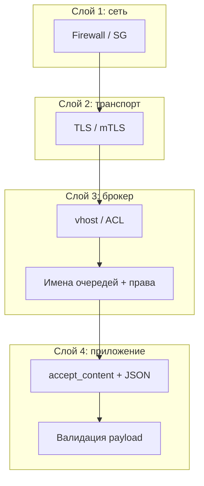
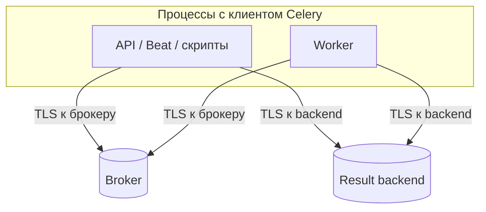
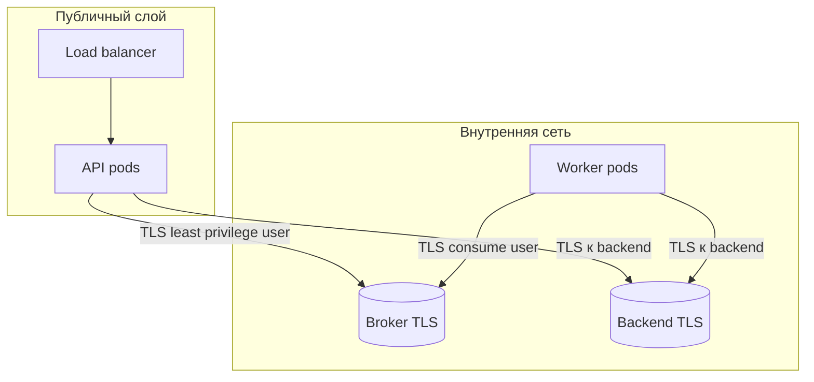
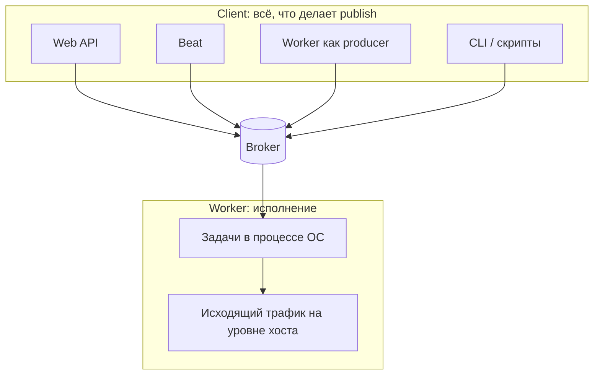

[← Назад к индексу части](index.md)
[↑ К глобальному плану](../mastery_plan.md)

## 17.3 Сетевой и инфраструктурный контур

### Цель раздела

Научиться **закрывать транспорт** между producer, broker, worker и result backend **шифрованием и сегментацией**, выдавать **минимальные права** и **управлять секретами** так, чтобы **ротация** не ломала кластер.

#### Проверь себя: формулировка цели §17.3

1. Почему в цели **четыре** имени ролей (producer, broker, worker, backend), а не «настроить RabbitMQ»?

<details><summary>Ответ</summary>

У каждого участника **свой** TCP-путь и **свои** секреты: забытый backend или producer (Beat) оставляет **неприкрытый** сегмент даже при идеальном брокере. Цель — **сквозная** карта соединений, не один компонент.

</details>

2. Как **ротация без поломки кластера** попадает в **ту же** цель, что и TLS?

<details><summary>Ответ</summary>

Оба — **операционная устойчивость** контура: TLS и ACL бесполезны, если команда **боится** менять пароль и годами держит скомпрометированный секрет. Плейбук ротации — часть **живой** сетевой политики.

</details>

3. Чем **«минимальные права»** отличаются от «сложный пароль»?

<details><summary>Ответ</summary>

Пароль отвечает **аутентификацию**; least privilege — **авторизацию после входа**: какие exchange/queue можно **read/write/configure**. Сильный пароль с правами **админа** на весь RabbitMQ — всё ещё катастрофа при утечке.

</details>

### В этом разделе главное

1. **TLS** до **брокера** и **отдельно** до **result backend** (два разных TCP-пути: `CELERY_BROKER_URL` и `CELERY_RESULT_BACKEND`) — защита от **пассивного** и **активного** перехвата в сети; **не** заменяет валидацию payload. ЗаTLS-ить только брокер и забыть Redis с результатами — типичный **пробел** в аудите.
2. **Сегментация**: отдельные **VPC/подсети**, security groups — брокер **не** торчит в интернет без необходимости.
3. **Отдельные пользователи и vhost** (RabbitMQ): права **configure/read/write** только на нужные **exchange/queue**; нет **глобального** админа у приложения.
4. **Redis**: по возможности **ACL**, отдельные пользователи, **отдельные** logical DB или ключевые префиксы + **не** `0.0.0.0` без пароля.
5. **Секреты** — из **Vault / K8s Secret / SSM**, не из git; **разные** пароли по окружениям.
6. **Ротация**: два активных секрета, поэтапное обновление worker/API, **короткоживущие** учётки где возможно.
7. **mTLS / mesh** — когда политика организации требует **взаимную** аутентификацию сервисов.
8. **Отдельные очереди** как граница ACL: учётка worker-а имеет `consume` только с **конкретных** имён очередей — это **дополняет** vhost и снижает риск «случайно прочитать чужое» при ошибке в роутинге.

#### Проверь себя: восьмерка «главное» §17.3

1. Почему пункт 1 требует **два** TLS-решения, а не «один раз включили TLS в кластере»?

<details><summary>Ответ</summary>

`CELERY_BROKER_URL` и `CELERY_RESULT_BACKEND` — **разные** TCP-сессии (часто разные хосты/порты); один защищённый путь **не** шифрует другой. Типичный пробел — RabbitMQ за TLS, Redis с результатами **без** `rediss://` или без проверки cert на втором клиенте.

</details>

2. Как пункты 3, 4 и 8 **вместе** реализуют least privilege **сильнее**, чем только «сложный пароль на брокер»?

<details><summary>Ответ</summary>

Пароль отвечает на «**кто** подключился»; vhost/ACL (3–4) и **узкие** имена очередей для consume (8) отвечают на «**что** можно делать после подключения». Компрометация одной учётки **не** должна давать админку всего брокера или чтение **всех** очередей.

</details>

3. Почему **короткоживущие** учётки (п. 6) упомянуты в **сетевой** главе, хотя это «про секреты»?

<details><summary>Ответ</summary>

Сеть определяет **кто достучался**; секрет определяет **авторизацию**. Короткий TTL секрета **сужает окно**, если трафик перехвачен или токен утёк из ENV — это связка **транспортной** модели и **операционной** гигиены, как и ротация без простоя.

</details>

### Термины

| Термин | Кратко |
|--------|--------|
| **TLS** | Криптографическая защита **канала**. |
| **mTLS** | Клиент и сервер предъявляют **сертификаты**. |
| **vhost** | Изолированное пространство имён в RabbitMQ. |
| **Security group / firewall** | Правила **кто к кому** может подключиться по сети. |

#### Проверь себя: термины §17.3

1. Чем **vhost** в RabbitMQ **принципиально** отличается от **префикса** в имени очереди?

<details><summary>Ответ</summary>

vhost — **жёсткая** граница имён и прав в модели брокера: пользователь одного vhost **не** видит ресурсы другого при корректных ACL. Префикс имени — **соглашение**; при ошибке прав или широком `set_permissions` можно **вылезти** за префикс.

</details>

2. Почему **TLS** и **mTLS** в терминах стоят **рядом**, но решают **разные** уровни доверия?

<details><summary>Ответ</summary>

TLS обычно подтверждает **сервер** для клиента; mTLS добавляет **проверку клиента** сервером (и иногда цепочку до PKI). Для Celery это влияет на то, **кто** может открыть соединение к брокеру **как легитимный** клиентский процесс.

</details>

3. Зачем **security group** относить к **той же** главе, что и TLS?

<details><summary>Ответ</summary>

Потому что это **независимые слои**: SG отвечает на «**кому разрешён TCP**», TLS — на «**кому доверять внутри** установленной сессии». Оба нужны в defense in depth.

</details>

### Теория и правила

**Defense in depth:** даже при ошибке в приложении **сеть** не должна позволять **любому** хосту достучаться до **6379/5672**.  
**Least privilege на брокере:** учётка worker-а может **consume** из очереди `tasks.compute`, но **не** объявляет произвольные exchange админом.  
**URL с паролем в ENV:** любой, кто видит `/proc/1/environ` в контейнере без hardening, видит пароль — ограничивайте **доступ к оркестратору** и **логам** (где ENV иногда печатают при старте).

**Namespaces (Redis и др.):** разделение **логическое** — другой **индекс DB** (`/1` vs `/2` в URL), **префикс ключей** `celery:` vs `app:` при общем Redis, **отдельный** ElastiCache cluster для Celery. Цель: компрометация или **flush** одного namespace **не** уничтожает сессии и кэш приложения (и наоборот).

#### Проверь себя: абзацы теории до слоёв L1–L4 §17.3

1. Почему **URL с паролем в ENV** упомянут в **сетевой** теории, хотя это «про секрет»?

<details><summary>Ответ</summary>

Секрет **привязан** к сетевому доступу: утечка ENV даёт **немедленную** возможность открыть TLS-сессию к брокеру от имени приложения. Защита — **не только** Vault, но и **кто** может читать `/proc`, логи старта pod, CI-артефакты.

</details>

2. Как **namespaces Redis** соотносятся с **defense in depth**, если TLS уже включён?

<details><summary>Ответ</summary>

TLS защищает **канал**; namespaces снижают **blast radius внутри** одного Redis при ошибке клиента, скрипте или **FLUSH** — данные Celery, кэш и сессии **не** должны быть одной **атомарной** жертвой.

</details>

3. Почему **least privilege на брокере** нельзя заменить только **firewall** «только worker подсеть»?

<details><summary>Ответ</summary>

Firewall режет **кто подключается**, но не **что делает** после подключения: скомпрометированный worker в разрешённой подсети с правами **админа** на RabbitMQ всё равно **уничтожает** топологию и читает чужие очереди. Нужны **оба** слоя.

</details>



**Два TLS-туннеля, не один:** `CELERY_BROKER_URL` и `CELERY_RESULT_BACKEND` — это **разные** сокеты (часто разные хосты/порты). В аудите и в Terraform/Helm нужно **два** решения: сертификаты, ACL, мониторинг срока действия cert — для **каждого** пути. Условная схема:



Если защищён только левый «луч», трафик к backend остаётся **читаемым** на сегменте сети или в зеркале — вместе с **результатами и traceback**.

#### Проверь себя: слои L1–L4 и два TLS-туннеля

1. На **каком слое** mermaid-диаграммы с L1–L4 живёт **`accept_content`**, и почему он там?

<details><summary>Ответ</summary>

На **слое приложения (L4)** — после того как сообщение **уже** прошло сеть, TLS и ACL брокера; это **логическая** граница десериализации и валидации, не сетевая.

</details>

2. Почему «**два TLS-туннеля**» важнее, чем «мы включили TLS в облачном провайдере»?

<details><summary>Ответ</summary>

Провайдерский TLS часто заканчивается на **балансировщике** или **другом** hop; для Celery нужно явно защитить **каждый** TCP-путь приложения к **broker** и к **result backend** (часто разные хосты/порты). Без второго луча результаты идут **открытым** текстом на участке.

</details>

3. Как **namespaces Redis** из текста связаны со **слоями** диаграммы?

<details><summary>Ответ</summary>

Namespaces — **не** замена TLS: это снижение **blast radius** и смешения зон доверия **внутри** одного сервиса Redis после того, как **сеть** (L1) и **ACL клиента** уже отработали; дополняет L3–L4 на уровне данных.

</details>

### Пошагово: чек-лист сетевой гигиены

1. Нарисуйте **все** TCP-пути к broker и backend.
2. Включите **TLS** на **брокере и на result backend**; в URL — `amqps://`, `rediss://` (или эквивалент для вашего стека), **отдельно** проверьте доверие к сертификату и имя хоста для **каждого** соединения.
3. Ограничьте **ingress** на порты **брокера и backend** списком security groups (только worker/API подсети).
4. Создайте **отдельные** пользователей: `app_publish`, `worker_consume`, **не** reuse одной учётки для админки Rabbit.
5. Вынесите пароли в **secret manager**; в CI используйте **OIDC** / краткоживущие токены вместо статичных паролей в переменных годами.
6. Запланируйте **ротацию**: новый пароль → обновить API → rolling worker → отключить старый.
7. Проверьте, что **мониторинг** (Flower, Prometheus exporter) **не** открывает **лишнего** (см. часть 14).

#### Проверь себя: пошаговый чек-лист сети §17.3

1. Зачем в шаге 1 явно **нарисовать все TCP-пути**, если в Helm уже есть один `broker_url`?

<details><summary>Ответ</summary>

Потому что **API**, **worker**, **beat** и **скрипты** могут идти **разными** сетевыми маршрутами к **broker** и **backend**; один URL в values **не** гарантирует, что вы учли **второй** хост Redis, **админский** порт, **mirror** трафика. Схема ловит «забытый» отрезок без TLS.

</details>

2. Почему шаг 7 (мониторинг) стоит **в том же** чек-листе, что и TLS к брокеру?

<details><summary>Ответ</summary>

Flower/exporter часто добавляют **второй HTTP/UI** к данным очередей и задач; при широком ingress это **новая** поверхность разведки и управления (см. **§17.1а**). Сетевая гигиена включает **наблюдаемость**, а не только 5672/6379.

</details>

3. Как шаг 4 (**разные пользователи publish/consume**) помогает при **компрометации только** API-процесса?

<details><summary>Ответ</summary>

Учётка с правом **только publish** **не** должна уметь **consume** административных очередей или **объявлять** топологию; атакующий ограничен **постановкой** (всё ещё опасно), но **не** получает полный контроль над **чтением** и **управлением**, как у «суперпользователя celery».

</details>

### Простыми словами

Брокер и (при отдельном URL) **result backend** — как **две базы**: их **не вывешивают** в интернет и **не дают** пароль админа приложению. Шифруют **дорогу** до **каждой** так же, как до PostgreSQL — это **два** решения, а не «раз TLS включили где-то».

### Картинка в голове

**Офис с пропусками:** TLS — **шифрованный коридор**; security groups — **турникеты**; учётка брокера — **пропуск только на этаж задач**, не на весь дом.



### Как запомнить

**TLS + firewall + узкие учётки** — три ноги **транспортной** безопасности.

### Примеры

**RabbitMQ:** пользователь `worker` с правами только на `vhost /prod` и очереди `celery.*`. Пользователь `beat` — только **publish** в нужный exchange.  
**Redis:** включён `--requirepass` + **rename** опасных команд или ACL без `FLUSHALL` для приложения.

**RabbitMQ: три полосы прав `set_permissions` (идея).** У каждой учётки три regex-шаблона: **configure**, **write**, **read** по ресурсам (exchange, queue, binding). Worker-у часто нужны **пустой** configure (или минимальный), **write+read** только на нужные имена; админская учётка — **не** в приложении.

```text
# Псевдоним команды (имена vhost/user подставь свои):
# rabbitmqctl set_permissions -p <vhost> <user> "<conf>" "<write>" "<read>"

# Пример философии: worker не объявляет произвольные топологии
# conf = ""  или очень узкий шаблон
# write/read = "^celery\\.prod\\..*"  (уточняйте под ваши имена очередей)
```

Точные шаблоны зависят от того, **создаёт** ли приложение очереди само или они **pre-declared** инфраструктурой (IaC). Ошибка «слишком широкий `.*`» на configure — частый **провал** аудита.

**Секреты через Vault / K8s Secret / SSM (дополнение к плану).** Практика: приложение при старте **читает** секрет из API менеджера, **не** кладёт его в образ; в логах — только факт «подключились к брокеру», **не** сам URL. **Dynamic database/broker credentials** (TTL, lease) уменьшают окно компрометации, но требуют **переподключения** worker при смене пароля — согласуйте с плейбуком ротации §17.3а.

### Практика / реальные сценарии

- **Kubernetes:** broker как **ClusterIP** или за **internal LB**; наружу **только** через VPN/bastion для админов.
- **Multi-region:** TLS обязателен **между** регионами; иначе **компрометация** одного сегмента сети раскрывает трафик.

#### Проверь себя: примеры RabbitMQ/Redis и секреты §17.3

1. Почему **пустой или узкий `configure`** в `set_permissions` — типичная рекомендация для worker-а?

<details><summary>Ответ</summary>

Чтобы worker **не** мог объявлять произвольные exchange/очереди и **не** расширял топологию при компрометации; топологию задаёт **IaC** или админ, а приложение только **пишет/читает** согласованные имена.

</details>

2. Чем **опасна** строка «ключ шифрования helm values лежит рядом в репо» **помимо** утечки пароля брокера?

<details><summary>Ответ</summary>

Это ломает **модель секретов**: любой с доступом к git получает **и** ciphertext, **и** средство расшифровки; фактически это **plaintext** для практичного атакующего. Нужны KMS/Vault и **разделение** ключа и данных.

</details>

3. Зачем в примере Redis упомянуты **rename опасных команд** или **ACL без FLUSHALL**?

<details><summary>Ответ</summary>

Чтобы при компрометации **одного** клиента приложения или ошибке скрипта **не** уничтожить весь инстанс и **соседние** данные (сессии, кэш, результаты Celery). Это **ограничение ущерба**, не замена пароля.

</details>

### Типичные ошибки

- «У нас private network, TLS не нужен» — **инсайдеры**, **скомпрометированный** pod, **логирование** трафика на зеркале.
- Одна учётка `celery` с правами **администратора** на весь RabbitMQ.
- Пароль broker в **helm values**, закоммиченных в git «в зашифрованном виде», но ключ рядом.

### Что будет, если…

- …брокер **без пароля** внутри VPC? Любой **под** в сети может **публиковать** — lateral movement после **одного** RCE в любом сервисе.
- …утёк **TLS не настроен**, перехват на пути? Утечка **аргументов задач** и **учётных данных** из handshake.

#### Проверь себя: типичные ошибки и сценарии §17.3

1. Почему аргумент «**private network — TLS не нужен**» из типичных ошибок **не** сводится к параноидальному threat model?

<details><summary>Ответ</summary>

В большой VPC **много** доверенных по оргструктуре процессов; **любой** скомпрометированный pod — кандидат на доступ к брокеру при слабых SG. Плюс **инсайдеры**, зеркалирование трафика, ошибочные **пиринги**. TLS даёт **конфиденциальность на проводе** даже «между своими».

</details>

2. Сопоставь **два** сценария из «Что будет, если…» с пунктами **L1** и **L2** диаграммы слоёв §17.3.

<details><summary>Ответ</summary>

Брокер **без пароля** в VPC — провал **L1** (кто угодно в сегменте открывает TCP и говорит с брокером). Перехват **без TLS** — провал **L2** на участке сети: трафик читается при доступе к пути, даже если SG «узкие».

</details>

3. Почему **пароль в helm values + ключ рядом** хуже, чем просто «пароль в git»?

<details><summary>Ответ</summary>

Создаётся **иллюзия** секретности (values «зашифрованы»), но **фактически** любой с git получает и ciphertext, и средство расхода — то же, что plaintext для практичной атаки, плюс **ложное** спокойствие при аудите.

</details>

#### Проверь себя: интеграция раздела §17.3

1. Чем **сегментация сети** дополняет TLS, а не «дублирует» его?

<details><summary>Ответ</summary>

TLS защищает **конфиденциальность и целостность** на канале для **легитимных** участников, которые **уже** могут установить соединение. Сегментация **ограничивает**, **кто вообще** может открыть TCP-сессию к брокеру. Без сегментации при **компрометации** любого узла в большой сети атакующий **достучится** до брокера; с сегментацией поверхность **меньше**.

</details>

2. Зачем **разные** пользователи для publish и consume, если оба «внутренние»?

<details><summary>Ответ</summary>

Чтобы **компрометация** только API-процесса (где есть publish) **не** давала автоматически права **управлять** очередями или **читать** всё подряд, если модель прав разделена; и наоборот — компрометация worker **не** обязана позволять **публиковать** произвольные сообщения в **административные** exchange. Это **blast radius** и принцип наименьших привилегий.

</details>

3. Почему ротация секретов требует **плана для worker-ов**, а не только API?

<details><summary>Ответ</summary>

Worker-ы **долгоживущие** и держат **пул соединений** к брокеру со **старым** паролем. Если обновить пароль на брокере **мгновенно** для всех, worker-ы **массово** отвалятся до рестарта — это **простой** обработки. Нужен **поэтапный** rollout или поддержка **двух** паролей на стороне брокера в переходный период.

</details>

### Запомните

**Сеть и учётки** — то, что отделяет **ваш** Celery от **чужого** доступа. TLS без узких ACL — **полумера**.

Официальную модель **брокер / клиент (все publisher-ы) / worker** — в **§17.3д** сразу после углублений по TLS, mesh и ротации сертификатов.

#### Проверь себя: запомните и метафора офиса §17.3

1. Почему **«TLS без узких ACL»** названо **полумерой**, если TLS уже шифрует трафик?

<details><summary>Ответ</summary>

Потому что **любой** процесс в сети, которому разрешён TCP к брокеру, может **установить** шифрованную сессию и **атаковать учётными данными** или украденным клиентским cert; узкие ACL и раздельные пользователи **сужают**, кто вообще может говорить с брокером.

</details>

2. Как **метафора «офис с пропусками»** соотносится с **mTLS**?

<details><summary>Ответ</summary>

Пропуск на вход — не только «знать пароль», но и **удостовериться**, что посетитель **тот**, за кого себя выдаёт: mTLS добавляет **взаимную** проверку сертификатов поверх «шифрованного коридора».

</details>

3. Зачем в конце «Запомните» отсылка к **§17.3д** **после** сетевых настроек?

<details><summary>Ответ</summary>

Потому что даже идеальная сеть **не** закрывает риск **легитимной** публикации с **компрометированного клиента** (API, Beat): модель **брокер/клиент/worker** возвращает к **не-сетевым** границам доверия.

</details>

---

### Углубление 17.3а: ротация credentials без простоя (плейбук)

**Цель:** обновить пароль или сертификат к брокеру **без** одновременного «все worker-ы отвалились».

**Вариант A — два пользователя на брокере.**

1. Создать `app_user_v2` с **теми же** правами, что у `app_user_v1`.
2. Rolling deployment API: `BROKER_URL` с **v2**.
3. Дождаться стабильности метрик publish (нет всплесков `Connection refused`).
4. Rolling worker-ы на URL с **v2**.
5. На RabbitMQ/Redis проверить отсутствие активных клиентов от **v1** (management UI, `CLIENT LIST`).
6. Удалить или отключить `v1`.

**Вариант B — окно обслуживания.** Допустимо только при малом контуре и явном согласовании SLO.

#### Проверь себя: ротация credentials §17.3а

1. Почему при ротации важен мониторинг **и** API, **и** worker-ов?

<details><summary>Ответ</summary>

API без worker-ов — **рост очереди** и латентность; worker-ы без валидного publish — реже, но при **beat** или **других** producer-ах возможны **частичные** сбои. Полный контур требует **проверки всех** ролей, которые держат соединение к брокеру.

</details>

2. Почему вариант **«окно обслуживания»** (вариант B) всё ещё фигурирует в плейбуке, хотя его избегают?

<details><summary>Ответ</summary>

На малом контуре или при **жёстком** лимите времени иногда дешевле **согласованный** простой, чем поддерживать **два** пользователя и сложный rollout. В учебном тексте важно **не** выдавать «только вариант A» за единственную реальность — и явно маркировать цену простоя и риска.

</details>

3. Как **dynamic credentials** (Vault lease) усложняют ротацию **именно** для Celery?

<details><summary>Ответ</summary>

Долгоживущие worker-ы держат **открытое** соединение со **старым** паролем; при истечении lease без **переподключения** или **grace** на брокере получается **массовый** обрыв. Нужен **плейбук**: сигнал на reload, два валидных секрета в переход, алёрты на `AuthenticationFailure`.

</details>

---

### Углубление 17.3б: mTLS и service mesh

**mTLS** — клиент и сервер **оба** предъявляют сертификаты. Нужен при политике **взаимной** аутентификации и строгом zero-trust.

**С mesh (sidecar):** TLS часто **заканчивается** на Envoy/Linkerd; до брокера — трафик **внутри** pod. Модель угроз: компрометация **sidecar** или **локального** сокета критична.

**Без mesh:** приложение Celery настраивает SSL-контекст для `amqps://` / `rediss://` с **клиентским** ключом — ответственность **в приложении** и в **ротации** cert в каждом образе/volume.

#### Проверь себя: mTLS и service mesh §17.3б

1. Назови **один** плюс и **один** минус termination TLS на sidecar для Celery.

<details><summary>Ответ</summary>

Плюс: **единая** политика сертификатов и observability на уровне mesh, приложению проще. Минус: **новая** критическая зависимость и **другая** граница доверия (plaintext localhost к брокеру внутри pod — если так сделано).

</details>

2. В какой ситуации **mTLS до брокера из приложения** всё ещё нужен, если mesh уже «закрыл» трафик между сервисами?

<details><summary>Ответ</summary>

Когда брокер **вне** mesh или termination происходит **раньше**, чем вы думаете (например, sidecar ↔ приложение plaintext, а до RabbitMQ идёт **отдельный** hop). Нужна **сквозная** карта: кто проверяет cert **на каждом** TCP-отрезке.

</details>

3. Почему компрометация **sidecar** в модели угроз приравнивается к серьёзному инциденту для Celery?

<details><summary>Ответ</summary>

Sidecar видит **весь** локальный трафик приложения к брокеру/backend и может **терминировать** TLS; при взломе — **перехват или подмена** без взлома самого Python-процесса. Это расширяет поверхность **инфраструктуры** рядом с приложением.

</details>

---

### Углубление 17.3в: TLS в конфигурации Celery (ориентиры)

Celery/Kombu обычно принимают SSL через **URL** (`amqps://`, `rediss://`) и/или словари **`broker_use_ssl`**, **`redis_backend_use_ssl`** (имена и поля зависят от версии и транспорта — сверяйтесь с документацией вашей ветки). Инженерно важно зафиксировать:

- **Проверка сервера:** `cert_reqs`, доверенный CA (корпоративный корень в trust store образа).
- **Клиентский сертификат** для mTLS: путь к cert/key или PEM в secret volume.
- **SNI / hostname check:** отключать проверку hostname «для простоты» — **опасно** (MITM).

**Простыми словами:** не только «включили TLS», а **как именно** Python проверяет, что перед ним **настоящий** RabbitMQ, а не прокси злоумышленника.

#### Проверь себя: TLS в конфигурации Kombu/Celery §17.3в

1. Зачем в одном абзаце упомянуты и **`rediss://`**, и **`redis_backend_use_ssl`** (или аналоги)?

<details><summary>Ответ</summary>

Потому что **брокер** и **result backend** могут быть **разными** Redis или одним кластером, но **разными** URL; параметры TLS к ним задаются **независимо** в конфигурации. Путаница «настроили SSL в одном месте» часто оставляет **второй** клиент без проверки cert.

</details>

2. Чем **опасна** практика отключить **проверку hostname** при сохранённом шифровании трафика?

<details><summary>Ответ</summary>

Атакующий в пути может предъявить **валидный** cert на **другое** имя или подставить узел, если клиент не сверяет, что подключился **к тому** хосту, который ожидался. Шифрование есть, **привязки к нужному** серверу — нет; это упрощает MITM и wrong-server подключения.

</details>

3. Как **mTLS** на уровне приложения Celery соотносится с **mTLS в service mesh** (кратко)?

<details><summary>Ответ</summary>

В mesh TLS часто **заканчивается** на sidecar; до брокера из приложения может идти уже **другой** отрезок (иногда plaintext внутри pod). Нужно понимать **где** заканчивается доверие к cert и **кто** отвечает за проверку — приложение, sidecar или оба. См. **§17.3б**.

</details>

---

### Углубление 17.3г: ротация сертификатов при mesh / корпоративной PKI

В отличие от пароля брокера, **сертификаты** имеют **Not After**. Плейбук:

1. **Два доверенных корня или перекрывающиеся cert:** новый серверный cert выкатывается **до** истечения старого; клиенты доверяют **обоим** цепочкам в переходный период.
2. **Автоматическое обновление** cert в pod (cert-manager, SPIFFE) + **перезапуск** worker при смене файла (или hot reload, если поддерживается вашим стеком).
3. **Алерт за 30/14 дней** до истечения **каждого** cert, который держит Celery-клиент.
4. **Регрессионный тест:** staging с **тем же** режимом TLS, что прод.

#### Проверь себя: ротация сертификатов и PKI §17.3г

1. Почему «отключили verify потому что самоподписанный cert» в prod — **хуже**, чем кажется?

<details><summary>Ответ</summary>

Потому что без проверки цепочки любой узел, способный **подставить** свой cert в пути (MITM в скомпрометированной сети, поддельный DNS), выглядит для клиента **допустимым**. Вы теряете **аутентификацию сервера**; шифрование без доверия к peer часто **иллюзорно**.

</details>

2. Зачем в плейбуке пункт **«регрессионный тест на staging с тем же TLS»** рядом с алёртом по сроку cert?

<details><summary>Ответ</summary>

Срок — про **календарь**; регрессия — про **конфигурацию**: неправильный cipher, забытый intermediate, несовместимость версии OpenSSL после обновления образа. Иначе вы «вовремя» обновили файлы, но **сломали** половину worker-ов в момент переключения.

</details>

3. Как **перекрывающиеся цепочки доверия** (два корня / два серверных cert) снижают риск при ротации?

<details><summary>Ответ</summary>

Клиенты, ещё **не** обновившие trust store, продолжают доверять **старой** цепочке, пока новая уже выкатывается; после миграции старую убирают. Это уменьшает **одномоментный** отказ всех соединений Celery к брокеру.

</details>

---

### Углубление 17.3д: три зоны ответственности — брокер, клиент, worker

В [официальном руководстве по безопасности](https://docs.celeryq.dev/en/stable/userguide/security.html) Celery явно делит тему на **брокер**, **клиент** и **worker**. Это удобная рамка для чек-листа: ошибка «мы заTLS-или RabbitMQ» **не закрывает** дыры в двух других зонах.

**Клиент** в терминологии Celery — **любой** код, который **публикует** сообщения в брокер: веб-приложение, **Beat**, другой **worker**, вызвавший `delay`, админский **shell**, **скрипт миграции**. Если брокер закрыт идеально, но **HTTP API** позволяет анониму вызвать внутренний эндпоинт «поставь задачу X с этими kwargs», защита брокера **не сработает** — сообщение **легитимно** пройдёт от вашего же приложения.

**Worker** — процесс с **правами ОС**, как у любого долгоживущего сервиса: файловая система, память, **исходящая сеть** (тот же доступ, что у машины/под-а, если не режете firewall-ом). При **prefork** дочерние процессы после `fork()` **наследуют** адресное пространство родителя; утечки чувствительных данных между задачами в **одном** дочернем процессе — отдельный класс рисков (см. часть 8 курса). Снижение blast radius: **non-root**, ограничение **egress** с пода/ВМ, `max_tasks_per_child` / лимиты памяти, минимальный образ.



**Простыми словами:** брокер — **таможня**; клиент — **кто подаёт декларации**; worker — **склад, где распаковывают груз**. Укрепить только таможню, оставив дырявым **офис оформления** (API), бессмысленно.

#### Проверь себя: брокер, клиент, worker (официальная модель) §17.3д

1. Почему **внутренний** микросервис, который ставит задачи в общую очередь, — это всё равно **«клиент»** с точки зрения модели угроз Celery?

<details><summary>Ответ</summary>

Потому что он **публикует** в брокер. Если его скомпрометировали или он **ошибочно** доверяет входным данным, он может стать **каналом** постановки произвольных сообщений. Безопасность брокера не отменяет необходимости **авторизации и валидации** на стороне каждого такого producer-а.

</details>

2. Назови **две** меры на уровне **worker/хоста**, не связанные напрямую с TLS к брокеру.

<details><summary>Ответ</summary>

Например: запуск **не от root**; **ограничение исходящих** соединений (egress firewall / NetworkPolicy); **read-only** корень файловой системы контейнера; лимиты **cgroup** на память/CPU; периодический **перезапуск** дочерних процессов (`max_tasks_per_child`) для снижения утечек. Достаточно двух осмысленных мер из этого ряда.

</details>

3. Почему **идеально заTLS-енный брокер** не спасает от сценария «открытый эндпоинт API ставит любую задачу»?

<details><summary>Ответ</summary>

Сообщение **легитимно** публикуется **вашим** приложением после HTTP; TLS к брокеру защищает **канал**, но не **авторизацию** и **валидацию** на границе HTTP. Модель Celery явно выделяет **клиента** как зону ответственности — см. текст выше про «офис оформления».

</details>

---
