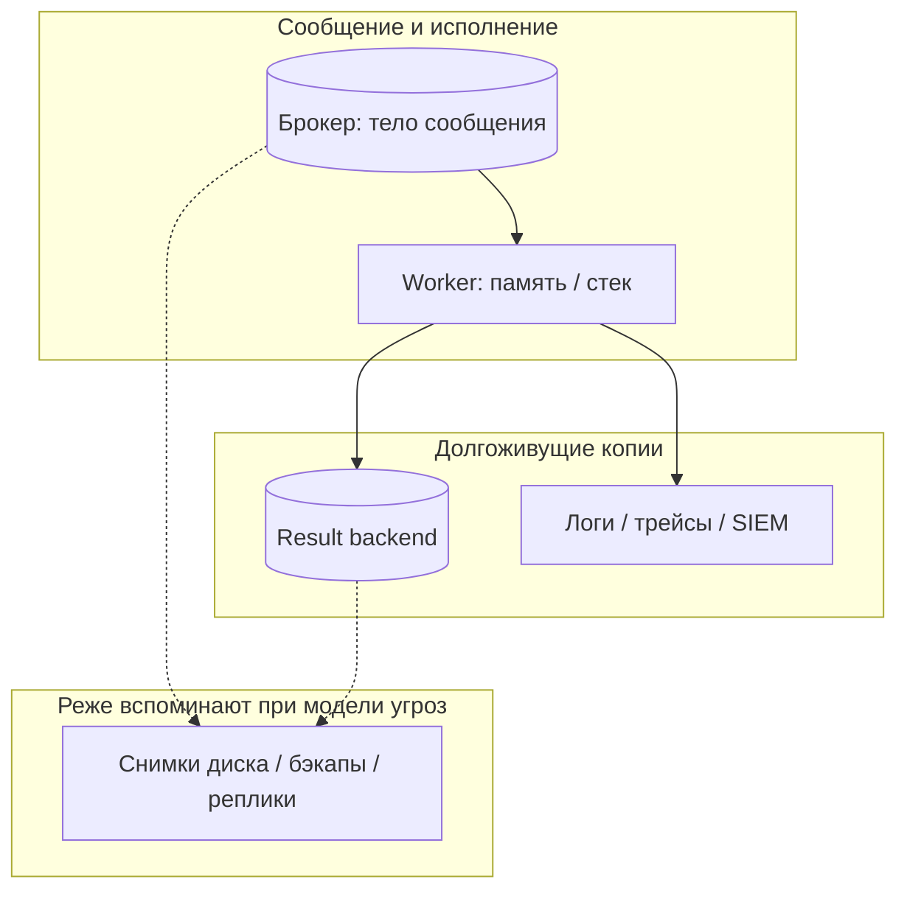

[← Назад к индексу части](index.md)
[↑ К глобальному плану](../../mastery_plan.md)

## 17.4 Защита данных в сообщениях, результатах и логах

### Цель раздела

Снизить **риск утечки** персональных и конфиденциальных данных через **payload**, **результаты**, **traceback** и **логи**, ввести **ретеншн** и **очистку**.

#### Проверь себя: формулировка цели §17.4

1. Почему в цели перечислены **и** payload, **и** логи — разве это не «разные системы»?

<details><summary>Ответ</summary>

С точки зрения субъекта данных и compliance это **один** жизненный цикл: одно и то же поле может оказаться в брокере, backend, **и** в строке ELK. Политика минимизации и retention должна быть **сквозной**.

</details>

2. Что означает **«ввести ретеншн»** помимо настройки `result_expires`?

<details><summary>Ответ</summary>

Согласованные сроки для **логов**, **APM**, **бэкапов** и тикетов поддержки; иначе короткий Redis **не** отменяет годовые индексы с PII (**§17.4а**).

</details>

3. Почему **traceback** выделен **отдельно** от «результатов задач»?

<details><summary>Ответ</summary>

Traceback часто содержит **код, пути, SQL, repr объектов** — отдельный канал разведки и утечки, который попадает **и** в backend при ошибке, **и** в логи; его нужно **нормализовать** на API и в обработчиках, а не только урезать `return`.

</details>

### В этом разделе главное

1. **Минимизация данных:** в сообщение кладём **идентификаторы**, а не **объекты с PII**; тяжёлые данные — из **БД/S3** по id.
2. **Результаты задач** в backend могут **дольше жить**, чем кажется — **TTL**, `result_expires`, периодическая чистка.
3. **Traceback** содержит **фрагменты кода и данных** — не отдавайте **сырой** traceback клиенту; в проде — **обобщённое** сообщение + id инцидента.
4. **Логи:** структурированные, с **allow-list** полей; **никогда** не логировать **пароли, токены, полный** HTTP body.
5. **Маскирование:** email/телефон → `u***@domain`, последние 4 цифры карты и т.д.
6. **Retention:** политика «сколько держим результаты и логи» согласована с **legal/compliance**.

#### Проверь себя: шестёрка «главное» §17.4

1. Свяжи пункты **1** и **3**: почему минимизация в kwargs **не** отменяет риска **traceback**?

<details><summary>Ответ</summary>

Даже при id вместо объекта исключение может вывести **SQL**, **путь к файлу**, **repr** загруженной сущности из стека. Traceback — **отдельный** канал утечки; нужны **обработчики**, фильтры и **не** отдавать сырой стек клиенту.

</details>

2. Как пункт **6** (retention + compliance) **пересекается** с пунктом **2** (TTL результатов)?

<details><summary>Ответ</summary>

`result_expires` задаёт **технический** срок в backend; compliance задаёт **юридический** срок и процедуры **удаления субъекта** во **всех** копиях (логи, APM, бэкапы). Оба должны быть **согласованы**: короткий Redis **не** отменяет длинный retention в SIEM.

</details>

3. Почему пункт **4** (логи) упоминает **HTTP body** отдельно от «kwargs задачи»?

<details><summary>Ответ</summary>

Запрос к API часто логируют **целиком** в middleware **до** постановки в Celery; там же могут быть **пароли** и **токены**, которые **никогда** не попадали в kwargs. Это **второй** сток PII, не заменяемый настройками только `celery.task`.

</details>

### Термины

| Термин | Кратко |
|--------|--------|
| **Data minimization** | Берём **минимум** данных для цели. |
| **TTL / result_expires** | Время жизни записи результата. |
| **Redaction** | Вырезание/замена чувствительных фрагментов. |

#### Проверь себя: термины §17.4

1. Чем **data minimization** в Celery отличается от «у нас в БД мало колонок»?

<details><summary>Ответ</summary>

Минимизация касается **всех копий** данных: kwargs в брокере, **return** в Redis, **traceback**, **логи** и **трейсы**. Схема БД — лишь один слой; Celery **размножает** снимки в транзите и в backend.

</details>

2. Почему **TTL** и **`result_expires`** упомянуты в одном термине **слэшем**?

<details><summary>Ответ</summary>

Оба задают **ограниченное время жизни** артефакта результата: `result_expires` — настройка Celery к ключам backend, TTL — **общий** рычаг Redis/политики ключей. В аудите проверяют **оба** и их **согласованность** с продуктом.

</details>

3. **Redaction** vs **encryption** логов — что первично в типичном контуре?

<details><summary>Ответ</summary>

**Redaction/минимизация** первичны: не собирать PII в агрегатор. Шифрование at-rest логов **дополняет** для compliance, но **не** отменяет необходимость **не писать** секреты в строку.

</details>

### Теория и правила

**Сообщение в брокере** может **персиститься** (зависит от настроек и типа доставки). Считайте, что **всё**, что вы положили в payload, **потенциально** останется на диске брокера **какое-то время**.  
**Result backend** часто **ключ → значение**; утечка дампа Redis = **утечка** всех непросроченных результатов.  
**Логи** агрегируются в ELK/Loki — **долгоживущие** и **индексируемые**; одна строка с PII = **масштаб** инцидента.

**Куда «течёт» чувствительное (одна схема для аудита):** payload проходит **брокер** и память **worker**; **результат и ошибка** оседают в **result backend**; **копии** часто оказываются в **логах/APM** и в **бэкапах** брокера/Redis. Политика защиты должна закрывать **каждый** сток, а не только «мы не шлём пароль в kwargs».

#### Проверь себя: три абзаца теории до mermaid PII §17.4

1. Почему фраза «считайте, что payload **потенциально** останется на диске брокера» важна для **юристов**, а не только для SRE?

<details><summary>Ответ</summary>

Персистентные очереди и бэкапы брокера создают **долгоживущие копии** PII вне приложения; для DPIA и ответов регулятору нужно учитывать **этот** сток, а не только «сообщение обработали и забыли».

</details>

2. Чем **утечка дампа Redis** с результатами принципиально похожа на утечку **БД приложения**?

<details><summary>Ответ</summary>

Оба — **key-value / табличные** снимки состояния: в value лежат **сериализованные** бизнес-данные и ошибки; ACL и TTL к Redis должны быть **такого же** класса внимания, как к основной БД.

</details>

3. Зачем вводный абзац перед диаграммой **явно** называет **бэкапы** брокера/Redis?

<details><summary>Ответ</summary>

Операционные runbook-и часто чистят **живые** системы, но **забывают** cold storage; инцидент «утёк бэкап» возвращает данные, которые в prod уже **удалили**. Это часть той же **модели угроз**, что пунктир **cold** на схеме ниже.

</details>



#### Проверь себя: поток PII и «холодные» копии

1. Зачем на схеме пунктиром выделен блок **cold** (снимки, бэкапы)?

<details><summary>Ответ</summary>

Потому что при инциденте «утёк бэкап брокера/Redis» данные **возвращаются** даже после очистки **живых** систем; политика retention и **шифрование** бэкапов — часть той же модели угроз, что и TTL в runtime.

</details>

2. Почему **память worker** на схеме — отдельный узел между брокером и backend?

<details><summary>Ответ</summary>

В процессе исполнения **расшифрованные** аргументы и промежуточные структуры живут в RAM и стеке; **core dump**, отладчик или утечка через **логирование исключения** могут скопировать их **вне** контролируемых хранилищ.

</details>

3. Какой **вывод для runbook-а** из стрелки `W --> LOG`?

<details><summary>Ответ</summary>

Любая настройка логирования задач должна учитывать, что worker **пишет** в поток то, что вы явно или неявно включили (`exception`, контекст); нужны **фильтры** и **сэмплирование** до попадания в SIEM.

</details>

### Пошагово: защита данных

1. Пройдитесь по всем `@app.task`: какие поля в **args/kwargs**?
2. Замените передачу **объектов** на **id** + загрузка в worker из **закрытой** БД.
3. Настройте `result_expires` / backend TTL согласно продукту (коротко для чувствительного).
4. В **exception handler** задачи: логируйте **incident_id**, не **сырой** PII из контекста.
5. Включите **фильтр** в logging `Filter`, который режет ключи `password`, `token`, `authorization`.
6. Согласуйте с **compliance** срок хранения логов и **анонимизацию** при экспорте.

#### Проверь себя: пошагово §17.4

1. Почему шаг 2 («id + БД в worker») **связан** с шагом 4 (exception handler)?

<details><summary>Ответ</summary>

Меньше данных в kwargs → меньше **случайного** попадания PII в текст исключения и стек; при ошибке загрузки по id проще вернуть **обезличенную** ошибку с `incident_id`, не разворачивая весь объект пользователя в лог.

</details>

2. Зачем **шаг 5** (logging Filter) **после** шага 4, а не вместо него?

<details><summary>Ответ</summary>

Filter — **сеть безопасности** на границе логгера; handler в задаче должен **изначально** не класть секреты. Полагаться только на regex — **хуже**, чем не генерировать чувствительные строки.

</details>

3. Что проверить по **шагу 6** при запросе субъекта данных на **удаление** (GDPR)?

<details><summary>Ответ</summary>

Все **индексы** и **реплики** логов, **APM**, возможные **экспорты** в data lake, **тикеты** поддержки с вложениями — не только Redis и брокер. Нужен **реестр** стоков данных из шага 6 и §17.4а.

</details>

### Простыми словами

**Не пишите секреты на стикерах и не кладите их в конверт с задачей для кухни.** Кухня (worker) всё прочитает; конверт могут **потерять** (логи, backend, дамп брокера).

### Картинка в голове

**Почтовый ящик с прозрачными конвертами** — брокер и логи. **Непрозрачный конверт** — шифрование **полезной нагрузки** (если нужно по модели угроз); **лучше** — **пустой конверт**: только номер заказа.

### Как запомнить

**ID вместо объекта; TTL на результат; лог без секретов.**

### Примеры

```python
import logging
import re

class RedactFilter(logging.Filter):
    _email = re.compile(r"[A-Za-z0-9._%+-]+@[A-Za-z0-9.-]+\.[A-Za-z]{2,}")

    def filter(self, record):
        if isinstance(record.msg, str):
            record.msg = self._email.sub("[REDACTED_EMAIL]", record.msg)
        return True

# logging.getLogger("celery.task").addFilter(RedactFilter())
```

```python
# celery.py
app.conf.result_expires = 3600  # секунд; подберите под риск и UX
```

Расширенная **таблица маскирования** по типам полей — в **§17.4д** (после углублений по retention, cleanup и минимизации traceback).

#### Проверь себя: примеры RedactFilter и result_expires

1. Почему **regex email** в примере Filter — **недостаточен** как единственная защита?

<details><summary>Ответ</summary>

Он не ловит **JSON-поля**, вложенные структуры, **токены** без `@`, PII в **бинарных** вложениях; плюс ложные срабатывания. Нужны **ключевые** фильтры и **минимизация** до логирования.

</details>

2. Как **`result_expires = 3600`** соотносится с **UX** poll статуса длинной задачи?

<details><summary>Ответ</summary>

Если задача длится **дольше** часа, клиент может получить «результат пропал», хотя задача **ещё** в работе или только завершилась. Нужно **согласовать** TTL с **SLA** задачи, хранить **статус** в БД отдельно или **продлевать** ключи по политике продукта.

</details>

3. Почему пример Filter **не** подключает логгер в коде (строка закомментирована)?

<details><summary>Ответ</summary>

Чтобы подчеркнуть: точка подключения зависит от **структуры** проекта и **имён** логгеров Celery; важно **явно** выбрать, к какому logger-у цеплять Filter, иначе фильтр **не** увидит сообщения задач.

</details>

### Практика / реальные сценарии

- **GDPR:** пользователь просит **удаление** — нужно знать, **где** его email мог оказаться (логи задач отправки письма, результат «sent=True»).
- **Отладка:** временно поднять логирование — только с **сэмплированием** и **без** production PII.

### Типичные ошибки

- Класть в kwargs **словарь профиля пользователя** «чтобы удобнее».
- Возвращать из задачи **полный** объект с **внутренними** полями — потом это **читают** через `AsyncResult`.
- Писать `logger.exception` с **контекстом**, где лежит **токен** стороннего API.

### Что будет, если…

- …результаты **без TTL** в Redis? **Рост** памяти + **долгая** утечка при компрометации.
- …клиенту отдать **traceback**? **Карта** кода, путей, версий библиотек — **разведка** для атаки.

#### Проверь себя: практика GDPR и отладка §17.4

1. Почему сценарий **GDPR-удаления** из практики требует **реестра стоков**, а не только «почистим Redis»?

<details><summary>Ответ</summary>

Email и статусы могли уйти в **логи отправки**, **результат** `sent=True`, **тикеты** поддержки и **экспорты**; Redis — одна точка. Без инвентаризации стоков удаление субъекта **неполное** и **регуляторно** рискованное.

</details>

2. Как **сэмплированный** debug в проде снижает риск по сравнению с «включили DEBUG на час»?

<details><summary>Ответ</summary>

Меньше **объём** строк с PII в агрегаторе за тот же интервал; сохраняется **статистическая** полезность для расследований. Полный DEBUG на всех воркерах **размножает** чувствительные копии **быстро** и **предсказуемо** для инцидента.

</details>

3. Сопоставь **типичную ошибку** «полный объект в return» с **двумя** пунктами из «Что будет, если…».

<details><summary>Ответ</summary>

Полный объект в **return** удлиняет жизнь PII в **result backend** без TTL/минимизации → сценарий **роста памяти и утечки при компрометации** Redis. Плюс при ошибке сериализации/логирования тот же объект ближе к **traceback** и разведке.

</details>

#### Проверь себя: интеграция раздела §17.4

1. Почему **передача только id** безопаснее, чем передача **сериализованного пользователя**, даже при JSON?

<details><summary>Ответ</summary>

Потому что **объём и чувствительность** данных в полёте меньше, проще **ретеншн** и **удаление** по запросу субъекта данных, меньше риск **случайно** залогировать лишнее. Данные подтягиваются в worker из **контролируемого** источника с **актуальными** правами доступа, а не «снимок» на момент постановки.

</details>

2. Чем **result backend** опасен с точки зрения **PII**, если пользователь **не** вызывает `get()` на результат?

<details><summary>Ответ</summary>

Данные всё равно **записаны** в хранилище и могут попасть в **дамп**, **реплику**, **бэкап**, **доступ админа** или **ошибочно** широкий ACL. «Не читаем через API» ≠ «данных нет».

</details>

3. Зачем **incident_id** в логах вместо полного контекста?

<details><summary>Ответ</summary>

Чтобы **связать** записи в логах и тикете **без** раскрытия PII в централизованном хранилище логов. Полный контекст можно хранить **в защищённом** тикете/сессии отладки с **ограниченным** доступом.

</details>

### Запомните

**Данные в Celery — в трёх местах: очередь, backend, логи.** Все три нужно **урезать, ограничить по времени и чистить**.

Ниже углубления **§17.4а–е** идут **в учебном порядке** (ретеншн → at-rest → cleanup → минимизация traceback → маскирование → целостность логов).

#### Проверь себя: метафоры и «три места» §17.4

1. Чем **прозрачные конверты** (метафора) отличаются от тезиса «шифруем payload»?

<details><summary>Ответ</summary>

Прозрачность — про **множество наблюдателей** (брокер, логи, админы): даже при шифровании **на канале** копии могут быть **в открытом** виде в логах или дампах. Метафора подталкивает к **минимизации**, а не только к TLS.

</details>

2. Почему формула **«три места»** **не** включает явно **APM**?

<details><summary>Ответ</summary>

APM в учебном тексте **вложен** в «логи и наблюдаемость» как **ещё один сток** копий; в §17.4а он вынесен **отдельной** строкой таблицы. В голове держите **четыре+** стока, если используете трейсинг.

</details>

3. Как **«ID вместо объекта»** из «Как запомнить» снижает нагрузку на **шаги 1–3 пошагово**?

<details><summary>Ответ</summary>

Меньше полей для инвентаризации, меньше **объёма** в брокере и backend, проще **TTL** и **удаление** по субъекту данных — одна дисциплина вместо «чистим везде огромный dict».

</details>

---

### Углубление 17.4а: retention по типам хранилищ

| Где лежит | Что именно | Рычаги | Типичный риск |
|-----------|------------|--------|----------------|
| **Брокер (персистентные очереди)** | Тела сообщений до consume | TTL сообщений, политики очереди, lazy queues | Долгий **хвост** PII на диске |
| **Result backend** | Результаты, traceback в value | `result_expires`, TTL ключей Redis, фоновая чистка | **Забытые** ключи месяцами |
| **Логи (Loki/ELK)** | Строки с kwargs/trace | Retention индекса, sampling | **Долгоживущие** копии для аудита |
| **APM / трейсы** | Атрибуты спанов | Scrubbing чувствительных тегов | Утечка через **метаданные** |

**Простыми словами:** настроили `result_expires`, но логи живут **год** — для compliance вы **всё равно** храните PII.

#### Проверь себя: retention по типам хранилищ §17.4а

1. Почему **APM / трейсы** вынесены в эту таблицу **рядом** с логами и брокером?

<details><summary>Ответ</summary>

Потому что в **атрибутах спанов** часто копируют **идентификаторы**, флаги, фрагменты запросов — те же **метаданные**, что и в логах. Отдельная политика **scrubbing** и retention для трейсов нужна, иначе «мы почистили Redis» **не** отменяет PII в Jaeger/Tempo.

</details>

2. В чём **противоречие** между коротким `result_expires` и **долгим** retention логов с точки зрения расследования инцидента?

<details><summary>Ответ</summary>

Короткий TTL в backend **снижает** окно утечки через Redis, но **следы** ошибки могли уже уйти в **логи** на год. Для расследования нужны **согласованные** политики: что хранится **где**, с какой **детализацией** и как **связать** incident_id без PII в агрегаторе.

</details>

3. Зачем для **брокера** отдельно упомянуты **lazy queues** как рычаг?

<details><summary>Ответ</summary>

Они влияют на то, **как долго** и **где** персистятся тела сообщений при высокой нагрузке, и на **пиковое** использование диска. Для модели угроз важно: сообщения с PII могут **дольше** лежать на носителе, чем ожидает «средняя» очередь в памяти.

</details>

---

### Углубление 17.4б: шифрование at-rest

**Брокер и Redis:** шифрование тома (EBS, PVC), политики облака. **Секрет в том:** at-rest **не** заменяет TLS и **не** мешает **легитимному** приложению читать данные — при RCE в worker-е данные **доступны** в открытом виде.

**Жёсткий compliance:** не класть чувствительное в value backend; хранить **идентификатор** объекта в KMS-шифрованном хранилище.

#### Проверь себя: at-rest и KMS §17.4б

1. Почему **шифрование диска** Redis не является «полной защитой данных» в Celery?

<details><summary>Ответ</summary>

Worker и API **читают** Redis по сети с правами приложения; при компрометации процесса атакующий получает **уже расшифрованные** данные через **тот же** клиент. Дисковое шифрование важно для **кражи носителя** и части офлайн-дампов, но не заменяет **минимизацию**, **ACL**, **ретеншн** и **безопасность кода**.

</details>

2. Когда **KMS-шифрованное хранилище** по id вместо PII в kwargs **уместнее**, чем «просто включили TLS к Redis»?

<details><summary>Ответ</summary>

Когда политика требует **контроль ключей**, **аудит** доступа к объекту и **минимизацию** копий: в сообщении и backend живёт только **opaque id**, а расшифровка — в **узком** сервисе с отдельными логами и политикой. TLS защищает **передачу**, но не **содержимое** при компрометации worker-а или дампа Redis.

</details>

3. Почему фраза «at-rest не мешает легитимному приложению читать данные» важна для **оценки риска RCE в задаче**?

<details><summary>Ответ</summary>

Любой код в worker-е — **легитимный клиент** хранилищ с точки зрения шифрования диска; он получит **plaintext** через драйверы и API. Значит, at-rest — **не** аргумент против минимизации payload и ограничения прав процесса.

</details>

---

### Углубление 17.4в: политики cleanup и операционная гигиена

**Retention** без **механизма удаления** превращается в обещание на бумаге. Практические рычаги:

| Что чистим | Как (ориентиры) |
|------------|-----------------|
| **Результаты в Redis/Memcached** | `result_expires`, TTL на ключах, периодический `celery -A app purge` **осторожно** (только осознанно для нужных очередей) |
| **Сообщения «зависшие» в брокере** | TTL сообщений, DLQ-политика, мониторинг depth + алёрты |
| **Логи** | Индексный lifecycle в ELK/OpenSearch, retention в Loki |
| **Старые chord/group метаданные** | Зависит от backend; убедитесь, что chord cleanup не течёт годами (см. части 10, 13) |

**Опасная операция:** `celery purge` **без** указания очередей в многотенантном контуре может **снести** работу соседей. Всегда **имя очереди**, **dry-run** где возможно, **runbook** с двойным подтверждением.

**Безопасный ответ клиенту при ошибке задачи.** В API не отдавайте **сырой** traceback Celery. Паттерн: `{ "ok": false, "error_code": "TASK_FAILED", "incident_id": "uuid", "message": "Попробуйте позже" }`. Внутренний лог — полный id задачи + ссылка на трейс в APM **с доступом по роли**.

#### Проверь себя: таблица cleanup и паттерн API §17.4в

1. Почему в таблице **chord/group метаданные** отнесены к **отдельной** строке, а не к «результаты в Redis»?

<details><summary>Ответ</summary>

Состояние canvas может жить **в других** ключах и с **другой** семантикой TTL, чем простой `AsyncResult`; «забытый» chord удерживает **память и метаданные** backend даже при коротком `result_expires` у обычных задач. Нужен **отдельный** аудит (части 10, 13).

</details>

2. Зачем в паттерне ответа клиенту **три** поля (`error_code`, `incident_id`, `message`), а не одна строка «ошибка»?

<details><summary>Ответ</summary>

`error_code` — **стабильный** класс для клиентской логики без утечки внутренностей; `incident_id` — **сквозной** ключ для SRE без PII в публичном JSON; `message` — **безопасная** формулировка для пользователя. Разделение снижает риск смешать **поддержку** и **публичный** контракт.

</details>

3. Как **DLQ** в таблице связана с **безопасностью**, а не только с надёжностью?

<details><summary>Ответ</summary>

Зависшие сообщения с PII **дольше** лежат в брокере; DLQ + TTL + мониторинг depth ограничивают **окно** утечки при компрометации брокера и **объём** данных в персистентных очередях.

</details>

#### Проверь себя: TTL, incident_id и purge §17.4в

1. Почему **TTL в Redis** для результатов **не** заменяет политику **логов**?

<details><summary>Ответ</summary>

Потому что это **разные** системы: результат мог **истечь** в Redis, а **та же** ошибка с фрагментом PII уже ушла в **централизованные логи** и живёт там по **своему** retention. Нужны **обе** политики и **согласованный** учёт для GDPR/удаления субъекта.

</details>

2. Почему **безопасный ответ API** с `incident_id` связан с **cleanup** и **не** только с UX?

<details><summary>Ответ</summary>

Без стабильного **incident_id** поддержка и SRE тянут **сырой** traceback или kwargs в тикеты и чаты — **новые копии** PII вне контролируемых систем. Хороший ответ клиенту **направляет** расследование в каналы с RBAC и retention.

</details>

3. В чём **операционный** риск `celery purge` в многотенантном контуре **сильнее**, чем удаления по TTL?

<details><summary>Ответ</summary>

`purge` — **массовая** и **синхронная** операция по очереди(ям); ошибка в имени может **снести** чужую работу **мгновенно**, без естественного истечения сообщений. TTL и таргетированная политика обычно **предсказуемее** для соседей.

</details>

---

### Углубление 17.4г: минимизация traceback и «лишнего» в result backend

План отдельно требует **минимизировать результаты и traceback** — не только «не показывать клиенту», но и **не хранить** лишнее без нужды.

| Рычаг | Смысл |
|-------|--------|
| **`task_ignore_result=True`** (или вызов без сохранения результата, если сценарий позволяет) | Нет записи в backend — **нет** утечки через `task_id` |
| **Короткий `return`** | Вместо большого dict — `{"status": "ok", "ref": "internal-id"}` |
| **Обработка исключений в задаче** | Перехват ожидаемых ошибок, **не** пробрасывать в Celery сырой контекст с PII |
| **Кастомный `on_failure` / логирование** | В backend и публичный API уходит **обезличенная** ошибка; детали — только в защищённый канал |
| **Не логировать `exc_info` с kwargs** | `logger.exception` часто тянет **строки запросов** из замыкания |

**Связь с платформой (см. глобальный план курса, блок про ОС и контейнер):** worker **не root**, read-only root filesystem где возможно — чтобы компрометация задачи **не** давала записи в образ и **не** упрощала пост-эксплуатацию.

#### Проверь себя: платформа (worker / контейнер) §17.4г

1. Почему **non-root** в контейнере относится к **§17.4**, а не «только к DevOps»?

<details><summary>Ответ</summary>

Потому что при утечке PII через traceback или файл злоумышленник с правами root может **смонтировать** или **прочитать** больше хоста и **закрепиться**; снижение прав **сужает** последствия той же утечки данных.

</details>

2. Что даёт **read-only root FS** в связке с **минимизацией traceback**?

<details><summary>Ответ</summary>

Даже если в ошибке виден **путь** или гаджет, запись **в образ** или подмена **бинарников** на диске усложняется; это **замедляет** пост-эксплуатацию после первичной ошибки или инъекции.

</details>

3. Как **эта связка** сочетается с **§17.3** (egress)?

<details><summary>Ответ</summary>

Это разные слои: **egress** режет **сеть**, read-only и non-root — **файловую систему и UID**. Вместе они снижают blast radius **после** компрометации задачи, когда данные уже могли **утечь** в лог.

</details>

#### Проверь себя: рычаги таблицы result backend §17.4г

1. Почему **`task_ignore_result`** полезен **с точки зрения безопасности**, а не только производительности?

<details><summary>Ответ</summary>

Потому что **не создаётся** запись в result backend с **результатом или ошибкой** — меньше **поверхность утечки** при украденном/подобранном `task_id` и меньше **чувствительных** артефактов в Redis при дампе.

</details>

2. Как **`on_failure` / обработка исключений** в задаче снижает риск по сравнению с «пусть Celery сам сериализует исключение»?

<details><summary>Ответ</summary>

Сырое исключение тянет **строки аргументов**, контекст SQL, пути файлов — всё это оказывается в **backend** и иногда в **логах** мониторинга. Явный перехват позволяет вернуть **обезличенную** ошибку и залогировать детали **только** в защищённый канал.

</details>

3. Почему **`logger.exception` с kwargs** упомянут отдельной строкой в таблице рычагов?

<details><summary>Ответ</summary>

`exc_info=True` сериализует стек и **часто** подмешивает **repr** объектов из замыкания и локальных переменных — неожиданная утечка токенов и PII **вне** явного `log.info(payload)`.

</details>

---

### Углубление 17.4д: маскирование типовых полей (шпаргалка)

План отдельно выделяет **masking/redaction** в логах. Ниже — ориентиры «**что** режем»; конкретные regex зависят от локали и формата логов.

| Тип данных | Пример до | Пример после | Замечание |
|------------|-----------|--------------|-----------|
| Email | `user@mail.com` | `u***@mail.com` или `[EMAIL]` | Не оставлять полный локальный ящик |
| Телефон | `+7 900 123-45-67` | `+7 *** **-45-67` или `[PHONE]` | Последние 2–4 цифры — по политике |
| PAN карты | `4111 1111 1111 1111` | `4111********1111` | Лучше **не** логировать вообще |
| JWT / Bearer | `Bearer eyJhbG...` | `[TOKEN]` | Длина токена уже утечка |
| API key в query | `?key=sk_live_xxx` | `?key=[REDACTED]` | Часто ловится в access-логах прокси |
| Пароль в JSON | `"password":"secret"` | `"password":"***"` | Фильтр по **ключам**, не только по regex |

**Практика:** для structured logging (JSON-строка в лог) удобнее **список запрещённых ключей** (`password`, `token`, `secret`, `authorization`, `cookie`) и рекурсивный обход dict **до** сериализации в строку — так не зависите от порядка полей в сообщении.

#### Проверь себя: таблица masking и structured logging §17.4д

1. Почему маскировать **только email regex-ом** в строке лога **недостаточно** для API-ключей в JSON?

<details><summary>Ответ</summary>

Потому что ключ может быть в **значении** поля с **безобидным** именем (`"data": "sk_live_..."`) или в **URL** внутри строки. Нужны **слои**: фильтр ключей, отдельные паттерны для известных форматов секретов, политика **не логировать** сырой HTTP body.

</details>

2. Зачем в практике рекомендован **рекурсивный обход dict до сериализации**, а не один regex по финальной строке?

<details><summary>Ответ</summary>

Структура может быть **вложенной**; порядок полей в JSON **не гарантирован**; одна regex по строке легко **пропускает** вложенный объект или ловит **ложные срабатывания**. Обход по ключам стабильнее для **structured logging**.

</details>

3. Почему **маскирование email** до `u***@domain` может быть **недостаточно** для строгого compliance, даже если regex сработал?

<details><summary>Ответ</summary>

По домену и частичному локальному имени иногда **восстанавливают** субъекта; политика может требовать **полной** замены токеном или **отсутствия** email в логах вообще. Маскирование — компромисс; истинная минимизация — **не писать** поле.

</details>

---

### Углубление 17.4е: логи как доказательная база — доступ и подмена

Официальная документация Celery напоминает: логи бесполезны для расследования взлома, если ими **легко манипулировать**. На практике это значит:

- **Централизованная** доставка (syslog / агент → Loki / ELK / облачный log sink) с **ограниченным** доступом к приёмнику;
- **Отдельная** учётка и сеть для сервера логов; нельзя править индекс с **того же** скомпрометированного worker-а без второго фактора;
- Для параноидального уровня — **целостность** (WORM-хранилище, подпись батчей, SIEM с независимым хранением) — по политике организации.

Это **не** заменяет redaction PII (§17.4д), а **дополняет**: сначала **не логируем** лишнее, затем **защищаем** то, что всё же нужно для эксплуатации.

#### Проверь себя: централизация и целостность логов §17.4е

1. Почему **локальный** файл лога на том же диске, что и приложение, — слабое звено при пост-эксплуатации?

<details><summary>Ответ</summary>

Потому что атакующий с правами процесса или пользователя приложения может **стереть** или **подменить** файл, скрыв следы или вставив ложные записи. Централизованный приёмник с **отдельными** ACL и немедленной отправкой событий **сложнее** «зачистить» с одной машины.

</details>

2. Как **redaction PII** и **целостность логов** соотносятся — что первично?

<details><summary>Ответ</summary>

Первично **не собирать** лишнее (минимизация + redaction): иначе «целостность» сохраняет **слишком много** чувствительного. Целостность/WORM/SIEM **дополняют** для расследований по **уже допустимому** набору полей.

</details>

3. Почему **отдельная учётка** на приёмник логов должна быть **недоступна** с того же worker-а, который пишет бизнес-логи?

<details><summary>Ответ</summary>

Иначе при RCE в задаче атакующий может **писать** в поток логов или **подделывать** доставку так, что агрегатор воспринимает события как легитимные. Разделение учёток и сетевых путей увеличивает **стоимость** сокрытия инцидента.

</details>

---
