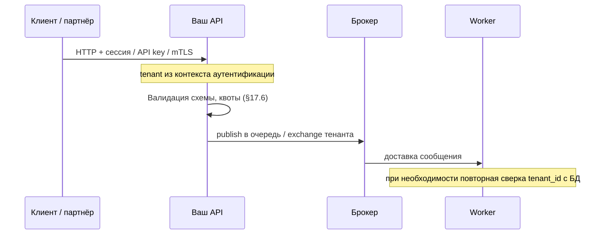
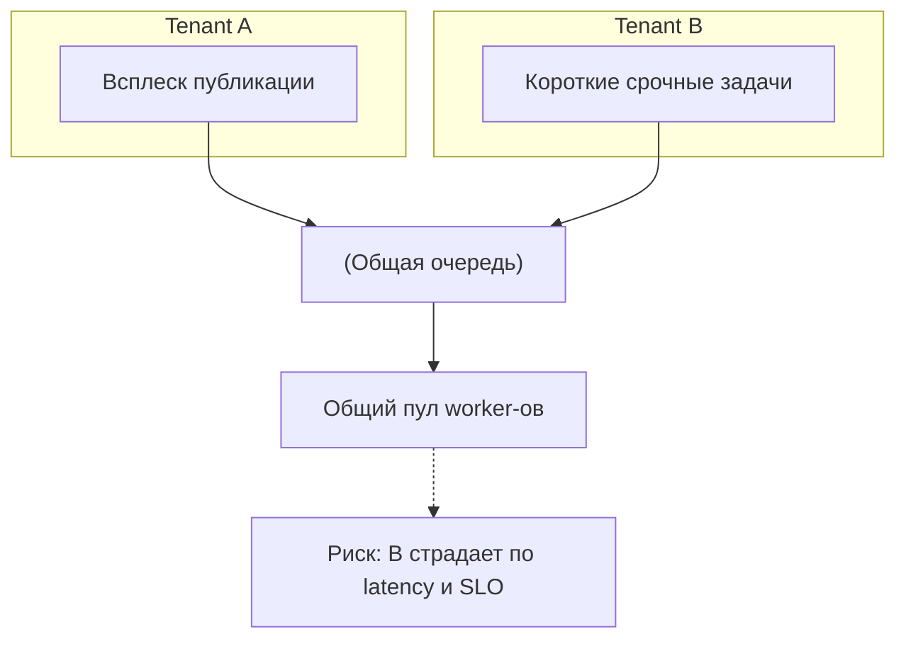
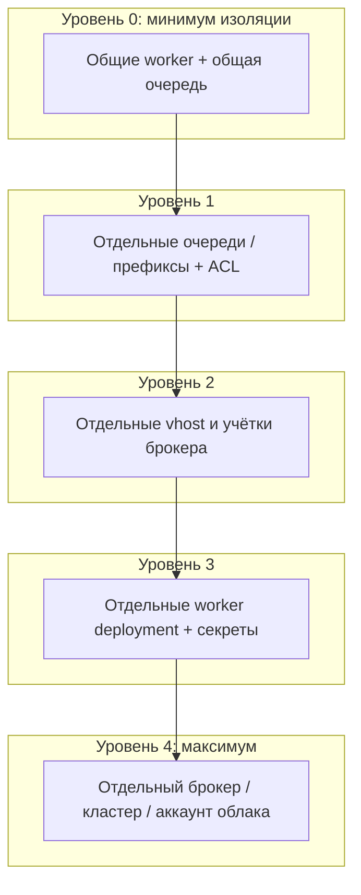

[← Назад к индексу части](index.md)
[↑ К глобальному плану](../../mastery_plan.md)

## 17.5 Multi-tenant и zero-trust сценарии

### Цель раздела

Научиться **изолировать** нагрузку и данные **разных клиентов** (или продуктов) в общем Celery-контуре и понимать **пределы** изоляции при **общих worker-ах**.

### В этом разделе главное

1. **Изоляция очередей по tenant:** отдельные **имена очередей** или **префиксы** + **роутинг**; лучше — **отдельные vhost** или даже **кластеры** при жёстких compliance-требованиях.
2. **Разные credentials:** учётка брокера tenant A **не** читает очереди tenant B.
3. **Noisy neighbor:** один клиент может **забить** общие worker-ы; нужны **лимиты**, **отдельные пулы**, **fair queues** (см. части 12, 16).
4. **Shared workers** выполняют **один и тот же код** и **одинаковые** секреты (ключи API, доступ к БД) — это **не** полная изоляция как у отдельных деплойментов.
5. **Zero-trust** в терминах Celery: **каждый** producer **аутентифицируется** и **авторизован** на **конкретные** очереди; **нет** доверия «раз внутри k8s».
6. **Данные:** tenant id в payload **валидируется** и **сверяется** с контекстом безопасности, а не «передали строкой и поверили».

#### Проверь себя: шестёрка «главное» §17.5

1. Почему **п.1** (очереди) **без** **п.4** (shared workers) даёт **ложное** чувство изоляции?

<details><summary>Ответ</summary>

Очереди разделяют **поток задач**, но один deployment worker-а делит **код, ENV и доступ к БД** между тенантами; уязвимость в задаче одного клиента бьёт по **общему** процессу и секретам.

</details>

2. Как **п.3** (noisy neighbor) **связывает** §17.5 с §17.6 **до** чтения про ingress?

<details><summary>Ответ</summary>

Даже при корректных ACL один тенант может **забить** общие ресурсы **объёмом** работы; без квот и отдельных пулов это **деградация и DoS по SLO** для соседей — предмет **лимитов** на входе и топологии.

</details>

3. Сформулируй **одним предложением**, чем **п.5** (zero-trust) **усиливает** **п.2** (разные credentials).

<details><summary>Ответ</summary>

Разные пароли задают **границу учёток**; zero-trust требует **проверять каждый publish и содержимое**, а не считать «раз внутри mesh — свой». Вместе это и **ACL**, и **семантика** доверия.

</details>

### Термины

| Термин | Кратко |
|--------|--------|
| **Tenant** | Изолированный клиент/организация в одной платформе. |
| **Blast radius** | Насколько широко **распространяется** компрометация. |
| **Zero-trust** | Нет неявного доверия по «внутренности» сети; **проверка** на каждом шаге. |

#### Проверь себя: термины multi-tenant §17.5

1. Чем **tenant** в смысле этой главы отличается от просто «поля `tenant_id` в JSON»?

<details><summary>Ответ</summary>

Tenant — это **модель изоляции** на уровне очередей, учёток, деплойментов и данных; строка в JSON без привязки к **аутентифицированному** контексту — лишь **ярлык**, который легко подменить.

</details>

2. Почему **blast radius** важнее обсуждать вместе с Celery, а не только для «взлома сайта»?

<details><summary>Ответ</summary>

Компрометация worker-а или брокера размножает **параллельное** исполнение и **распространяет** доступ к секретам и БД на **все** задачи процесса; масштаб ущерба **шире**, чем у одного HTTP-запроса.

</details>

3. В двух словах: что **нельзя** делать, если вы заявляете «у нас zero-trust», но брокер принимает publish **без** проверки прав на exchange/queue?

<details><summary>Ответ</summary>

Нельзя **считать** внутренние сервисы доверенными по умолчанию: любой скомпрометированный pod сможет **поставить** чужую работу или **читать** чужие очереди — это **ломает** определение zero-trust для контура сообщений.

</details>

### Теория и правила

**Истина про shared workers:** процесс worker — **единая** среда исполнения. Если задача для tenant A может вызвать код, который читает **глобальный** секрет платформы, то **логическая** изоляция только очередями **недостаточна** при **уязвимости** или **злонамеренной** задаче внутри **вашего** кода (supply chain, инсайдер). Для **строгой** изоляции нужны **отдельные** деплойменты worker-ов с **разными** env и **разными** доступами к данным.

**Практичный компромисс:**  
- **Отдельные очереди + отдельные worker deployment** на класс SLA или на группу тенантов.  
- **Один** кодовый образ, но **разные** `CELERY_QUEUES` и **разные** секреты через **external secret** per deployment.

#### Проверь себя: shared workers и практичный компромисс §17.5

1. Почему **один образ** с **разными** секретами per deployment **не** отменяет риска **shared code**?

<details><summary>Ответ</summary>

Один и тот же **байткод** и зависимости во всех deployment: уязвимость или **злонамеренный** пакет в образе бьёт **все** группы тенантов, даже если ENV разный. Секреты режут **доступ к данным**, но не **весь** supply chain и не **все** логические баги.

</details>

2. Когда **отдельные очереди без отдельных worker** — **осознанный** компромисс, а не ошибка?

<details><summary>Ответ</summary>

При низком **регуляторном** риске, **однородных** тенантах и строгих **квотах**/наблюдаемости, когда cost отдельных deployment не оправдан, а данные в задачах **уже** строго изолированы запросами к БД с **tenant_id** из доверенного контекста. Всё равно документируйте **пределы** изоляции.

</details>

3. Как **«истина про shared workers»** связана с **§17.1** (supply chain)?

<details><summary>Ответ</summary>

Оба тезиса про **один процесс / один образ**: компрометация зависимости или кода задачи влияет на **всех** потребителей этого deployment-а; изоляция только очередями **не** разделяет **исполняемый** слой.

</details>

### Пошагово: проектирование multi-tenant

1. Классифицируйте тенантов по **риску** и **нагрузке** (tiering).
2. Для **high-risk** — выделенные worker-ы и **отдельный** vhost/аккаунт брокера.
3. В payload **обязательный** `tenant_id`; в задаче — проверка против **доверенного** источника (не подменяемый клиентом без подписи).
4. Введите **квоты**: максимум задач в минуту на tenant на уровне API (§17.6).
5. Мониторинг **per-tenant** метрик: depth очереди, ошибки, latency.
6. Документируйте **модель угроз**: что произойдёт при **компрометации** одного tenant API-ключа.

**Поток zero-trust для постановки задачи (внешний клиент):** идентичность и **tenant** фиксируются на **доверенном** API, а не переносятся из сырого JSON как истина.



Если клиент присылает `tenant_id` в теле и API **копирует** его в kwargs без проверки — zero-trust **нарушен**: достаточно подменить строку в запросе.

#### Проверь себя: пошаговое проектирование и sequenceDiagram §17.5

1. Зачем в шаге 3 payload помечен как **обязательный** `tenant_id`, если очередь уже роутится по тенанту?

<details><summary>Ответ</summary>

Очередь режет **маршрутизацию**, но задача всё равно должна **явно знать** контекст для запросов к БД и логики; без **согласованной** проверки `tenant_id` против доверенного источника возможны **ошибки** или **обход** при replay и внутренних вызовах.

</details>

2. Почему **квоты на API** (шаг 4) отнесены к §17.5, хотя подробнее они в §17.6?

<details><summary>Ответ</summary>

Multi-tenant **не работает** без ограничения noisy neighbor на **входе**; без квот один тенант **забивает** общий контур **до** того, как сработают лимиты worker-а. §17.6 детализирует механики, §17.5 — **место** в модели изоляции.

</details>

3. На диаграмме: почему **недостаточно**, что `tenant` «виден» только в `Note over API`, если дальше в kwargs он всё равно попадает в брокер?

<details><summary>Ответ</summary>

Важно **откуда** взят tenant: из **сессии/API key/mTLS** на доверенном API, а не из сырого тела. Иначе злоумышленник подставит **чужой** id, и сообщение **легитимно** дойдёт до worker-а с неверным контекстом.

</details>

### Простыми словами

**Общая кухня с одним поваром** — все заказы видны на одном столе. **Разные окна выдачи (очереди)** помогают, но **повар** всё равно один: если ему дали **универсальный** доступ к холодильнику, **все** ингредиенты доступны. Для **банков** часто нужны **отдельные кухни** (кластеры).

### Картинка в голове

**Квартиры в одном доме:** стены между квартирами — **vhost и учётки**; **общий подвал** — shared worker с общими ключами — **слабое место**.

**Noisy neighbor на одной очереди** (когда план требует явно понимать эффект):



**Меры:** отдельные **очереди** и **worker-ы** под SLA, **fair dispatch** где поддерживается транспортом, **квоты** ingress per tenant (§17.6), **алёрты** на рост depth по меткам очереди.

**Уровни изоляции (выбери сознательно):**



Чем **правее** по схеме, тем **выше** cost и **ниже** blast radius; для регулируемых данных почти всегда нужен минимум **уровень 2–3**.

#### Проверь себя: noisy neighbor и уровни изоляции §17.5

1. На схеме **общая очередь**: почему **короткие** задачи tenant B могут **страдать**, хотя они «лёгкие»?

<details><summary>Ответ</summary>

Потому что узкое место — **очередь и пул worker-ов**: при всплеске A сообщения B **ждут** дольше в хвосте независимо от **длительности** одной задачи; растёт **latency** и нарушается SLO.

</details>

2. Чем **уровень 3** принципиально сильнее **уровня 1** с хорошими ACL на одном vhost?

<details><summary>Ответ</summary>

Отдельный deployment worker-ов + **разные секреты** ограничивают **процесс и ENV**: даже при ошибке маршрутизации или баге в коде **меньше** шансов, что задача получит **те же** ключи к БД, что и другой тенант.

</details>

3. Почему «**уровень 4**» в схеме — не каприз enterprise, а иногда **регуляторное** требование?

<details><summary>Ответ</summary>

Отдельный брокер/кластер даёт **жёсткую** границу данных и аудита: нет общего **персистентного** хранилища сообщений и метаданных между клиентами, что упрощает **доказуемость** изоляции для compliance.

</details>

### Как запомнить

**Очереди режут нагрузку; отдельные worker + секреты режут blast radius.**

#### Проверь себя: метафоры кухня и дом §17.5

1. В метафоре **«один повар»** что символизирует **холодильник с универсальным доступом**?

<details><summary>Ответ</summary>

**Shared worker** с **общими** секретами и строками подключения к БД: любая задача теоретически дотягивается до **ингредиентов** всех тенантов на уровне процесса, даже если **лотки** (очереди) подписаны по-разному.

</details>

2. Чем **«квартиры в одном доме»** отличается от **уровней 0–4** на схеме ниже?

<details><summary>Ответ</summary>

Метафора даёт **интуицию** про vhost vs подвал; уровни 0–4 — **инженерная** шкала cost vs изоляция. На экзамене нужно уметь **перевести** «нам нужен отдельный подвал» в «нужен минимум уровень 3» или отдельный кластер (**уровень 4**).

</details>

3. Почему **noisy neighbor** на диаграмме показан **до** блока «уровни изоляции»?

<details><summary>Ответ</summary>

Сначала читатель видит **симптом** (общая очередь → страдает B), затем — **иерархию лечения**. Так проще **мотивировать** переход вправо по уровням, а не воспринимать уровни как абстракцию без боли.

</details>

### Примеры

**Маршрутизация по tenant (упрощённо):**

```python
def route_task(name, args, kwargs, options, task=None, **kw):
    tenant = kwargs.get("tenant_id")
    if not tenant:
        return {"queue": "celery.default"}
    return {"queue": f"tenant.{tenant}.tasks"}

app.conf.task_routes = (route_task,)
```

На практике **ограничьте** множество имён очередей (не бесконечный динамический список без автоматизации), используйте **пулы** `tenant.tier1.*`, `tenant.tier2.*`.

**Ограничения при shared workers (явный список из плана).** Если **один** деплоймент worker-ов обслуживает несколько тенантов или типов задач, считайте, что:

1. **Одинаковые секреты в ENV** — все задачи **теоретически** могут дотянуться до тех же ключей API и строк подключения к БД, что прописаны в этом deployment.
2. **Один процесс = один уровень ОС** — уязвимость или `exec` в **любой** задаче бьёт по **всему** процессу (и соседним greenlet/thread в зависимости от пула).
3. **Нет «жёсткой» изоляции CPU/RAM** между задачами внутри одного worker-процесса без внешних cgroup-лимитов на pod.
4. **Квоты только очередями** не мешают **одному** тенанту положить **огромные** сообщения, если лимит размера не на **уровне API** (§17.6).
5. **Compliance «выделенный инстанс»** часто требует **отдельных** worker + broker namespace, а не только префикса имени.

#### Проверь себя: маршрутизация и ограничения shared workers §17.5

1. В примере `route_task`: какая **операционная** угроза в **бесконечном** множестве имён очередей `tenant.{id}.tasks`?

<details><summary>Ответ</summary>

Рост числа очередей **раздувает** конфиг брокера, усложняет **ACL и мониторинг**, даёт **утечки** ресурсов (пустые очереди), открывает путь к **DoS** через создание миллионов имён. Нужны **пулы** tier и автоматизация жизненного цикла.

</details>

2. Почему пункт **«один процесс = один уровень ОС»** в списке ограничений важен для **безопасности**, а не только стабильности?

<details><summary>Ответ</summary>

RCE или произвольный код в **одной** задаче наследует **память и права** процесса worker-а — в том числе доступ к **секретам в ENV** и соседним **потокам** в пуле. Это прямой рост **blast radius** при уязвимости.

</details>

3. Как пункт про **огромные сообщения** связан с тезисом «квоты только очередями недостаточны»?

<details><summary>Ответ</summary>

Очередь может **принять** немного сообщений, но каждое **гигантское** — это RAM/диск брокера и десериализация на worker-е. Лимит нужен на **API** (размер тела) и на **поля** payload, см. §17.6.

</details>

### Практика / реальные сценарии

- **B2B SaaS:** enterprise-клиент требует **выделенный** инстанс — отдельный Helm release worker-ов + broker namespace.
- **Малый SaaS:** один кластер, но **жёсткие** квоты и **отдельные** очереди по `tenant_id` + **алёрты** на аномалии.

### Типичные ошибки

- Думать, что **префикс** в имени очереди = **безопасность** без ACL на брокере.
- Передавать `tenant_id` от клиента **без** проверки на API и ожидать, что worker «как-нибудь» разберётся.
- **Один** Redis DB на всё: кэш, сессии, Celery — смешение **зон доверия**.

### Что будет, если…

- …**shared worker** и **SQL-инъекция** в коде задачи? Потенциально **все** данные, доступные этому worker-у, не только одного тенанта (если нет **строгой** фильтрации в запросах).
- …**noisy neighbor** без лимитов? **SLA** остальных клиентов рушится — **репутационный** и **контрактный** ущерб.

#### Проверь себя: практика и антипаттерны §17.5

1. В сценарии **B2B SaaS / малый SaaS** из текста: что **общего** в защите, кроме масштаба инфраструктуры?

<details><summary>Ответ</summary>

И там нужны **учётные границы**, **квоты** или алёрты на аномалии и **осознанный** выбор уровня изоляции; разница в том, **насколько далеко** вправо по схеме уровней вы готовы зайти за cost.

</details>

2. Почему ошибка «**префикс в имени очереди = безопасность**» опасна **именно** при RabbitMQ?

<details><summary>Ответ</summary>

Имя — не **ACL**: без раздельных **прав пользователя брокера** конкурент или ошибка конфига может **publish/consume** в чужой ресурс с похожим паттерном. Нужны **permissions** на vhost/exchange/queue.

</details>

3. Почему **один Redis** на кэш, сессии и Celery нарушает идею **разделения зон доверия**?

<details><summary>Ответ</summary>

Утечка или ключ с широким доступом открывает **сразу** несколько классов данных; компрометация одного паттерна ключей может **затронуть** и результаты задач, и сессии. Разные **instance/DB/prefix+ACL** снижают коррелированный риск.

</details>

#### Проверь себя: интеграция раздела §17.5

1. Почему **отдельные очереди** не дают **полной** изоляции данных?

<details><summary>Ответ</summary>

Потому что **исполнитель** (worker) и **код**, **секреты** и **подключения к БД** часто **общие**. Очередь управляет **маршрутизацией работы**, но не **моделью доступа к данным** внутри процесса. Полная изоляция требует **разделения** процессов/кластеров и **разных** учётных данных к хранилищам.

</details>

2. Что означает **zero-trust** для **публикации** задачи из микросервиса A в очередь сервиса B?

<details><summary>Ответ</summary>

Сервис A **не** считается безопасным только потому, что в той же сети: брокер (или шлюз) **проверяет** идентичность и **полномочия** на **publish** в конкретный exchange/queue; сообщения **валидируются**; привилегии **минимальны**. Нет предположения «внутренний вызов = доверенный».

</details>

3. Когда **отдельный vhost** на RabbitMQ **лучше**, чем только префиксы имён очередей?

<details><summary>Ответ</summary>

Когда нужна **жёсткая** граница прав: пользователь одного vhost **физически** не видит ресурсов другого vhost в модели RabbitMQ. Префиксы без раздельных прав **легко** ошибиться в конфиге и **выдать** лишнее. Для compliance и **снижения** blast radius vhost — сильный инструмент.

</details>

### Запомните

**Multi-tenant в Celery = очереди + учётки + (при необходимости) отдельные worker-ы и секреты.** Без последнего вы оптимизируете **организацию**, а не **безопасность**.

---

### Углубление 17.5а: чек-лист zero-trust для Celery-контура

Используй как **инвентаризацию** перед аудитом или релизом.

1. [ ] Каждый процесс с `apply_async` **аутентифицирован** к брокеру **уникальной** учёткой или **краткоживущим** токеном с минимальными правами.
2. [ ] **Нет** сервиса с правами «прочитать все очереди» без операционной необходимости.
3. [ ] **TLS** включён на всех участках, где трафик пересекает **границу** зоны доверия (даже «внутри» VPC — по политике).
4. [ ] **Сериализация** — JSON (или иной безопасный формат) + `accept_content` без лишнего.
5. [ ] **tenant_id** и аналоги **не** принимаются от клиента без **связки** с сессией/API-key на **доверенном** API.
6. [ ] **Мониторинг** и **алёрты** есть на **аномалии** per-tenant (глубина очереди, ошибки, publish rate).
7. [ ] **План отзыва** доступа tenant-а: отключить ключ API **и** понять, **останутся ли** сообщения в очереди с его id.

#### Проверь себя: пункты чек-листа zero-trust §17.5а

1. Почему пункт 1 требует **уникальной** учётки (или краткоживущего токена), а не «один логин celery для всех сервисов»?

<details><summary>Ответ</summary>

При компрометации одного сервиса **blast radius** ограничен **его** правами на брокер; общий пароль превращает любой сбой в **полный** доступ ко всем очередям, что **противоречит** zero-trust.

</details>

2. Как пункты 3 и 4 **дополняют** друг друга: TLS закрыл канал, зачем ещё про сериализацию?

<details><summary>Ответ</summary>

TLS защищает **байты в пути**, но worker всё равно **исполняет** десериализованный объект; небезопасный формат — это **атака на приложение** даже при шифровании. Нужны **оба** барьера.

</details>

3. Что должно произойти **операционно**, если пункт 6 сработал (аномалия per-tenant), но причина не ясна?

<details><summary>Ответ</summary>

Запускается **runbook**: изоляция ключа/тенанта, **снижение** квоты, расследование publish rate, при необходимости **пауза** consumer-а на очереди тенанта — цель **не** только график, а **сдерживание** возможной компрометации или фрода.

</details>

#### Проверь себя: отзыв доступа и сквозной аудит §17.5а

1. Почему пункт 7 чек-листа важен **именно** для очередей, а не только для HTTP API?

<details><summary>Ответ</summary>

Потому что сообщения могут **уже лежать** в брокере с аргументами, сформированными **до** отзыва ключа. Нужна политика: **drain** с проверкой, **отбрасывание** по tenant, **TTL** сообщений или **компенсирующие** задачи — иначе отзыв API **не** отменяет уже поставленную работу.

</details>

2. Зачем в одном чек-листе стоят и **TLS**, и **сериализация JSON** — разве это не «разные команды»?

<details><summary>Ответ</summary>

Zero-trust требует **и** защиты канала, **и** ограничения того, **что** worker исполняет из байтов. Разные команды владеют слоями, но **аудит** и **релиз** должны **не пропускать** ни один пункт: иначе типичный промах «TLS сделала платформа, pickle оставил разработчик».

</details>

3. Почему **мониторинг per-tenant** отнесён к zero-trust, а не только к «качеству сервиса»?

<details><summary>Ответ</summary>

Без метрик по тенанту сложно **обнаружить** компрометацию ключа, фродовый флуд или ошибку интеграции **на ранней** стадии; это **ранняя** линия обнаружения нарушения политики «кто сколько может публиковать». SLO и безопасность здесь пересекаются.

</details>

---
