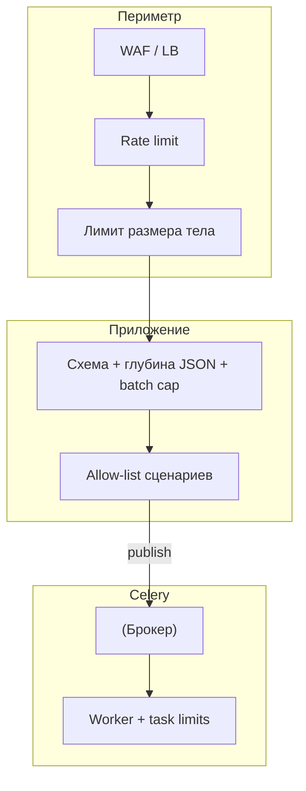
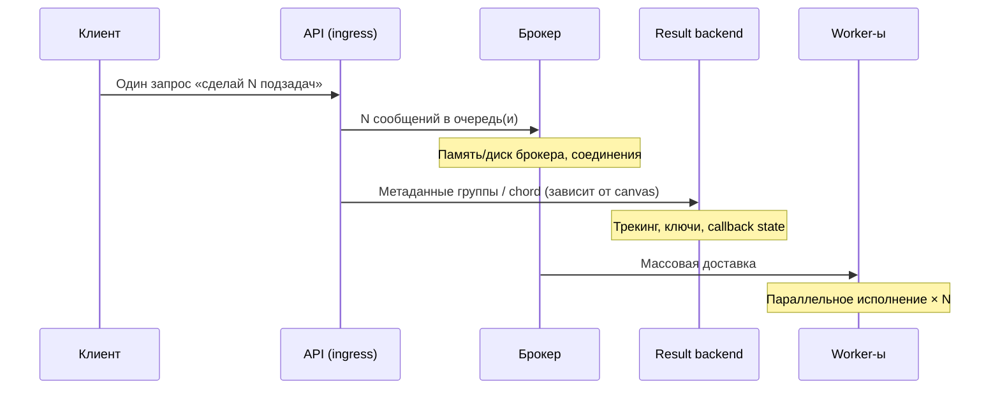

[← Назад к индексу части](index.md)
[↑ К глобальному плану](../../mastery_plan.md)

## 17.6 Защита от злоупотреблений и DoS на уровне задач

### Цель раздела

Научиться **ограничивать** злоупотребление **публичным** или полупубличным API, которое ставит задачи: **частота**, **размер**, **сложность** композиций (group/chord), чтобы Celery **не усиливал** атаку своей **параллельностью**.

#### Проверь себя: формулировка цели §17.6

1. Что в цели означает «Celery **не усиливал** атаку **параллельностью**»?

<details><summary>Ответ</summary>

Один запрос к API может превратиться в **много** одновременных задач и сообщений в брокере — платформа **сама** масштабирует нагрузку на инфраструктуру. Защита должна **ограничивать** fan-out и объём **до** того, как параллелизм **разгонит** брокер и backend.

</details>

2. Почему акцент на **полупубличном** API (партнёры, B2B), а не только на «открытом интернете»?

<details><summary>Ответ</summary>

Доверенный партнёр или скомпрометированный ключ API всё равно может **ошибиться** или **злоупотребить** квотой; модель угроз включает **легитимных** акторов с **высоким** лимитом, поэтому нужны **серверные** потолки на N и размер, не только WAF от анонимов.

</details>

3. Как **три измерения** в цели (частота, размер, сложность canvas) соответствуют **трём разным** слоям защиты?

<details><summary>Ответ</summary>

Частота — **ingress** rate limit и квоты; размер — **proxy + парсер** JSON и лимиты полей; сложность canvas — **серверные** константы для group/chord и запрет пользовательских графов без потолка. Все три нужны **ортогонально**.

</details>

### В этом разделе главное

1. **Ingress rate limit** на API: по **IP**, по **пользователю**, по **API key** — до вызова `apply_async`.
2. **Максимальный размер тела** запроса и **глубина вложенности** JSON — защита от **памяти** и **CPU** на сериализации.
3. **Allow-list** типов операций: пользователь не выбирает **произвольное** имя задачи — только **заранее** разрешённые сценарии.
4. **Chord bomb / group bomb:** запрет на **пользовательское** задание `N` в `group` без **жёсткого** верхнего предела; **серверные** константы вместо клиентских.
5. **Отложенные задачи** (`eta`) в большом объёме — **давление** на брокер; лимиты на **число отложенных** на пользователя.
6. **Идемпотентность** + **дедупликация** по бизнес-ключу снижает **повторный** флуд с retry.

#### Проверь себя: шестёрка «главное» §17.6

1. Почему **п.1** и **п.4** оба говорят про **лимиты**, но на **разных** границах системы?

<details><summary>Ответ</summary>

П.1 — **ingress** HTTP: не создавать лишние сообщения. П.4 — **семантика** fan-out внутри уже авторизованного запроса: даже один «легитимный» вызов не должен порождать **неограниченный** group/chord. Нужны **оба** потолка.

</details>

2. Как **п.2** (размер тела + глубина JSON) дополняет **§17.2** (JSON безопасен при парсинге)?

<details><summary>Ответ</summary>

Парсер **не** исполняет код, но **может** съесть CPU/RAM на гигантском или глубоком JSON — класс **доступности**, не RCE. Это переносит часть защиты на **edge и валидацию** до `delay`.

</details>

3. Почему **п.6** не отменяет необходимость **п.1**, если retry и так «безопасен»?

<details><summary>Ответ</summary>

Идемпотентность делает повтор **корректным**, но **не** ограничивает **скорость** и **объём** попыток: клиент или баг всё ещё могут **заспамить** брокер. Квоты на API и dedup **разные** рычаги.

</details>

### Термины

| Термин | Кратко |
|--------|--------|
| **DoS** | Отказ в обслуживании из-за **исчерпания** ресурсов. |
| **Ingress** | Вход в систему **снаружи** (публичный API). |
| **Chord** | Группа параллельных задач + **callback** после всех. |

#### Проверь себя: термины DoS и ingress §17.6

1. Почему **DoS** в контексте Celery часто выглядит как «система жива», хотя для пользователей она **мертва**?

<details><summary>Ответ</summary>

Ресурсы **исчерпаны** в брокере, connection pool, backend или очередях — HTTP может отвечать 200 на постановку, но **время выполнения** и **глубина** хвоста делают сервис непригодным; это **отказ по SLO**, не только 503.

</details>

2. Чем **ingress** отличается от «нагрузки на worker» в §17.6?

<details><summary>Ответ</summary>

Ingress — **граница**, где ещё можно **не создать** сообщения; нагрузка на worker — **после** попадания работы в контур. Злоумышленник выигрывает, если **успевает** заспамить брокер **до** того, как worker «разрулит».

</details>

3. Зачем в терминах отдельно назван **chord**, а не только **group**?

<details><summary>Ответ</summary>

Chord добавляет **callback** и **состояние** в result backend; «бомба» бьёт **и** по брокеру, **и** по трекингу canvas — **хуже**, чем простой group по числу сообщений.

</details>

### Теория и правила

Celery **масштабирует работу**: злоумышленник превращает **один** HTTP запрос в **тысячи** сообщений и **тысячи** параллельных исполнений. Защита **только** на worker-е уже поздно — брокер и backend **перегружены** раньше.

**Правило:** любые параметры, влияющие на **количество** создаваемых задач и **объём** данных, определяются **сервером** (константы, квоты), а не **клиентом**.

#### Проверь себя: правило серверных потолков §17.6

1. Приведи **контрпример**: что пойдёт не так, если клиент передаёт `fanout=N`, а сервер **доверяет** этому числу?

<details><summary>Ответ</summary>

Один запрос порождает **N** сообщений и **N** исполнений; при большом N брокер и backend **лопаются** раньше, чем сработают лимиты worker-а. Потолок **N** должен задаваться **серверной константой** и `min(...)`.

</details>

2. Почему фраза «защита только на worker-е уже поздно» **не** означает «worker не защищать»?

<details><summary>Ответ</summary>

Нужны **слои**: ingress режет **объём входа**, worker-лимиты и circuit breaker режут **исполнение и retry** уже внутри. Пропуск ingress **не компенсируется** только `task_annotations`.

</details>

3. Как **идемпотентность** соотносится с правилом «параметры задаёт сервер»?

<details><summary>Ответ</summary>

Идемпотентность **не задаёт** число задач от клиента; она делает **повторы безопасными** и позволяет **дедуп** по бизнес-ключу. Это **снижает вред** от штормов, но **не снимает** необходимость **квот и потолков**.

</details>

### Пошагово: слои защиты

1. **WAF / reverse proxy:** лимит размера тела, timeout.
2. **Application middleware:** rate limit (Redis token bucket / leaky bucket).
3. **Валидация:** максимум элементов в списке ids (например, ≤ 100).
4. Для batch-операций — **одна** задача «обработать пакет», внутри **чанки**, а не `group` из 10 000 подзадач **по желанию** пользователя.
5. Мониторинг: всплеск **publish rate**, **рост** глубины очереди **с корреляцией** по tenant/user.
6. **Circuit breaker** на вызовы внешних API внутри задач — защита **соседей** от retry storm (связь с частью 9).

**Слои от периметра к Celery (один взгляд):**



Сбой **любого** слоя перекладывает нагрузку на нижележащий; идеал — **остановить** атаку на **edge**, не дав дойти до **миллионов** сообщений в брокере.

#### Проверь себя: слои edge → app → Celery §17.6

1. На схеме: зачем **WAF/LB** стоит **перед** rate limit в приложении — разве не дублирование?

<details><summary>Ответ</summary>

Периметр отсекает **типовые** атаки, аномально большие запросы и часть **ботового** трафика **дешевле**, чем доводить до приложения; приложение держит **бизнес-осмысленные** квоты (tenant, user). Это **разные** политики и **разная** стоимость обработки.

</details>

2. Почему шаг «**одна задача на пакет** с чанками внутри» отнесён к **безопасности**, а не только к производительности?

<details><summary>Ответ</summary>

Пакет из 10 000 подзадач — это **взрыв** сообщений и метаданных; без паттерна «одна задача» злоумышленник **масштабирует** атаку через **параллелизм** Celery. Чанкинг **сжимает** поверхность транспорта.

</details>

3. Как пункт 6 (circuit breaker) **замыкает** защиту с шагами 1–3?

<details><summary>Ответ</summary>

Даже при **успешном** ingress часть задач может **размножиться** через retry к внешнему API; breaker **останавливает каскад** внутри worker-а, защищая брокер и соседей от **лавины** повторов.

</details>

### Простыми словами

Не давайте пользователю кнопку «запустить **сколько угодно** фоновых работ одним кликом» без **потолка**. Иначе это кнопка «положить платформу».

### Картинка в голове

**Лифт с табличкой «не более 8 человек»** — ingress limit. **Запрет тащить мебель** без заявки — allow-list операций. **Один** грузовой подъёмник для тяжёлого — batch-задача вместо сотни мелких.

#### Проверь себя: метафора лифта и мебели §17.6

1. Что в метафоре соответствует **chord bomb**, если **лифт** — rate limit по запросам?

<details><summary>Ответ</summary>

**Один** человек зашёл в лифт (один HTTP 200), но **внутри** у него **скрыта** команда «разбудить 10 000 грузчиков на каждом этаже» — fan-out и canvas. Нужен **отдельный** потолок на **число порождаемых задач**, не только на «вошёл/не вошёл».

</details>

2. Почему **грузовой подъёмник** — это **не** то же самое, что «просто увеличить `worker_concurrency`»?

<details><summary>Ответ</summary>

Concurrency **масштабирует исполнение**, но **не** снимает **налог транспорта**: тысячи сообщений всё равно **публикуются** и **трекаются** в backend. Batch-задача **сжимает** число движущихся частей в брокере.

</details>

3. Как **allow-list операций** в метафоре **сочетается** с **§17.2** (`accept_content`)?

<details><summary>Ответ</summary>

`accept_content` — **какой формат байтов** разрешён на worker-е; allow-list сценариев API — **какие имена задач / продуктовые действия** вообще можно поставить. Оба — **whitelist**, но на **разных** границах: транспорт Celery vs **продуктовый** контракт HTTP.

</details>

### Как запомнить

**Лимиты на входе; потолки на числе задач; сервер задаёт масштаб, не клиент.**

### Примеры

```python
# Псевдокод: жёсткий потолок на размер batch
MAX_BATCH = 200

@app.post("/enqueue/process")
def enqueue_process(ids: list[str]):
    if len(ids) > MAX_BATCH:
        raise HTTPException(400, "batch too large")
    process_batch.delay(ids)
```

```python
# Анти-паттерн (не делать так для пользовательского input):
# group(some_task.s(i) for i in user_supplied_list).apply_async()
# — если user_supplied_list может быть огромным.
```

**Безопасный паттерн:** пользователь передаёт **файл/отчёт** → API кладёт **ссылку S3** и ставит **одну** задачу «обработать объект X»; worker сам читает **потоково**.

**Пример: лимит глубины вложенности JSON (kwargs).** Злоумышленник шлёт вложенный dict глубины 10 000 — парсер и `json.loads` могут **съесть CPU/RAM** ещё до задачи. Проверяйте **до** `delay`:

```python
def assert_max_depth(obj, limit: int = 32, depth: int = 0) -> None:
    if depth > limit:
        raise ValueError("nested too deep")
    if isinstance(obj, dict):
        for v in obj.values():
            assert_max_depth(v, limit, depth + 1)
    elif isinstance(obj, list):
        for x in obj:
            assert_max_depth(x, limit, depth + 1)

# перед apply_async: assert_max_depth(user_dict)
```

**Максимальный размер payload (план §17.6): не только глубина.** Огромная **одна строка** в JSON (мегабайты `base64`, «комментарий» на миллион символов) может **положить** парсер и процесс API **до** `delay`, а после постановки — **раздуть** сообщение в брокере. Дополняйте проверку глубины **лимитами длины** строковых полей и **общим** потолком тела запроса на **reverse proxy** (шаг 1 выше).

```python
MAX_NOTE_LEN = 16_384

def validate_note(s: str) -> None:
    if len(s) > MAX_NOTE_LEN:
        raise ValueError("note too long")
```

Дополнительно на **reverse proxy** задайте **`client_max_body_size`** (nginx) или аналог — **первая** линия против гигантского тела.

**Паттерн «безопасный chord»:** сервер вычисляет `n = min(len(ids), MAX_FANOUT)` и строит group **сам**; клиент получает только `job_id` агрегата, **не** возможность задать произвольный `n` порядка миллионов.

**Почему один HTTP-запрос бьёт сразу по трём слоям** (схема для «бомбы» group/chord):



Даже при «легких» задачах **налог транспорта** и **состояние в backend** растут **линейно** (а иногда хуже) от **N**, поэтому потолок **N** задаётся на **сервере**, а не из JSON клиента.

#### Проверь себя: примеры кода и chord/group «бомба» §17.6

1. Почему **отдельно** добавлены проверка **глубины** JSON и лимит **длины строки** — разве недостаточно `MAX_BATCH`?

<details><summary>Ответ</summary>

`MAX_BATCH` режет **число элементов списка**, но не **один** гигантский объект или **мегастроку** в поле; плоский JSON может **положить** парсер и память **без** большого `len(ids)`. Нужны **ортогональные** потолки.

</details>

2. В **sequenceDiagram** «один запрос → N сообщений»: какой **третий** компонент, кроме брокера и worker-ов, критичен для chord/group?

<details><summary>Ответ</summary>

**Result backend** хранит **состояние** группы/chord и метаданные callback; при большом N он **перегружается** параллельно с брокером.

</details>

3. Почему паттерн «**ссылка S3 + одна задача**» безопаснее, чем передача **большого** payload в `delay`?

<details><summary>Ответ</summary>

Сообщение в брокере остаётся **маленьким**; тяжёлая работа и **объём данных** переносятся в **потоковое** чтение из объектного хранилища с **отдельными** квотами и ACL, а не раздувают **каждое** сообщение.

</details>

### Практика / реальные сценарии

- **Экспорт отчёта:** не `group` по 100 000 строк; **одна** задача + **пагинация** внутри или **стриминг** в файл.
- **Реферальные акции:** фрод **ставит** миллионы задач уведомлений — без rate limit по пользователю **умрёт** брокер.

### Типичные ошибки

- Доверять `count` или списку id **из JSON** без верхней границы.
- Строить **динамический** canvas из **пользовательского** шаблона.
- Игнорировать **рост** отложенных сообщений как **DoS** (память брокера).
- Проверять только **глубину** вложенности JSON и **не** лимитировать **длину строк** / размер поля — «плоский» гигантский payload всё равно DoS.

### Что будет, если…

- …**chord** на 50 000 задач? Огромное **давление** на result backend для **трекинга** группы, риск **таймаутов** и **падений** worker-ов (см. часть 10, 16).
- …**нет** ingress limit? **API** и **брокер** лягут от **одного** скрипта с `while True: delay()`.

#### Проверь себя: сценарии и антипаттерны §17.6

1. Почему **экспорт** через одну задачу с пагинацией **безопаснее** для контура, чем `group` по строкам отчёта?

<details><summary>Ответ</summary>

Каждая строка как задача — это **отдельное** сообщение и накладные расходы; при большом отчёте вы **умножаете** нагрузку на брокер и **риск** таймаутов canvas. Одна задача **контролирует** темп чтения и **единый** лимит ресурсов.

</details>

2. В чём **опасность** «динамический canvas из пользовательского шаблона», если шаблон **не** исполняется как код?

<details><summary>Ответ</summary>

Пользователь всё равно задаёт **структуру** графа задач (число веток, глубину chord) — это **программирование** через данные; без потолков получается **логическая** group/chord bomb.

</details>

3. Почему **рост отложенных** сообщений классифицируется как DoS, хотя они **не** выполняются сразу?

<details><summary>Ответ</summary>

Они **занимают** память/диск брокера и в момент наступления срока дают **синхронный** всплеск consume — отложенная атака **переносится во времени**, но **не** исчезает.

</details>

#### Проверь себя: интеграция раздела §17.6

1. Почему **rate limit на API** важнее, чем **только** `task_annotations` с rate limit на worker?

<details><summary>Ответ</summary>

Rate limit на worker **распределяет исполнение**, но **сообщения уже в брокере**. Флуд с API **забьёт** очередь, **исчерпает** соединения, **раздует** память брокера и backend **до** того, как worker «спокойно» ограничит себя. Ingress защищает **весь контур**, а не только CPU worker-а.

</details>

2. В чём разница между **ограничением размера batch** и **идемпотентностью** против злоупотреблений?

<details><summary>Ответ</summary>

**Размер batch** ограничивает **масштаб одного запроса**. **Идемпотентность** не **ограничивает** число попыток, но делает **повторные** вызовы **безопасными** и позволяет **дедуплицировать** по ключу. Для DoS нужны **квоты и потолки**; идемпотентность — про **корректность** при повторах и снижение **вреда** от штормов, но не заменяет лимиты.

</details>

3. Почему **одна тяжёлая задача** с внутренним чанкингом часто **устойчивее**, чем **группа** из тысячи лёгких для того же объёма работы?

<details><summary>Ответ</summary>

Потому что тысячи сообщений несут **налог транспорта** (publish, deliver, ack, метаданные в backend для групп/chord), **больше** движущихся частей и **острее** реагируют на всплески. Одна задача **амортизирует** overhead и упрощает **контроль** ресурсов внутри процесса (см. часть 16 про batching).

</details>

### Запомните

**DoS в Celery начинается на API.** Потолки, allow-list, batch вместо взрыва group/chord — обязательная гигиена.

---

### Углубление 17.6а: rate limit задачи на worker и `worker_disable_rate_limits`

**Встроенный** rate limit задачи (через аннотации конфигурации Celery) ограничивает **частоту исполнения** конкретного типа задачи **на worker-е**. Это **полезно** против **перегруза внешнего API**, но **не** предотвращает **накапливание** сообщений в брокере при флуде publish — см. основной текст §17.6.

**Опасная настройка:** глобальное отключение rate limits на worker (`worker_disable_rate_limits`) для «ускорения» может **снять** единственный предохранитель против **retry storm** и **ддоса** внешнего партнёра. Делайте это только осознанно и временно.

#### Проверь себя: worker rate limit и `worker_disable_rate_limits` §17.6а

1. Когда rate limit **на задаче** — правильный инструмент, а когда **обязателен** лимит на API?

<details><summary>Ответ</summary>

**На задаче** — когда нужно **сохранить** стабильность downstream **независимо** от того, **сколько** сообщений уже в очереди (мягкое выравнивание исполнения). **На API** — когда нужно **не дать** брокеру превратиться в **хранилище миллионов** сообщений и **не исчерпать** соединения/память **до** worker-а. Для здоровья системы часто нужны **оба** слоя с **разными** целями.

</details>

2. Почему **`worker_disable_rate_limits`** опасен **в паре** с агрессивным **retry** в задачах?

<details><summary>Ответ</summary>

Retry размножает сообщения; rate limit на задаче — один из способов **не добить** внешний API и **не разогнать** очередь до лавины повторов. Отключение глобально снимает этот **предохранитель** и ускоряет **retry storm** на весь контур.

</details>

3. Как **circuit breaker** во внешнем вызове внутри задачи (связь с частью 9) помогает **§17.6**?

<details><summary>Ответ</summary>

Он ограничивает **каскад**: одна деградация партнёра не превращается в **бесконечный** поток повторных задач и не **раздувает** брокер. Это **соседняя** линия защиты после ingress-лимитов.

</details>

---

### Углубление 17.6б: лавина `eta` / `countdown` как форма нагрузки

Злоумышленник или баг может поставить **миллионы** отложенных задач на **разные** моменты времени. Брокер **держит** их в памяти/на диске; в момент «срабатывания» получается **стеной** consume. Защита: **лимиты** на отложенные задачи per user, **expires** на сообщениях, мониторинг **объёма** отложенной работы, продуктовые **окна** обработки.

**Внутренний флуд без внешнего API.** Помимо пользовательского HTTP, источником лавины бывают: **ошибочно настроенный Beat** (см. §17.1г), **цикл в коде** с `apply_async` в обработчике сигнала, **миграция** со скриптом «догнать хвост» без батчей, **тесты** в prod-контуре. Для таких сценариев те же **потолки** на размер батча и **алёрты** на publish rate, но точка контроля — **ревью** и **canary**, а не только WAF.

#### Проверь себя: лавина `eta` / `countdown` §17.6б

1. Почему **`expires`** на сообщении помогает и **безопасности** (устойчивости), и **смыслу** бизнеса?

<details><summary>Ответ</summary>

Старые задачи часто **бессмысленны** (курс устарел, уведомление неактуально). Их исполнение **тратит** ресурсы и может **вредить** UX. `expires` уменьшает **хвост** мусора в брокере и **пики** «просроченной» работы, снижая и **риск**, и **стоимость**.

</details>

2. Назови **два** внутренних источника флуда задач, на которые **не** действует публичный rate limit API.

<details><summary>Ответ</summary>

Например: **скомпрометированный или ошибочно настроенный Celery Beat**; **скрипт миграции/one-off** в том же контуре, что и prod-брокер; **цикл** `apply_async` в задаче или сигнале. Защита — **операционная дисциплина**, изоляция сред, лимиты на уровне **приложения и брокера**, мониторинг publish rate **по роли** процесса.

</details>

3. Почему **мониторинг объёма отложенной работы** важнее, чем кажется при «всего лишь отложили на завтра»?

<details><summary>Ответ</summary>

Миллионы отложенных сообщений **занимают** память/диск брокера и в момент срабатывания дают **стену** consume — это **DoS по времени**. Ранние алёрты на рост отложенного хвоста позволяют остановить баг или атаку **до** дедлайна.

</details>

---
