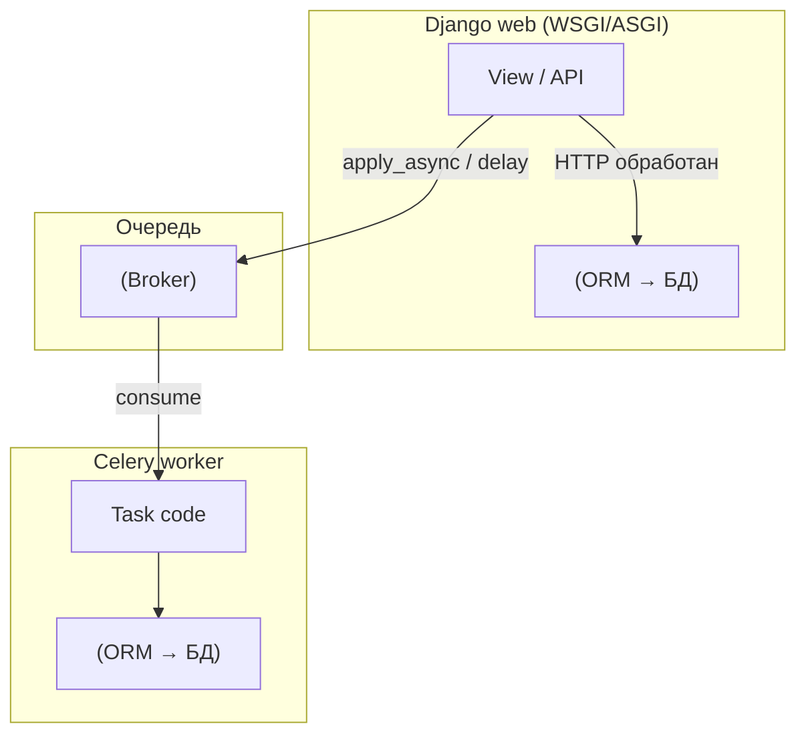
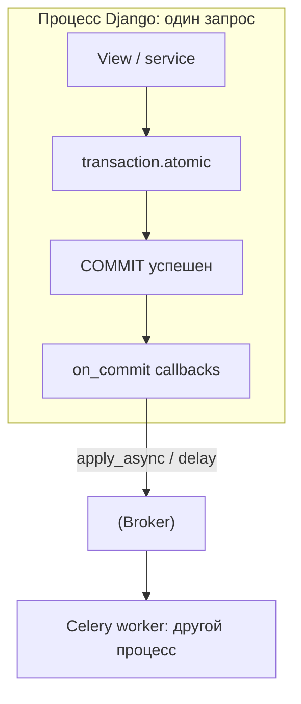

[← Назад к индексу части](index.md)
[↑ К глобальному плану](../../mastery_plan.md)

## Что желательно знать заранее

Желательно уже понимать:

- архитектуру **producer → broker → worker** и модель задач — части **3–5**;
- **транзакции БД** на уровне «commit/rollback видимость» — курс по Django ORM или SQL;
- **prefork worker** и соединения — часть **8**;
- **идемпотентность и retry** — часть **9**;
- основы **безопасности** сообщений — часть **17** (для admin‑кнопок и payload).

**Сквозная схема:** браузер бьёт в **Django**; Django **пишет в БД** и **кладёт работу в очередь**; **worker** (другой процесс, часто другой контейнер) **читает БД и внешние API**, обновляет статусы/файлы/почту.

**Граница транзакции и очереди (один HTTP‑запрос):** постановка в брокер логически живёт **рядом** с успешным коммитом, а не «внутри» SQL‑транзакции.

#### Проверь себя: предпосылки

1. Почему на схеме **два** пути к БД (`ORM_w` и `ORM_c`)?

Ответ

Потому что **web** и **worker** — **разные процессы** с **разными** пулами соединений и **разным временем жизни**: видимость данных, блокировки и кэш ORM **не разделяются** автоматически как в одном процессе.

2. Можно ли считать, что после `delay()` задача **обязательно** выполнится?

Ответ

Нет: `delay`/`apply_async` означает **постановку в брокер** (при успешной публикации), а дальше действуют **надёжность брокера**, **наличие worker‑ов**, **ретраи**, **TTL/expires**, **ошибки** и **идемпотентность**. Это **асинхронная** модель, не «удалённый вызов функции с гарантией».

---
