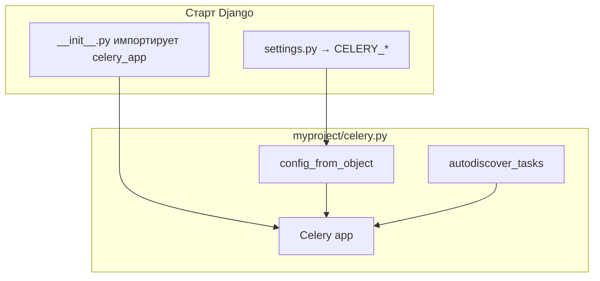
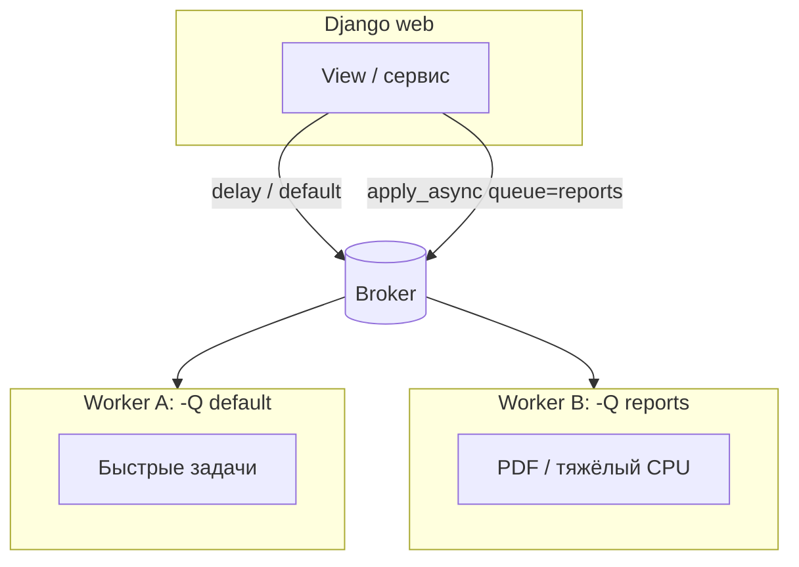
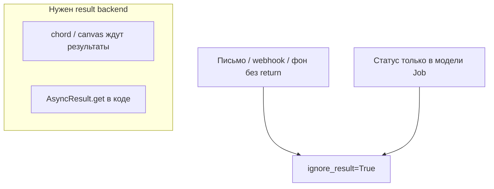
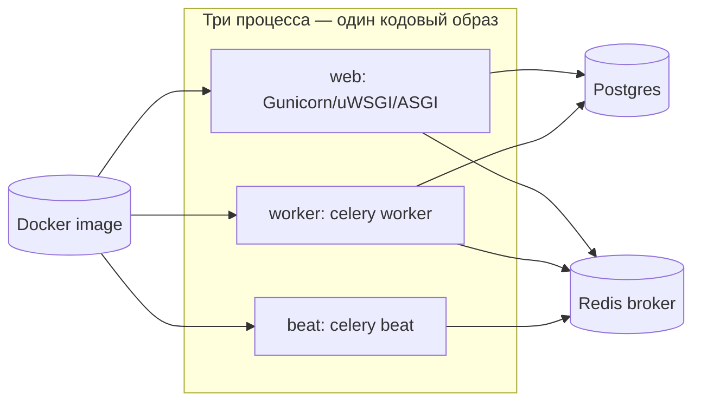

[← Назад к индексу части](index.md)
[↑ К глобальному плану](../mastery_plan.md)

## 18.1 Базовая интеграция

### Цель раздела

Научиться **с нуля собрать** типовой каркас **Django + Celery**: объект приложения Celery, связывание с **настройками Django**, автопоиск задач и **запуск** worker/beat так, чтобы это было **воспроизводимо** в dev/stage/prod.

### В этом разделе главное

- Один объект **`Celery('projname')`** живёт в **отдельном модуле** рядом с `settings`.
- Django **импортирует** этот модуль при старте (`project/__init__.py`), чтобы **shared_task** и конфиг применялись консистентно.
- Настройки Celery удобно брать из **`django.conf.settings`** через префикс **`CELERY_`** или `namespace=`.
- **`autodiscover_tasks()`** ищет `tasks.py` в приложениях из **`INSTALLED_APPS`**.
- **Worker** и **beat** запускаются **отдельными процессами**; им нужен **тот же код** и **те же переменные окружения**, что и web (в контейнерной среде — отдельные сервисы).

### Термины

| Термин | Кратко |
|--------|--------|
| **Celery application** | Именованный экземпляр `Celery`, регистрирующий задачи и конфиг. |
| **Broker URL** | Куда публикуются сообщения (Redis/RabbitMQ/…). |
| **Result backend** | Где хранятся статусы/результаты (опционально). |
| **Beat** | Планировщик периодических задач. |

### Теория и правила

**Формально:** Celery — **библиотека**, которая в Python‑проекте получает **конфигурацию** (broker, сериализаторы, маршруты) и **регистрирует** задачи. Django — **фреймворк** с **настройками** и **приложениями**. Интеграция — это **импортный граф** и **единый источник правды для конфигурации** (обычно `settings.py` + env).

**Правила:**

1. **`celery.py` не должен импортировать тяжёлые view** — только создать `app` и вызвать `config_from_object`.
2. Цикл импортов ломает старт: `celery.py` → `models` → снова `celery` — избегайте взаимных импортов на уровне модуля.
3. Для задач используйте **`@shared_task`** в приложениях **или** `@app.task` после того как `app` доступен — оба стиля валидны; **`shared_task`** удобен при **много-приложенческой** структуре.

4. **Импортируйте Django‑модели и `get_user_model` внутри тела задачи** (или внутри функции, вызываемой из задачи), а не на верхнем уровне `tasks.py`, если есть риск **циклического импорта** при загрузке `celery.py` → `tasks` → `models` → … Практичное правило: декоратор **`@shared_task`** на верхнем уровне ок, а **`from myapp.models import Order`** — чаще **внутри** функции задачи.

### Пошагово

1. Установите пакеты: `celery`, брокер‑клиент (`redis` / `kombu[librabbitmq]` и т.д.), при необходимости **`django-celery-beat`**.
2. Создайте `myproject/celery.py` с созданием `app = Celery('myproject')`.
3. Вызовите `app.config_from_object('django.conf:settings', namespace='CELERY')`.
4. В `myproject/__init__.py` импортируйте `celery_app` (или `.celery import app as celery_app`) — **side effect** для загрузки.
5. В `settings.py` задайте как минимум `CELERY_BROKER_URL`, при необходимости `CELERY_RESULT_BACKEND`, таймзону `CELERY_TIMEZONE = TIME_ZONE`.
6. В `celery.py` после конфигурации: `app.autodiscover_tasks(lambda: settings.INSTALLED_APPS)` (или без lambda в зависимости от версии/стиля).
7. В каждом приложении при необходимости добавьте `tasks.py` с задачами.
8. Запуск: `celery -A myproject worker -l info` и `celery -A myproject beat -l info` (или объединённые стратегии под ваш оркестратор).

### Простыми словами

Представь **два офиса**: **веб** принимает заказы и пишет в **журнал (БД)**, **склад (worker)** выполняет работу. `celery.py` — **инструкция**, как склад подключён к **трубе (брокер)**. `autodiscover` — **автоматический список сотрудников‑исполнителей** по отделам (`INSTALLED_APPS`).

### Картинка в голове



### Как запомнить

**«Один `app`, один `config_from_object`, один `autodiscover`, много `tasks.py`».**

### Примеры

**Минимальный `myproject/celery.py`:**

```python
import os
from celery import Celery

os.environ.setdefault("DJANGO_SETTINGS_MODULE", "myproject.settings")

app = Celery("myproject")
app.config_from_object("django.conf:settings", namespace="CELERY")
app.autodiscover_tasks()
```

**`myproject/__init__.py`:**

```python
from .celery import app as celery_app

__all__ = ("celery_app",)
```

**Фрагмент `settings.py`:**

```python
CELERY_BROKER_URL = os.environ["CELERY_BROKER_URL"]
CELERY_RESULT_BACKEND = os.environ.get("CELERY_RESULT_BACKEND", "")
CELERY_TASK_TRACK_STARTED = True
CELERY_TASK_TIME_LIMIT = 60 * 30
CELERY_ACCEPT_CONTENT = ["json"]
CELERY_TASK_SERIALIZER = "json"
CELERY_RESULT_SERIALIZER = "json"
```

**`shop/tasks.py`:**

```python
from celery import shared_task

@shared_task
def send_welcome_email(user_id: int) -> None:
    from django.contrib.auth import get_user_model
    User = get_user_model()
    user = User.objects.get(pk=user_id)
    # ... отправка почты (см. 18.4)
```

**Запуск локально:**

```bash
export DJANGO_SETTINGS_MODULE=myproject.settings
celery -A myproject worker -l info
celery -A myproject beat -l info
```

### Практика / реальные сценарии

- В **Docker Compose** три сервиса: `web`, `worker`, `beat` (иногда beat совмещают с отдельным лёгким worker — компромисс операционный).
- **Тот же образ**, разные **command** — стандартный паттерн.
- Для периодических задач из БД подключают **`django_celery_beat`** в `INSTALLED_APPS` и миграции — когда расписание должны менять **без релиза**.

### Дополнение: отдельные **очереди** брокера для разных Django‑нагрузок

Почта и «лёгкие» задачи часто живут в **`default`**, а **отчёты PDF**, тяжёлый **экспорт** и **сканирование файлов** лучше направлять в **отдельные очереди** (`reports`, `exports`, …), чтобы долгие задачи **не вытесняли** короткие (fairness, SLO — части **12** и **16**).

**В коде Django** — либо **`apply_async(..., queue="reports")`**, либо централизованно в **`settings`**:

```python
CELERY_TASK_ROUTES = {
    "reports.tasks.build_pdf": {"queue": "reports"},
    "shop.tasks.export_catalog_csv": {"queue": "exports"},
}
```

**Запуск worker‑а** должен **слушать** нужные очереди: например  
`celery -A myproject worker -Q default,reports,exports -l info`  
(если процесс **не** подписан на очередь, задачи там **не выполнятся**).



#### Проверь себя: очереди

1. Задачи попадают в Redis/RabbitMQ, но **не потребляются**: в Flower видно длину очереди **`reports`**, а вы запустили `celery worker` без указания этой очереди. Что проверить в первую очередь?

<details><summary>Ответ</summary>

Что worker подписан на нужные имена: аргумент **`-Q`** (или конфиг по умолчанию) должен **включать** `reports`, либо задачи должны идти в **`celery`**/`default`, если вы сознательно не используете отдельные очереди. Несовпадение «куда публикуем» и «что слушает процесс» — самая частая причина «зависших» сообщений при живом брокере.

</details>

2. Зачем вообще **разводить** задачи по очередям `default` / `reports`, если один worker теоретически может слушать **все** сразу?

<details><summary>Ответ</summary>

Чтобы **изолировать SLO**: тяжёлый PDF не блокирует **конкуренцию** за воркеры с короткими задачами; можно **масштабировать** отдельные пулы (`concurrency`, отдельные деплойменты) и **лимитировать** ресурсы CPU/RAM под тяжёлый контур, не трогая «быстрый» контур.

</details>

3. Когда **`CELERY_TASK_ROUTES`** предпочтительнее, чем разбрасывать **`queue=`** по всему коду view/сервисов?

<details><summary>Ответ</summary>

Когда нужна **централизованная** политика маршрутизации (один файл настроек, ревью без охоты по вызовам), единообразие для **одноимённых** задач из разных мест и проще **миграция** имён очередей при реорганизации инфраструктуры.

</details>

### Типичные ошибки

- Забыли **`DJANGO_SETTINGS_MODULE`** в окружении worker → задачи падают при импорте моделей.
- Запуск **`python scripts/foo.py`** с импортом моделей без **`django.setup()`** → **`AppRegistryNotReady`**.
- **`autodiscover`** не видит приложение: оно не в **`INSTALLED_APPS`** или `tasks.py` лежит не там.
- Дублируют **имя** Celery app и **проекта** без нужды и путают **`-A`** в командной строке.
- Хранят **секреты брокера** в репозитории, а не в **env**/secret manager.
- Поставляют задачи в очередь **`reports`**, а worker запущен только с **`-Q default`** — задачи **висят** в брокере без исполнителя.

### Что будет, если…

- **Нет импорта в `__init__.py`**: часть регистраций/сигналов может работать «иногда», в тестах и worker — **рассинхрон**.
- **Разные `CELERY_*` у web и worker**: странные **ретраи**, неверный broker, «задачи пропали».

### Проверь себя

1. Зачем **`namespace='CELERY'`** в `config_from_object`?

<details><summary>Ответ</summary>

Чтобы ключи вида **`CELERY_BROKER_URL`** в `settings.py` автоматически мапились на **`broker_url`** внутри Celery без ручного словаря: префикс отбрасывается при чтении.

</details>

2. Почему `os.environ.setdefault("DJANGO_SETTINGS_MODULE", ...)` часто стоят **и** в `manage.py`, **и** в `celery.py`?

<details><summary>Ответ</summary>

Worker может стартовать **не через** `manage.py`; явный **default** гарантирует корректный модуль настроек при **прямом** запуске `celery`.

</details>

3. Что даёт **`@shared_task`** перед `@app.task` в Django‑проекте?

<details><summary>Ответ</summary>

`shared_task` привязывается к **текущему** зарегистрированному приложению Celery при выполнении декоратора и не требует импортировать **`app`** из `celery.py` в каждом приложении — удобнее для **переиспользуемых** приложений и уменьшает связность.

</details>

4. Почему правило «**импортируй модели внутри тела задачи**» связано не только с **циклическими импортами**, но и с **безопасностью сериализации**?

<details><summary>Ответ</summary>

Потому что перенос **ORM‑объектов** в аргументах задачи тянет за собой риск **pickle/тяжёлых графов** и **устаревшего снимка**; импорт моделей **внутри** функции держит верхний уровень `tasks.py` лёгким и подталкивает к передаче **`pk`/идентификаторов**, что согласуется с безопасным **JSON** и явным **`get()`** в worker‑е.

</details>

5. Что ломается, если **worker** и **web** смотрят на **разные** значения `CELERY_BROKER_URL`?

<details><summary>Ответ</summary>

Web **публикует** в один брокер/БД, worker **читает** из другого — задачи **исчезают** с точки зрения исполнителя или обрабатываются **не теми** воркерами; симптомы: пустые очереди в «ожидаемом» Redis, «зависшие» джобы, рассинхрон result backend.

</details>

### Запомните

Базовая интеграция — это **импорт**, **конфиг из settings**, **autodiscover**, **одинаковый env** для web/worker.

### Дополнение: `autodiscover_tasks` и модули задач

- По соглашению Celery ищет в каждом пакете приложения модуль **`tasks`** (файл **`tasks.py`**). Имя модуля задаётся параметром **`related_name`** (по умолчанию **`"tasks"`**). Чтобы подхватить, например, **`jobs.py`**, передайте **и список пакетов, и имя** — первый аргумент обычно **`lambda: settings.INSTALLED_APPS`**, второй — ключевое слово **`related_name`**:

```python
from django.conf import settings

app.autodiscover_tasks(lambda: settings.INSTALLED_APPS)  # …/tasks.py
app.autodiscover_tasks(lambda: settings.INSTALLED_APPS, related_name="jobs")  # …/jobs.py
```

Два вызова подряд — нормальный приём, если в проекте **два соглашения** об именах модулей с задачами. Альтернатива — **`CELERY_IMPORTS`** для произвольных путей модулей.

- **`app.autodiscover_tasks()`** без аргументов в типовом `celery.py` достаточен для классической структуры (Celery сам возьмёт **`INSTALLED_APPS`** в связке с Django); явная форма **`autodiscover_tasks(lambda: settings.INSTALLED_APPS)`** подчёркивает источник списка и полезна в **нестандартных** конфигурациях (кастомный `AppConfig`, динамические apps).

**Пример явных импортов:**

```python
# settings.py
CELERY_IMPORTS = ("billing.jobs", "integrations.workers")
```

#### Проверь себя: autodiscover и имена модулей

1. В проекте часть задач лежит в **`jobs.py`**, часть — в классическом **`tasks.py`**. Как **без дублирования кода регистрации** подхватить оба соглашения?

<details><summary>Ответ</summary>

Сделать **два** вызова **`autodiscover_tasks`**: один с **`related_name="tasks"`** (по умолчанию), второй с **`related_name="jobs"`**, либо добавить недостающие модули в **`CELERY_IMPORTS`**, если они вне стандартного шаблона пакетов приложений.

</details>

2. Чем **`autodiscover_tasks()` без аргументов** принципиально опирается на Django в типовом `celery.py`?

<details><summary>Ответ</summary>

На то, что интеграция Celery+Django знает, откуда взять список **установленных приложений** и обойти их пакеты в поиске модулей задач — то есть на **связку** с **`INSTALLED_APPS`**, а не на ручной перечень путей.

</details>

3. Почему **`CELERY_IMPORTS`** не заменяет полностью **`INSTALLED_APPS`** для бизнес‑кода Django?

<details><summary>Ответ</summary>

`CELERY_IMPORTS` решает узкую задачу **загрузки модулей с задачами**; **`INSTALLED_APPS`** по‑прежнему определяет **модели, миграции, админку, сигналы** и жизненный цикл приложения — без приложения в `INSTALLED_APPS` ORM‑слой задачи часто просто **некуда** корректно подключить.

</details>

### Дополнение: альтернатива `__init__.py` — `AppConfig.ready`

Иногда импорт в **`project/__init__.py`** нежелатен (сторонние пакеты, тестовые раннеры). Тогда можно в **`apps.py`** основного приложения:

```python
class CoreConfig(AppConfig):
    default_auto_field = "django.db.models.BigAutoField"
    name = "core"

    def ready(self):
        from . import celery_hooks  # noqa: F401 — side effect: подтягивает celery app
```

А в **`celery_hooks.py`** достаточно **одной строки** импорта приложения Celery (например `from myproject.celery import app as celery_app`), чтобы Django при старте приложения **зарегистрировал** задачи так же, как при импорте из `__init__.py`. Важно не создать **циклический импорт** с `models.py` (не импортируйте модели на верхнем уровне `celery_hooks`, если те тянут `AppConfig` обратно).

#### Проверь себя: `AppConfig.ready` и side effect

1. В каких ситуациях **импорт Celery из `project/__init__.py`** бывает **нежелателен**, и чем его заменяют?

<details><summary>Ответ</summary>

Когда пакет используют как **библиотеку**, странно ведут себя **альтернативные раннеры**/тестовые harness’ы, или нужно **отложить** побочный эффект до готовности приложений — тогда **`AppConfig.ready`** + лёгкий **`celery_hooks`** дают **контролируемую** точку загрузки без глобального импорта при любом `import project`.

</details>

2. Почему в **`celery_hooks.py`** опасно тянуть **`models`** на верхнем уровне?

<details><summary>Ответ</summary>

Потому что граф импортов `AppConfig` → `ready` → `celery_hooks` → `models` → снова приложения может замкнуться в **цикл** на старте; модели безопаснее импортировать **внутри** функций задач или после полной инициализации, где это оправдано.

</details>

3. Совпадает ли **семантика** регистрации задач при импорте из **`__init__.py`** и при хуке **`ready`** при корректной реализации?

<details><summary>Ответ</summary>

**Да по сути:** оба способа должны привести к тому, что модуль **`celery.py`** и цепочка **`autodiscover`/`CELERY_IMPORTS`** отработают при старте процесса Django; отличается **точка подключения** и **контроль над побочными эффектами**, а не протокол Celery.

</details>

### Дополнение: периодические задачи **без** `django-celery-beat`

Если расписание **статично** и меняется только релизом, достаточно **`CELERY_BEAT_SCHEDULE`** в `settings` (или `app.conf.beat_schedule` в `celery.py`):

```python
from celery.schedules import crontab

CELERY_BEAT_SCHEDULE = {
    "purge-old-export-jobs": {
        "task": "reports.tasks.purge_old_jobs",
        "schedule": crontab(hour=3, minute=0),
    },
}
```

**Beat** по‑прежнему отдельный процесс: `celery -A myproject beat -l info`.

#### Проверь себя: статическое расписание (`CELERY_BEAT_SCHEDULE`)

1. Какой **операционный** минус `CELERY_BEAT_SCHEDULE` в коде по сравнению с **`django-celery-beat`**?

<details><summary>Ответ</summary>

Любое изменение cron/интервала требует **релиза** и выкладки; нет **живого** переключателя в админке, аудита правок и гибких флагов «выключить задачу без деплоя».

</details>

2. Почему **beat** остаётся **отдельным процессом** даже при статическом расписании в `settings`?

<details><summary>Ответ</summary>

Потому что планировщик **не** встроен в web‑воркеры: ему нужен **долгоживущий** цикл таймеров и публикация в брокер **по расписанию** независимо от HTTP‑нагрузки; иначе каждый web‑процесс дублировал бы тики и давал бы **гонки** и лишнюю нагрузку.

</details>

3. В `CELERY_BEAT_SCHEDULE` указали **`"task": "reports.tasks.purge_old_jobs"`**, но задача **не вызывается**. Какие **две** проверки назовёте первыми?

<details><summary>Ответ</summary>

**(1)** Запущен ли процесс **`celery beat`** с тем же **`-A`** и **`DJANGO_SETTINGS_MODULE`**, что и проект. **(2)** Зарегистрировано ли имя задачи в реестре Celery (модуль импортирован/`autodiscover` видит приложение) — иначе beat **не сможет** разрешить путь к задаче.

</details>

### Дополнение: вызов задач из management command

```python
from django.core.management.base import BaseCommand

class Command(BaseCommand):
    def handle(self, *args, **options):
        from shop.tasks import rebuild_catalog
        rebuild_catalog.delay()  # или apply_async с очередью
```

Те же правила: если команда пишет в БД в **`atomic()`**, используйте **`on_commit`**. Команда — ещё один **producer**, как view и beat.

#### Проверь себя: management command как producer

1. Чем вызов **`rebuild_catalog.delay()`** из команды отличается от вызова **той же** функции **напрямую** в `handle()` с точки зрения **наблюдаемости** и **масштабирования**?

<details><summary>Ответ</summary>

`delay` ставит работу в **очередь**: исполнение переносится на **worker** (отдельные ресурсы, ретраи Celery, метрики брокера); прямой вызов выполняет работу **в процессе команды** — проще отладить локально, но нет **асинхронного** снятия пика и нет типичного **Celery‑мониторинга** задачи.

</details>

2. Почему команду нельзя считать «**вне транзакций**» только потому, что она запускается из shell?

<details><summary>Ответ</summary>

Потому что внутри `handle()` вы сами можете открыть **`transaction.atomic()`**, вызвать сервисы, которые атомарны, или в будущем обернуть команду **другим** кодом; **producer‑дисциплина** (`on_commit`, outbox) привязывается к **наличию транзакции**, а не к тому, HTTP это или CLI.

</details>

### Дополнение: отладка без брокера

- **`task.apply(args=..., kwargs=...)`** выполняет задачу **синхронно** в текущем процессе (удобно в shell, см. часть 5).
- **`CELERY_TASK_ALWAYS_EAGER`** в тестах — см. отдельное дополнение ниже; не путать с «прод‑надёжностью».

#### Проверь себя: `apply` и отладка

1. Чем **`task.apply(...)`** в shell отличается от **`task.delay(...)`** с точки зрения **брокера** и **процесса** исполнения?

<details><summary>Ответ</summary>

`apply` выполняет задачу **синхронно в текущем процессе** и **не** публикует сообщение в broker (как правило, удобно для пошаговой отладки); `delay` **ставит** задачу в очередь для **worker** — другой процесс, другая среда соединений с БД.

</details>

2. Почему успешный **`apply` в shell** **не** доказывает, что та же задача корректно отработает в **prefork worker**?

<details><summary>Ответ</summary>

Потому что в worker другие **процессы/форки**, **пул соединений**, **env**, **лимиты памяти/времени** и **параллелизм**; ошибки «после fork» и утечки соединений часто проявляются **только** в долгоживущем воркере.

</details>

### Дополнение: произвольный Python‑скрипт и **`django.setup()`**

Если вы запускаете **`python tools/requeue_failed.py`** или **cron** вызывает модуль **вне** `manage.py` и **вне** процесса `celery worker`, Django **ещё не инициализирован** — импорт моделей или **`from app.tasks import foo; foo.delay()`** даст **`django.core.exceptions.AppRegistryNotReady`** (или похожие ошибки импорта).

**Минимальный каркас:**

```python
import os
import django

os.environ.setdefault("DJANGO_SETTINGS_MODULE", "myproject.settings")
django.setup()

from shop.tasks import rebuild_catalog  # после setup

if __name__ == "__main__":
    rebuild_catalog.delay()
```

**Идея:** `django.setup()` загружает **`INSTALLED_APPS`**, модели и конфиг так же, как при старте **worker** (который подтягивает Django через **`celery -A`** и `DJANGO_SETTINGS_MODULE`). Без этого **ORM** и **регистрация задач** в изолированном скрипте **не гарантированы**.

#### Проверь себя: каркас и точки входа

1. Когда нужен **`CELERY_IMPORTS`**, если уже вызывается **`autodiscover_tasks()`**?

<details><summary>Ответ</summary>

Когда модули с задачами **не** называются `tasks.py` и **не** лежат в корне приложения из `INSTALLED_APPS`, либо задачи регистрируются в **нестандартных** пакетах; `CELERY_IMPORTS` **принудительно** загружает перечисленные модули при старте worker‑а.

</details>

2. Почему management command, ставящий задачи, должен подчиняться **тем же** правилам `on_commit`, что и view?

<details><summary>Ответ</summary>

Потому что команда может вызываться **внутри** транзакционных сценариев (обвязка в `atomic()`, вызов из другого кода) или сама оборачивать работу в `atomic()`; без `on_commit` легко **повторить** те же гонки и фантомные задачи, что и в HTTP‑слое.

</details>

3. Зачем в **отдельном** скрипте (`python tools/foo.py`) вызывать **`django.setup()`**, если в проекте уже есть **`celery.py`** и импорт в **`__init__.py`**?

<details><summary>Ответ</summary>

Потому что такой скрипт **не** проходит тот же **entrypoint**, что `manage.py` или `celery -A`: без явной инициализации приложения Django модели и **`AppRegistry`** могут быть **не готовы**; **`setdefault(DJANGO_SETTINGS_MODULE)` + `django.setup()`** гарантируют загрузку настроек и приложений **независимо** от текущей рабочей директории и способа запуска.

</details>

### Дополнение: `django-celery-beat` (расписание из БД)

**Зачем:** стандартный `beat_schedule` в коде требует **релиза**, чтобы поменять cron. В продукте часто нужно: оператор или продукт меняет расписание **без деплоя**, хранит **историю**, отключает задачу **флагом**.

**Идея пакета:** расписание хранится в **таблицах Django**; процесс **beat** читает их и планирует отправку сообщений в брокер так же, как при статическом расписании.

**Пошагово подключения (типовой скелет):**

1. `pip install django-celery-beat`
2. В `INSTALLED_APPS` добавить **`django_celery_beat`**
3. `python manage.py migrate`
4. В `settings.py` указать, что beat использует этот планировщик:

```python
from celery.schedules import crontab

CELERY_BEAT_SCHEDULER = "django_celery_beat.schedulers:DatabaseScheduler"
```

5. Запуск beat **как отдельного процесса** остаётся прежним (`celery -A proj beat`), но источник правды — **БД**.

**Практические нюансы:**

- **Clock skew:** beat и worker должны иметь согласованное время (NTP в контейнерах/ВМ).
- **Миграции самого пакета:** при апгрейде `django-celery-beat` обязательно прогоняйте миграции **до** включения новых worker‑ов.
- **Права на изменение расписания:** кто может создавать `PeriodicTask` в админке — фактически может **менять нагрузку** на систему; это **операционный** риск (см. §18.5).
- Связь с **частью 11** курса: периодические задачи Celery остаются теми же **примитивами**, меняется только **источник конфигурации** расписания.

**Проверь себя**

1. Что именно меняется при переходе на `DatabaseScheduler` — протокол сообщений или только **источник расписания**?

<details><summary>Ответ</summary>

Меняется **источник** конфигурации того, **когда** beat кладёт задачи в брокер. Формат сообщений Celery и работа worker‑ов **те же**; меняется механизм «кто и как задаёт cron/interval».

</details>

2. Почему при **`DatabaseScheduler`** критичны **миграции** самого `django-celery-beat` и **порядок** выката?

<details><summary>Ответ</summary>

Схема таблиц расписания — часть **контракта** между beat и БД; несовпадение версий пакета и миграций даёт **ошибки чтения/записи** расписания или «тихие» сбои планирования. Выше риск **рассинхрона** при rolling deploy, если новый beat ожидает поля, которых ещё нет в БД.

</details>

3. Как **права в админке** на редактирование `PeriodicTask` соотносятся с **безопасностью** (см. §18.5)?

<details><summary>Ответ</summary>

Изменение расписания — это **операционная атака поверхности**: можно **разогнать** нагрузку, включить дорогие задачи в пике или **отключить** критичные джобы; это требует **least privilege**, аудита и часто **отдельной** роли, не «любой staff».

</details>

### Дополнение: `django-celery-results` (результаты в БД Django)

**Зачем:** если вы хотите **результаты и статусы** в **той же СУБД**, что и продукт (единый бэкап, SQL‑отчёты, простой доступ из админки), вместо отдельного Redis.

**Плюсы:** операторам привычный **SQL**; проще **retention** через scheduled cleanup.

**Минусы:** БД может стать **hotspot** при большом числе задач; нужны **индексы**, **партиционирование** или агрессивный TTL; не подменяет **продуктовую** модель `Job` для UX (часто всё равно нужна своя таблица).

**Скелет настроек:**

```python
INSTALLED_APPS += ["django_celery_results"]

CELERY_RESULT_BACKEND = "django-db"
CELERY_RESULT_EXTENDED = True  # по необходимости: больше метаданных (сверьтесь с версией)
```

После миграций появятся таблицы для хранения **результатов/статусов** задач Celery.

**Проверь себя**

1. Почему **`django-celery-results`** не отменяет введение модели **`ExportJob`** в продукте?

<details><summary>Ответ</summary>

Таблицы пакета описывают **инфраструктурный** слой Celery (статус/результат/трейс), а не **доменные** поля отчёта (фильтры, ACL на файл, продуктовые статусы). Продуктовый UI и бизнес‑инварианты всё равно требуют **своей** модели или хотя бы **связи** с ней.

</details>

2. Назовите **два** риска хранения **всех** результатов Celery в **той же** БД, что и продукт.

<details><summary>Ответ</summary>

**(1)** Таблицы результатов становятся **hotspot** по IO и размеру. **(2)** Бэкапы/репликация продукта **тяжелеют** из‑за «шумового» потока служебных строк; нужны **TTL**, индексы, партиции или отдельная политика retention.

</details>

3. Когда **`CELERY_RESULT_EXTENDED = True`** оправдан, а когда лучше **не** включать «на весь проект»?

<details><summary>Ответ</summary>

Оправдан, когда реально используете **богатые метаданные** для отладки/поддержки и готовы платить **объёмом**; на весь проект опасно без политики очистки — лучше точечно для **отдельных** задач/окружений или с жёстким **retention**, иначе таблица раздувается быстрее прироста бизнес‑данных.

</details>

### Дополнение: `ignore_result` и когда **не** копить результаты Celery

Многие Django‑задачи — **«сделал эффект и всё»**: письмо ушло, webhooks вызван, строка в БД обновлена. Им **не** нужен **`AsyncResult`** и запись в **result backend**; иначе Redis/таблицы **`django_celery_results`** раздуваются **мусором**, растёт **IO** и стоимость хранения (см. часть **6**).

**На задаче:**

```python
@shared_task(ignore_result=True)
def send_welcome_email(user_id: int) -> None:
    ...
```

**Глобально** (осторожно — сломает код, который реально ждёт `.get()` по `task_id`):

```python
CELERY_TASK_IGNORE_RESULT = True
```

**Практика в продукте:** если статус для UI живёт в **`ExportJob`** / **`Job`**, а Celery result **нигде не читается**, включайте **`ignore_result`** и не полагайтесь на **result backend** как на источник правды — он для **инфраструктурной** отладки, не для домена.



#### Проверь себя: результаты задач

1. Почему **`ignore_result=True`** **не** отменяет необходимость **идемпотентности** и обработки ошибок в задаче?

<details><summary>Ответ</summary>

Потому что это лишь отключает **сохранение возвращаемого значения/метаданных** в result backend; **повторная доставка**, **ретраи** и **побочные эффекты** в БД остаются теми же. Идемпотентность — про **эффект**, а не про наличие записи в Redis.

</details>

2. Что может **сломаться**, если включить **`CELERY_TASK_IGNORE_RESULT = True` глобально**, а в коде остались вызовы **`AsyncResult(task_id).get()`**?

<details><summary>Ответ</summary>

`get()` перестанет находить **сохранённый** результат/статус в backend — зависания, таймауты или постоянные **PENDING**; глобальный флаг требует **ревью всех** мест, где Celery result используется как контракт.

</details>

3. Как **`ignore_result`** сочетается с паттерном «**статус только в модели `Job`**»?

<details><summary>Ответ</summary>

Это **согласованная** архитектура: Celery — **транспорт**, а **истина для UI** — строка `Job`; `ignore_result` убирает **дублирование** состояния в Redis/таблицах результатов, снижая стоимость и путаницу «два источника правды».

</details>

### Дополнение: Docker Compose и один образ

Типовой **`docker-compose.yml`** (упрощённо):

```yaml
services:
  web:
    build: .
    command: gunicorn myproject.wsgi:application -b 0.0.0.0:8000
    environment:
      DJANGO_SETTINGS_MODULE: myproject.settings
      CELERY_BROKER_URL: redis://redis:6379/0
    depends_on: [redis, db]

  worker:
    build: .
    # при отдельных очередях: celery -A myproject worker -Q default,reports -l info
    command: celery -A myproject worker -l info
    environment:
      DJANGO_SETTINGS_MODULE: myproject.settings
      CELERY_BROKER_URL: redis://redis:6379/0
    depends_on: [redis, db]

  beat:
    build: .
    command: celery -A myproject beat -l info
    environment:
      DJANGO_SETTINGS_MODULE: myproject.settings
      CELERY_BROKER_URL: redis://redis:6379/0
    depends_on: [redis]

  redis:
    image: redis:7

  db:
    image: postgres:16
```

**Идея:** **одинаковый образ**, разные **`command`**, **одинаковые** критичные переменные (`BROKER`, `DATABASE_URL`, `SECRET_KEY` политика). Расхождение версий кода между web и worker при одном образе **минимизируется** — это важно для §18.6.



#### Проверь себя: Docker и один образ

1. Зачем в Compose подчёркивать **одинаковый образ** для `web`, `worker`, `beat`, если можно собрать три разных Dockerfile?

<details><summary>Ответ</summary>

Чтобы **минимизировать** класс багов §18.6: web и worker исполняют **разные версии кода** или **разные зависимости**; один образ гарантирует, что **байткод и миграции** согласованы при выкате.

</details>

2. Почему **`depends_on: [redis, db]`** у worker **не заменяет** проверку «БД реально принимает соединения»?

<details><summary>Ответ</summary>

`depends_on` лишь упорядочивает **старт контейнеров**, а не **готовность** сервиса; Postgres может ещё инициализироваться, миграции не пройдены — worker всё равно упадёт на импорте/первом запросе без **healthcheck/retry** политики.

</details>

3. Как **разные `command`** у сервисов соотносятся с **переменными окружения** в примере?

<details><summary>Ответ</summary>

Образ **один**, но **процесс** разный: всем нужен согласованный **`DJANGO_SETTINGS_MODULE`**, **`CELERY_BROKER_URL`** и доступ к **одной** БД; `command` лишь выбирает **роль** (HTTP‑сервер, consumer, планировщик) при **общей** конфигурации.

</details>

### Дополнение: локальная разработка без Docker

Типичный набор **терминалов**:

1. `python manage.py runserver` (или ASGI‑сервер) — web.
2. `celery -A myproject worker -l info` — worker **с тем же** `DJANGO_SETTINGS_MODULE` и доступом к той же локальной БД.
3. При периодических задачах — `celery -A myproject beat -l info`.

**Redis/RabbitMQ** локально: отдельный контейнер или нативный сервис. Проверка «жив ли worker»: `celery -A myproject inspect ping` (из venv с теми же env).

#### Проверь себя: локальная разработка

1. Почему **недостаточно** запустить только `runserver`, если view вызывает `task.delay()`?

<details><summary>Ответ</summary>

Сообщение уйдёт в **брокер**, но **не будет исполнено** без процесса **worker** (или без режима eager в тестах); пользователь увидит «успех» HTTP, а фон **зависнет** в очереди.

</details>

2. Зачем для `inspect ping` использовать **тот же venv и env**, что и у worker?

<details><summary>Ответ</summary>

Иначе CLI подключится к **другому** broker/virtual host или с **другим** именем приложения **`-A`**, и ping покажет **пусто** или чужие воркеры — ложное ощущение, что «воркеров нет».

</details>

3. Сравните **локальный** Redis в Docker с **нативным** с точки зрения **паритета** с продом.

<details><summary>Ответ</summary>

Контейнер Redis ближе к **изоляции** и версии образа как в проде; нативный быстрее на ноутбуке, но может отличаться **конфигом** (persistence, ACL, maxmemory) — для отладки Celery обычно достаточно любого стабильного broker с **тем же типом** транспорта.

</details>

### Дополнение: `SECRET_KEY` и «подписанные» данные между процессами

Web и worker должны использовать **одинаковый** `SECRET_KEY` (и в целом одинаковую крипто‑конфигурацию), если:

- вы передаёте в сообщения **подписанные** токены Django (`Signer`, `django.core.signing`);
- используете **зашифрованные** session/cookie данные, которые как‑то воспроизводятся в задаче (редко, но встречается в интеграциях).

Расхождение ключей между контейнерами из‑за **ошибки env** даёт «валидно в web, бито в worker».

#### Проверь себя: `SECRET_KEY` между web и worker

1. Приведите **пример сценария**, где web подписывает данные, а worker **должен** проверить подпись — и почему ключи должны совпадать.

<details><summary>Ответ</summary>

Например, **одноразовый токен** действия в задаче, созданный через **`Signer`** в view: worker читает строку из БД/сообщения и валидирует; при **разных** `SECRET_KEY` подпись **не сойдётся** даже при корректной бизнес‑логике.

</details>

2. Совпадение **`SECRET_KEY`** решает ли проблему **разных `ALLOWED_HOSTS`** или **CSRF** между процессами?

<details><summary>Ответ</summary>

**Нет:** это разные механизмы; `SECRET_KEY` нужен для **крипто‑примитивов** Django (подписи, часть сессионной криптографии), а сетевые/HTTP‑политики web‑сервера на worker **часто вообще не применимы** — путать нельзя.

</details>

### Дополнение: тесты и `CELERY_TASK_ALWAYS_EAGER`

В тестах Django иногда включают **`CELERY_TASK_ALWAYS_EAGER = True`**: задачи выполняются **синхронно** в том же процессе.

**Плюс:** простые тесты без брокера.

**Минусы:** **не** воспроизводит реальную **асинхронность**, **не** ловит ошибки `on_commit` порядка, **не** ловит проблемы соединений worker‑а. Для критичных путей добавляйте **интеграционные** тесты с реальным broker (см. часть 15) или явно тестируйте **сервисный слой** задачи отдельно от транспорта.

**Проверь себя**

1. Почему «все тесты зелёные с `ALWAYS_EAGER`» **не** гарантирует корректность `transaction.on_commit` в проде?

<details><summary>Ответ</summary>

Потому что при eager исполнение часто происходит **в том же потоке/процессе** и **сразу**, смазывая разницу между «до commit» и «после»; реальный worker читает БД **в другом процессе** и **позже**, где гонки и видимость проявляются иначе.

</details>

2. Какие **два** класса проблем **остаются непокрытыми** `ALWAYS_EAGER` даже при зелёных unit‑тестах?

<details><summary>Ответ</summary>

**(1)** Поведение **долгоживущего** worker: соединения к БД, утечки, лимиты памяти, эффекты **fork**. **(2)** Реальная **асинхронность** и интеграция с **брокером** (ACL, сериализация, недоступность, порядок доставки) — eager их **имитирует** слишком грубо.

</details>

3. Как **осознанно** комбинировать eager‑тесты и интеграционные тесты с broker для Django+Celery?

<details><summary>Ответ</summary>

Eager — для **быстрых** проверок чистой логики «вызвали функцию задачи»; для путей с **`on_commit`**, видимостью реплик и **инфраструктурой** — отдельный слой тестов с **реальным** broker/worker fixture (см. часть 15) или тест **сервисного** слоя постановки и **обработчика** раздельно.

</details>

---
