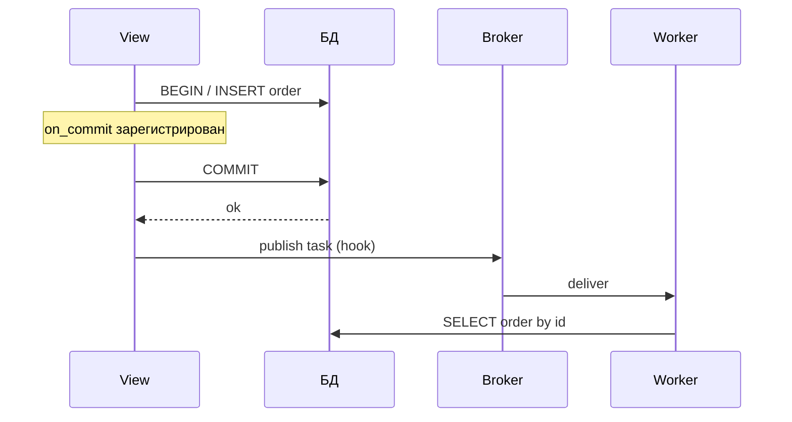
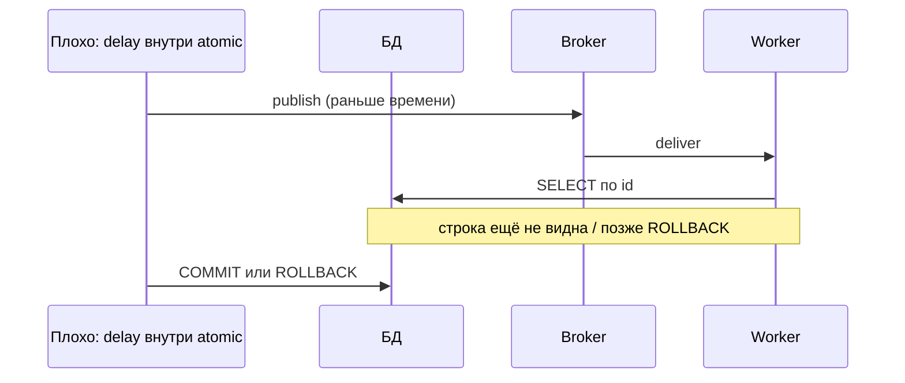
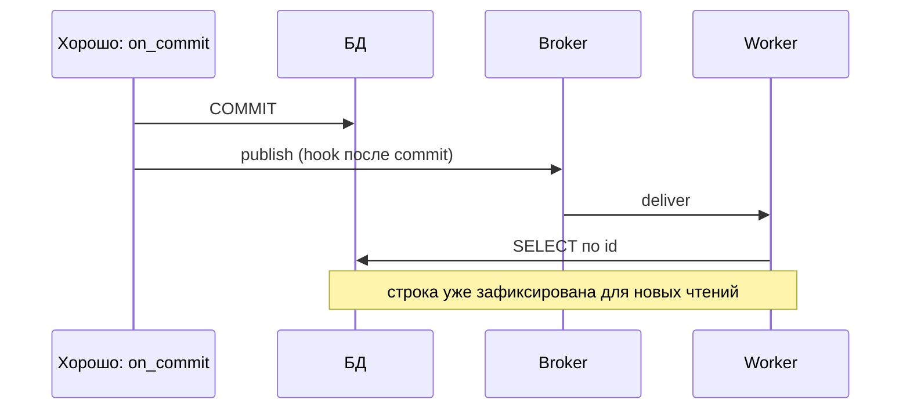
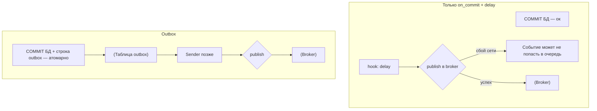
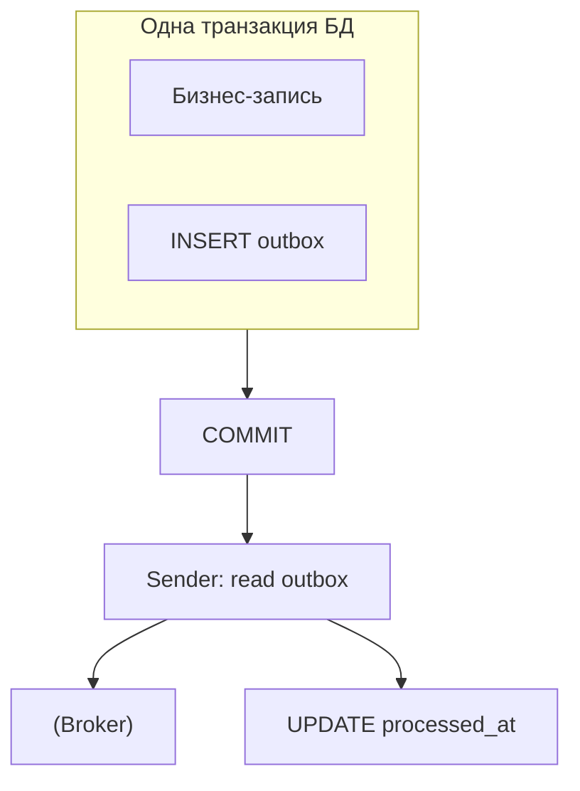

[← Назад к индексу части](index.md)
[↑ К глобальному плану](../../mastery_plan.md)

## 18.2 Транзакции и публикация задач

### Цель раздела

Понять **порядок** «запись в БД → постановка в очередь» так, чтобы не было **фантомных задач** при rollback и **гонок** «worker не видит строку».

### В этом разделе главное

- **По умолчанию** постановка задачи **не участвует** в транзакции БД.
- **`transaction.on_commit`** — стандартный Django‑способ **отложить** побочный эффект до **успешного commit**.
- Даже с `on_commit` брокер **другая система**: для **строгой** связки нужен **outbox**.
- Чтение «только что созданного» в задаче — это вопрос **видимости** и **изоляции**; иногда нужен **явный** `refresh_from_db` или повторный `get`.

### Термины

| Термин | Кратко |
|--------|--------|
| **`atomic()`** | Блок, внутри которого Django управляет транзакцией (savepoint’ы на вложенность). |
| **Visibility** | Когда другая сессия БД **видит** строку после commit. |
| **At-least-once** | Брокер может **доставить сообщение более одного раза** — задача должна быть устойчива (идемпотентность). |

### Теория и правила

**Интуиция:** транзакция БД — **замок сейфа**. Пока сейф не закрыли (**commit**), сосед (worker) может **не увидеть** клад или увидит **старую** версию. Если вы «отправили письмо курьеру» (**delay**) **до** закрытия сейфа, а потом сейф **открыли и выбросили содержимое** (**rollback**) — курьер везёт **призрак**.

**Правила:**

1. Если задача **должна существовать только если запись в БД зафиксирована** — оборачивайте публикацию в **`transaction.on_commit`**.
2. Если нужна гарантия «**запись + событие**» без окна — проектируйте **outbox** в той же транзакции.
3. Не смешивайте **`on_commit`** с **долгими** внешними вызовами внутри хука: хук должен быть **быстрым** (поставить в очередь), тяжёлое — в worker‑е.

### Пошагово (паттерн view/service)

1. Выполните бизнес‑логику в `transaction.atomic()`.
2. Создайте/обновите строки.
3. Зарегистрируйте **`on_commit(lambda: my_task.delay(obj.pk))`**.
4. Выйдите из `atomic` — при успешном commit хук выполнится **после** фиксации.
5. В задаче **заново** прочитайте объект из БД по `pk`.

### Простыми словами

**`on_commit`** — «сделай это **когда сделка с БД реально состоялась**». Без него Celery живёт **в параллельной вселенной**, не в той же транзакции.

### Картинка в голове



### Как запомнить

**«Сначала коммит — потом курьер (очередь).»**

### Дополнение: почему нельзя слать задачу **до** коммита (две оси риска)

| Риск | Что происходит | Симптом в логах/продукте |
|------|----------------|---------------------------|
| **Rollback** | Сообщение уже в брокере, транзакция откатилась | Обработка «несуществующего» заказа, письма не тем людям, мусор в аудите |
| **Видимость** | Worker стартует **до** фиксации строки для **другой** сессии БД | `DoesNotExist`, успех со **второго** retry, флаппинг под нагрузкой |





#### Проверь себя: две оси риска (rollback и видимость)

1. Почему **одна и та же** ошибка `DoesNotExist` в логах worker может соответствовать **разным** корневым причинам — и rollback, и видимость?

<details><summary>Ответ</summary>

Потому что **симптом** один: worker читает по id и не находит строку. **Rollback/фантом** — когда сообщение **не должно было** существовать после отката транзакции. **Видимость** — когда строка **есть** на primary, но **ещё не видна** реплике/другой сессии или запись на **другом** шарде. Диагностика требует **трассировки** постановки относительно commit и **точки чтения**.

</details>

2. Сравните **outbox** и **`on_commit`+delay** с точки зрения оси риска **«rollback оставил сообщение»**.

<details><summary>Ответ</summary>

`delay` **до** commit даёт **фантом** при rollback. **`on_commit`** убирает рассинхрон **БД vs очередь** относительно commit, но **не** делает брокер частью транзакции. **Outbox** записывает намерение **в той же** транзакции, что и сущность — rollback **убирает** и строку, и событие; потеря возможна уже на этапе **отправки** из outbox, но журнал в БД остаётся.

</details>

3. На диаграмме «плохо» сообщение уходит **раньше** COMMIT. Почему **ускорение** worker‑а (больше concurrency, быстрый брокер) **усиливает** проявление бага?

<details><summary>Ответ</summary>

Чем **раньше** доставка и старт задачи, тем **выше** вероятность, что SELECT выполнится в окне **до** видимости строки или **до** финального исхода транзакции; под нагрузкой **гонки** становятся **частыми**, а не «редким флаком».

</details>

### Дополнение: чтение «только что созданного» объекта в задаче

После **`on_commit`** и успешной публикации в брокер обычно выполняется цепочка: **commit уже завершён** → хук выполнился → сообщение ушло в broker → worker делает **`get(pk=...)`**. На **одном primary Postgres** с типичным **`READ COMMITTED`** новая строка **видна** новым транзакциям после commit — это **нормальный** happy path.

**Когда ломается «очевидная» картина:**

1. **Реплика чтения с лагом:** если worker читает с **replica**, а запись была на primary, возможен **кратковременный** «не найдено». Решения: читать критичные задачи с **primary**, подождать/повторить с backoff, или не использовать replica для этого типа задач.
2. **Несколько БД / шардов:** убедитесь, что worker обращается к **тому же alias**, куда писал web (явный **`using`** в сообщении).
3. **Тесты на SQLite / особые изоляции:** воспроизводите поведение максимально близко к продовой СУБД для интеграционных тестов транзакций.

**Практика:** в задаче всегда **`get()` или `filter().first()`** с **явной** обработкой отсутствия строки (лог + **безопасный** выход или отложенный retry, если бизнес допускает задержку появления данных).

#### Проверь себя: видимость данных

1. Почему при **`on_commit`** всё ещё возможен **`DoesNotExist`** в задаче, если web использует **read replica** с лагом?

<details><summary>Ответ</summary>

Потому что `on_commit` гарантирует порядок относительно **commit на primary**, но worker, читающий **replica**, может попасть в окно **репликационного лага** до появления строки на читателе. Нужен **primary** для чтения, **backoff/retry** или отказ от replica для этого класса задач.

</details>

2. Почему проблема **«несколько БД / шардов»** **не решается** одним лишь **`on_commit`**?

<details><summary>Ответ</summary>

`on_commit` синхронизирует побочный эффект с **commit выбранной** транзакции на **конкретном** `using`; worker должен **явно** знать **alias/шард** и ходить туда же. Иначе задача читает **не ту** БД и получает **`DoesNotExist`** при живом заказе на другом шарде.

</details>

3. Как в задаче **безопасно** обработать ситуацию «строка ещё не видна», если бизнес допускает краткую задержку?

<details><summary>Ответ</summary>

**Явный** `get` с обработкой отсутствия, **короткий backoff/retry** с лимитом, или **отложенная** постановка второй задачи; главное — **не** бесконечный ретрай всей тяжёлой логики и **метрики**, чтобы отличить нормальный лаг от бага данных.

</details>

### Примеры

**Анти‑паттерн:**

```python
def create_order_bad(request):
    with transaction.atomic():
        order = Order.objects.create(...)
        process_order.delay(order.id)  # опасно: может уйти до commit / при rollback — фантом
    return redirect("ok")
```

**Лучше:**

```python
from django.db import transaction

def create_order_good(request):
    with transaction.atomic():
        order = Order.objects.create(...)
        transaction.on_commit(lambda: process_order.delay(order.id))
    return redirect("ok")
```

**Outbox (упрощённо):**

```python
class OutboxEvent(models.Model):
    topic = models.CharField(max_length=64)
    payload = models.JSONField()
    created_at = models.DateTimeField(auto_now_add=True)
    processed_at = models.DateTimeField(null=True, blank=True)

def create_order_outbox(request):
    with transaction.atomic():
        order = Order.objects.create(...)
        OutboxEvent.objects.create(
            topic="order.created",
            payload={"order_id": order.id},
        )
    # отдельный процесс / периодическая задача читает OutboxEvent и публикует в broker,
    # затем помечает processed_at
```

### Практика / реальные сценарии

- **Сигналы `post_save`**: часто **внутри** транзакции модели — туда тоже нужен **`on_commit`**, иначе дублирование логики view/signal.
- **Celery retry** + **on_commit**: retry **не откатывает** уже закоммиченный заказ; продумывайте **идемпотентность** обработки заказа.
- Для **критичных финансовых** событий outbox + **exactly‑once эффект** на стороне получателя (ключ идемпотентности) — практичный production‑компромисс.

#### Проверь себя: сигналы, retry и критичные события

1. Почему **`post_save` + `delay()`** часто воспроизводит **те же** риски, что и `delay()` внутри `atomic()` в view?

<details><summary>Ответ</summary>

Потому что сигнал срабатывает **в контексте сохранения модели**, которое обычно **внутри** активной транзакции; постановка без **`on_commit`** снова даёт **фантом при rollback** и **гонку видимости** до commit.

</details>

2. Почему **Celery retry** после успешного commit **не** «отменяет» уже созданный заказ в БД?

<details><summary>Ответ</summary>

Ретраи касаются **исполнения задачи** и доставки сообщений; **закоммиченные** строки остаются. Нужна **идемпотентная** обработка и явные **доменные** статусы/компенсации, а не ожидание «отката транзакции из задачи».

</details>

3. Зачем для **финансовых** событий часто комбинируют **outbox** и **идемпотентность на приёмнике**, а не полагаются только на «надёжный брокер»?

<details><summary>Ответ</summary>

Брокер и сеть дают **at-least-once**; без ключа идемпотентности **дубликаты** событий превращаются в **двойные списания**. Outbox фиксирует **намерение** в БД и позволяет **повторять** отправку, а приёмник по **business key** гарантирует **эффект один раз**.

</details>

### Типичные ошибки

- Ставить задачу **до** `atomic` завершения без `on_commit`.
- Думать, что **`delay` внутри atomic** «откатится» вместе с БД.
- В `on_commit` передавать **замыкание** с **ORM‑объектом**, а не **`pk`** → лишняя связность и риск **устаревших** данных.

### Что будет, если…

- **Rollback** после `delay`: задача могла **уже улететь** → **orphan processing**, путаница в аудите, лишние письма пользователям.
- Worker стартует **слишком быстро** без `on_commit`: **`DoesNotExist`**, **ретраи**, мусор в логах.

### Проверь себя

1. Сформулируй **два разных** риска: «задача при rollback» и «worker раньше commit».

<details><summary>Ответ</summary>

**При rollback без on_commit:** задача могла быть **опубликована**, хотя БД откатилась — **несогласованность**. **Worker раньше commit:** задача могла быть доставлена **до** видимости строки в БД для другой сессии — **`DoesNotExist`/гонка** (особенно под нагрузкой).

</details>

2. Какой **инвариант** outbox усиливает по сравнению с `on_commit`+broker?

<details><summary>Ответ</summary>

Запись outbox **в той же транзакции**, что и бизнес‑данные, даёт **устойчивый журнал намерений**: даже если брокер временно недоступен, событие **не потеряно** и может быть **дослано** позже.

</details>

3. Почему в `on_commit` лучше передавать **`order.id`**, а не **`order`**?

<details><summary>Ответ</summary>

Чтобы хук не удерживал **ссылку на ORM‑объект** и чтобы в worker‑е выполнялся **свежий** `SELECT` по идентификатору; это проще сериализовать и снижает риск **устаревшего состояния** в замыкании.

</details>

4. Почему в **`on_commit`** не стоит вызывать **медленный HTTP** к внешнему API, даже если постановка в Celery «лёгкая»?

<details><summary>Ответ</summary>

Хук выполняется **в контексте завершения транзакции/запроса**; долгий внешний вызов **блокирует** поток, удлиняет **latency** web‑процесса и **удлиняет** окно удержания ресурсов. Побочный эффект в очереди должен быть **быстрым**; тяжёлое — **в worker‑е**.

</details>

5. Как **at-least-once** доставка связана с правилом «в задаче **заново** прочитать объект по `pk`»?

<details><summary>Ответ</summary>

Задача может выполниться **более одного раза**; повторное чтение по `pk` даёт **актуальное** состояние и позволяет **идемпотентно** решить, нужно ли что‑то делать (версия строки, статус, флаг «уже обработано»).

</details>

### Запомните

**Публикация задачи — побочный эффект вне БД; `on_commit` синхронизирует его с успешным commit; outbox — если нужна журналируемая доставка.**

### Дополнение: автокоммит и отсутствие `atomic()`

Если код выполняется **вне** явного `transaction.atomic()` (режим автокоммита Django), каждый **`save()`** часто приводит к **немедленному** commit на уровне запроса к БД. Тогда **`delay()` сразу после `save()`** может **казаться** «работающим».

**Ловушка:** как только тот же код окажется **внутри** `atomic()` (рефакторинг, новый декоратор, вызов из другого места), баг **проявится**. Поэтому **стандарт организации кода**: для побочных эффектов в очереди используйте **`on_commit` даже тогда**, когда «сейчас не в транзакции» — это **идемпотентно по смыслу** относительно порядка: при автокоммите commit уже произошёл, хук выполнится **сразу после** завершения текущей транзакции верхнего уровня (в автокоммите это эквивалентно «после операции»).

**Формулировка проще:** `on_commit` — **универсальная** привычка; она не ломает автокоммит, но спасает при появлении `atomic`.

#### Проверь себя: автокоммит

1. Почему код «`save(); delay()`» может **годами работать**, а затем **внезапно сломаться** без изменений Celery?

<details><summary>Ответ</summary>

Потому что его могли **обернуть** в `atomic()`, вызвать из **другого** места или включить **`ATOMIC_REQUESTS`** — появилась **внешняя** транзакция, и постановка снова стала **раньше** commit. **`on_commit`** делает поведение **устойчивым** к такому рефакторингу.

</details>

2. Выполняется ли **`on_commit`** «слишком поздно» в режиме автокоммита по сравнению с «немедленным» `delay()`?

<details><summary>Ответ</summary>

Обычно **нет смысловой** разницы для верхнего уровня: при автокоммите commit уже произошёл, хук отработает **сразу после** завершения текущей транзакции верхнего уровня — практически **сразу после** операции; выигрыш — в **едином** стиле и защите от будущего `atomic`.

</details>

### Дополнение: вложенные `atomic()` и порядок хуков

При **вложенных** `atomic()` Django использует **savepoint**‑ы. **`on_commit` хуки выполняются только при успешном commit внешней транзакции** — не при выходе из внутреннего блока.

**Порядок:** хуки вызываются **в порядке регистрации** (FIFO). Если вы регистрируете два `on_commit` подряд, сначала выполнится **первый**.

**Практический вывод:** если задача B **логически зависит** от того, что задача A **уже поставлена**, убедитесь, что и **данные**, и **порядок хуков** это отражают — или объедините в **одну** задачу с явными шагами.

#### Проверь себя: вложенные `atomic()`

1. Зарегистрировали `on_commit` **внутри** внутреннего `atomic()` (savepoint). Когда выполнится хук при успешном завершении **внешней** транзакции?

<details><summary>Ответ</summary>

**Только при успешном commit внешней** транзакции — не при выходе из внутреннего блока; до внешнего commit хуки **копятся**.

</details>

2. Два хука зарегистрированы подряд: A, затем B. Какой порядок **постановки** в брокер ожидать после commit?

<details><summary>Ответ</summary>

**FIFO:** сначала выполнится хук, зарегистрированный **первым** (A), затем второй (B), если только один из них сам не меняет порядок побочными эффектами.

</details>

### Дополнение: что `on_commit` **не** гарантирует

1. **Успешную доставку** в брокер после вызова хука — сеть к Redis/RabbitMQ может отказать; задача **не откатит** БД.
2. **Однократное** исполнение на стороне consumer‑а — см. at-least-once и **идемпотентность** (часть 9).
3. **Синхронный порядок** между **разными** web‑процессами — каждый процесс коммитит независимо; глобальный порядок событий требует **отдельного** механизма (очередь по шард‑ключу, версия сущности, event log).

#### Проверь себя: границы `on_commit`

1. БД **успешно закоммичена**, но сразу после хука **Redis недоступен**. Откатит ли Django транзакцию?

<details><summary>Ответ</summary>

**Нет:** commit уже **зафиксирован**; сбой публикации в брокер — **отдельная** проблема. Нужны **ретраи отправки**, **outbox** или мониторинг **пропущенных** событий.

</details>

2. Почему **`on_commit` не гарантирует exactly-once** на стороне worker?

<details><summary>Ответ</summary>

Потому что доставка сообщений в типичных брокерах **at-least-once**, а воркеры и ретраи могут **повторить** исполнение; гарантия «один раз» достигается **идемпотентностью** и ключами на стороне обработчика, а не хуком Django.

</details>

3. Два gunicorn‑воркера создали сущности **параллельно**. Почему нельзя ожидать **глобального** порядка задач в очереди только из **`on_commit`**?

<details><summary>Ответ</summary>

Каждый процесс коммитит **независимо**; порядок commit’ов и доставки в брокер **не** совпадает с «логическим» порядком бизнес‑событий без **явного** шардирования/версий/event log.

</details>

### Дополнение: `on_commit` и outbox на одной схеме (где «рвётся» гарантия)



**Идея:** в ветке **on_commit** «истина» о бизнес‑данных уже в БД, но **публикация** — отдельный шаг, который может упасть. В ветке **outbox** намерение **записано в БД** и может быть **повторено** отправщиком.

#### Проверь себя: on_commit vs outbox на схеме

1. Укажите **одно** место на схеме «только on_commit», где событие может **потеряться** при зелёном commit в Postgres.

<details><summary>Ответ</summary>

На шаге **publish в broker** после хука: сеть/брокер может отказать, а транзакция БД уже **не откатить** — событие **не попало** в очередь.

</details>

2. Что именно в outbox остаётся **истиной**, если broker временно лежит час?

<details><summary>Ответ</summary>

**Строки outbox** в БД: отправщик может **повторять** попытки публикации, пока не доставит; бизнес‑данные и намерение **зафиксированы** атомарно.

</details>

### Дополнение: `ATOMIC_REQUESTS` в `DATABASES['default']` (и соседних alias)

Если для alias БД включено **`'ATOMIC_REQUESTS': True`**, Django оборачивает **каждый** HTTP‑запрос в транзакцию: весь view живёт внутри **одной** большой транзакции до успешного завершения запроса.

**Связь с Celery:** **`on_commit` всё ещё нужен**, если вы ставите задачу **до** финального commit запроса (что почти всегда так и есть): до завершения запроса commit не произошёл, а **`delay` без `on_commit`** снова даёт **гонку/фантом**. Не полагайтесь на интуицию «раз запрос один — можно без on_commit».

#### Проверь себя: `ATOMIC_REQUESTS`

1. Весь view — одна большая транзакция. Почему **`delay` в середине** обработки запроса **опаснее**, чем кажется «одному запросу — одна транзакция»?

<details><summary>Ответ</summary>

Потому что **commit запроса** происходит **только в конце** успешного HTTP‑цикла; до этого момента данные **не зафиксированы** для других сессий, а worker уже может **читать** из своей сессии — классическая **гонка** без `on_commit`.

</details>

2. Меняет ли **`ATOMIC_REQUESTS`** необходимость **outbox** для строгой «запись+событие»?

<details><summary>Ответ</summary>

**Нет принципиально:** он лишь делает **явным**, что почти весь view в транзакции; **outbox** по‑прежнему нужен, когда требуется **журнал намерений** в БД и устойчивость к сбоям брокера **после** commit.

</details>

### Дополнение: `bulk_create` / `bulk_update` и постановка задач

- **`bulk_create`** по умолчанию **не** вызывает **`save()`** и **не** шлёт сигналы **`post_save`**/`pre_save`. Если вы рассчитывали на сигнал для постановки в очередь — **ничего не произойдёт**.
- Решения: явный цикл постановки задач **после** `bulk_create` (с **`on_commit`** и батч‑лимитами), отдельная задача «обработать пачку id», или **`send_signals`** там, где поддерживается и осознанно (сверьте версию Django и ограничения).

#### Проверь себя: `bulk_create` и сигналы

1. Почему **`bulk_update`** тоже не заменяет **поштучную** постановку задач через сигналы, если вы ожидали `post_save`?

<details><summary>Ответ</summary>

`bulk_update` **не** вызывает `save()` на каждой модели и **не** шлёт типичные сигналы **`post_save`**; логика «на каждое изменение — задача» должна быть **явной** после bulk‑операции или вынесена в **отдельную** пакетную задачу.

</details>

2. Когда **одна** задача «обработать список id» предпочтительнее **N** вызовов `delay` после `bulk_create`?

<details><summary>Ответ</summary>

При больших пачках: меньше **сообщений** в брокере, проще **бэкпрешер** и **лимиты**, единый **батч** в worker‑е с контролем памяти и одним **логом/метрикой** на операцию.

</details>

### Дополнение: outbox — сквозной пример процесса‑отправщика

**Таблица outbox** (упрощённо):

```python
class OutboxEvent(models.Model):
    event_type = models.CharField(max_length=64)
    payload = models.JSONField()
    created_at = models.DateTimeField(auto_now_add=True)
    processed_at = models.DateTimeField(null=True, blank=True)
```

**Запись в той же транзакции, что и бизнес‑сущность:**

```python
with transaction.atomic():
    order = Order.objects.create(...)
    OutboxEvent.objects.create(
        event_type="order.created",
        payload={"order_id": order.id},
    )
```

**Отправщик (периодическая Celery‑задача или management command + loop):**

```python
@shared_task
def flush_outbox_batch() -> None:
    close_old_connections()
    with transaction.atomic():
        batch = list(
            OutboxEvent.objects.select_for_update(skip_locked=True)
            .filter(processed_at__isnull=True)
            .order_by("id")[:100]
        )
        if not batch:
            return
        for ev in batch:
            publish_to_broker(ev.event_type, ev.payload)  # обёртка над apply_async
            ev.processed_at = timezone.now()
            ev.save(update_fields=["processed_at"])
```

**Замечания по продакшену:**

- `select_for_update(skip_locked=True)` помогает **нескольким** отправщикам работать параллельно.
- Публикацию и отметку `processed_at` лучше согласовать с **идемпотентностью** consumer‑а: при **краше** между broker ack и `save` возможен **дубликат** события.
- Альтернатива: **двухфазная** отметка (`published` / `confirmed`) или **логический** dedupe key на стороне обработчика.



#### Проверь себя: отправщик outbox

1. Зачем в примере **`select_for_update(skip_locked=True)`**, если отправщиков несколько?

<details><summary>Ответ</summary>

Чтобы **разные** процессы брали **разные** строки пачки без ожидания друг друга: `skip_locked` пропускает уже **заблокированные** строки, снижая **взаимные блокировки** и ускоряя параллельный drain.

</details>

2. Почему между **успешной** публикацией в broker и **`save(processed_at)`** всё ещё возможен **дубликат** события у consumer?

<details><summary>Ответ</summary>

Процесс может **упасть** после отправки в брокер, но **до** фиксации `processed_at`; при повторной обработке той же строки outbox (или повторном чтении) consumer снова получит сообщение — нужна **идемпотентность** или **двухфазная** отметка.

</details>

3. Почему в отправщике в начале вызывают **`close_old_connections()`**?

<details><summary>Ответ</summary>

Чтобы не работать с **устаревшим/битым** соединением к БД после долгих пауз или ошибок в **долгоживущем** worker‑процессе; это согласуется с дисциплиной соединений Django в Celery (см. §18.3).

</details>

### Дополнение: сигналы `post_save` и `on_commit`

**Анти‑паттерн:** в `post_save` вызывать `task.delay()` напрямую — сигнал срабатывает **внутри** транзакции модели.

**Лучше:**

```python
from django.db.models.signals import post_save
from django.dispatch import receiver
from django.db import transaction

@receiver(post_save, sender=Order)
def order_created(sender, instance, created, **kwargs):
    if not created:
        return
    order_id = instance.pk
    transaction.on_commit(lambda: process_order.delay(order_id))
```

#### Проверь себя: `post_save` и `on_commit`

1. Почему в примере в лямбду передают **`order_id`**, захваченный в **локальную переменную**, а не `instance.pk` прямо внутри без копии?

<details><summary>Ответ</summary>

Это защита от типичных ошибок **замыкания** в циклах и ясный сигнал «передаём **примитив**»; для одного вызова `instance.pk` часто эквивалентен, но **локальная копия** упрощает ревью и совпадает с правилом «в очередь — **id**».

</details>

2. Что даёт **`if not created: return`** с точки зрения постановки задач?

<details><summary>Ответ</summary>

Задача ставится только при **создании** строки, а не при каждом **обновлении** — иначе получите **шторм** повторных задач и лишнюю нагрузку.

</details>

### Дополнение: `IntegrityError` в задаче и дубли доставки

При **повторной доставке** сообщения (at-least-once) вставка «строго одного» лога/строки может дать **`IntegrityError`** (unique constraint). Обрабатывайте это как **ожидаемый** идемпотентный исход: **`try/except IntegrityError`** + **без** повторного ретрая всей задачи, если бизнес‑эффект уже достигнут, или используйте **`get_or_create`** / **`update_or_create`** с осмысленным ключом идемпотентности.

#### Проверь себя: `IntegrityError` как идемпотентность

1. Почему **бесконечный Celery retry** при `IntegrityError` на **unique** часто вреден?

<details><summary>Ответ</summary>

Потому что ошибка может означать «**запись уже есть** — цель достигнута», а не временный сбой; ретраи создают **шум**, задерживают очередь и маскируют **реальные** проблемы данных.

</details>

2. Как **`get_or_create`** помогает с **at-least-once** доставкой?

<details><summary>Ответ</summary>

Повторный запуск **не ломает** инвариант: второй раз вернёт **существующую** строку вместо вставки‑дубликата, если ключ совпадает с **идемпотентным** бизнес‑ключом доставки.

</details>

### Дополнение: `SoftTimeLimitExceeded` и соединения к БД

При **`soft_time_limit`** Celery бросает исключение; код в **`finally`** всё равно выполняется. Имеет смысл **гарантированно** вызывать **`close_old_connections()`** (или аккуратно закрывать транзакции), чтобы не оставить соединение в «полузавершённом» состоянии для следующей задачи в том же процессе (подробнее про лимиты — часть 9 и документация Celery).

```python
from django.db import close_old_connections
from celery.exceptions import SoftTimeLimitExceeded

@shared_task(soft_time_limit=30)
def long_job(order_id):
    try:
        ...
    except SoftTimeLimitExceeded:
        raise
    finally:
        close_old_connections()
```

#### Проверь себя: `SoftTimeLimitExceeded` и БД

1. Почему **`finally: close_old_connections()`** связан именно с **soft time limit**, а не «просто хорошая практика»?

<details><summary>Ответ</summary>

При soft limit исполнение **прерывается исключением**, но **finally** всё равно выполняется; без сброса соединений следующая задача в **том же** worker‑процессе может унаследовать **подвисшую** транзакцию/сокет. Явное закрытие снижает риск **утечек** и «битых» сессий БД.

</details>

2. Чем **soft** limit отличается от **hard** с точки зрения шанса выполнить **`finally`**?

<details><summary>Ответ</summary>

Soft даёт шанс **поймать исключение** и отработать очистку; hard может **убить** процесс **жёстко**, и тогда гарантий на выполнение Python‑`finally` в этой задаче **нет** — критичную очистку проектируют иначе (короткие транзакции, идемпотентность).

</details>

**Проверь себя**

1. Почему FIFO‑порядок `on_commit` важен, если одна задача **должна** стартовать строго после другой?

<details><summary>Ответ</summary>

Потому что **время постановки в очередь** для двух `delay()` из разных хуков следует порядку **выполнения хуков** после commit; если перепутать регистрацию, consumer может увидеть **обратный** порядок сообщений относительно бизнес‑логики. Для жёстких цепочек иногда проще одна **оркестрация** (chain/canvas, часть 10) или **одна** задача‑конвейер.

</details>

2. В чём **главный** компромисс outbox против «просто `on_commit` + delay»?

<details><summary>Ответ</summary>

Outbox добавляет **сложность** (таблица, отправщик, мониторинг застрявших записей), но даёт **устойчивый журнал намерений** в БД и снижает окно **потери события** при сбое брокера после commit. `on_commit` дешевле, но **не** делает брокер частью транзакции.

</details>

3. Включён **`ATOMIC_REQUESTS`**: можно ли **без** **`on_commit`** вызвать **`delay`** сразу после **`Order.objects.create`** внутри view?

<details><summary>Ответ</summary>

**Нет, по той же причине, что и при обычном `atomic()`:** до **успешного завершения** запроса внешняя транзакция **ещё не закоммичена**; worker может стартовать **раньше** фиксации. Нужен **`transaction.on_commit(...)`** (или outbox в той же транзакции).

</details>

4. После **`bulk_create`** не сработал **`post_save`** и задачи не поставились — что делать?

<details><summary>Ответ</summary>

**Не полагаться на сигналы:** либо **явно** после `bulk_create` зарегистрировать постановку (часто **одна** задача «обработать список id»), либо осознанно использовать **`send_signals`** там, где версия Django это поддерживает и где это оправдано по производительности.

</details>

---
