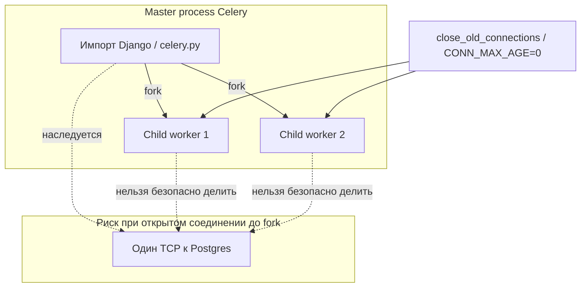

[← Назад к индексу части](index.md)
[↑ К глобальному плану](../celery_mastery_plan.md)

## 18.3 ORM и задачи

### Цель раздела

Научиться **безопасно и эффективно** работать с Django ORM внутри задач: что класть в сообщение, как избегать **N+1**, как управлять **соединениями** в **prefork** worker‑ах.

### В этом разделе главное

- **Сериализуйте идентификаторы**, не «живые» модели.
- Любой долгоживущий worker **переиспользует процессы** — соединения к БД требуют **явной гигиены**.
- **Prefetch/select_related** в задаче так же важны, как в view — иногда **важнее**, потому что задачи **пакетные**.
- **Версия строки** (timestamp/`updated_at`) помогает детектировать **устаревшие** решения.

### Термины

| Термин | Кратко |
|--------|--------|
| **Pickle / JSON serializer** | Как args попадают в брокер; модели **не должны** ехать через pickle в недоверенной среде. |
| **`select_for_update`** | Блокировка строки на время транзакции — иногда нужна **до** постановки задачи, не внутри задачи без понимания таймаутов. |

### Теория и правила

**Почему не instance:**

1. **Сериализация**: крупные объекты, вложенные связи, **lazy querysets** — непредсказуемый размер сообщения.
2. **Устаревание**: instance отражает **момент постановки**, не **момент исполнения**.
3. **Безопасность**: pickle **опасен** при недоверенном брокере (см. часть 17).

**Соединения и fork:**

- В **prefork** родитель может открыть соединение; после `fork` дети **наследуют FD** — типичный источник **«SSL connection already closed»** и зависаний.
- Практика: **`CONN_MAX_AGE=0`** для worker **или** агрессивное **`close_old_connections()`** в нужных хуках Celery (например `task_prerun`/`task_postrun`).

### Пошагово

1. В сообщении: **`pk`**, **тип сущности** (если несколько таблиц), **версия** при необходимости.
2. В начале задачи: **`close_old_connections()`** (по политике проекта).
3. Загрузите объект **`select_related`/`prefetch_related`** по реальному сценарию доступа.
4. Выполните эффект в **`transaction.atomic()`** внутри задачи, если нужны инварианты.
5. По завершении длинной задачи — по политике **`connection.close()`** (осторожно с пулом — оцените последствия).

### Простыми словами

Worker — **не продолжение** того же Python‑процесса, что обслужил HTTP. Думай: «**новый вход** — новый запрос к БД по паспорту (**pk**)».

### Картинка в голове

Официант (view) записал заказ на бумажке **`id=42`**. Повар (worker) идёт в **общую базу рецептов (БД)** и заново читает заказ **42**, а не использует **фотокопию** столетней давности.

**Prefork и соединения к БД:** главный процесс worker‑а (мастер) при старте может импортировать Django; **дочерние** процессы после **`fork()`** наследуют **файловые дескрипторы** открытых сокетов к БД. Если соединение «привязано» к сессии на сервере, использование **унаследованного** сокета в двух процессах ведёт к **хаосу**. Отсюда **`CONN_MAX_AGE=0`** и/или **`close_old_connections()`** на границе задачи.



### Как запомнить

**«В очередь — паспорт; в задаче — свежий SELECT».**

### Примеры

**Задача с prefetch:**

```python
from celery import shared_task
from django.db import close_old_connections, transaction

@shared_task
def rebuild_user_dashboard(user_id: int) -> None:
    close_old_connections()
    from django.contrib.auth import get_user_model
    User = get_user_model()
    with transaction.atomic():
        user = (
            User.objects.select_related("profile")
            .prefetch_related("orders")
            .get(pk=user_id)
        )
        # ... тяжёлая пересборка агрегатов
```

**Хук для соединений (фрагмент `celery.py` или `AppConfig.ready`):**

```python
from celery.signals import task_prerun, task_postrun
from django.db import close_old_connections

@task_prerun.connect
def _close_db(**kwargs):
    close_old_connections()

@task_postrun.connect
def _close_db_after(**kwargs):
    close_old_connections()
```

**N+1 в задаче (анти‑пример и исправление):**

```python
# Плохо: для каждого заказа отдельный запрос к пользователю
@shared_task
def notify_orders_bad(order_ids: list[int]) -> None:
    close_old_connections()
    for oid in order_ids:
        order = Order.objects.get(pk=oid)
        _send(order.user.email, order.id)  # order.user — lazy → запрос на каждый order

# Лучше: одна выборка с join
@shared_task
def notify_orders_good(order_ids: list[int]) -> None:
    close_old_connections()
    qs = (
        Order.objects.filter(pk__in=order_ids)
        .select_related("user")
        .iterator(chunk_size=500)
    )
    for order in qs:
        _send(order.user.email, order.id)
```

**Stale data — явная версия строки:**

```python
@shared_task
def apply_discount(order_id: int, expected_updated_at_iso: str) -> None:
    close_old_connections()
    from django.utils.dateparse import parse_datetime
    expected = parse_datetime(expected_updated_at_iso)
    with transaction.atomic():
        order = Order.objects.select_for_update().get(pk=order_id)
        if order.updated_at != expected:
            return  # заказ изменился после постановки задачи — не применяем устаревшую акцию
        # ...
```

### Практика / реальные сценарии

- **Пакетная обработка**: передавайте **список id ограниченного размера** или **диапазон**, а не «все id» без лимита — защита от **огромных** сообщений (см. часть 17, DoS).
- **Multi-db**: указывайте **`using=`** явно, если роутинг не тривиален.
- **Файлы `FileField`**: в задаче используйте **`storage` API** и помните про **пути в shared volume** или S3 — не «локальный путь разработчика».

### Типичные ошибки

- Передавать **QuerySet** как аргумент — **сериализация/оценка** не там, где ожидаете.
- Полагаться на **`F()` выражения** между процессами без повторного чтения.
- Держать **`CONN_MAX_AGE=600`** в prefork worker без мониторинга — **странные** обрывы под балансировщиком БД.

### Что будет, если…

- Нет **`close_old_connections`**: редкие **DatabaseError: connection already closed** на долгоживущих worker‑ах.
- Передаёте **вложенные dict с «моделью»**: раздувание сообщения и **PII** в брокере.

### Проверь себя

1. Почему **stale data** — не только «объект устарел», но и **бизнес‑решение** в задаче?

<details><summary>Ответ</summary>

Задача могла быть поставлена по **старому состоянию** (цена, лимит, флаг отмены). К моменту исполнения правила могли измениться; без **повторной проверки** в БД задача применит **неактуальную** логику.

</details>

2. Зачем **`task_prerun`** для `close_old_connections`, если Django «и так умеет БД»?

<details><summary>Ответ</summary>

В долгоживущих процессах и при **fork** соединения могут стать **невалидными** для сервера БД или TLS; явное закрытие **перед** задачей снижает класс ошибок **первого** запроса после простоя.

</details>

3. В каких случаях **`select_for_update`** уместнее во **view**, а не в задаче?

<details><summary>Ответ</summary>

Когда нужно **атомарно зафиксировать намерение** и порядок относительно **других web‑запросов** до постановки работы (например, резервирование остатка). В задаче блокировки **дольше** держат транзакцию и опасны **таймаутами**; решение зависит от домена.

</details>

4. Почему передавать в **`delay`** готовый **`QuerySet`** — почти всегда плохая идея?

<details><summary>Ответ</summary>

QuerySet **ленив** и привязан к **процессу/контексту**; при сериализации в брокер либо получите **неожиданную оценку** запроса, либо **несериализуемый** объект, либо **огромное** сообщение. Правильнее **`list` id с лимитом** или **диапазон** с явной выборкой в задаче.

</details>

5. Как **fork** в prefork объясняет ошибки вида «соединение к БД уже закрыто» **после** деплоя без изменений кода задач?

<details><summary>Ответ</summary>

После обновления образа/зависимостей меняется **порядок импорта** или **момент** первого подключения к БД в master до **fork**; дети **наследуют** FD и получают **битое** разделённое соединение. Политика **`close_old_connections`/`CONN_MAX_AGE=0`** для worker как раз про изоляцию после fork.

</details>

### Запомните

**Идентификаторы в сообщении, свежая загрузка в worker‑е, дисциплина соединений, осознанный prefetch.**

### Дополнение: `max_tasks_per_child` и утечки ORM

Даже при аккуратном коде долгоживущие процессы иногда накапливают **утечки** (кэши сторонних библиотек, циклические ссылки). В связке Django+Celery часто задают **`worker_max_tasks_per_child`** (или устаревшее имя в зависимости от версии — сверьте документацию Celery для вашей ветки), чтобы **периодически перерождать** воркер‑процессы после N задач.

**Компромисс:** перезапуск детей стоит **времени** (импорт Django, прогрев); слишком маленький N создаёт **накладные расходы** (см. часть 16).

#### Проверь себя: `max_tasks_per_child`

1. Какой **класс проблем** в Django+Celery слабо лечится только `close_old_connections`, но может смягчаться **периодическим перерождением** воркер‑процесса?

<details><summary>Ответ</summary>

**Утечки памяти** в сторонних C‑расширениях, накопление **глобальных** кэшей и **циклических** ссылок, «раздувание» процесса со временем; закрытие соединений **не освобождает** весь RSS и не сбрасывает **все** виды состояния.

</details>

2. Почему **слишком маленький** N для `max_tasks_per_child` может **снизить throughput**?

<details><summary>Ответ</summary>

Каждый перезапуск тянет **импорт Django**, инициализацию приложений и **холодный** прогрев; при высокой частоте перезапусков CPU уходит в **накладные расходы**, а не в полезную работу задач.

</details>

### Дополнение: пул процессов worker-а (`prefork` vs `solo` / `threads` / `gevent`)

| Пул | Взаимодействие с Django ORM | Когда вспоминают в Django‑проектах |
|-----|------------------------------|-------------------------------------|
| **prefork** (по умолчанию) | **`fork()`** детей → классика проблем с **унаследованными** соединениями к БД | CPU‑bound задачи, изоляция по памяти |
| **solo** | **Один** процесс, **нет** fork детей | Отладка, малые нагрузки, проще жить с `CONN_MAX_AGE` |
| **threads** | Общий процесс, потоки делят соединения осторожно | I/O‑bound; следить за **not thread-safe** библиотеками |
| **gevent/eventlet** | Патчинг сокетов; ORM в зелёных потоках требует **дисциплины** | Высокая конкурентность I/O (см. часть 8) |

**Вывод:** если вы «лечите» только Django‑соединениями, но упираетесь в странные баги на **prefork**, временно **`celery -A proj worker -P solo`** помогает **локализовать**: проблема в **fork** или в **логике задачи**.

#### Проверь себя: пул worker‑а

1. Чем **threads** пул рискованен для кода с **не thread-safe** клиентами (часть старых SDK, глобальное состояние)?

<details><summary>Ответ</summary>

Потоки **делят память** одного процесса; два одновременных захода в задачу могут **гнать** один и тот же **немой** глобальный клиент и получить **гонки**, `SSL`‑ошибки или порчу кэша — в prefork процессы **изолированнее**.

</details>

2. Зачем **`solo`** полезен как **диагностический** шаг, даже если в проде нужен prefork?

<details><summary>Ответ</summary>

`Solo` убирает **fork** детей и упрощает модель «один процесс — одна задача за раз»; если баги **исчезают**, гипотеза про **унаследованные соединения/мультипроцессность** усиливается, и можно целенаправленно чинить **CONN_MAX_AGE**, хуки и порядок импорта.

</details>

3. Когда **gevent** в связке с ORM требует **особой** дисциплины?

<details><summary>Ответ</summary>

Когда блокирующий код **не патчится** кооперативно и **держит** event loop: долгие CPU‑участки или синхронные вызовы к БД без учёта **pool** могут **заморозить** все зелёные потоки; нужен осознанный выбор библиотек и часто **отдельные** пулы под нагрузку (см. часть 8).

</details>

### Дополнение: PgBouncer и `CONN_MAX_AGE`

Если перед Postgres стоит **PgBouncer** в режиме **transaction pooling**, долгоживущие **сессионные** фичи Postgres (prepared statements без осторожности, `LISTEN`, некоторые типы temp tables) становятся **чувствительны**. Django имеет настройки взаимодействия с pgbouncer (в новых версиях — **`DISABLE_SERVER_SIDE_CURSORS`**, **`CONN_HEALTH_CHECKS`** и т.д. — **сверьте документацию вашей версии Django**).

**Практическое правило:** при странных обрывах «**server closed the connection unexpectedly**» на worker‑ах сначала проверьте **сочетание** `CONN_MAX_AGE`, **pool mode** и **health checks**.

#### Проверь себя: PgBouncer и долгие соединения

1. Почему **`CONN_MAX_AGE > 0`** на worker может **конфликтовать** с **transaction pooling** в PgBouncer?

<details><summary>Ответ</summary>

Клиент держит **долгоживущее** соединение и ожидает **сессионные** гарантии Postgres, а пулер **перекидывает** backend‑сессию между транзакциями; вместе это даёт **неожиданные** обрывы, потерю prepared state и ошибки «сервер закрыл соединение».

</details>

2. Что проверить **раньше**, чем blameить Celery, при таких обрывах?

<details><summary>Ответ</summary>

**Режим пулера** (session vs transaction vs statement), **`CONN_MAX_AGE`**, **`CONN_HEALTH_CHECKS`/`DISABLE_SERVER_SIDE_CURSORS`** для вашей версии Django и таймауты на стороне **балансировщика** БД — часто это **инфраструктурный** матчинг, а не баг задачи.

</details>

### Дополнение: несколько баз данных

Если используется **`DATABASE_ROUTERS`**, задача должна **явно** знать, в какой БД читать/писать. Передавайте в сообщении не только `pk`, но и **`db_alias`** (строка), если маршрутизация зависит от **тенанта** или **шарда**.

**Пример контракта сообщения:**

```python
@shared_task
def sync_tenant_stats(tenant_id: int, using: str = "default") -> None:
    close_old_connections()
    Tenant = apps.get_model("tenants", "Tenant")
    tenant = Tenant.objects.using(using).get(pk=tenant_id)
    ...
```

#### Проверь себя: multi-db в сообщении

1. Почему **недостаточно** передать только `tenant_id`, если роутер когда‑то «всегда» слал tenant‑ов в alias `shards`?

<details><summary>Ответ</summary>

В worker нет того же **HTTP‑контекста**, правила роутера могут **измениться**, появятся **исключения** для админки/миграций; явный **`using`** в сообщении — **контракт**, устойчивый к рефакторингу.

</details>

2. Чем опасно **жёстко зашить** alias в коде задачи без параметра?

<details><summary>Ответ</summary>

Шардирование и **переезд** тенанта между БД потребуют **перекомпиляции** всех старых сообщений в брокере или **невозможности** корректно обработать хвост очереди после смены топологии.

</details>

### Дополнение: `FileField` и хранилища

**Неверно:** передавать **абсолютный путь** на диске разработчика.

**Верно:** в сообщении — **`pk`** медиа‑модели; в задаче — `file_field.open("rb")` через **storage backend** (S3, GCS, NFS). Убедитесь, что worker имеет **те же credentials** для облачного storage, что и web (IAM role, env vars).

#### Проверь себя: `FileField` и storage

1. Почему **абсолютный путь** на диске web‑сервера — типичный антипаттерн для аргумента задачи?

<details><summary>Ответ</summary>

У worker **другая файловая система** или контейнер без того же mount; путь **не переносится** между средами. Нужен **pk** и **storage API**, чтобы разрешить файл в **том же** бэкенде, что и у продукта.

</details>

2. Что сломается, если web пишет в S3 с одной **IAM ролью**, а worker без доступа к bucket?

<details><summary>Ответ</summary>

`open()`/`save()` в задаче даст **403/AccessDenied** или таймауты; симптом «в админке файл есть, в задаче нет» часто именно **расхождение credentials**, а не Celery.

</details>

### Дополнение: кэш Django (`CACHES`) и worker

| Бэкенд | Web и worker «видят» одно и то же? | Комментарий |
|--------|-----------------------------------|-------------|
| **`django.core.cache.backends.locmem.LocMemCache`** | **Нет** | Отдельный процесс = **отдельный** словарь в памяти. Инвалидация из web **не** видна worker‑у. |
| **Redis / Memcached** | **Да** (при одном кластере) | Стандарт для **флагов**, **rate limit**, **дебаунса** пересчётов между web и worker. |

**Типичный баг:** в view кладёте в LocMem «кэш справочника», в задаче читаете — всегда **промах**. Либо **общий** Redis, либо не кэшировать то, что нужно в worker, а перечитывать из БД.

**Связь с §18.4:** debounce пересчёта агрегатов удобно делать ключом в Redis вида `recalc:tenant:{id}` с TTL, а не «флажком» в памяти процесса.

#### Проверь себя: кэш в worker

1. Почему **LocMemCache** почти никогда не подходит для «инвалидации справочника, который читает и web, и Celery»?

<details><summary>Ответ</summary>

Потому что **LocMem** живёт **внутри одного процесса**; web и worker — **разные процессы** с **разными** экземплярами локального кэша. Изменения в одном процессе **не видны** другому.

</details>

2. Почему **Redis** как общий кэш лучше подходит для **debounce** пересчёта между web и worker (связь с §18.4)?

<details><summary>Ответ</summary>

Ключ с **TTL** в Redis **виден всем** процессам; можно **атомарно** обновлять «последний запрос на пересчёт» и снимать **шторм** событий без общей памяти одного воркера.

</details>

3. Когда проще **не кэшировать** в worker, а **перечитать из БД**?

<details><summary>Ответ</summary>

Когда данные **часто меняются**, кэш **сложно** инвалидировать между процессами, а запрос к БД **дешевле** операционной сложности рассинхрона; также когда объём справочника мал и **latency** БД приемлема.

</details>

### Дополнение: `only()` / `defer()` в задачах

Если в view вы отдали в очередь только `pk`, а в задаче делаете `.only("a", "b").get(pk=...)`, убедитесь, что **все** поля, к которым обращаетесь в теле задачи, либо в `only`, либо не трогайте «отложенные» поля — иначе получите **дополнительные** запросы или `DeferredAttribute`‑сюрпризы. Для сложной логики проще **`select_related` + полный набор нужных полей** без микрооптимизаций, пока нет профилирования.

#### Проверь себя: `only` / `defer`

1. Почему **`defer`** в задаче с **пакетной** обработкой может **увеличить** число запросов к БД?

<details><summary>Ответ</summary>

При обращении к «отложенному» полю ORM подгружает его **лениво** для **каждой** строки (или пакетами не всегда эффективно без профилирования), превращая экономию на SELECT в **N+1**‑паттерн.

</details>

2. Когда **отказ от `only/defer`** в пользу явного `select_related` оправдан **инженерно**, даже если «лишние колонки» чуть шире?

<details><summary>Ответ</summary>

Когда логика задачи **разрастается** и легко **забыть** поле в `only`; предсказуемый один запрос с нужными связями **дешевле** инцидентов и сложности ревью, пока профилировщик не показал узкое место.

</details>

### Дополнение: сравнительная таблица «что передавать»

| В сообщении | Оценка | Почему |
|-------------|--------|--------|
| `pk` int / **UUID** | Рекомендуется | UUID как первичный ключ **JSON‑сериализуем** как строку; держите **единый** формат (str vs uuid.UUID) в сигнатуре задачи |
| Сериализованный dict полей | Осторожно | Может раздувать сообщение и нести PII; быстро устаревает |
| `Model` instance (pickle) | Избегать | Опасно и тяжело; см. часть 17 |
| `QuerySet` | Избегать | Непредсказуемая сериализация/оценка |
| «Снимок» dict + версия | Иногда | Для событий, где важен **императив** «как было на момент события»; всё равно продумайте размер и секреты |

#### Проверь себя: полезная нагрузка сообщения

1. Когда **dict с полями модели** в аргументах задачи **уместен**, несмотря на риски?

<details><summary>Ответ</summary>

Когда нужен **императив события** («применить именно эти параметры согласования») и размер **ограничен**, **PII** отфильтрована, а идемпотентность построена по **ключу события**; всё равно чаще комбинируют с **версией**/`updated_at` в БД.

</details>

2. Почему **pickle модели** хуже **JSON + pk** даже в «доверенном» внутреннем Redis?

<details><summary>Ответ</summary>

См. часть 17: компрометация брокера или ошибка ACL превращает pickle в **RCE**; плюс тяжёлый граф объектов и **неявные** зависимости от кода версии модели при старых сообщениях в очереди.

</details>

3. Когда **«снимок» dict + версия** в сообщении предпочтительнее одного **`pk`**?

<details><summary>Ответ</summary>

Когда бизнес‑смысл «сделай **именно то**, что пользователь подтвердил» не выводится из текущей строки БД (например, цена на момент клика), и вы готовы контролировать **размер** и **секреты** снимка.

</details>

### Дополнение: UUID как первичный ключ в сообщениях

Если у модели **`UUIDField(primary_key=True)`**, в Celery с **`JSON`‑сериализатором** в брокер удобнее передавать **`str(uuid)`** единообразно: и в логах, и в типах задачи (`order_id: str`). Смешивание в одном проекте **`str`** и **`uuid.UUID`** в разных задачах повышает риск **мелких** багов при сравнении и логировании.

**Плюсы UUID в distributed‑системах:** можно **создать id на клиенте/web** до вставки и сразу поставить задачу по **известному** ключу (всё равно с **`on_commit`**, если строка в БД должна существовать до обработки).

**Минусы:** UUID **длиннее** int в логах и URL; индексы и **JOIN** на Postgres обычно ок, но **не** ожидайте «естественной» сортировки по времени без отдельного поля **`created_at`**.

### Проверь себя: UUID и контракт сообщения

1. Почему для UUID‑pk всё равно важен **`on_commit`**, если id известен **до** `INSERT`?

<details><summary>Ответ</summary>

Потому что **бизнес‑инварианты** часто требуют, чтобы строка и связи **были зафиксированы** и **видимы** другим транзакциям до фоновой обработки; ранний `delay` может дать worker‑у **`DoesNotExist`** или обработку «черновика», откат которого уже не синхронизирован с очередью. Id, известный заранее, **не отменяет** правил транзакции.

</details>

2. Зачем в мульти‑БД сценарии передавать **`using`**, если роутер «и так знает»?

<details><summary>Ответ</summary>

Роутер в worker‑е исполняется в **другом контексте** и может дать **другой** alias при изменении правил или при вызове вне HTTP‑запроса; явный **`using`** фиксирует **контракт** сообщения и снижает сюрпризы при рефакторинге маршрутизации.

</details>

3. Почему смешивать в проекте **`str`** и **`uuid.UUID`** в сигнатурах разных задач опасно?

<details><summary>Ответ</summary>

Сравнения, логирование и ключи кэша могут **не совпасть** (`UUID` vs строка); единый тип в аннотациях и сериализации снижает **мелкие** production‑баги.

</details>

### Дополнение: `GenericForeignKey` и `ContentType` в сообщениях

**Проблема:** нельзя передать «связанный объект произвольной модели» как instance; **GenericForeignKey** сам по себе в БД — это **`content_type_id` + `object_id`**.

**Контракт сообщения:** передавайте **два числа** (или UUID для `object_id`, если так устроена модель):

```python
@shared_task
def notify_comment_mention(content_type_id: int, object_id: int) -> None:
    close_old_connections()
    from django.contrib.contenttypes.models import ContentType
    ct = ContentType.objects.get(pk=content_type_id)
    model = ct.model_class()
    if model is None:
        return
    obj = model.objects.get(pk=object_id)
    # ...
```

**Граничные случаи:** объект уже **удалён** → `ObjectDoesNotExist` (решайте идемпотентно); `ContentType.objects.get(pk=...)` должен указывать на **ту же** БД/проект; не передавайте **имя** модели строкой без версии схемы, если боитесь рассинхрона после переименования приложений.

#### Проверь себя: GFK в очереди

1. Почему в payload **нельзя** ограничиться строкой `"app_label.Model"` без **`content_type_id`**?

<details><summary>Ответ</summary>

Потому что при **переезде приложения**, **переименовании** модели или **слиянии** миграций строковая метка может **разойтись** с фактическим `ContentType` в БД; **`content_type_id`** — стабильная ссылка на строку таблицы `django_content_type` в рамках окружения (при миграциях между средами всё равно нужна осторожность, но это тот контракт, который использует Django).

</details>

2. Почему **`model.objects.get(pk=object_id)`** после разрешения `ContentType` может дать **`ObjectDoesNotExist`** **без** бага маршрутизации?

<details><summary>Ответ</summary>

Целевой объект мог быть **удалён** между постановкой задачи и исполнением; для at-least-once это **нормальный** исход — обрабатывать **идемпотентно** (лог + выход), а не считать ошибкой инфраструктуры.

</details>

3. Зачем в GFK‑задаче проверять **`model is None`**?

<details><summary>Ответ</summary>

`ContentType` может указывать на модель, **удалённую** из кода или недоступную в этом worker‑е (старый образ, расхинхрон деплоя); без проверки будет **`ImportError`/краш** вместо контролируемого выхода.

</details>

---
