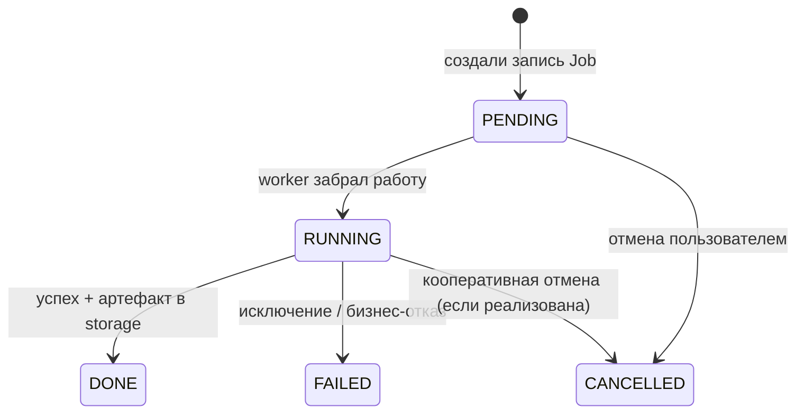
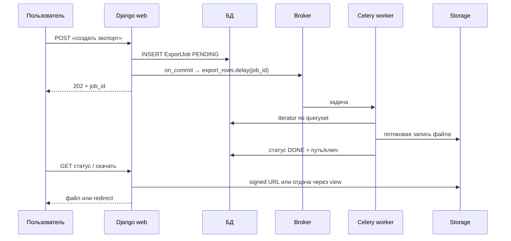
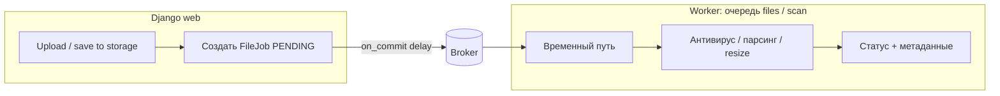

[← Назад к индексу части](index.md)
[↑ К глобальному плану](../../mastery_plan.md)

## 18.4 Django‑специфичные сценарии

### Цель раздела

Разобрать **частые продуктовые** применения Celery в Django‑мире: что именно выносится в фон, какие **инварианты** и **подводные камни**.

### В этом разделе главное

- **Email** — классика: не держите SMTP в request‑цикле.
- **Отчёты** — CPU/IO + возможно **большие файлы**: продумайте **хранилище** и **уведомление** готовности.
- **Экспорт** — потоковая запись, **лимиты**, **идемпотентность** повторов.
- **Агрегаты** — избегайте гонок: **блокировки**, **пересчёт по событию**, **materialized view** (если уместно).
- **Файлы пользователей** — вирусы/PII: **изоляция**, **антивирус** в отдельном контуре, **квоты**.

### Термины

| Термин | Кратко |
|--------|--------|
| **StreamingHttpResponse** | Для web‑выгрузки; в задачах — **потоковая запись на диск/S3**. |
| **Idempotency key** | Ключ, по которому повтор **не дублирует** эффект. |

### Теория и правила

Каждый сценарий — это **контракт**:

- **Вход**: какие id/фильтры, какие ограничения размера.
- **Выход**: куда кладём результат (модель `ReportJob`, S3 URL).
- **Наблюдаемость**: статус `PENDING/RUNNING/DONE/ERROR` для UI.
- **Ошибки**: ретраи только там, где **безопасно**.

### Пошагово (отчёт)

1. Создайте модель **`ReportRequest`** со статусом.
2. В view: создайте запись, **`on_commit`** → `build_report.delay(request_id)`.
3. В задаче: `close_old_connections`, загрузите запись, смените статус на `RUNNING`.
4. Сгенерируйте файл **частями** (не обязательно держать всё в RAM).
5. Сохраните в storage, обновите статус `DONE` + ссылку.
6. При ошибке: `ERROR` + **безопасное** сообщение (без traceback наружу).

### Простыми словами

Celery в Django чаще всего — **«сделай тяжёлое потом и скажи пользователю, когда готово»**, а не «ускорь HTTP».

### Картинка в голове

**Кухня ресторана:** заказ (HTTP) принят мгновенно, готовка (worker) идёт на кухне; гость получает **звонок** (уведомление), когда блюдо готово.

**Жизненный цикл типовой фоновой джобы в БД** (конечный автомат для UI и алёртов):



### Примеры

**Email (фрагмент):**

```python
@shared_task(bind=True, autoretry_for=(SMTPServerDisconnectedError,), retry_backoff=True)
def send_invoice_email(self, invoice_id: int) -> None:
    close_old_connections()
    invoice = Invoice.objects.select_related("customer").get(pk=invoice_id)
    if invoice.email_sent_at:
        return  # идемпотентный guard
    # send_mail(...)
    invoice.email_sent_at = timezone.now()
    invoice.save(update_fields=["email_sent_at"])
```

**Экспорт с лимитом:**

```python
@shared_task
def export_rows(job_id: int) -> None:
    close_old_connections()
    job = ExportJob.objects.get(pk=job_id)
    qs = job.queryset()[: job.row_limit]
    with job.open_output_stream() as stream:
        for row in qs.iterator(chunk_size=2000):
            stream.write(format_row(row))
    job.mark_done()
```

### Практика / реальные сценарии

- **Генерация PDF**: вынесите **шрифты/шаблоны** в кэш процесса; следите за **памятью** (часть 16).
- **Почта через внешний API (SendGrid и т.д.)** — ретраи с **backoff**, **лимиты** провайдера.
- **Пересчёт агрегатов** после пачки изменений: **debounce** через `chain`/`group` или отдельная «сводная» задача по **таймеру**.

### Типичные ошибки

- Отправлять письмо **синхронно** из сигнала без **`on_commit`**.
- Хранить **гигабайтный** результат в **result backend** (в т.ч. «положить туда весь CSV»).
- Не помечать **частичный успех** (файл записан, а статус не обновлён из‑за исключения позже).

### Что будет, если…

- Нет **идемпотентности** для email: пользователь получит **дубликаты** при ретраях.
- Нет **лимита** экспорта: один пользователь **положит** БД и диск.

### Проверь себя

1. Почему для отчётов часто вводят модель **`ReportJob`**, а не только `AsyncResult` Celery?

<details><summary>Ответ</summary>

`AsyncResult` привязан к **Celery** и может быть **недостаточен** для продукта: нужны **бизнес‑поля** (кто заказал, фильтры, ссылка на файл в storage, ACL). Модель Django даёт **долгоживущий** контракт для UI и аудита независимо от backend результатов.

</details>

2. Какой **минимальный** guard идемпотентности показан в примере с `email_sent_at`?

<details><summary>Ответ</summary>

Перед отправкой проверяем **метку времени**/флаг «уже отправлено» и **выходим**, если письмо было отправлено в прошлой попытке — повторная доставка задачи **не дублирует** письмо.

</details>

3. Зачем **`iterator(chunk_size=...)`** в экспорте?

<details><summary>Ответ</summary>

Чтобы **не загрузить** весь queryset в память разом; потоковая обработка снижает **пик RAM** worker‑а на больших выборках.

</details>

4. Зачем в сценарии «отчёт/экспорт» вводить **конечный автомат** статусов в БД, а не полагаться на «задача выполнилась без исключения»?

<details><summary>Ответ</summary>

Исключение может случиться **после** записи файла, **до** обновления статуса; нужны явные переходы **RUNNING/DONE/FAILED**, идемпотентные guard’ы и **аудит** для UI и поддержки. Celery «успех» не описывает **продуктовый** контракт доставки артефакта пользователю.

</details>

5. Почему **`fail_silently=True`** в фоновой отправке почты — антипаттерн?

<details><summary>Ответ</summary>

Ошибки SMTP/API **скрываются**: оператор видит «зелёное», письма не ушли, нет **метрик** и **ретраев** на уровне задачи. Нужны лог, статус джобы и осмысленный **retry/backoff**.

</details>

### Запомните

**Каждая django‑задача — мини‑проект: статус, хранилище, идемпотентность, лимиты.**

### 18.4.1 Отправка email

**Типовой поток:** view создаёт сущность → `on_commit` → задача **`send_*_email.delay(pk)`**.

**Инженерные детали:**

- **Backend:** SMTP, SES, SendGrid и т.д. — у каждого **лимиты** и **ретраи**; не используйте безлимитные sync вызовы внутри цикла по 10k пользователей в одной задаче без **батчинга** и **throttle**.
- **Шаблоны Django** (`render_to_string`) в worker‑е **нормальны**: убедитесь, что **контекст** не тянет лишние queryset‑ы.
- **Вложения:** большие файлы — через **storage**, не inline bytes в сообщении задачи.
- **Идемпотентность:** флаг `email_sent_at` или таблица «отправлено письмо типа X для объекта Y».

**Настройки Django, которые реально влияют на задачу:**

- **`EMAIL_BACKEND`** — тот же модуль, что и в web, если задача вызывает `send_mail` / `EmailMessage` (часто `django.core.mail.backends.smtp.EmailBackend` или облачный адаптер).
- **`DEFAULT_FROM_EMAIL`**, **`SERVER_EMAIL`** — должны быть заданы осмысленно и **одинаково** в окружении worker‑а.
- Пакеты вроде **`django-anymail`** переводят отправку на HTTP API провайдера: в worker нужны **те же** API‑ключи из env, что и на web.

**Анти‑паттерн:** `send_mail(..., fail_silently=True)` в фоне — вы **глотаете** ошибки доставки; в задачах лучше **явный** try/except, лог и **осмысленный** статус/ретрай.

**Батчинг:** для массовых рассылок рассмотрите **`django.core.mail.get_connection()`** и **`connection.send_messages([...])`** с ограничением размера батча, чтобы уложиться в лимиты провайдера и не держать гигабайты писем в памяти.

**Симптомы плохой реализации:** дубликаты писем при ретраях, зависание worker на SMTP timeout без `time_limit`, утечка PII в логах при ошибке рендера.

#### Проверь себя: email в Django + Celery

1. Почему **`EMAIL_BACKEND`** и ключи **Anymail** должны быть **согласованы** между web и worker?

<details><summary>Ответ</summary>

Задача вызывает тот же **`send_mail`/HTTP API**, что и web; расхождение env даёт «в админке тестовое письмо ушло, из задачи — 401/ошибка маршрута» или отправку **в другой** аккаунт провайдера.

</details>

2. Зачем при массовой рассылке говорить про **`get_connection().send_messages`** и **лимиты батча**?

<details><summary>Ответ</summary>

Провайдеры накладывают **rate limit** и размер батча; отправка **по одному** письму в цикле без троттлинга даёт **бан** и **зависшие** задачи. Общее соединение и пакеты снижают overhead и помогают уложиться в квоты.

</details>

3. Как **вложения** больших файлов связаны с **storage** и **аргументами задачи**?

<details><summary>Ответ</summary>

В сообщение не кладут **мегабайты** base64; в брокер — **id** сущности или **ключ** в S3, а worker читает через **storage API** с теми же **credentials**, что и web.

</details>

### 18.4.2 Генерация отчётов (PDF/Excel)

**Паттерн:** модель **`ReportJob`**: `PENDING → RUNNING → DONE/ERROR`, поля `parameters_json`, `output_file`, `error_redacted`.

**CPU и память:** PDF генерация часто **тяжёлая** — выносите в **отдельную очередь** `reports` с меньшей **concurrency** (часть 12/16).

**Время:** выставьте **`task_time_limit`** с запасом и **мягкий** `soft_time_limit` для корректной очистки.

**UX:** пользователь получает **ссылку** на готовый файл (signed URL), а не держит HTTP открытым часами.

**Стеки генерации (выбор компромисса):**

| Подход | Плюсы | Минусы |
|--------|-------|--------|
| **WeasyPrint / wkhtmltopdf** | HTML→PDF знаком фронтендерам | Зависимости ОС/шрифтов в контейнере worker‑а, память |
| **ReportLab / xhtml2pdf** | Контроль в Python | Верстка тяжелее, дольше разработка |
| **openpyxl / xlsxwriter** для Excel | Предсказуемо по памяти при потоковой записи | Не PDF |

Worker, который рендерит **Django templates** в HTML/PDF, должен видеть **те же** `TEMPLATES`, **`STATIC_ROOT`** (или доступ к статике через storage), что и web, иначе «в письме картинки есть, в PDF нет».

#### Проверь себя: PDF/отчёты

1. Почему генерацию PDF часто выносят в **очередь `reports`** с **меньшей** `concurrency`?

<details><summary>Ответ</summary>

Рендер **CPU/память**‑тяжёлый; смешивание с `default` **вытесняет** короткие задачи и может **исчерпать** RAM контейнера. Отдельный пул изолирует **SLO** и упрощает **лимиты** `time_limit`.

</details>

2. Зачем **`soft_time_limit`** рядом с **`task_time_limit`** для долгих отчётов?

<details><summary>Ответ</summary>

Soft даёт шанс **корректно** завершить участки и вызвать **`close_old_connections`/очистку** в `finally` до жёсткого kill; hard — последняя линия против «вечной» задачи.

</details>

3. Почему пользователю отдают **signed URL**, а не держат HTTP‑запрос открытым до конца генерации?

<details><summary>Ответ</summary>

Worker **асинхронен**; удержание соединения браузера часами **ломает** таймауты прокси и **масштабирование** web. Файл в storage + **короткая** ссылка — стандартный контракт.

</details>

### 18.4.3 Экспорт данных (CSV/JSON)

**Обязательно:** `QuerySet.iterator(chunk_size=...)` или серверный курсор (с учётом Django/БД), **верхняя граница** строк, **отмена** по флагу в БД если нужно.

**Поток «запросил в UI → скачал файл»** (worker не отдаёт HTTP сам по себе — он пишет **артефакт**, web отдаёт **ссылку** или **скачивание** после проверки прав):



**JSON / JSONL:** для больших выборок удобен **построчный** JSONL (одна запись = одна строка): меньше пиков памяти, чем у «одного гигантского `json.dumps`». Для **иерархий** с вложенностью заранее решите, **нормализуете** ли вы в несколько файлов/листов.

**Не кладите** готовый экспорт в **result backend** Celery: лимиты размера, TTL и стоимость хранения; **источник правды** — `ExportJob` + **object storage** или `MEDIA` с квотами.

**Кодировка и локаль:** явно задайте UTF‑8 BOM для Excel‑дружелюбного CSV, если это требование бизнеса.

**Идемпотентность:** повтор задачи не должен **дублировать** списание квоты или плейсхолдер файла — guard по `status IN (DONE, RUNNING)` или **уникальный** ключ экспорта на `(user_id, фильтр, день)`.

**Безопасность:** экспорт может быть **массовой утечкой** данных — проверяйте **права** в начале задачи **повторно** (не доверяйте только view).

#### Проверь себя: экспорт

1. Почему worker обычно **не** отвечает пользователю «файлом» напрямую через HTTP?

<details><summary>Ответ</summary>

Потому что исполнение **асинхронно** и в **другом процессе**; контракт — **модель джобы + storage**, а HTTP‑ответ отдаёт **web** (или CDN) после готовности, с **повторной** проверкой прав на скачивание.

</details>

2. Почему **готовый CSV** не кладут в **result backend** Celery?

<details><summary>Ответ</summary>

Result backend не рассчитан на **большие** бинарные полезные нагрузки: лимиты размера, стоимость Redis, TTL; **источник правды** — `ExportJob` + **object storage**, а не инфраструктурный слой результатов.

</details>

3. Зачем в начале задачи экспорта **повторно** проверять права, если view уже проверил?

<details><summary>Ответ</summary>

Задачу могли поставить **из другого входа**, возможен **replay** сообщения или **старый** `job_id`; экспорт — **массовая утечка** при ошибке ACL. Проверка в worker‑е — **контракт безопасности** на границе процесса.

</details>

### 18.4.4 Пересчёт агрегатов и счётчиков

**Гонки:** два события могут одновременно инициировать пересчёт. Решения: **идемпотентная** формула пересчёта из источника правды, **`select_for_update`** на строке агрегата, **debounce** (отложить пересчёт на T секунд и слить запросы).

| Паттерн | Когда уместен | Осторожно |
|---------|---------------|-----------|
| **Пересчёт из источника правды** (`SUM`/`COUNT` по детям) | Итог должен **совпадать** с БД после любых ретраев | Дорого на огромных таблицах — батчи, индексы, отдельная очередь |
| **`F()`‑выражения** | Инкремент счётчика **одной** атомарной `UPDATE` | Не подходит для «сложной формулы из многих таблиц» без доп. SQL |
| **`select_for_update`** на строке агрегата | Нужна **критическая секция** вокруг read‑modify‑write | Дедлоки и долгие блокировки при плохом порядке захвата |
| **Debounce / одна задача на ключ** | Поток мелких событий (правки каталога) | Задержка в UI; промежуточные состояния могут **не** отражаться в агрегате до окна debounce |

**Атомарный инкремент (идея):** вместо «прочитали `n`, записали `n+1`» в Python — одна команда на уровне БД:

```python
from django.db.models import F

Product.objects.filter(pk=product_id).update(sales_count=F("sales_count") + 1)
```

**Read‑modify‑write в транзакции** (когда нужна логика в Python между чтением и записью):

```python
from django.db import transaction

with transaction.atomic():
    agg = ShopStats.objects.select_for_update().get(shop_id=shop_id)
    agg.revenue_cents = recompute_from_orders(shop_id)
    agg.save(update_fields=["revenue_cents", "updated_at"])
```

**Eventual consistency:** покажите в UI, что цифра «обновляется с задержкой», если пересчёт асинхронен.

**База:** для тяжёлых отчётных агрегатов иногда лучше **materialized view** или отдельная OLAP‑цепочка — Celery не отменяет законы объёма данных.

**Дебаунс пересчёта (идея с Redis):** при потоке событий «изменился товар» не ставьте задачу на **каждое** изменение — установите ключ с TTL 30–60 с и ставьте **одну** задачу «пересчитать каталог X», если ключа ещё не было (или используйте `SETNX`). Альтернатива — поле **`recalc_scheduled_at`** в БД и периодический sweep.

```python
# Упрощённо: один пересчёт на shop_id в окне TTL
from django.core.cache import cache
from django.db import transaction

def schedule_shop_recalc(shop_id: int) -> None:
    key = f"recalc:shop:{shop_id}"
    if cache.add(key, 1, timeout=45):  # True только если ключа не было
        from shop.tasks import rebuild_shop_stats
        transaction.on_commit(lambda: rebuild_shop_stats.delay(shop_id))
```

#### Проверь себя: агрегаты и debounce

1. Чем **`F("sales_count") + 1`** предпочтительнее «прочитать n, записать n+1» в Python при высокой конкуренции?

<details><summary>Ответ</summary>

Обновление **одной** SQL‑командой **атомарно** на стороне БД и не требует долгой транзакции с блокировкой строки в Python; меньше **гонок** и потерь инкремента.

</details>

2. Какой **компромисс** у debounce через Redis TTL для агрегата в UI?

<details><summary>Ответ</summary>

Цифра в интерфейсе **отстаёт** на окно TTL; зато не создаётся **шторм** задач на каждое микроизменение. Нужно явно договориться об **eventual consistency** с пользователем.

</details>

3. Когда **`select_for_update`** на строке агрегата уместнее, чем **`F()`**?

<details><summary>Ответ</summary>

Когда между чтением и записью нужна **сложная логика** в Python (не выразить одним `UPDATE`) и важна **критическая секция**; помнить о **дедлоках** и держать секцию **короткой**.

</details>

### 18.4.5 Пост‑обработка пользовательских файлов

**Риски:** malware, **огромные** файлы, **PII** в содержимом, нехватка **диска** в контейнере.

**Граница зон ответственности** (web принял файл → worker тяжело обрабатывает):



#### Проверь себя: пользовательские файлы в worker

1. Зачем выделять **отдельную очередь** `files` / `scan` для антивируса?

<details><summary>Ответ</summary>

Сканирование **долгое** и **рискованное** (таймауты внешнего движка); изоляция не даёт ему **блокировать** обработку критичных задач в `default` и упрощает **лимиты** ресурсов на контур.

</details>

2. Почему **временные файлы** обязательно удалять в **`finally`**?

<details><summary>Ответ</summary>

При исключении или **`SoftTimeLimitExceeded`** файл останется на диске; без `finally` контейнеры **забивают** ephemeral storage и получают **OOM/eviction** серийно.

</details>

**Практики:**

- Сканирование в **изолированном** воркере/очереди с лимитами.
- **Квоты** размера и типов MIME на **публикации** задачи (часть 17, ingress).
- Явный **`max_length`** и валидация на уровне модели + повтор в задаче.
- Удаление временных файлов в **`finally`**.

**Проверь себя**

1. Почему для PDF‑отчётов часто выделяют **отдельную очередь**, а не общую `default`?

<details><summary>Ответ</summary>

Чтобы **не вытеснять** короткие критичные задачи долгими CPU‑bound отчётами и иметь **разный** `concurrency`/лимиты/мониторинг для **разного класса** нагрузки (fairness и SLO, см. части 12 и 16).

</details>

2. Чем **экспорт** опаснее **отправки email** с точки зрения утечки данных?

<details><summary>Ответ</summary>

Экспорт по определению собирает **массовый срез** записей в один файл; ошибка прав доступа или баг фильтра даёт **большой** объём чувствительных данных в одном артефакте, тогда как письмо чаще **точечное**.

</details>

3. Как **квоты MIME/размера** на этапе постановки задачи связаны с **DoS** (часть 17)?

<details><summary>Ответ</summary>

Без лимитов злоумышленник или баг клиента ставит **гигабайтные** задачи, исчерпывая **диск**, **CPU** сканера и очередь; валидация **до** `delay` и **повтор** в задаче снижают **ingress**‑поверхность.

</details>

---
