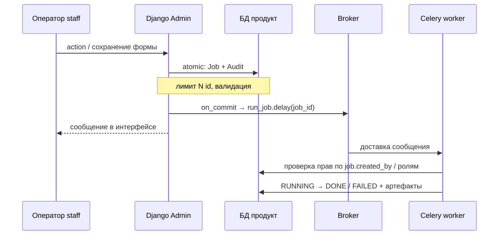
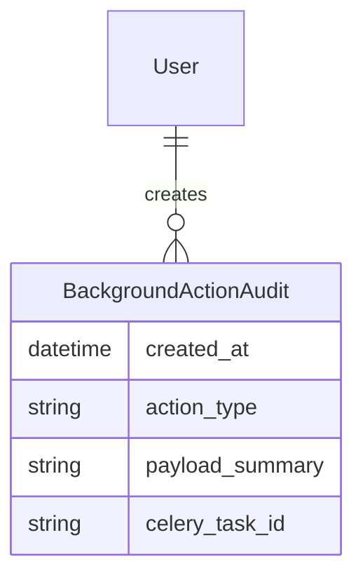
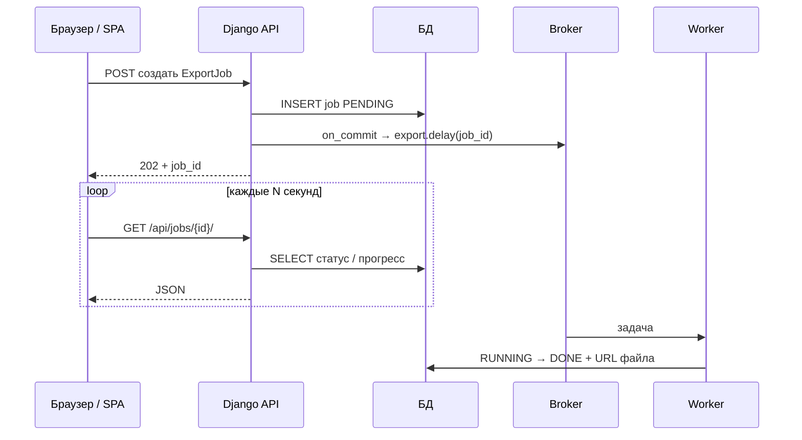
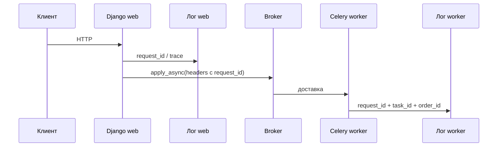

[← Назад к индексу части](index.md)
[↑ К глобальному плану](../../mastery_plan.md)

## 18.5 Django admin и observability

### Цель раздела

Связать **операторский UX** (админка) с фоновыми задачами **безопасно**: статусы, действия, аудит.

### В этом разделе главное

- Admin **удобен**, но часто **слишком мощный** — любая кнопка «запусти задачу» — потенциальный **remote code path**.
- Показывайте **статус** из **своей модели** (`Job`) + при необходимости ссылку на **Flower/логи** (осторожно с правами).
- Любое **массовое действие** → продумайте **лимиты** и **подтверждение**.
- **Audit trail**: кто нажал, когда, какие параметры.

### Теория и правила

**Поверхность атаки** (часть 17) в админке:

- Привилегированный пользователь может **поставить в очередь** дорогие задачи (**DoS** внутри периметра).
- Ошибочно выданные права **staff** → публикация произвольных задач, если действия написаны легкомысленно.

**Правила:**

1. Действия админки вызывают **сервисный слой**, который валидирует **объём** (сколько id, какие статусы допустимы).
2. Не передавайте **сырой** `request.POST` в задачу.
3. Логируйте **`user_id`**, **`job_id`**, **корреляцию** (trace id).

### Пошагово

1. Добавьте **`readonly_fields`** для статусов фоновых джобов.
2. **`AdminAction`** → создаёт строку `AdminJob` + `on_commit` → `run_admin_task.delay(job_id)`.
3. В задаче проверьте, что **`job.created_by`** — staff и **роль** допустима.
4. Обновляйте статус и **результат**/ошибку **без утечки** секретов наружу.

### Простыми словами

Админка — **пульт управления**: не вешайте на каждую кнопку «ракету», пока не проверили **кто** имеет право жать и **сколько** это стоит системе.

### Картинка в голове

**Пульт в операторской:** индикаторы (статус), ключ зажигания (права), журнал (аудит). Без журнала инциденты не расследовать.

**Сквозной поток** (границы: HTTP‑сессия админки ≠ процесс worker):



**Идея диаграммы:** админка **только ставит намерение** и пишет **аудит**; исполнение и долгие эффекты — в **worker**, с **повторной** проверкой доверия на входе задачи.

### Примеры

**Read-only статус в админке:**

```python
@admin.register(ExportJob)
class ExportJobAdmin(admin.ModelAdmin):
    list_display = ("id", "status", "created_by", "created_at", "finished_at")
    readonly_fields = ("status", "error_message_safe", "output_url")

    def error_message_safe(self, obj):
        return obj.redacted_error or ""
```

### Типичные ошибки

- **`action`** ставит задачу на **тысячи** объектов без подтверждения.
- Показывать **полный traceback** пользователю админки.
- Не различать **право «видеть»** и **право «запускать тяжёлое»**.
- Вызывать **`delay` прямо в action** без **`on_commit`**, когда создание `Job`/изменение связанных моделей ещё в **одной транзакции** с сохранением админки — те же гонки, что в view (§18.2).

### Проверь себя

1. Почему «запуск задачи из admin action» **опаснее**, чем тот же вызов из публичного API?

<details><summary>Ответ</summary>

Не обязательно опаснее **сетевым** периметром (admin часто внутри VPN), но **опаснее моделью доверия**: staff часто **шире** круга, чем ожидают разработчики, а действия **массовые**; ошибка в правах даёт **сильный** внутренний DoS и доступ к данным через побочные эффекты задач.

</details>

2. Что должно быть в **audit trail** для фоновой операции из админки?

<details><summary>Ответ</summary>

**Кто** (user id), **когда**, **что** (тип операции, id сущностей в безопасном объёме), **результат**/статус, **корреляционный** id; без секретов и без избыточного PII.

</details>

3. Зачем дублировать статус в **модели Job**, если есть **Flower**?

<details><summary>Ответ</summary>

Flower — **операционный** инструмент, не **продуктовый** контракт: доступ ограничен, история может быть **короче**, а бизнес‑оператору нужен **стабильный** UI в админке и связь с доменными объектами.

</details>

4. Почему правило «**не передавать сырой `request.POST` в задачу**» усиливается для admin actions?

<details><summary>Ответ</summary>

Staff может подставить **произвольные** поля формы; задача должна получать **валидированный** сервисный DTO (id, лимиты, тип операции), а не доверять размеру и содержимому POST **как контракту** без повторной проверки.

</details>

### Запомните

**Админка + Celery = сильные права → валидация объёма, аудит, минимум утечек в UI.**

### Дополнение: отображение статусов фоновых операций

**Принцип:** оператор смотрит в **админку на вашу модель** (`ExportJob`, `ImportJob`, `RecalcRun`), а не на «сырой» Celery task id как единственный источник правды.

**Что показывать в `list_display` / `readonly_fields`:**

- **`status`**: `PENDING`, `RUNNING`, `DONE`, `FAILED`, `CANCELLED` — **конечный автомат** с ясными переходами.
- **`progress_percent`** (0–100) или **`rows_processed / rows_total`** для длительных задач — обновляйте **батчами** внутри задачи (`update_fields`), не каждую строку, иначе убьёте БД.
- **`celery_task_id`** (опционально) — ссылка для **оператора**, который имеет доступ к Flower/логам; для обычных staff лучше **не подсвечивать** как «главное поле».
- **`started_at` / `finished_at`**, **`duration_seconds`** (вычисляемое readonly) — диагностика без раскрытия traceback.

**Шаблон прогресса в задаче (идея):**

```python
def run_export_job(job_id: int) -> None:
    close_old_connections()
    job = ExportJob.objects.get(pk=job_id)
    job.status = "RUNNING"
    job.save(update_fields=["status", "updated_at"])
    total = job.count_rows()
    job.rows_total = total
    job.save(update_fields=["rows_total", "updated_at"])
    for i, chunk in enumerate(job.iter_chunks(), start=1):
        process_chunk(chunk)
        if i % 10 == 0:
            job.rows_processed = min(i * CHUNK, total)
            job.progress_percent = int(100 * job.rows_processed / max(total, 1))
            job.save(update_fields=["rows_processed", "progress_percent", "updated_at"])
```

#### Проверь себя: статусы в админке

1. Почему **`celery_task_id` в list_display** для всех staff часто **нежелателен**?

<details><summary>Ответ</summary>

Это **толкает** операторов искать диагностику в Flower без понимания рисков; плюс **утечка** внутренних идентификаторов инфраструктуры. Лучше **опционально** и для подмножества ролей.

</details>

2. Как частота **`save(update_fields=...)`** прогресса влияет на **БД**?

<details><summary>Ответ</summary>

Каждое обновление — **запись на primary**; слишком частые обновления создают **hot row** и снижают throughput задачи. Батчи (каждые N чанков) балансируют **свежесть** UI и нагрузку.

</details>

3. Зачем показывать **`duration_seconds`** как **readonly** вычисляемое?

<details><summary>Ответ</summary>

Оператору нужна **быстрая** диагностика «зависло vs нормально долго» без доступа к **сырым** логам; вычисление из `started_at`/`finished_at` не дублирует **секреты** и не требует ручного ввода.

</details>

### Дополнение: audit trail (журнал действий)

**Зачем:** при расследовании «кто запустил пересчёт на весь каталог» недостаточно логов worker‑а — нужна **запись в БД** с **неизменяемыми** фактами (append‑only по политике).

**Минимальная модель:**

```python
class BackgroundActionAudit(models.Model):
    created_at = models.DateTimeField(auto_now_add=True)
    actor = models.ForeignKey(settings.AUTH_USER_MODEL, on_delete=models.PROTECT)
    action_type = models.CharField(max_length=64)  # например "export_csv"
    subject_repr = models.CharField(max_length=255)  # человекочитаемо, без PII
    payload_summary = models.JSONField(default=dict)  # id сущностей, лимиты, без секретов
    celery_task_id = models.CharField(max_length=128, blank=True)
    result_status = models.CharField(max_length=32, blank=True)
```



**Правило:** audit пишется **в той же транзакции**, что и создание `ExportJob`, или **сразу после** `on_commit` отдельной лёгкой записью — выберите одну политику и придерживайтесь её во всём проекте.

#### Проверь себя: audit trail

1. Почему audit часто делают **append‑only** или с **`PROTECT`** на пользователя?

<details><summary>Ответ</summary>

Чтобы **нельзя было** стереть след расследования при удалении аккаунта или «почистить историю»; для GDPR/compliance иногда **анонимизируют** актора, но **факт** операции сохраняют по политике.

</details>

2. Чем **`payload_summary`** в аудите отличается от полного лога args задачи Celery?

<details><summary>Ответ</summary>

**Summary** — осознанно **урезанный** контракт без секретов для **продуктовой** расследуемости; args Celery могут содержать **PII** и технические детали, не предназначенные для долгого хранения в БД аудита.

</details>

### Дополнение: безопасный `ModelAdmin.action` с лимитом

```python
@admin.register(Order)
class OrderAdmin(admin.ModelAdmin):
    actions = ["enqueue_recalc"]

    @admin.action(description="Пересчитать выбранные заказы (фон)")
    def enqueue_recalc(self, request, queryset):
        from django.contrib import messages

        MAX_N = 200
        ids = list(queryset.values_list("pk", flat=True)[: MAX_N + 1])
        if len(ids) > MAX_N:
            self.message_user(request, f"Выберите не больше {MAX_N} заказов.", level=messages.ERROR)
            return
        from django.db import transaction
        from shop.tasks import recalc_orders

        def _enqueue():
            recalc_orders.delay(ids)

        transaction.on_commit(_enqueue)
        self.message_user(request, f"Поставлено в очередь: {len(ids)} шт.")
```

**Почему так:** лимит защищает от **внутреннего DoS**; `on_commit` согласует с возможными изменениями в той же админской форме, если вы оборачиваете сохранение в транзакцию.

#### Проверь себя: admin action и лимит

1. Почему **`transaction.on_commit(_enqueue)`** здесь важен даже без явного `atomic()` в snippet?

<details><summary>Ответ</summary>

Админка и связанные save‑хуки могут выполняться **внутри** транзакции; без `on_commit` постановка снова даёт **фантом** при откате. Явный хук **унифицирует** поведение с view и DRF.

</details>

2. Что даёт **`MAX_N + 1` в slice** перед проверкой длины?

<details><summary>Ответ</summary>

Можно **дёшево** узнать, что выбрано **больше** лимита, не загружая **все** id в память; UX — сразу ошибка «выберите не больше N».

</details>

### Дополнение: фронтенд и статус фоновой операции (polling)

Django‑шаблон или SPA **не** видит Celery напрямую: браузер общается только с **HTTP API**. Типовой поток:



**Практика:** не опрашивайте **Flower** из публичного JS; отдавайте **своё** DRF/view с **авторизацией** и **ограничением** видимости чужих джобов. Для «живого» UX — **SSE/WebSocket** (отдельная тема), но источник правды всё равно **модель Job** в БД.

### Дополнение: Django REST Framework и постановка задач

В **`ModelViewSet.perform_create`** (или сервисном слое, который вызывает serializer.save) применяются **те же** правила, что и в обычном view:

```python
from django.db import transaction

class OrderViewSet(ModelViewSet):
    def perform_create(self, serializer):
        with transaction.atomic():
            order = serializer.save()
            transaction.on_commit(lambda: process_order.delay(order.id))
```

**Не** вызывайте **`delay`** прямо в serializer без понимания транзакции; **permissions** DRF проверяются **до** `perform_create`, но **задача** всё равно должна **повторно** валидировать права/состояние, если может быть поставлена из других входов.

#### Проверь себя: фронтенд и очередь

1. Почему в диаграмме polling **GET** идёт в **Django + БД**, а не напрямую в **Redis/broker**?

<details><summary>Ответ</summary>

Потому что брокер — **инфраструктурный** слой без продуктовой **авторизации** и без связи «какой пользователь может видеть какой job»; открывать его фронту — **увеличение поверхности атаки** и утечки метаданных. Контракт UI — **ваш API** и **модель Job** с ACL.

</details>

2. Чем **SSE/WebSocket** для статуса принципиально не снимает необходимость **модели Job** в БД?

<details><summary>Ответ</summary>

Канал доставки в браузер **меняется**, но **источник правды** остаётся в БД: при обрыве соединения клиент **переподключается** и читает актуальный статус; без строки Job нечего **атомарно** обновлять из worker‑а.

</details>

3. Почему polling каждые **100 ms** — плохая практика для типичного экспорта?

<details><summary>Ответ</summary>

Создаётся **шторм** HTTP и запросов к БД, нагрузка растёт **линейно** с числом открытых вкладок; разумнее **2–5 с** с backoff или событийная модель.

</details>

#### Проверь себя: админка и джобы

1. Почему обновлять **`progress_percent`** на **каждой** строке экспорта — плохая идея?

<details><summary>Ответ</summary>

Каждое `save` — отдельный **round-trip к БД** и рост нагрузки на primary; на больших выборках это **убивает** throughput задачи и создаёт hot spot. Обновляйте прогресс **батчами** (каждые N строк или процентов).

</details>

2. Зачем в audit хранить **`payload_summary`**, а не полный **JSON тела запроса**?

<details><summary>Ответ</summary>

Полный POST может содержать **секреты и PII**; для расследований достаточно **минимального** набора (тип действия, id, лимиты). Это снижает **риск утечки** из админки и размер строки аудита.

</details>

3. Почему DRF **`perform_create` + on_commit** не снимает необходимость **повторной** проверки в задаче?

<details><summary>Ответ</summary>

Задачу могут поставить **админка**, **beat**, **скрипт**; permissions DRF действуют только на **этот** HTTP‑путь. Вход в задачу — отдельный **контракт доверия**.

</details>

### Дополнение: Flower и прочие панели

**Flower** (если используете) даёт **операционную** картину: активные задачи, графики, иногда **слишком много** власти (shutdown worker — зависит от конфигурации). **Не заменяет** продуктовый статус в БД и **не должен** быть доступен из интернета без **TLS + auth** (часть 17).

**Корреляция:** прокидывайте **`request_id` / trace id** из Django в **headers** Celery (`apply_async(headers=...)`, см. часть 5 и 14), чтобы связать клик в админке с логами в Loki/ELK.

#### Проверь себя: Flower

1. Почему Flower **не должен** быть доступен из интернета без **TLS + auth**?

<details><summary>Ответ</summary>

Панель раскрывает **инфраструктуру** (задачи, воркеры, иногда управление процессами) и даёт **операционную** власть; без защиты это **удалённый** вход в контур очередей.

</details>

2. Зачем **коррелировать** `request_id` из web с логами worker?

<details><summary>Ответ</summary>

Чтобы за **один** инцидент «пользователь нажал кнопку» проследить цепочку до **конкретной** задачи и ошибки без ручного **поиска по времени** в разнесённых логах.

</details>

### Дополнение: безопасный паттерн «кнопка перезапуска задачи»

Вместо произвольного «введи имя задачи» (это **RCE‑подобный** риск при ошибке дизайна):

1. Явный **whitelist** допустимых операций в коде (`enum` типов джобы).
2. Сервер создаёт строку **`AdminActionJob`** с параметрами, валидированными **формой**.
3. Только **`on_commit`** ставит **конкретную** зарегистрированную задачу с **`job_id`**, а задача **снова** проверяет права и статус.

#### Проверь себя: перезапуск из админки

1. Почему поле «введите **имя задачи** Celery» в админке — **опасный** UX?

<details><summary>Ответ</summary>

Ошибка или эскалация прав превращает форму в **запуск произвольного** зарегистрированного кода с аргументами — близко к **RCE‑поверхности** внутри периметра. Нужен **whitelist** типов джоб и **валидированные** параметры.

</details>

2. Зачем при перезапуске создавать **новую** строку `AdminActionJob`, а не «просто снова `delay`»?

<details><summary>Ответ</summary>

Нужны **аудит**, **лимиты**, **идемпотентность** и связь «кто нажал» → **конкретный** контракт параметров; сырая повторная постановка теряет **прослеживаемость** и обходит политики.

</details>

### Дополнение: наблюдаемость без Flower

Минимум: **структурные логи** в worker (`task_id`, `task_name`, доменные id вроде `order_id`), **метрики** брокера (lag, rate), **алерты** на рост `FAILED` в вашей таблице `Job`. Это **достаточно** для многих команд, если продуктовые статусы в БД честные.

#### Проверь себя: без Flower

1. Какие **три** сигнала из текста достаточны для алерта «что-то не так с фоном» без UI Flower?

<details><summary>Ответ</summary>

Рост **lag** очереди в брокере, всплеск **`FAILED`** в продуктовой таблице `Job`, аномалия в **структурных логах** worker (частота `exception` по `task_name`).

</details>

2. Почему «честные» статусы в **БД** — предусловие отказа от Flower?

<details><summary>Ответ</summary>

Без них вы **не видите** продуктовый смысл сбоя в метриках; Celery‑уровень скажет «task failed», но не «экспорт пользователя X завис на RUNNING» — это только **`Job`**.

</details>

### Дополнение: логирование внутри задач (`get_task_logger`)

В задачах удобно брать логгер через **`celery.utils.log.get_task_logger`**: имя модуля попадёт в иерархию **`celery.task`**, проще **фильтровать** поток worker‑а в Loki/ELK и не смешивать с произвольными **`logging.getLogger("django")`**.

```python
from celery import shared_task
from celery.utils.log import get_task_logger
from django.db import close_old_connections

logger = get_task_logger(__name__)

@shared_task(bind=True, autoretry_for=(ConnectionError,), retry_backoff=True)
def process_order(self, order_id: int) -> None:
    close_old_connections()
    logger.info("start", extra={"order_id": order_id, "celery_task_id": self.request.id})
    try:
        ...
    except Exception:
        logger.exception("failed order_id=%s", order_id)
        raise
```

**Практика:** в **`extra=`** или в **структурированном** логгере (JSON) кладите **pk сущностей** и **`self.request.id`** — это связывает строку лога с **Flower**, **Sentry** и **трейсом** из HTTP (если прокинули `request_id` в заголовках задачи, см. часть **14**). У стандартного **`logging`** поля из **`extra`** должны попадать в **Formatter** / JSON‑энкодер, иначе агрегатор их **не увидит** — проверьте конфиг **`LOGGING`** или используйте **structlog** по стандарту команды.

**Сквозная корреляция** «HTTP → постановка → worker» (упрощённо):



**Не полагайтесь** только на **`print`** в worker: при ротации и уровне **WARNING** в проде вывод может быть **потерян** или **неиндексируем**.

#### Проверь себя: наблюдаемость и логи в worker

1. Зачем в задаче предпочитать **`get_task_logger(__name__)`** голому **`logging.getLogger(__name__)`**, если «и так работает»?

<details><summary>Ответ</summary>

Чтобы логи задач **предсказуемо** попадали в конфигурацию Celery/Django logging и их проще **отфильтровать** по имени/иерархии в агрегаторах; плюс это **соглашение** экосистемы Celery, снижающее хаос при десятках приложений.

</details>

2. Почему **нельзя** считать Flower «источником правды» для бизнес‑статуса отчёта?

<details><summary>Ответ</summary>

Flower отражает **инфраструктурное** состояние Celery и может **не знать** продуктовых полей (куда сохранён файл, кто владелец, прошли ли пост‑обработки). Кроме того, retention и доступ в Flower обычно **операционные**, не контракт для пользовательского UI.

</details>

3. Почему поля из **`extra=`** могут **не появиться** в Kibana/Loki без доработки formatter?

<details><summary>Ответ</summary>

Стандартный текстовый formatter выводит только **сообщение**; **структурированные** поля нужно явно включить в **JSON**‑layout или structlog, иначе агрегатор их **отбрасывает**.

</details>

---
