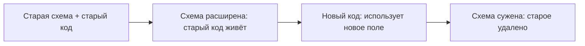
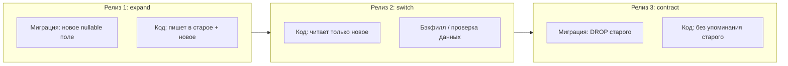
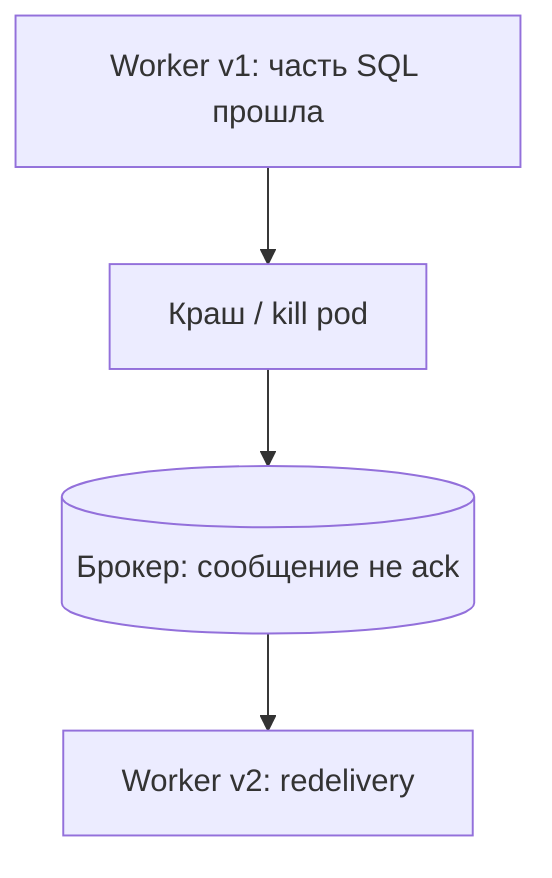
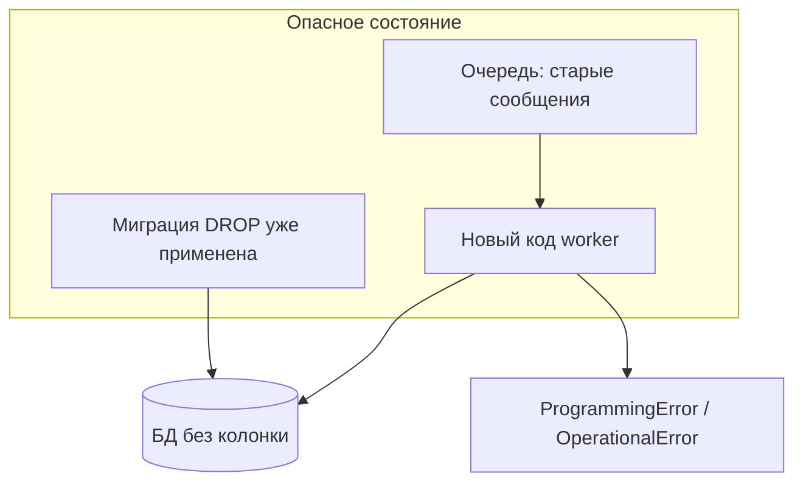

[← Назад к индексу части](index.md)
[↑ К глобальному плану](../mastery_plan.md)

## 18.6 Миграции Django и Celery

### Цель раздела

Научиться **планировать выкат** так, чтобы **новая схема БД**, **старый код worker‑а** и **новый код** не устроили **инцидент**.

### В этом разделе главное

- В проде одновременно живут **несколько версий** кода (rolling deploy).
- **Миграция БД** обычно **быстрее/раньше**, чем все процессы обновятся.
- Паттерн **expand → migrate → contract**: сначала **совместимая** схема, потом **переключение** кода, потом **удаление** старого.
- Задачи должны **терпеть** промежуточные состояния или быть **остановлены** на окно миграции.

### Теория и правила

**Типичный инцидент:** вы удалили колонку миграцией, а **старый worker** ещё делает `SELECT old_column` → **ошибки в очереди**, ретраи, шум.

**Стратегии:**

1. **Двухфазные миграции:** добавить новое поле (nullable/default), выкатить код, **бэкфилл**, сделать NOT NULL, потом удалить старое.
2. **Drain очередей** перед ломающей миграцией: остановить worker‑ы, миграция, деплой, старт.
3. **Feature flag** в задаче: если видим новую схему — одна ветка, иначе другая (краткоживущий костыль).

### Пошагово (безопасное удаление поля)

1. Выкат **код**, который **не читает** старое поле, но **ещё пишет** в новое и (временно) дублирует в старое при необходимости.
2. Миграция: добавить новое, бэкфилл данными.
3. Выкат **код**, который читает только новое.
4. Миграция: удалить старое поле.

### Простыми словами

**Сначала расширяем мост (новая колонка), перевозим поток машин на новую полосу, потом убираем старую полосу.** Не взрывайте старую полосу, пока на ней ещё едут worker‑ы.

### Картинка в голове

**Временная шкала по релизам (как «лежит» expand/contract в календаре деплоя):**

На всём протяжении **R1–R3** сообщения в брокере могут нести **старые** payload; либо **очереди чисты** к R3, либо задачи **толерантны** к версии.

### Дополнение: ретраи брокера, `acks_late` и миграции

При **at-least-once** доставке и настройках вроде **`task_acks_late`** (см. части **8** и **9**) сообщение может быть **доставлено повторно**, если процесс worker‑а упал **после** части изменений в БД, но **до** подтверждения брокеру. На окне **смены схемы** вторая попытка может уже выполняться **новым кодом** при **старом** payload — это усиливает необходимость **идемпотентности**, **`schema_version` в аргументах** и **двухфазных** миграций, а не только «старый worker vs новая БД».

#### Проверь себя: redelivery, `acks_late` и смена схемы

1. Почему **`acks_late`** усиливает риск «**вторая попытка** уже на **новом** коде» при деплое?

Ответ

Сообщение может быть **доставлено снова** после краша worker до ack; к моменту redelivery поднят **новый** образ с **другими** ожиданиями к схеме и payload. Нужны **идемпотентность**, **schema_version** и **двухфазные** миграции.

2. Как **идемпотентность** на стороне задачи помогает именно при redelivery на границе миграции?

Ответ

Повтор после частичного успеха не должен **ломать** данные: повторный `UPDATE` с тем же эффектом, guard по статусу, **`IntegrityError`** как успех — всё это сглаживает окно **v1/v2** кода и схемы.

3. Зачем в payload иногда вводят **`schema_version`**?

Ответ

Чтобы worker **явно** ветвился: старая версия сообщения может быть **безопасно** обработана no‑op или отдельным совместимым путём, а не падать на **отсутствующей** колонке.

### Практика / реальные сценарии

- **Переименование колонки**: часто делают как **add + copy + switch + drop** в несколько релизов.
- **Тяжёлый бэкфилл**: не в **транзакции на всю таблицу** в проде — батчи в **фоне** (Celery) или SQL по чанкам с **throttle**.
- **Индексы CONCURRENTLY** (Postgres) — отдельная дисциплина, не блокировать прод.

### Типичные ошибки

- «Сделали миграцию и деплой одновременно» без учёта **rolling**.
- Удалили таблицу, пока **beat** ещё ставит задачи на старый тип.
- Не мониторили **очередь ошибок** после миграции.

### Проверь себя

1. Почему **drain очереди** — валидная стратегия, хотя и «останавливает» обработку?

Ответ

Потому что **кратковременная** пауза обработки иногда **дешевле**, чем **часовой шторм** ошибок и poison messages от **несовместимости** схемы и кода; выбор зависит от SLO и размера окна.

2. Что такое **expand/contract** одной фразой?

Ответ

**Сначала** делаем схему **совместимой с обеими** версиями кода, **потом** переводим код на новую модель, **затем** убираем совместимость.

3. Как Celery **усложняет** миграции по сравнению с **только web**‑деплоем?

Ответ

Worker‑ы и **сообщения в брокере** продолжают нести **старые предположения** о схеме и payload **после** миграции БД; нужен учёт **версий** задач, **двухфазных** изменений или **остановки** consumer‑ов.

4. Когда **кратковременный feature flag** в задаче — оправданный компромисс?

Ответ

На **узком** окне rolling deploy, когда нужно **сосуществование** двух форматов payload или двух путей чтения схемы до завершения contract‑миграции; флаг должен быть **короткоживущим** и снят в следующем релизе.

### Запомните

**Схема БД и версии кода в полёте расходятся по времени — планируйте совместимость.**

### Дополнение: Kubernetes / rolling update

Типичный порядок **осторожного** выката при ломающей схеме:

1. **Увеличить** совместимость: миграции **expand** (новые nullable поля, новые таблицы).
2. Выкатить **web** и **worker** на версию кода, которая **пишет в новое** и **читает с fallback** (или только новое, если старых читателей уже нет).
3. **Бэкфилл** данных фоном.
4. Выкатить версию, которая **убирает** чтение старого.
5. Миграции **contract** (drop column) — когда **метрики** подтверждают отсутствие старых pod‑ов и **пустые** очереди от старых сообщений (если сообщения несут предположения о схеме — см. версионирование payload).

**Celery‑специфика:** сообщения могли быть поставлены **до** деплоя и исполнятся **после**. Либо **drain** очередей критичного типа, либо задачи **терпят** обе схемы короткое окно, либо версия в payload.

#### Проверь себя: Kubernetes и rolling update

1. Почему при rolling update **одновременно** в кластере могут быть pod‑ы **трёх** «поколений» относительно миграции?

Ответ

**Старые** web/worker ещё не вытеснены, **новые** уже принимают трафик, а **БД** может быть на **промежуточной** схеме expand; сообщения в брокере переживают поколения pod‑ов — нужна **совместимость** на каждом шаге.

2. Зачем смотреть на **метрики очередей** перед **contract**‑миграцией (`DROP`)?

Ответ

Чтобы убедиться, что **хвост** старых сообщений, завязанных на старую схему, **обработан** или **безопасен**; иначе `DROP` превратит очередь в **мертвую** с SQL‑ошибками.

### Дополнение: версионирование имени задачи и маршрутов

Если вы переименовали задачу или переместили модуль, в брокере могут остаться сообщения со **старым** fully qualified name. Имейте **план**: совместимый **alias** задачи, **dead letter** для неизвестных имён, или **очистка** очереди в окно обслуживания.

**Проверь себя**

1. Почему «сначала миграция, сразу потом деплой» опаснее при **10 репликах** worker, чем при **1**?

Ответ

Потому что окно, в котором **разные реплики** исполняют **разные версии** кода, **длиннее** и вероятность, что сообщение обработает **несовместимая** пара «код↔схема», выше. С одним worker переключение почти мгновенное.

2. Что делать, если переименовали задачу и в очереди остались сообщения со **старым** fully qualified name?

Ответ

Иметь **alias** регистрации (старый путь указывает на ту же функцию), **период окна** с обработкой обоих имён, **очистку** очереди в maintenance или **DLQ** для ручного разбора — иначе новый worker получит **NotRegistered**.

### Дополнение: задачи, которые читают **удалённые** таблицы или колонки

**Сценарий:** миграция удалила таблицу `legacy_invoices` или колонку `legacy_total`, а в брокере ещё лежат сообщения «пересчитай по `legacy_total`», поставленные **до** деплоя. Новый worker падает на SQL‑ошибке; старый worker уже не запущен — получается **мертвая очередь** или бесконечные ретраи.

**Профилактика (в порядке надёжности):**

1. **Двухфазная схема** из §18.6: код перестаёт **читать** старое **до** миграции `DROP`.
2. **Версия в payload:** `{"schema_version": 2, ...}`; задача **игнорирует** или **маршрутизирует** старые версии в **отдельный** обработчик‑«тихий выход».
3. **Окно обслуживания:** остановить worker‑ы, **drain/purge** очереди (осознанно!), миграция, деплой, старт. Подходит для низкорисковых ночных окон.
4. **Dead letter queue** на брокере + алерт на рост DLQ после релиза.

**Операционный ответ при инциденте:** временно **запретить** consumer‑ам брать проблемный тип задач, **переместить** сообщения в DLQ, выпустить **hotfix** задачи с безопасным no‑op + логированием, или **replay** после исправления данных.

**Проверь себя**

1. Почему **purge очереди** — это **продуктовое** решение, а не только «операционная кнопка»?

Ответ

Потому что необратимо **теряются** намерения: не будет пересчёта/отправки, если вы не **повторно** поставите задачи из достоверного источника (БД/outbox). Purge допустим только с явным пониманием **как восстановить** эффект.

2. Почему **двухфазная** миграция (код перестаёт читать старое **до** `DROP`) надёжнее, чем надеяться на **hotfix** задачи?

Ответ

Hotfix **не отменяет** уже доставленных сообщений с **старым** контрактом; двухфазность гарантирует, что к моменту удаления схемы **ни один** поддерживаемый путь кода не обращается к старому.

3. Как **DLQ** помогает после релиза с ломающей схемой?

Ответ

Проблемные сообщения **изолируются** из основной очереди, останавливается **бесконечный** retry шум; по DLQ виден **масштаб** инцидента и можно **replay** после исправления или **согласованного** purge.

---
