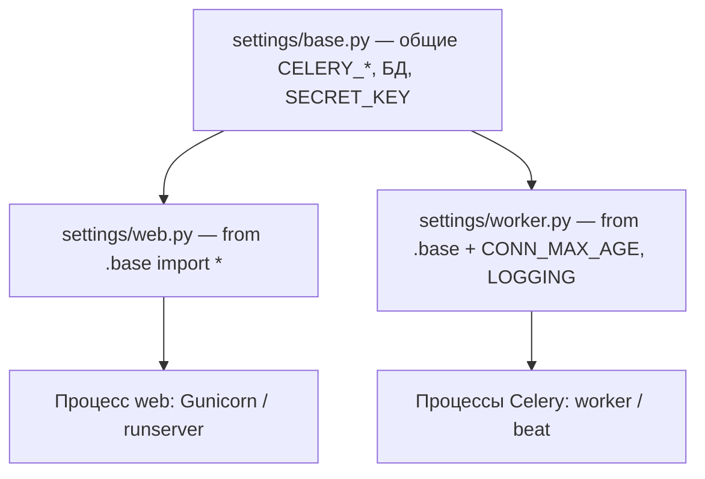
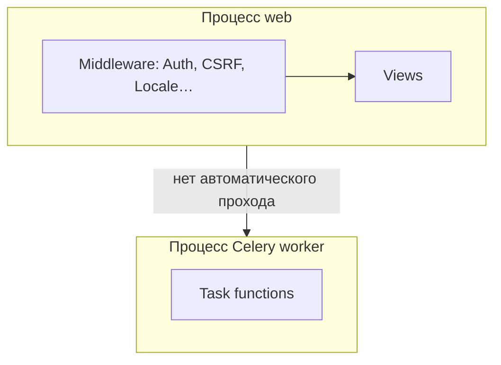
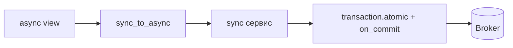

[← Назад к индексу части](index.md)
[↑ К глобальному плану](../mastery_plan.md)

## 18.7 Настройки Django, влияющие на worker

### Цель раздела

Сопоставить **параметры Django** (особенно БД) с **жизнью Celery worker**: пулы соединений, `CONN_MAX_AGE`, health checks, разделение конфигурации.

### В этом разделе главное

- Worker — **долгоживущий** процесс: **`persistent connections`** ведут себя иначе, чем в web.
- Рекомендуется явно решить: **`CONN_MAX_AGE=0`** в worker **или** контролируемый возраст + **`close_old_connections`**.
- Разделяйте **настройки**: `settings/web.py` vs `settings/worker.py`, общий `base.py`.
- **Логирование**: worker часто пишет **больше** и **дольше** — ротируйте, не используйте DEBUG в проде.

### Теория и правила

**Web (короткий жизненный цикл запроса):** соединение на запрос — приемлемо; **`CONN_MAX_AGE`** иногда >0 для снижения latency.

**Worker (длинный процесс, fork):** удержание соединений повышает риск **протухших** сессий; **0** упрощает модель.

**Health checks БД** (если используете): убедитесь, что они **не создают шторм** при большом числе воркеров.

### Пошагово

1. Вынесите общие настройки в `settings/base.py`.
2. Создайте `settings/worker.py`: `from .base import *`, переопределите `DATABASES['default']['CONN_MAX_AGE'] = 0` (если так решили).
3. Укажите `DJANGO_SETTINGS_MODULE=myproject.settings.worker` для процесса Celery.
4. Добавьте сигналы `task_prerun`/`task_postrun` при необходимости.
5. Проверьте **пул к БД** на стороне сервера (PgBouncer, max connections).

**Наследование модулей настроек** (один `base`, разные точки входа для процессов):



Один **`CELERY_BROKER_URL`** и **`DATABASES`** в `base` уменьшают риск «web пишет в одну БД, worker — в другую» из‑за опечатки в env.

### Примеры

**`settings/worker.py`:**

```python
from .base import *

DATABASES["default"]["CONN_MAX_AGE"] = 0
CELERY_TASK_ALWAYS_EAGER = False
LOGGING["loggers"]["celery"]["level"] = "INFO"
```

**Запуск:**

```bash
DJANGO_SETTINGS_MODULE=myproject.settings.worker celery -A myproject worker -l info
```

**Пример: `DATABASES` для worker с явными полями (ориентир; сверьте с версией Django):**

```python
# settings/worker.py (фрагмент после from .base import *)
DATABASES["default"].update(
    {
        "CONN_MAX_AGE": 0,
        # Django 4.1+: проверка «живости» соединения при CONN_MAX_AGE > 0
        # "CONN_HEALTH_CHECKS": True,
    }
)
```

Если вы **осознанно** держите **`CONN_MAX_AGE > 0`** на worker (например, очень дорогой handshake), включение **`CONN_HEALTH_CHECKS`** часто снижает сюрпризы после рестартов PgBouncer/Postgres, но увеличивает число **лёгких запросов** при старте использования соединения.

### Дополнение: WSGI, ASGI и worker

**Web‑процесс** может быть **Gunicorn+WSGI** или **Uvicorn+Django ASGI** — для Celery это **не меняет** модель: worker — **отдельный процесс**, который использует **те же** `INSTALLED_APPS`, модели и `settings` (часто тот же `base.py`). Отличия касаются в основном **периметра HTTP** (middleware, async views), а не ORM в задачах.



**Важно:** код задачи **не проходит** через CSRF/session middleware; любая «как в браузере» безопасность должна быть **явно** восстановлена (токены, проверка прав по `user_id`, см. часть 17).

#### Проверь себя: WSGI/ASGI и worker

1. Меняется ли **контракт Celery** при переходе web с Gunicorn+WSGI на Uvicorn+ASGI?

<details><summary>Ответ</summary>

**Нет по сути:** worker по‑прежнему отдельный процесс с теми же **`INSTALLED_APPS`** и ORM; меняется **модель HTTP** и async‑views, а не протокол сообщений брокера.

</details>

2. Почему **нельзя** ожидать, что «раз в web включён `AuthenticationMiddleware`, задача уже аутентифицирована»?

<details><summary>Ответ</summary>

Middleware **не** выполняется в worker‑е; доверие должно быть **явно** передано (`user_id` + повторная проверка) или встроено в **подписанный** контракт, а не подразумеваться из HTTP‑сессии.

</details>

### Дополнение: `async` views (ASGI), ORM и постановка задач

При **`async def` view** стандартный Django **ORM** и **`transaction.atomic` / `on_commit`** остаются **синхронными** API: их нельзя «просто так» смешивать с `await` без учёта **event loop** и **потокобезопасности** соединений к БД.

**Практичный паттерн:** оставить «создать строки + **`on_commit` → `delay`**» в **обычной sync‑функции**, а из `async` view вызывать её через **`asgiref.sync.sync_to_async`** (параметры вроде **`thread_sensitive`** — по документации Django для вашей версии):

```python
from asgiref.sync import sync_to_async
from django.db import transaction
from django.http import JsonResponse

from shop.models import Order
from shop.tasks import process_order

@sync_to_async
def create_order_and_enqueue(customer_id: int) -> Order:
    with transaction.atomic():
        order = Order.objects.create(customer_id=customer_id)
        transaction.on_commit(lambda: process_order.delay(order.id))
    return order

async def checkout_view(request):
    order = await create_order_and_enqueue(customer_id=...)
    return JsonResponse({"id": str(order.pk)})
```

**Анти‑паттерн:** долгий **`await`** между **`create`** и логикой, которая должна быть атомарна с постановкой задачи, без явного **`atomic()`** в одном sync‑блоке — легко разорвать **инварианты** «данные + намерение в очереди».

**Celery:** `delay` / `apply_async` — **синхронная** публикация в клиент брокера; вызывайте из **sync** части (как в примере внутри `on_commit`), а не «голым» `await` из async view.

**`thread_sensitive`:** у **`sync_to_async`** по умолчанию **`thread_sensitive=True`** — sync‑блок выполняется в **одном выделенном потоке** на loop, что обычно **совместимо** с ожиданиями Django к **соединениям БД** внутри одного процесса web. Менять на **`False`** имеет смысл только осознанно (параллельные sync‑вызовы из async) и **сверяясь** с документацией Django — иначе легко получить **нестабильные** соединения ORM.

**Альтернатива на горизонте версий:** в новых ветках Django доступен **async‑ORM** (`aget`, `acreate`, …). Если **вся** цепочка чтения/записи переведена на него, паттерн может отличаться от приведённого; в **смешанном** коде (часть async view, часть только sync API) приведённый **`sync_to_async` + sync‑сервис** остаётся **рабочим базовым** рецептом для Celery.



#### Проверь себя: ASGI и Celery

1. Почему нельзя считать, что **«раз Django на ASGI, Celery автоматически async»**?

<details><summary>Ответ</summary>

Потому что **worker Celery** по-прежнему исполняет **обычные sync‑функции** задач (если вы специально не используете другие режимы), а **публикация** из процесса web — это **синхронный вызов** клиента; ASGI меняет модель **HTTP**, а не контракт **ORM + транзакция + брокер**.

</details>

2. Зачем упоминается **`thread_sensitive`** у `sync_to_async` рядом с **`transaction.atomic`**?

<details><summary>Ответ</summary>

Потому что выполнение sync‑ORM в **неподходящем** пуле потоков может нарушить ожидания Django к **привязке соединений к потоку** и дать редкие **интермиттирующие** ошибки; значение по умолчанию выбрано как **безопасное** для типового кода с БД, а смена режима требует понимания модели потоков ASGI‑сервера.

</details>

3. Почему **`delay`/`apply_async`** нельзя «оборачивать» в **`await`** из async view как обычный async‑вызов?

<details><summary>Ответ</summary>

Публикация в брокер — **синхронный** вызов клиента; её нужно выполнять из **sync** части вместе с **`transaction.on_commit`**, иначе легко нарушить порядок транзакции и получить **блокировку** event loop на сетевом I/O к Redis без осознанного выноса в thread pool.

</details>

### Дополнение: время, таймзоны и `CELERY_TIMEZONE`

Согласуйте **`TIME_ZONE`**, **`USE_TZ`** в Django и **`CELERY_TIMEZONE`** (и при необходимости **`CELERY_ENABLE_UTC`**) так, чтобы:

- **`timezone.now()`** в задачах и в web давал **согласованные** моменты для полей `DateTimeField`;
- отложенные задачи (`eta`/`expires`, часть 5 и 11) не «прыгали» из‑за несовпадения локального времени worker‑хоста и настроек Django.

На проде обычно держат **UTC** везде и переводят в локаль только в **шаблонах/письмах**.

#### Проверь себя: время и таймзоны

1. Что может «поехать», если **`CELERY_TIMEZONE`** и **`TIME_ZONE`** Django расходятся?

<details><summary>Ответ</summary>

**`eta`/`expires`**, crontab в beat и **`timezone.now()`** в задачах будут интерпретировать моменты **по-разному** — задачи приходят **раньше/позже** ожидания, отчёты за «вчера» смещаются.

</details>

2. Почему на проде рекомендуют **UTC** везде?

<details><summary>Ответ</summary>

Исключается путаница **DST** и разных часовых поясов web/worker/БД; локаль остаётся **представлением** для пользователя, а не хранением моментов времени.

</details>

### Дополнение: `STATIC_ROOT`, шаблоны и медиа в worker

Если задача вызывает **`render()`** или собирает PDF с ****, worker должен либо:

- иметь доступ к **собранной** статике (**`collectstatic`** → `STATIC_ROOT` на общем том или в образе), либо
- использовать **внешний** URL/CDN для ресурсов (без ожидания локального файла).

**Медиа пользователей** — по-прежнему через **`FileField`/`storage`** (§18.3), не через предположение «файл лежит у разработчика в `/tmp`».

#### Проверь себя: шаблоны и статика в worker

1. Почему PDF в worker «**без картинок**», хотя в письме через web всё ок?

<details><summary>Ответ</summary>

Worker **не имеет** того же `STATIC_ROOT`/тома после **`collectstatic`**, или `` резолвится в **недоступный** путь в контейнере; нужен **общий** артефакт образа/volume или **CDN** URL.

</details>

2. Совпадение **`TEMPLATES`** между web и worker — про что именно?

<details><summary>Ответ</summary>

Одинаковые **DIRS**, **APP_DIRS**, loaders и контекстные процессоры, чтобы рендер в задаче не падал на **другом** наборе шаблонов и тегов при том же коде.

</details>

### Типичные ошибки

- Один **`settings.py`** с **`DEBUG=True`** случайно на worker.
- Слишком большой **`CONN_MAX_AGE`** + **PgBouncer в transaction mode** → неожиданные ошибки.
- Не учитывать **`max_connections`** Postgres при масштабировании worker × concurrency.
- В **`async def` view** вызывать **ORM / `transaction.on_commit` / `delay`** «как в sync view» без **`sync_to_async`** и без выделенного sync‑сервиса — риск **блокировки event loop**, гонок и предупреждений Django про **async unsafe**.

### Проверь себя

1. Почему **`CONN_MAX_AGE=0`** часто выбирают для worker «по умолчанию»?

<details><summary>Ответ</summary>

Чтобы каждый цикл задачи получал **свежее** соединение и уменьшить класс проблем **протухших**/невалидных коннектов в **долгоживущих** процессах и после **fork** без сложного тюнинга.

</details>

2. Зачем отдельный **`DJANGO_SETTINGS_MODULE`** для worker, если можно всё держать в одном файле?

<details><summary>Ответ</summary>

Явное разделение снижает риск **случайных** отличий поведения (DEBUG, логирование, пулы БД) и делает **операционные** решения видимыми в коде/review, а не «через env только на сервере worker».

</details>

3. Как worker‑ы влияют на **`max_connections`** БД?

<details><summary>Ответ</summary>

Каждый процесс/поток может держать соединения; суммарно **`процессы × конкурентность × пулы`** может исчерпать лимит. Нужен расчёт и часто **PgBouncer**/лимиты пула.

</details>

4. Почему **`DEBUG=True`** на worker в prod особенно вреден?

<details><summary>Ответ</summary>

Утечка **чувствительных** данных в трассировках, **лишний** overhead, риск случайного включения **небезопасных** путей и неожиданно **другого** поведения логирования/статики относительно web.

</details>

### Запомните

**Worker ≠ web по профилю соединений; зафиксируйте политику `CONN_MAX_AGE` и разделите settings осознанно.**

### Дополнение: таблица «web vs worker» (ориентир)

| Настройка / тема | Web (короткий процесс) | Worker (долгий процесс) |
|------------------|------------------------|-------------------------|
| **`DEBUG`** | false в prod | **обязательно** false; иначе утечки и оверхед |
| **`CONN_MAX_AGE`** | часто небольшой >0 для latency | часто **0** или малый + `close_old_connections` |
| **Шаблоны / middleware** | полный стек | минимум: задачи редко рендерят HTTP‑ответы |
| **`async` views + ORM** | нужен **`sync_to_async`** (или sync view) для **atomic/on_commit/delay** | worker не «async‑продолжение» view |
| **Кэш локальный в памяти** | осторожно с инвалидацией | риск **устаревшего** кэша между задачами |
| **Логирование** | запросный уровень | высокий объём; **ротация**, структура |

### Дополнение: `CONN_HEALTH_CHECKS` (Django 4.1+)

При **`CONN_MAX_AGE > 0`** Django может проверять соединение перед использованием (**`DATABASES['default']['CONN_HEALTH_CHECKS'] = True`** в поддерживаемых версиях). Это снижает ошибки «соединение убило с другой стороны», но добавляет **латентность** на проверку. Для worker‑ов решение **комбинировать** с политикой `CONN_MAX_AGE` и мониторингом.

**Важно:** сверяйте точное поведение с **документацией вашей версии Django** — детали эволюционируют.

#### Проверь себя: `CONN_HEALTH_CHECKS`

1. Какой **компромисс** вы покупаете, включая health checks при **`CONN_MAX_AGE > 0`**?

<details><summary>Ответ</summary>

**Дополнительные** round-trip’ы к БД при взятии соединения из пула — **латентность** и нагрузка на Postgres; зато меньше сюрпризов после **рестартов** сервера БД или PgBouncer.

</details>

2. Почему health checks **не отменяют** необходимость согласовать режим **PgBouncer**?

<details><summary>Ответ</summary>

Они проверяют «жив ли коннект», но не меняют семантику **transaction pooling** и несовместимости **долгих** сессионных состояний — это отдельный слой политики.

</details>

### Дополнение: `ALLOWED_HOSTS` и worker

Worker **не** обслуживает Host‑заголовок HTTP в типичной схеме, но некоторые библиотеки/проверки безопасности всё равно импортируют настройки. Держите конфиг **валидным** и **одинаково безопасным**: пустой/локальный `ALLOWED_HOSTS` в prod worker — признак **случайного** смешения dev‑настроек.

#### Проверь себя: `ALLOWED_HOSTS` на worker

1. Зачем упоминать **`ALLOWED_HOSTS`**, если worker **не** принимает HTTP?

<details><summary>Ответ</summary>

Некоторые пути импорта Django/сторонних пакетов **валидируют** настройки при старте; **расхождение** prod/dev и «пустой» список может маскировать **не тот** `settings` модуль или сломать утилиты, которые строят абсолютные URL через `Site`/request‑заглушки.

</details>

**Проверь себя**

1. Почему **локальный in‑memory cache** в долгоживущем worker может давать **странные** баги?

<details><summary>Ответ</summary>

Потому что кэш **переживает** множество задач и может хранить **устаревшие** объекты/флаги, которые в web‑процессе жили «на один запрос». Инвалидация должна быть **явной** или кэш — **внешний** (Redis/Memcached) с TTL.

</details>

### Дополнение: контекст HTTP **не** существует в worker

В задаче **нет** `request.user`, **нет** middleware‑цепочки, **нет** пер‑запросного логирования. Если нужны **права**, передавайте **`user_id`** и в задаче:

- заново загрузите пользователя;
- проверьте **роли/permissions** через `user.has_perm(...)` или свою модель ACL;
- **не доверяйте** «уже проверенному» флагу из view без повторной проверки, если задача может быть поставлена **из другого места** (админка, management command, beat).

**Locale/timezone:** для корректных дат в письмах активируйте **`timezone.activate()`** или передавайте **UTC + tz id** в payload.

#### Проверь себя: нет HTTP‑контекста в задаче

1. Почему **`request.user`** в задаче **недоступен** и что передают вместо этого?

<details><summary>Ответ</summary>

Задача выполняется в **отдельном процессе** без middleware; передают **`user_id`**, в задаче делают `get_user_model().objects.get` и **повторяют** проверку прав/ролей.

</details>

2. Почему нельзя полагаться на **пер‑запросный** кэш из middleware в worker?

<details><summary>Ответ</summary>

Потому что **нет запроса**; любой кэш должен быть **явным** (Redis, БД) или вычисляться **заново** в задаче.

</details>

### Дополнение: тестирование (связь с частью 15)

Практичная **лестница** для Django‑проекта:

1. **Юнит‑тест** чистой функции, которая принимает уже загруженные данные или моки — без Celery.
2. **Юнит‑тест задачи** с `@override_settings(...)` и вызовом **`.apply()`** / прямым вызовом тела, где ORM работает против **тестовой БД**.
3. **Интеграционный тест** с **реальным broker** (часто через docker в CI) для проверки **маршрутизации**, **сериализации** и **ретраев**.
4. Отдельные тесты на **`on_commit`**: использовать **`CaptureOnCommitCallbacks`** (Django) или сценарий с **явной** транзакцией и проверкой, что задача **не** ставится до commit.

**Пример: `captureOnCommitCallbacks` на `TransactionTestCase` (Django 4.2+ добавил удобный контекст на тестовом кейсе; в более старых версиях смотрите `django.test.utils` — сверьте документацию):**

```python
from unittest.mock import patch
from django.db import transaction
from django.test import TransactionTestCase

from shop.models import Order
from shop.tasks import process_order

class OrderOnCommitTests(TransactionTestCase):
    def test_process_order_delayed_after_commit(self):
        with patch("shop.tasks.process_order.delay") as mock_delay:
            with self.captureOnCommitCallbacks(execute=True):
                with transaction.atomic():
                    order = Order.objects.create(...)
                    transaction.on_commit(lambda: process_order.delay(order.id))
        mock_delay.assert_called_once_with(order.id)
```

**Зачем `TransactionTestCase`:** обычный `TestCase` оборачивает тесты в транзакцию с откатом; сценарии **`on_commit`** там часто **не совпадают** с продом. Для тонкой проверки коммитов используйте **`TransactionTestCase`** или специализированные утилиты из документации Django.

На практике дополнительно выделяют **сервис** `enqueue_order_processing(order)`, чтобы мокать одну точку входа, а не размазывать `on_commit` по view.

**Проверь себя**

1. Почему нельзя полагаться на то, что «view уже проверил `has_perm`», без дублирования в задаче?

<details><summary>Ответ</summary>

Потому что ту же задачу могут вызвать **beat**, **админка**, **другой сервис** или **replay** сообщения; контракт безопасности должен быть на **входе задачи**, а не только на одном HTTP‑пути.

</details>

2. Зачем для **`on_commit`** часто использовать **`TransactionTestCase`** вместо обычного `TestCase`?

<details><summary>Ответ</summary>

Обычный `TestCase` оборачивает тест в транзакцию с откатом; **`on_commit`** может **не сработать** так же, как в проде. `TransactionTestCase` ближе к **реальным** commit’ам (см. документацию вашей версии Django).

</details>

3. Что даёт выделение функции **`enqueue_order_processing(order)`** для тестов?

<details><summary>Ответ</summary>

Одна точка для **мока** постановки в очередь и проверки **`on_commit`** без копирования логики по всем view; проще **регрессии** при рефакторинге.

</details>

---

<a id="final-spravochnik"></a>
