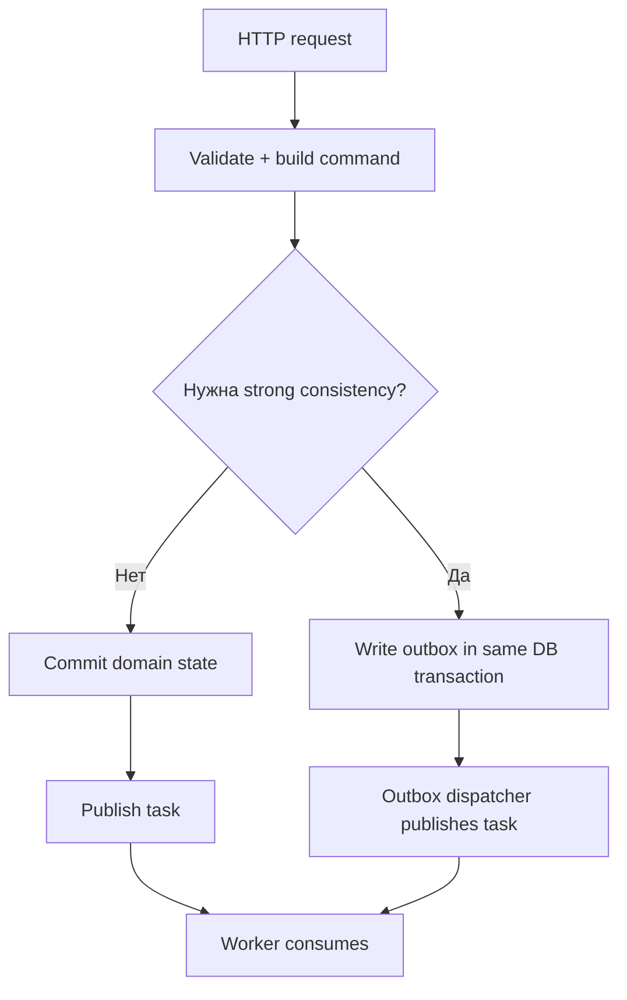
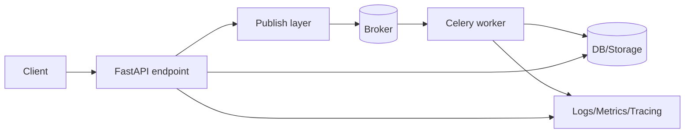
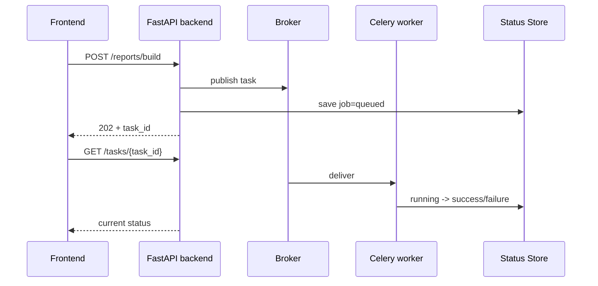

[← Назад к индексу части](index.md)
[↑ К глобальному плану](../../mastery_plan.md)

## 19.1. FastAPI + Celery

### Цель раздела

Понять практическую и архитектурно корректную интеграцию FastAPI и Celery: как организовать структуру проекта, как публиковать задачи из endpoint-ов, как переносить минимальный контекст, и как избежать типичных ошибок на async/sync границе.

### В этом разделе главное

- FastAPI (ASGI) и Celery worker живут в разных процессах и жизненных циклах.
- Публикация задач должна быть тонкой и предсказуемой: endpoint не должен знать детали исполнения worker-а.
- В payload передаем примитивы и идентификаторы, а не тяжелые объекты контекста запроса.
- Нужен явный contract layer: версия payload, correlation id, retry policy.
- Async endpoint не делает task-код "автоматически async".

### Термины

| Термин | Определение |
|---|---|
| **Dependency Injection (FastAPI)** | Механизм передачи зависимостей в endpoint (db session, auth и т.д.). |
| **BackgroundTasks (FastAPI)** | Локальные фоновые задачи в процессе ASGI-приложения, не распределенная очередь. |
| **Publish API** | Внутренний слой, который публикует задачу в Celery (единое место правил). |
| **Correlation metadata** | Набор полей для трассировки: request id, user id, source endpoint. |

### Теория и правила

#### Интуиция

FastAPI хорошо справляется с коротким запрос-ответ циклом. Celery хорошо справляется с работой "за пределами" этого цикла: длительная обработка, retry, отложенное исполнение, fan-out. Вместе они дают разделение ответственности.

#### Точная формулировка

Корректная интеграция FastAPI + Celery означает:

1. endpoint формирует **команду** (intent) и публикует ее в очередь;
2. worker независимо исполняет команду по контракту;
3. web-слой не зависит от внутреннего устройства worker-а;
4. observability позволяет связать HTTP-запрос и конкретный task execution.

#### Граница "транзакция API -> публикация в очередь"

Даже вне Django проблема та же: если ты сначала публикуешь задачу, а потом падаешь при записи в БД, worker может обработать "фантомную" команду, для которой в доменной модели не зафиксировано основание.

Поэтому у тебя обычно один из двух шаблонов:

1. **Publish-after-commit**  
   Сначала коммитишь доменное состояние, потом публикуешь задачу.
2. **Transactional outbox**  
   В той же транзакции пишешь outbox-событие, отдельный publisher доставляет в broker.

Второй путь сложнее, но надежнее при жестких требованиях к доставке.



#### Базовая архитектурная схема



#### Схема "frontend -> backend -> task status" (прикладной жизненный цикл)



Эта схема особенно полезна, чтобы не путать:

- `202 Accepted` не означает "работа уже выполнена";
- frontend должен уметь читать статус асинхронной операции;
- источник правды по статусу может быть отдельной таблицей Job, а не только `AsyncResult`.

#### Минимальный каркас проекта

```text
app/
  main.py
  api/
    routes_reports.py
  services/
    reports.py
  tasks/
    celery_app.py
    report_tasks.py
  infra/
    task_publish.py
```

**Зачем такая структура:** она отделяет HTTP-вход (`api`) от бизнес-логики (`services`) и от task execution (`tasks`). Это снижает связность и упрощает тестирование.

#### Пример настройки Celery для FastAPI

```python
# app/tasks/celery_app.py
from celery import Celery

celery_app = Celery(
    "my_service",
    broker="redis://localhost:6379/0",
    backend="redis://localhost:6379/1",
)

celery_app.conf.update(
    task_default_queue="default",
    task_serializer="json",
    accept_content=["json"],
    result_serializer="json",
    task_track_started=True,
)

celery_app.autodiscover_tasks(["app.tasks"])
```

```python
# app/tasks/report_tasks.py
from app.tasks.celery_app import celery_app

@celery_app.task(
    bind=True,
    autoretry_for=(TimeoutError,),
    retry_backoff=True,
    retry_jitter=True,
    max_retries=5,
)
def build_report(self, report_id: str, requested_by: str, contract_version: int = 1):
    # Реальная логика обычно в сервисном слое
    # В задачу передаем только сериализуемые примитивы
    return {"report_id": report_id, "status": "done", "by": requested_by, "v": contract_version}
```

```python
# app/infra/task_publish.py
from app.tasks.report_tasks import build_report

def publish_build_report(report_id: str, user_id: str, request_id: str) -> str:
    res = build_report.apply_async(
        kwargs={
            "report_id": report_id,
            "requested_by": user_id,
            "contract_version": 1,
        },
        headers={"x-request-id": request_id, "x-source": "POST /reports"},
        queue="reports",
    )
    return res.id
```

```python
# app/infra/task_publish.py
# Вариант с управлением dedup и ETA
from datetime import timedelta
from app.tasks.report_tasks import build_report

def publish_build_report_dedup(report_id: str, user_id: str, request_id: str) -> str:
    idempotency_key = f"report:{report_id}:build:v1"
    res = build_report.apply_async(
        kwargs={
            "report_id": report_id,
            "requested_by": user_id,
            "contract_version": 1,
        },
        headers={
            "x-request-id": request_id,
            "x-idempotency-key": idempotency_key,
            "x-contract-version": "1",
        },
        queue="reports",
        countdown=2,
        expires=timedelta(minutes=10).total_seconds(),
    )
    return res.id
```

```python
# app/api/routes_reports.py
from fastapi import APIRouter, Header
from app.infra.task_publish import publish_build_report

router = APIRouter()

@router.post("/reports/{report_id}/build", status_code=202)
async def build_report_endpoint(report_id: str, x_request_id: str = Header(default="n/a")):
    task_id = publish_build_report(
        report_id=report_id,
        user_id="current-user-id",
        request_id=x_request_id,
    )
    return {"task_id": task_id, "status": "accepted"}
```

### Пошагово

1. Создай отдельный модуль `celery_app` и определи базовые политики сериализации/очередей.
2. Выдели publish layer (функции, публикующие задачи), чтобы endpoint не работал напрямую с `.delay()`.
3. Введи обязательные метаданные в headers (`request-id`, источник вызова).
4. В task payload передавай только IDs и простые типы.
5. Для user-facing endpoint возвращай `202 Accepted` и `task_id`.
6. Для долгих операций добавь endpoint статуса (`GET /tasks/{task_id}` или статус в своей таблице Job).
7. Выбери policy публикации: прямой publish после коммита или outbox.
8. Добавь ограничители нагрузки: `rate_limit`, раздельные очереди, sensible `expires`.
9. Проверь graceful degradation: что вернет API при недоступном broker.

### Простыми словами

FastAPI должен "сказать системе", что нужно сделать, и быстро ответить клиенту. Celery должен "сделать работу". Когда API пытается знать слишком много о том, как именно worker все выполняет, система становится хрупкой.

### Картинка в голове

Представь ресепшен и цех:

- FastAPI — ресепшен: принимает заявку и регистрирует номер.
- Celery broker — диспетчерская доска с карточками задач.
- Worker — цех, где реально делают работу.

Ресепшен не должен сам запускать станок, а цех не должен читать HTTP-заголовки напрямую.

### Как запомнить

**Команда в API, выполнение в worker, контекст через контракт.**

### Практика / реальные сценарии

- генерация отчетов и экспортов;
- отправка email/push после действия пользователя;
- интеграция с внешними API, где часто есть retry;
- CPU-heavy задачи (например, конвертация документов) в отдельной очереди.
- fan-out синхронизации в сторонние системы (CRM, billing, analytics) с отдельными очередями по SLA.

### Типичные ошибки

- вызывать `.delay()` прямо в каждом endpoint без единого слоя публикации;
- передавать ORM/session/client объект в payload;
- считать, что `async def` endpoint автоматически ускоряет task execution;
- не передавать correlation metadata и потом не мочь расследовать инцидент.

### Что будет, если...

- **...передавать большие payload в очередь**: растет latency, память broker-а, риск serialization ошибок и стоимость передачи.
- **...не версионировать контракт payload**: сложнее безопасно выкатывать изменения API и worker-кода.
- **...не выделять отдельную очередь для тяжелых задач**: тяжелые задачи забивают общий поток, ухудшая SLA легких задач.
- **...публиковать задачу до фиксации доменного состояния**: worker увидит "полуправду", начнутся гонки и фантомные побочные эффекты.

### Сравнение вариантов интеграции в FastAPI

| Вариант | Когда подходит | Плюсы | Минусы |
|---|---|---|---|
| `BackgroundTasks` | Легкие, некритичные post-response действия | Просто и быстро | Нет брокера, слабая надежность |
| `Celery delay/apply_async` | Долгие/нагруженные/ретраимые операции | Масштабирование, retry, маршрутизация | Больше инфраструктуры и дисциплины |
| Outbox + Celery | Критичные команды с требованиями к согласованности | Лучшая устойчивость публикации | Самый сложный путь |

### Anti-pattern vs Best practice (FastAPI + Celery)

| Плохая практика | Почему плохо | Хорошая практика |
|---|---|---|
| Публиковать задачу прямо из endpoint без слоя | Дубли правил и расхождения по API | Единый publish adapter |
| Передавать весь request payload как есть | Лишние/чувствительные данные, хрупкий контракт | Минимальный payload + `contract_version` |
| Возвращать `200 OK` при старте долгой операции | Ложная модель синхронного успеха | `202 Accepted` + `task_id` + endpoint статуса |
| Не задавать `expires` | Старые задачи могут исполняться слишком поздно | Явная политика времени актуальности |
| Надеяться на "вдруг выполнится" при сбое broker | Неуправляемая деградация | Явный failure path и operational alerts |

### Проверь себя

1. Почему `BackgroundTasks` в FastAPI не равно Celery?

<details><summary>Ответ</summary>

`BackgroundTasks` выполняются в контексте того же приложения и процесса, не дают брокерную доставку, распределенное масштабирование и устойчивую retry-модель как Celery.

</details>

2. Почему полезен отдельный publish layer, если можно вызвать `.delay()` напрямую?

<details><summary>Ответ</summary>

Publish layer централизует контракт, маршрутизацию, headers, политику ретраев и аудит публикации. Это снижает дублирование и риск расхождения поведения по endpoint-ам.

</details>

3. Что должно жить в payload задачи: "данные целиком" или "идентификатор + версия"?

<details><summary>Ответ</summary>

В большинстве production-сценариев лучше "идентификатор + версия контракта + нужные минимальные примитивы". Это проще эволюционирует и безопаснее при изменении моделей.

</details>

### Запомните

FastAPI + Celery — это не "хитрый async-хак", а распределенный контракт между web-слоем и worker-слоем.

#### Дополнительная самопроверка по подпунктам 19.1

1. В каком случае стоит выбрать outbox вместо прямого publish-after-commit в FastAPI-сервисе?

<details><summary>Ответ</summary>

Когда критична надёжность связки "изменение в БД + публикация в очередь" и недопустима потеря события между коммитом и отправкой в broker. Outbox даёт более сильную гарантию за счёт сложности.

</details>

2. Почему архитектурная схема с отдельным publish layer уменьшает количество инцидентов?

<details><summary>Ответ</summary>

Она централизует правила публикации: формат payload, headers, queue/routing, correlation id и обработку ошибок. Без этого правила расползаются по endpoint-ам и быстро расходятся.

</details>

---
