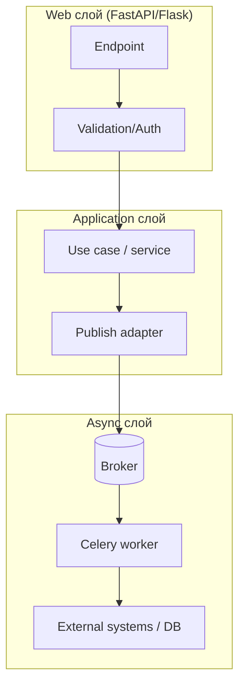
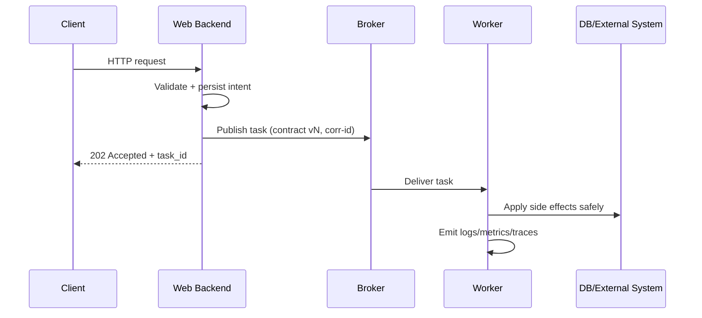

[← Назад к индексу части](index.md)
[↑ К глобальному плану](../../mastery_plan.md)

## 19.3. Общее для web backends

### Цель раздела

Собрать единый набор инженерных правил, которые одинаково важны для FastAPI, Flask и других Python backend-ов при работе с Celery.

### В этом разделе главное

- Есть универсальный контракт публикации задач.
- Идемпотентность и retry должны проектироваться до прод-выката.
- Наблюдаемость (логи, метрики, trace correlation) — обязательный элемент, не "дополнение потом".
- Версионирование payload критично для безопасной эволюции.
- Любой backend должен иметь fallback-план при отказе broker/worker.

### Термины

| Термин | Определение |
|---|---|
| **Command contract** | Формальное описание задачи: поля, версия, SLA, retries, side effects. |
| **Idempotency key** | Ключ, позволяющий безопасно обрабатывать повторные доставки. |
| **Poison payload** | Невалидный/конфликтный payload, стабильно ломающий задачу. |
| **Dead letter / quarantine** | Политика изоляции сообщений, которые нельзя безопасно обработать. |

### Теория и правила

#### Универсальный шаблон контракта задачи

Минимум, который стоит фиксировать в любом сервисе:

- `task_name`;
- `contract_version`;
- `entity_id` или business key;
- `requested_at` и `source`;
- `correlation_id`;
- `idempotency_key` (если есть риск дублей эффекта);
- ожидаемая queue/routing policy.

#### Контракт публикации как "мини-API"

Относись к задаче как к внешнему API-контракту, даже если producer и worker в одном репозитории.  
Те же правила, что у HTTP API:

- совместимость назад;
- явная версия;
- валидация входа;
- документированные коды/состояния неуспеха;
- наблюдаемость и аудит.

Если так смотреть, гораздо меньше "магии" и сюрпризов на релизах.

#### Минимальная схема слоёв (рекомендуемая граница ответственности)



Эта схема нужна, чтобы не смешивать уровни:

- endpoint занимается входом и ответом;
- сервис принимает бизнес-решение;
- publish adapter знает детали очередей;
- worker исполняет задачу по контракту.

#### Почему это важно

Без контракта задачи становятся "неявными RPC-вызовами", а система теряет управляемость. С контрактом ты можешь:

- безопасно менять API и worker независимо;
- расследовать инциденты;
- тестировать ожидания, а не случайное поведение;
- масштабировать команду без скрытых правил "в головах".

#### Единый поток данных (общая схема)



#### Пошаговый стандарт публикации

1. Валидируй входные данные endpoint-а.
2. Сформируй business intent (что должно быть выполнено).
3. Зафиксируй критичное состояние в своей БД (если требуется доменной логикой).
4. Публикуй задачу с версией контракта и correlation metadata.
5. Возвращай клиенту понятный async-ответ (`202` + tracking reference).
6. Обеспечь способ проверки статуса (endpoint/таблица job/events).
7. Определи retry-classification: что ретраить, что сразу помечать как permanent failure.
8. Введи quarantine-политику для poison payload.

#### Матрица ошибок и действий

| Класс ошибки | Пример | Действие | Почему |
|---|---|---|---|
| Transient | timeout внешнего API | retry с backoff | Высокий шанс восстановления |
| Resource | rate limit/429 | отложенный retry + throttling | Нужен контроль скорости |
| Permanent | неверный payload schema | fail fast + quarantine | Retry не исправит данные |
| Business conflict | дубль операции | idempotent success или controlled reject | Сохраняем целостность |

#### Граничные случаи, которые часто забывают

1. **Task принята broker-ом, но endpoint уже отдал 5xx**  
   Клиент может повторить запрос, а задача уже в очереди. Нужны idempotency key и повторно-безопасная семантика.

2. **API отдало 202, но publish фактически не состоялся**  
   Если ошибка публикации не обработана явно, клиент получает ложное ощущение успеха. Нужен явный failure path и алертинг.

3. **Старый worker обрабатывает новый payload**  
   В rolling deploy это нормальный режим. Без versioning и fallback-ветки будет массовый fail/retry storm.

4. **Одна команда публикуется в разные очереди по разным endpoint-ам**  
   Если политика не централизована, поведение плавает и SLA становится непредсказуемым.

### Простыми словами

Независимо от фреймворка, хорошая интеграция выглядит одинаково: API принимает запрос, формирует "заявку", worker обрабатывает ее по четким правилам, а ты всегда можешь понять, что произошло и почему.

### Картинка в голове

Представь стандартный бланк заявки на заводе. Пока бланк стандартизирован, любой цех (FastAPI-сервис, Flask-сервис, отдельный consumer) понимает, что делать. Когда бланк "каждый пишет как хочет", ошибки неизбежны.

### Как запомнить

**Один контракт > сто локальных соглашений.**

#### Контракт статусов асинхронной операции (рекомендуемый минимум)

Когда endpoint возвращает `202`, важно договориться о статусной модели, которую понимают и backend, и frontend, и support:

| Статус | Смысл | Кто выставляет | Что видит клиент |
|---|---|---|---|
| `queued` | Задача принята и ожидает worker | API/publisher | "Запрос принят, ждёт обработки" |
| `running` | Worker начал исполнение | Worker | "Идёт обработка" |
| `success` | Задача завершена успешно | Worker | "Готово" + результат/ссылка |
| `failure` | Невосстановимая ошибка | Worker | "Ошибка обработки" + нормализованная причина |
| `retrying` | Временная ошибка, запланирован повтор | Worker | "Временная проблема, пробуем ещё" |

Простая, но важная идея: клиентский UX становится предсказуемым только когда статусный контракт формализован, а не "как получится".

### Примеры

Пример payload-схемы:

```json
{
  "contract_version": 2,
  "entity_id": "order_123",
  "action": "recalculate_totals",
  "requested_by": "user_42",
  "requested_at": "2026-04-06T10:11:12Z",
  "correlation_id": "req-7f9b",
  "idempotency_key": "order_123:recalculate:v2"
}
```

#### Сравнение интеграции FastAPI и Flask (практический взгляд)

| Аспект | FastAPI | Flask | Что важно для Celery |
|---|---|---|---|
| Модель web-слоя | ASGI/часто `async` endpoint | WSGI/часто sync endpoint | Worker-контур всё равно отдельный и явный |
| Контекст запроса | `request.state`, dependency injection | `request`, `g`, app/request context | Контекст в задачу переносится только явно |
| Типичный риск | Переоценка async как "авто-ускорения" | Невидимая зависимость от Flask context | Нужен контракт payload + publish layer |
| Стартовая интеграция | Обычно проще структурировать по слоям | Часто легаси и import-узлы сложнее | Особенно важен единый bootstrap Celery |
| Подход к тестам | `TestClient`, async-ориентированные проверки | Flask test client, context checks | Общие правила контрактных и integration тестов одинаковы |

### Практика / реальные сценарии

- общий task contract для нескольких API-шлюзов;
- перенос монолита на микросервисы без ломки фоновых процессов;
- стандартизация логов и метрик для SRE;
- миграция payload с v1 на v2 без простоя.

### Типичные ошибки

- "у нас маленький сервис, контракт не нужен";
- нет versioning payload, все меняется "по месту";
- retry без разделения transient/permanent ошибок;
- отсутствие четкой стратегии для poison payload.

### Что будет, если...

- **...не иметь idempotency policy**: дублированные списания, повторные письма, повторные внешние вызовы.
- **...не иметь корреляции логов**: инциденты расследуются часами.
- **...не управлять версионностью**: выкат worker-а ломает старые сообщения в очереди.
- **...не выделить единый publish adapter**: каждый endpoint начинает жить по своим правилам ретраев и роутинга.

### Проверь себя

1. Какой минимум полей стоит добавить в любой task payload для эксплуатации?

<details><summary>Ответ</summary>

`contract_version`, `entity_id`/business key, `correlation_id`, источник (`source`), время публикации и при необходимости `idempotency_key`.

</details>

2. Почему versioning payload важен даже в "одном репозитории"?

<details><summary>Ответ</summary>

Потому что разные инстансы кода могут жить одновременно (rolling deploy), а в очереди могут оставаться сообщения старого формата.

</details>

3. Что дает единый publish standard команде?

<details><summary>Ответ</summary>

Предсказуемость, повторяемость, меньшую вариативность ошибок, проще онбординг и стабильные тестовые сценарии.

</details>

### Запомните

Общая архитектурная дисциплина важнее конкретного web-фреймворка.

#### Дополнительная самопроверка по подпунктам 19.3

1. Почему контракт задачи нужно версионировать даже внутри одного монорепозитория?

<details><summary>Ответ</summary>

Потому что API и worker могут быть раскатаны не одновременно, а сообщения старой версии могут оставаться в очереди. Версия — это механизм безопасной совместимости во времени.

</details>

2. Как связаны матрица ошибок и стоимость эксплуатации?

<details><summary>Ответ</summary>

Чёткая классификация ошибок (transient/permanent и т.д.) предотвращает бесполезные retries и retry storm, снижает нагрузку на систему и ускоряет восстановление сервиса.

</details>

---
