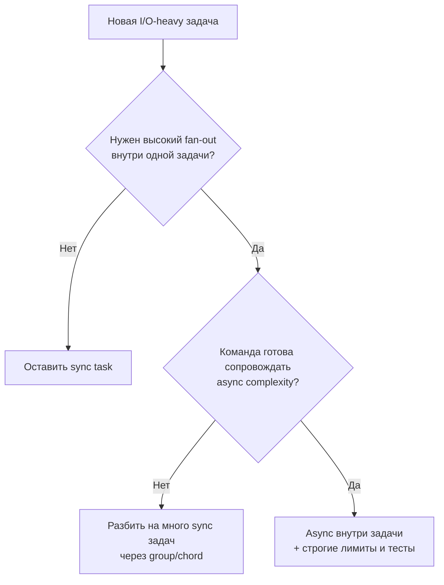

[← Назад к индексу части](index.md)
[↑ К глобальному плану](../../mastery_plan.md)

## 19.4. Async Python и Celery

### Цель раздела

Понять, как правильно мыслить о `async` в API и синхронной модели Celery worker-а, чтобы не строить ошибочных ожиданий и не создавать скрытые блокировки.

### В этом разделе главное

- Async endpoint и async task — разные вещи.
- Celery исторически ориентирован на процессную/потоковую модель worker-ов.
- Внутри задач можно вызывать async-код, но это требует явного bridge и осторожности.
- Blocking I/O внутри async endpoint-а и внутри задач ломает производительность по-разному.

### Термины

| Термин | Определение |
|---|---|
| **Event loop** | Цикл обработки async-задач в одном потоке. |
| **Blocking call** | Вызов, блокирующий поток выполнения до завершения операции. |
| **Sync bridge** | Явный переход между async и sync кодом (`asyncio.run`, adapters). |
| **Concurrency model mismatch** | Несовпадение модели конкурентности между компонентами системы. |

### Теория и правила

#### Интуиция

FastAPI может эффективно обрабатывать много соединений через async. Celery worker обычно работает через процессы/потоки и обрабатывает задачи иначе. Если смешать эти модели без правил, получится "медленно и трудно диагностировать".

#### Точная формулировка

Нужно различать два уровня:

1. **Web concurrency**: как API обрабатывает входящие HTTP.
2. **Task concurrency**: как worker исполняет фоновые задачи.

Оптимизация одного уровня не равна оптимизации другого.

#### Где обычно путаются

- "У нас FastAPI async, значит все автоматически неблокирующее" — неверно.
- "Запущу async ORM прямо внутри Celery без анализа" — риск неопределенного поведения и усложнения.
- "Оберну все в `asyncio.run` внутри каждой задачи" — возможные накладные расходы и проблемы управления ресурсами.

#### Практическое правило

Если задача в Celery в основном работает с синхронными клиентами (классические DB драйверы, SDK), оставляй ее синхронной и хорошо управляемой.

Если реально нужно async-взаимодействие (например, много параллельных внешних HTTP-запросов), проектируй отдельный слой и тестируй внимательно граничные условия.

#### Мини-сравнение стратегий для I/O-heavy задач

| Подход | Когда уместен | Риск |
|---|---|---|
| Синхронная задача + обычный HTTP-клиент | Умеренная нагрузка, простая логика | Меньшая эффективность на высоком параллелизме |
| Синхронная задача + батчирование | Много однотипных операций | Сложность chunking/rollback |
| Async внутри задачи | Высокий fan-out внешних запросов | Сложность контроля event loop и timeouts |
| Разбиение на group/chord | Четко делимый workload | Оркестрационная сложность и стоимость backend |

#### Decision tree: когда идти в async внутри задачи



Идея дерева: async внутри task полезен, но это не дефолт; это осознанный инженерный выбор.

### Пошагово

1. Определи доминирующий тип I/O в задаче (sync или async).
2. Выбери модель исполнения worker-а, подходящую под профиль задачи.
3. Не смешивай async/sync "по привычке", делай явные переходы.
4. Проверь таймауты, ретраи и graceful shutdown в выбранной модели.
5. Нагрузочно протестируй реальный сценарий, а не "hello world".
6. Подбери лимиты параллелизма (внутри задачи и на уровне worker) по бюджетам внешних зависимостей.

### Простыми словами

Async в API — это про "как быстро принимать заказы". Celery worker — про "как выполнять заказы в цехе". Хороший ресепшен не делает цех автоматически эффективным.

### Картинка в голове

```text
API layer concurrency      !=      Worker layer concurrency
ASGI event loop                    process/thread pool
```

### Как запомнить

**Async ускоряет вход, но не отменяет инженерии выхода.**

### Примеры

Пример явного bridge (осторожно, применять осознанно):

```python
import asyncio
from app.tasks.celery_app import celery_app

async def fetch_many(ids: list[str]) -> dict:
    # условный async-код
    return {i: "ok" for i in ids}

@celery_app.task
def aggregate_external(ids: list[str]) -> dict:
    # Явный переход sync -> async
    return asyncio.run(fetch_many(ids))
```

Комментарий: это рабочая техника, но ее нужно применять только если ты понимаешь стоимость запуска event loop, поведение таймаутов и ограничений окружения.

Пример ограничения параллелизма при fan-out:

```python
import asyncio
from app.tasks.celery_app import celery_app

SEM = asyncio.Semaphore(20)

async def call_with_limit(client, item_id: str):
    async with SEM:
        return await client.fetch(item_id)

@celery_app.task
def fetch_batch_with_limit(item_ids: list[str]) -> list[dict]:
    async def _run():
        client = ...  # создать async-клиент
        return await asyncio.gather(*(call_with_limit(client, i) for i in item_ids))
    return asyncio.run(_run())
```

Ключевая мысль: без лимитов fan-out быстро превращается в DoS против внешней зависимости.

### Практика / реальные сценарии

- FastAPI endpoint принимает batch, Celery задача обрабатывает его по частям;
- worker взаимодействует с внешним API, где бывают rate-limit и короткие таймауты;
- гибридные сценарии, где часть логики синхронная (БД), часть асинхронная (HTTP fan-out).

### Типичные ошибки

- считать async "бесплатным ускорителем";
- не ограничивать параллелизм внешних запросов;
- игнорировать backpressure и rate limits;
- не тестировать поведение при отмене/таймауте.
- забывать, что retry может повторно запускать уже частично выполненный async fan-out.

### Что будет, если...

- **...блокировать event loop в API**: деградация throughput, рост latency под нагрузкой.
- **...случайно создавать очень высокий fan-out в задаче**: перегруз внешней зависимости и cascade failures.
- **...не учитывать retry + async side effects**: дубли и нестабильные частичные эффекты.

### Проверь себя

1. Почему "async endpoint" и "эффективная Celery-задача" не одно и то же?

<details><summary>Ответ</summary>

Потому что это разные слои конкурентности и разные жизненные циклы исполнения. Улучшение web-слоя не гарантирует оптимальность worker-слоя.

</details>

2. Когда стоит оставить Celery-задачу синхронной?

<details><summary>Ответ</summary>

Когда основная работа опирается на синхронные библиотеки/драйверы и нет явной выгоды от async-параллелизма внутри одной задачи.

</details>

3. Что критично проверить при использовании async внутри задач?

<details><summary>Ответ</summary>

Таймауты, ограничение параллелизма, корректность retry, расход ресурсов, поведение при остановке worker-а и общую стабильность под нагрузкой.

</details>

### Запомните

Надежная система сначала проектирует границу async/sync, а потом оптимизирует.

#### Дополнительная самопроверка по подпунктам 19.4

1. Почему "async внутри задачи" не является универсальным default-паттерном?

<details><summary>Ответ</summary>

Он повышает сложность: нужно контролировать event loop, лимиты параллелизма, таймауты, ретраи и частичные эффекты. Часто проще и безопаснее sync-задачи с грамотным batching или Canvas.

</details>

2. Как decision tree помогает избежать деградации внешних API?

<details><summary>Ответ</summary>

Он принуждает оценить потребность в fan-out и готовность сопровождать async-сложность. Это помогает не запускать неограниченный параллелизм и не устроить перегруз внешней зависимости.

</details>

---
