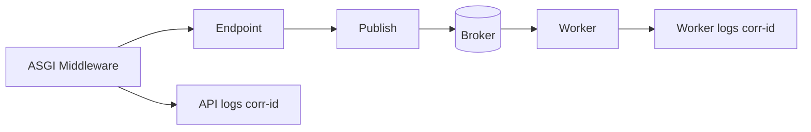

[← Назад к индексу части](index.md)
[↑ К глобальному плану](../mastery_plan.md)

## 19.5. Starlette / ASGI и общий контекст

### Цель раздела

Разобрать ASGI-специфичные аспекты интеграции с Celery: lifecycle hooks, middleware-контекст, propagation correlation id и ограничения переноса request state в задачу.

### В этом разделе главное

- ASGI middleware удобно генерирует trace/correlation id.
- Контекст запроса нужно переносить явно через headers/payload.
- lifespan-события приложения и worker lifecycle независимы.
- `contextvars` в API не "доезжают" в Celery автоматически.

### Термины

| Термин | Определение |
|---|---|
| **Lifespan events** | События старта/остановки ASGI-приложения. |
| **Context propagation** | Передача контекста (trace-id, tenant-id) между компонентами. |
| **Middleware chain** | Последовательность обработчиков запроса в ASGI. |

### Теория и правила

#### Интуиция

В ASGI-приложении контекст запроса удобнее собирать через middleware. Но Celery-задача не знает об этом контексте, пока ты явно не передашь его в message metadata.

#### Точная формулировка

Корректная контекстная интеграция состоит из трех шагов:

1. получить/сгенерировать correlation id в middleware;
2. передать его в publish layer;
3. записать его в task headers и логи worker-а.

#### Какие данные можно и нельзя тащить в контекст задач

Можно:

- `correlation_id`, `source_endpoint`, `tenant_id` (если нужно);
- безопасные технические маркеры маршрутизации.

Нельзя или крайне нежелательно:

- сырые access tokens;
- персональные данные "на всякий случай";
- весь HTTP request body без фильтрации.

Правило: передавай минимум, который реально нужен worker-у.

#### Практический шаблон "безопасного контекста"

```json
{
  "correlation_id": "req-13af",
  "source": "POST /v1/reports/build",
  "tenant_id": "tenant_12",
  "actor_id": "user_77",
  "contract_version": 2
}
```

Что важно:

- нет секретов доступа;
- нет сырых персональных полей;
- контекст достаточен для трассировки и авторизационных проверок на стороне worker-сервиса.

#### Пример middleware + публикация

```python
from starlette.middleware.base import BaseHTTPMiddleware
from starlette.requests import Request
import uuid

class CorrelationIdMiddleware(BaseHTTPMiddleware):
    async def dispatch(self, request: Request, call_next):
        corr_id = request.headers.get("x-correlation-id", str(uuid.uuid4()))
        request.state.correlation_id = corr_id
        response = await call_next(request)
        response.headers["x-correlation-id"] = corr_id
        return response
```

```python
# в endpoint
task_id = build_report.apply_async(
    kwargs={"report_id": report_id, "contract_version": 1},
    headers={"x-correlation-id": request.state.correlation_id},
).id
```

### Пошагово

1. Введи middleware для correlation id.
2. Установи формат логов API, включающий correlation id.
3. Передавай этот id во все публикации задач.
4. Настрой логирование worker-а, чтобы id был в каждой записи.
5. Проверь end-to-end трассировку на живом сценарии.

### Простыми словами

Correlation id — это номер накладной. Если API и worker пишут его в логи, ты видишь полный путь запроса.

### Картинка в голове



#### Жизненный цикл контекста запроса и задачи

```text
[HTTP request started]
    -> middleware генерирует correlation_id
    -> endpoint валидирует и публикует task
    -> HTTP response возвращён (контекст запроса завершён)
    -> worker позже получает message headers
    -> worker пишет логи/метрики с тем же correlation_id
```

Этот цикл полезно держать в голове, чтобы не ожидать "живого request context" после завершения HTTP-ответа.

### Как запомнить

**Contextvars локальны процессу, correlation id глобален по цепочке.**

### Практика / реальные сценарии

- расследование "почему клиенту 202, а результата нет";
- multi-tenant сервисы, где важно передавать tenant metadata;
- трассировка в observability-платформах.
- корреляция инцидента между API gateway, backend-сервисом и Celery worker-ом по единому id.

### Типичные ошибки

- надеяться, что request state "как-то доступен" в worker-е;
- передавать весь request body/headers без фильтрации;
- забывать маскировать чувствительные данные в логах.

### Что будет, если...

- **...не переносить correlation id**: расследование инцидентов превращается в ручной поиск по косвенным признакам.
- **...передавать лишние данные контекста**: рост риска утечки и нарушение принципа минимальных данных.

### Проверь себя

1. Почему `contextvars` нельзя считать механизмом межпроцессной передачи контекста?

<details><summary>Ответ</summary>

Потому что `contextvars` существуют в памяти конкретного процесса/потока исполнения и не пересылаются через broker между API и worker.

</details>

2. Какой минимальный контекст стоит передавать в Celery headers?

<details><summary>Ответ</summary>

Обычно correlation/request id, источник (endpoint/service) и при необходимости tenant/user идентификаторы в безопасной форме.

</details>

3. Почему важно возвращать correlation id в HTTP response?

<details><summary>Ответ</summary>

Клиент/поддержка получают единый идентификатор для связи запросов, логов и фоновой обработки, что ускоряет диагностику.

</details>

### Запомните

В ASGI-интеграции контекст не наследуется автоматически: его нужно проектировать и переносить явно.

#### Дополнительная самопроверка по подпунктам 19.5

1. Почему перенос "всех заголовков запроса" в task headers считается риском?

<details><summary>Ответ</summary>

Можно случайно передать секреты, лишние персональные данные и шум, не нужный worker-у. Правильнее передавать минимальный безопасный контекст (correlation id, source, tenant/actor при необходимости).

</details>

2. Что даёт единый correlation id в цепочке ASGI -> broker -> worker?

<details><summary>Ответ</summary>

Позволяет быстро восстановить причинно-следственную цепочку инцидента, связать логи разных процессов и ускорить диагностику проблем с доставкой/исполнением задач.

</details>

---
