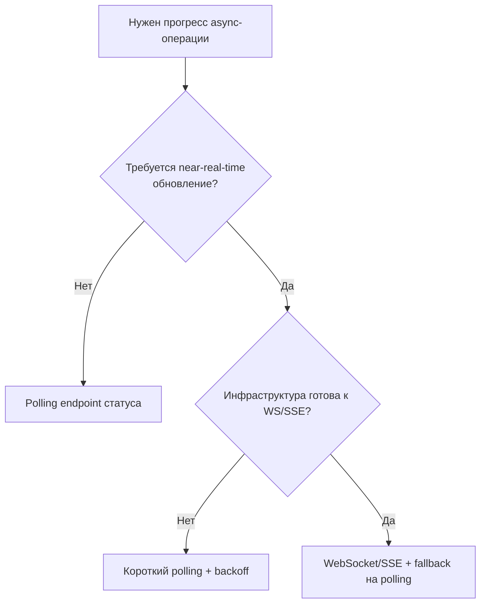

[← Назад к индексу части](index.md)
[↑ К глобальному плану](../mastery_plan.md)

## Частые сценарии

### Сценарий 1. "Нужно быстро вынести долгий endpoint в фон"

**Решение:**

1. endpoint -> `202 Accepted`;
2. publish layer с `contract_version` и `correlation_id`;
3. задача читает `entity_id` и выполняет side effects идемпотентно;
4. отдельный статус endpoint/таблица job.

#### Проверь себя по сценарию 1

1. Почему перенос в фон без статуса операции считается незавершённой интеграцией?

Ответ

Потому что клиенту и поддержке негде узнать итог операции. Без статусного слоя появляются "вечные ожидания" и непрозрачная диагностика.

### Сценарий 2. "После релиза worker перестал понимать старые сообщения"

**Решение:**

1. проверь наличие `contract_version` в payload;
2. временно поддержи обе версии (`v1`, `v2`) в worker;
3. введи стратегию deprecation;
4. добавь контрактные тесты в CI.

#### Проверь себя по сценарию 2

1. Почему поддержка `v1` и `v2` одновременно — нормальная временная стратегия?

Ответ

При rolling deploy в очереди естественно сосуществуют сообщения разных версий. Временная двуверсионная поддержка предотвращает массовые падения и даёт окно миграции.

### Сценарий 3. "Есть 202 в API, но задача не исполняется"

**Диагностика по шагам:**

1. лог публикации: получен ли `task_id`;
2. брокер: есть ли сообщение в ожидаемой очереди;
3. worker: слушает ли нужную очередь;
4. маршрутизация: `queue/routing key` совпадают ли с конфигом;
5. сериализация/десериализация: нет ли ошибок payload.

#### Проверь себя по сценарию 3

1. Почему проверку нужно начинать с факта публикации (`task_id`, queue, headers), а не сразу с кода задачи?

Ответ

Потому что частая причина — сообщение не дошло до нужной очереди или worker её не слушает. Анализ кода задачи бессмысленен, если задача вообще не была доставлена.

### Сценарий 4. "Переход с Flask на FastAPI, Celery оставить"

**Решение:**

1. стабилизируй publish contract как отдельный модуль;
2. отвяжи task-логики от Flask globals;
3. перенеси API-слой, сохраняя контракт задач;
4. прогоняй контрактные и интеграционные тесты до/после миграции.

#### Проверь себя по сценарию 4

1. Почему при миграции web-фреймворка первым стабилизируют publish contract, а не endpoint-ы?

Ответ

Потому что publish contract — точка совместимости с worker-контуром. Если её не зафиксировать, миграция API может незаметно ломать фоновые процессы.

### Сценарий 5. "Frontend ждёт мгновенный результат, а задача долгая"

**Решение:**

1. backend всегда возвращает `202` + `task_id`;
2. frontend переключается на polling или websocket-уведомления статуса;
3. backend хранит статусы (`queued/running/success/failure`) в понятной модели;
4. при `failure` frontend получает нормализованную ошибку для UX, а не сырые traceback-детали.

**Ключевая идея:** асинхронный UX должен быть спроектирован вместе с backend-контрактом, иначе появляются "вечные спиннеры" и пользователь не понимает, что происходит.

#### Выбор канала статусов для frontend

Практическое правило: начинать обычно проще с polling и хорошей статусной модели, а в real-time идти только когда есть реальная продуктовая потребность.

#### Проверь себя по сценарию 5 и выбору канала

1. В каком случае polling предпочтительнее WebSocket/SSE, даже если real-time "звучит лучше"?

Ответ

Когда нет строгой потребности в near-real-time и важнее простота/стоимость сопровождения. Хорошо спроектированный polling с backoff часто даёт достаточный UX при меньшей сложности.

### Сценарий 6. "Миграция с прямого `delay()` к централизованному publish layer"

**Пошаговый безопасный план:**

1. создать publish module с теми же именами задач и параметрами;
2. перевести 1-2 endpoint-а на новый слой и сравнить поведение;
3. добавить обязательные `contract_version` и `correlation_id`;
4. включить контрактные тесты на старые и новые endpoint-ы;
5. постепенно перевести все вызовы;
6. запретить прямой `.delay()` из web-слоя через code review правило.

**Зачем это делать постепенно:** чтобы не ломать сразу весь контур и видеть регрессии на малой площади.

#### Проверь себя по сценарию 6

1. Почему запрет прямого `.delay()` через code review — это не "бюрократия", а защита системы?

Ответ

Это закрепляет единый контракт публикации и предотвращает расползание разных правил по коду. В долгую это резко снижает число интеграционных инцидентов.

### Сценарий 7. "А точно ли здесь нужен Celery, а не более простой механизм?"

Перед внедрением полезно пройти короткий фильтр:

1. Нужны ли retry, отдельные worker-процессы, маршрутизация очередей и независимое масштабирование?
2. Допустим ли eventual consistency (результат позже, а не сразу в HTTP-ответе)?
3. Готова ли команда поддерживать broker, мониторинг и диагностику очередей?
4. Нужна ли именно distributed task queue, а не локальный background executor?

Если ответы в основном "нет", возможно лучше:

- `BackgroundTasks` (для простых post-response действий);
- `cron`/scheduler (для регулярных простых работ);
- отдельный синхронный сервисный вызов (если нужна мгновенная консистентность).

Идея блока: не внедрять Celery "по привычке", если задача решается проще и дешевле.

#### Проверь себя по сценарию 7

1. Какой главный сигнал, что Celery в этом кейсе может быть избыточным?

Ответ

Когда не нужны распределённая обработка, retries, сложная маршрутизация и независимое масштабирование worker-слоя; а задачу можно надёжно и проще решить локальным механизмом.

---
