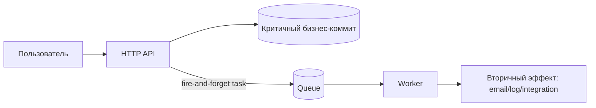

[← Назад к индексу части](index.md)
[↑ К глобальному плану](../../mastery_plan.md)

## 20.1 Fire-and-forget задачи

### Цель раздела

Научиться правильно использовать паттерн "отправил и не жду ответ", чтобы ускорять пользовательские сценарии и разгружать синхронный контур, не теряя управляемость и наблюдаемость.

### В этом разделе главное

- fire-and-forget подходит только для некритичных по мгновенному результату действий;
- "не ждем ответ" не равно "можно не думать о надежности";
- даже вторичные задачи требуют идемпотентности и мониторинга.

### Термины

| Термин | Определение |
|---|---|
| **Secondary side effect** | Вторичный эффект после основного бизнес-действия (например, письмо после успешной покупки). |
| **Best effort** | Выполнение "по возможности", где допустимы отдельные пропуски или задержки при условии повторных попыток и мониторинга. |
| **Delivery confirmation boundary** | Граница ответственности: подтверждаем ли только публикацию задачи или завершение бизнес-эффекта. |

### Теория и правила

Fire-and-forget хорош для:

- отправки уведомлений (email, push);
- логирования вторичных событий;
- медленных интеграций, не влияющих на критичный path запроса.

Fire-and-forget плох для:

- операций, где клиенту нужен немедленный подтвержденный бизнес-результат;
- финансовых действий без сильной дедупликации;
- шагов, влияющих на инварианты транзакции.

#### Простыми словами

Представь, что кассир пробил покупку и отдельно попросил помощника положить рекламный буклет в пакет. Покупка уже завершена, буклет важен, но не критичен для факта покупки. Вот это и есть fire-and-forget.

#### Картинка в голове



### Пошагово

1. Выдели, что в операции критично, а что вторично.
2. Критичное заверши синхронно и зафиксируй в источнике правды.
3. Вторичное публикуй как задачу с минимальным payload.
4. Добавь retry policy и ограничение скорости.
5. Заложи метрики: publish rate, success/failure, age in queue.

### Как запомнить

**Формула fire-and-forget:** "Основной результат уже гарантирован, задача в фоне только дополняет картину".

### Примеры

```python
from celery import shared_task

@shared_task(bind=True, autoretry_for=(TimeoutError,), retry_backoff=True, retry_jitter=True, max_retries=7)
def send_order_email(self, order_id: str, template: str) -> None:
    # В задачу передаем только идентификаторы и легкие параметры.
    # Данные читаем заново, чтобы не таскать тяжелый/устаревающий payload.
    order = get_order_by_id(order_id)
    send_email(order.customer_email, template=template, context={"order_id": order.id})
```

### Мини-кейс: "уведомления + аналитика после checkout"

Сценарий:

1. платеж уже подтвержден в основном синхронном контуре;
2. в фоне запускаются 2 задачи: письмо и аналитическое событие;
3. если аналитика временно недоступна, покупка не откатывается.

Критично:

- метрика "доля неотправленных уведомлений";
- алерт на рост latency вторичных очередей;
- отдельный rate limit, чтобы всплеск не перегрузил почтовый провайдер.

### Практика / реальные сценарии

- после регистрации пользователя отправить welcome email;
- после покупки отправить аналитическое событие в data-платформу;
- после обновления профиля инициировать "медленную" синхронизацию с CRM.

### Типичные ошибки

- считать, что если задача вторичная, то можно игнорировать failure metrics;
- отправлять в payload полный ORM-объект или большие бинарные данные;
- не ограничивать ретраи и случайно создать retry storm.

### Что будет, если...

- **...поставить fire-and-forget для критичного платежного шага?**  
  При временном сбое пользователь получит неочевидное состояние "запрос успешен, бизнес-эффект неизвестен".

- **...не вести мониторинг вторичных задач?**  
  Деградация может идти неделями незаметно, пока не накопится операционный долг.

### Проверь себя

1. Почему fire-and-forget не отменяет требований к идемпотентности?

<details><summary>Ответ</summary>

Потому что доставка в очередях чаще всего at-least-once, и задача может быть выполнена повторно. Без идемпотентности повторы приводят к дублям side effects.

</details>

2. Какой главный критерий, что действие можно вынести в fire-and-forget?

<details><summary>Ответ</summary>

Отложенное выполнение не должно ломать основной бизнес-инвариант операции и пользовательский контракт "что считается завершенным прямо сейчас".

</details>

3. Что важнее мониторить: только ошибки worker-а или весь путь от публикации до эффекта?

<details><summary>Ответ</summary>

Весь путь. Ошибки worker-а показывают лишь часть картины; нужна видимость publish, очереди, latency и конечного side effect.

</details>

4. Почему fire-and-forget особенно опасен в операциях с двойным списанием/двойной отправкой?

<details><summary>Ответ</summary>

Потому что повторная доставка и ретраи могут вызвать повторный side effect. Для таких операций недостаточно просто "вынести в фон", нужны строгая идемпотентность, ключи дедупликации и часто другой архитектурный паттерн.

</details>

### Запомните

Fire-and-forget — это паттерн **для вторичных эффектов**, а не лицензия на архитектурную небрежность.

---
