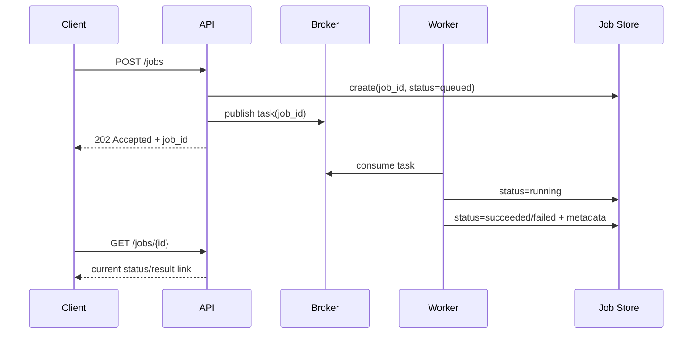
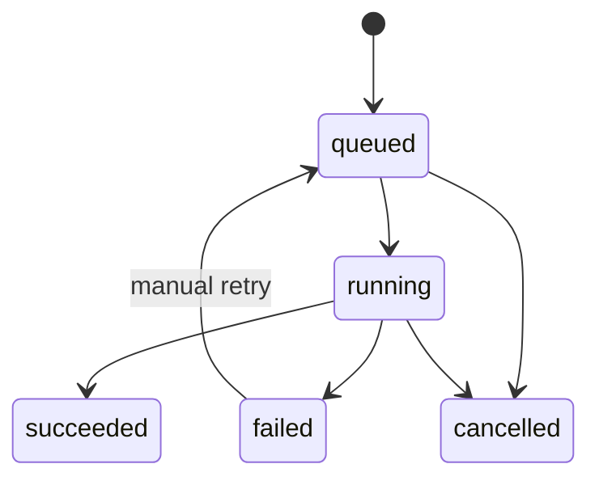

[← Назад к индексу части](index.md)
[↑ К глобальному плану](../mastery_plan.md)

## 20.2 Async request/reply

### Цель раздела

Освоить паттерн долгих пользовательских операций, где запрос запускает задачу, а результат приходит позже через статусный API.

### В этом разделе главное

- `202 Accepted` означает "принято в обработку", а не "бизнес-результат готов";
- жизненный цикл job должен быть отдельной моделью, а не только `AsyncResult`;
- нужен четкий контракт статусов и ошибок для клиента.

### Термины

| Термин | Определение |
|---|---|
| **Job resource** | Сущность в API (`/jobs/{id}`), представляющая асинхронную операцию. |
| **Polling** | Периодический опрос статуса клиентом. |
| **Terminal status** | Финальное состояние (`succeeded`, `failed`, `cancelled`). |

### Теория и правила

Паттерн нужен, когда операция может занимать секунды/минуты и не укладывается в нормальный HTTP timeout. Классическая схема:

1. `POST /jobs` запускает обработку, возвращает `job_id` и `202`.
2. Клиент опрашивает `GET /jobs/{job_id}`.
3. После terminal status получает результат (или ссылку на артефакт).

Важно не путать два разных слоя хранения:

- **инфраструктурный слой**: `AsyncResult`/result backend (внутренняя механика Celery);
- **продуктовый слой**: `jobs`-модель (понятные бизнес-статусы, UX, аудит, retention).

В production чаще всего нужен именно второй слой как источник правды для API-клиента.

#### Картинка в голове



### Пошагово

1. Заведи таблицу/хранилище `jobs` с явной схемой статусов.
2. На старте запроса создай запись `queued`.
3. Опубликуй задачу с `job_id`.
4. В worker обновляй статусы `running -> terminal`.
5. Сделай понятные коды ошибок и retry semantics для клиента.

### Polling vs WebSocket/Callback: как выбрать

| Подход | Когда подходит | Плюсы | Ограничения |
|---|---|---|---|
| **Polling** | Большинство API и B2B интеграций | Просто, надежно, легко дебажить | Лишние запросы, задержка между опросами |
| **WebSocket/SSE** | Интерактивный UI с "живым" прогрессом | Мгновенные обновления | Сложнее инфраструктурно и в эксплуатации |
| **Webhook callback** | Сервер-сервер интеграции | Меньше опросов, событийная модель | Нужны подписи, ретраи, дедуп callback-ов |

#### Диаграмма жизненного цикла job



### Как запомнить

Не "task status для Celery", а "job lifecycle для пользователя".

### Пример API-контракта

```json
{
  "job_id": "b8048f8f-6bf4-4d7e-a74d-8087a0b85776",
  "status": "queued",
  "submitted_at": "2026-04-21T11:50:00Z",
  "links": {
    "self": "/api/v1/jobs/b8048f8f-6bf4-4d7e-a74d-8087a0b85776"
  }
}
```

### Мини-кейс: polling API для "генерации отчета"

```http
POST /api/v1/reports
-> 202 Accepted
{
  "job_id": "job_123",
  "status_url": "/api/v1/jobs/job_123"
}
```

```http
GET /api/v1/jobs/job_123
-> 200 OK
{
  "job_id": "job_123",
  "status": "running",
  "progress": 64,
  "eta_seconds": 18
}
```

```http
GET /api/v1/jobs/job_123
-> 200 OK
{
  "job_id": "job_123",
  "status": "succeeded",
  "result": {
    "download_url": "/api/v1/reports/report_987.pdf"
  }
}
```

### Практика / реальные сценарии

- генерация PDF-отчета;
- массовая обработка изображений;
- длительная сверка данных с внешней системой.

### Типичные ошибки

- хранить статус только в result backend и не иметь доменной модели job;
- смешивать инфраструктурные состояния Celery с пользовательскими состояниями UI;
- не задавать TTL/retention и копить "вечные job-ы".

### Что будет, если...

- **...возвращать 200 OK сразу после постановки в очередь как будто результат готов?**  
  Клиент начнет строить неверные ожидания, а интеграция станет нестабильной по смыслу контракта.

- **...не фиксировать `failed` причины в job store?**  
  Пользователь и поддержка не смогут отличить "временная ошибка, можно перезапустить" от "логическая ошибка входных данных".

- **...не ограничить частоту polling со стороны клиентов?**  
  API начнет тратить заметную долю ресурсов на обслуживание статусов вместо полезной работы.

### Проверь себя

1. Почему `AsyncResult` обычно недостаточно как единственный источник статуса для API?

<details><summary>Ответ</summary>

Потому что API требует бизнес-ориентированную модель жизненного цикла, историю, понятные причины ошибок и политику хранения; `AsyncResult` инфраструктурен и часто краткоживущий.

</details>

2. Что важнее для клиента: знать `task_id` или понимать переходы бизнес-статусов?

<details><summary>Ответ</summary>

Переходы бизнес-статусов. `task_id` полезен для трассировки, но клиенту нужен прозрачный жизненный цикл операции.

</details>

### Запомните

Async request/reply — это не просто "долгая задача в фоне", а отдельный **API-контракт жизненного цикла**.

---
