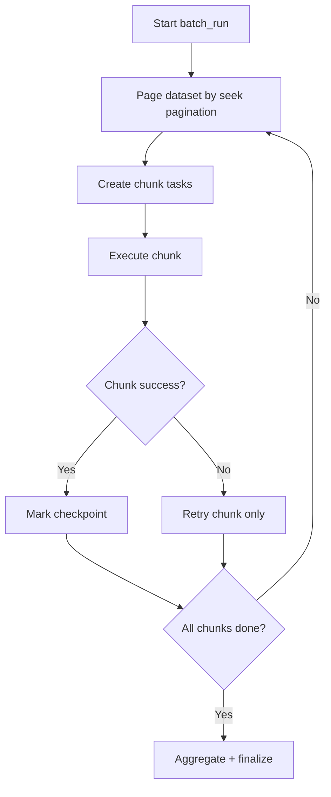

[← Назад к индексу части](index.md)
[↑ К глобальному плану](../../mastery_plan.md)

## 20.3 Batch processing

### Цель раздела

Научиться проектировать массовые ночные и регламентные обработки так, чтобы они были прогнозируемыми по времени, стоимости и надежности.

### В этом разделе главное

- батч нужно дробить на чанки, а не запускать монолитный мегапроцесс;
- fan-out/fan-in дает масштабируемость, но требует контроля частичных ошибок;
- важны checkpoint-и и возможность перезапуска с места сбоя.

### Термины

| Термин | Определение |
|---|---|
| **Chunking** | Разбиение большого набора данных на партии фиксированного размера. |
| **Fan-out** | Распараллеливание задач на множество подзадач. |
| **Fan-in** | Сбор и агрегация результатов подзадач. |
| **Checkpoint** | Точка фиксации прогресса для безопасного перезапуска. |

### Теория и правила

Batch-паттерн оптимален, когда:

- есть большой объем однотипной работы;
- приемлемо отложенное выполнение (например, nightly window);
- требуется контролируемая нагрузка на БД и внешние API.

Базовый принцип: **маленькие повторяемые шаги > одна гигантская задача**.

Отдельно про пункт плана **pagination over dataset**: крупный набор нельзя забирать "целиком в память". Обычно используется постраничный проход:

- по устойчивому ключу (`id > last_seen_id`) вместо `OFFSET` на огромных таблицах;
- со снимком периода (например, `created_at < cutoff_time`), чтобы входной набор не "плыл" во время долгого батча;
- с фиксацией `batch_run_id` и контрольных границ чтения.

Нюанс про `OFFSET` vs "seek pagination":

- `OFFSET` на больших таблицах с ростом данных становится дорогим;
- "seek pagination" (`WHERE id > last_id ORDER BY id LIMIT n`) обычно стабильнее и быстрее;
- для детерминизма батча фиксируй сортировку и границу набора (`cutoff`).

#### ASCII-схема

```text
Dataset (N records)
      |
      v
Split into chunks [1..K]
      |
      +--> Task chunk#1 --\
      +--> Task chunk#2 ----> Aggregator -> Final report
      +--> Task chunk#3 --/
```

### Пошагово

1. Выбери размер чанка (на основе времени выполнения и лимитов).
2. Запусти fan-out задач по чанкам.
3. Сохраняй прогресс и статистику по каждому чанку.
4. Агрегируй результаты отдельным шагом.
5. Реализуй retry только для неуспешных чанков, а не всего батча.

Практическое эвристическое правило для старта:

- целевое время одного чанка: 10-60 секунд;
- целевой объем памяти на чанк: "без резких пиков и OOM";
- при ошибке в 1 чанке не должны перезапускаться все остальные.

### Пример (псевдокод)

```python
def launch_nightly_recalc(batch_id: str, chunk_size: int = 1000):
    ids = fetch_target_ids()
    chunks = split_into_chunks(ids, chunk_size)
    group_result = group(recalc_chunk.s(batch_id, chunk) for chunk in chunks).apply_async()
    finalize_batch.apply_async(args=[batch_id, group_result.id])
```

### Диаграмма с checkpoint-ами



### Как запомнить

Batch = **pagination + chunking + selective retry + aggregation**.

### Практика / реальные сценарии

- ночной пересчет рекомендаций;
- обновление поискового индекса;
- массовая валидация документов.

### Типичные ошибки

- один giant batch task на весь набор;
- отсутствие отдельного состояния batch run;
- агрегация без обработки частичных сбоев.

### Что будет, если...

- **...увеличить chunk_size "до максимума", чтобы меньше задач?**  
  Падает гибкость ретраев, растет риск timeouts и memory spikes.

- **...делать retry всего батча из-за одного сбоя?**  
  Резко растет стоимость и время обработки, появляются дубли side effects.

### Проверь себя

1. Почему маленькие чанки обычно устойчивее крупных?

<details><summary>Ответ</summary>

Потому что уменьшают blast radius сбоя, упрощают точечные ретраи, снижают пиковое потребление памяти и улучшают управляемость по времени.

</details>

2. Что критичнее для оператора батча: общее число задач или прозрачность прогресса и отказов?

<details><summary>Ответ</summary>

Прозрачность прогресса и отказов, потому что именно она позволяет управлять восстановлением и SLA, а не гадать по косвенным признакам.

</details>

### Запомните

Batch в Celery — это дисциплина chunking + checkpoint + selective retry.

---
